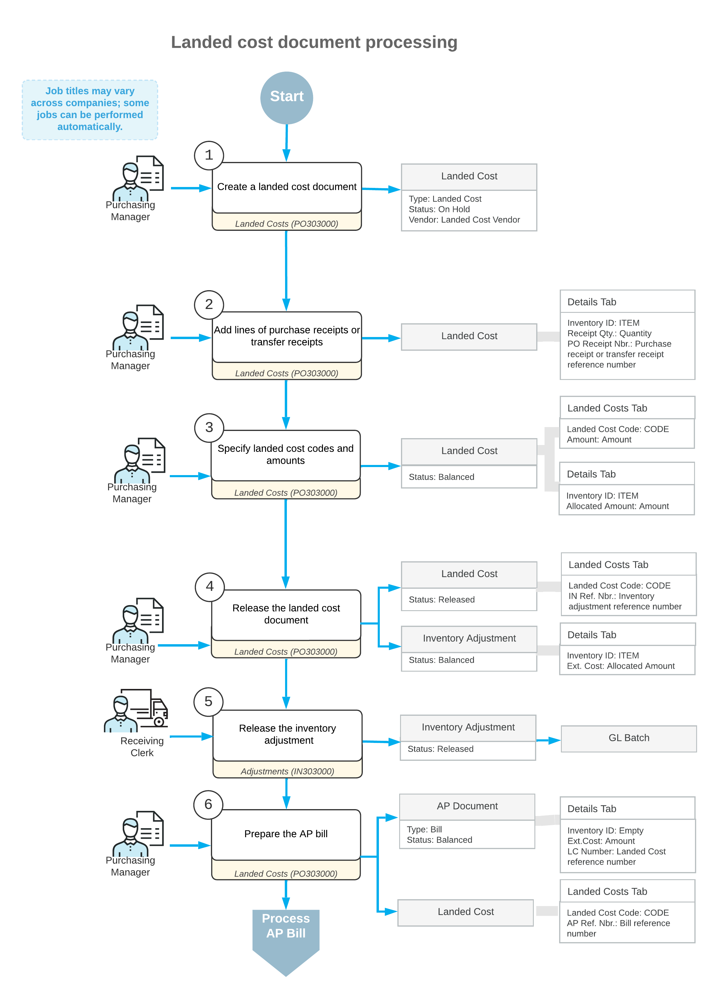

# Processing Landed Cost Documents {#_d0a104ed-6544-469c-992e-f2bbb6938752 .concept}

With Acumatica ERP, your company can track the landed costs incurred for purchased or transferred stock items, to accurately calculate the total costs of the items. Landed costs in Acumatica ERP are processed through landed cost documents. In a landed cost document, you specify the landed cost amounts, and the purchase receipts or transfer receipts, to which these landed cost amounts should be allocated.

## General Workflow and Related Documents { .section}

You can add to a single landed cost document either purchase receipts or transfer receipts \(but not both types\). The type of the added receipts does not affect the landed cost document workflow. The diagram below shows the processing steps for landed cost documents.

The following sections describe in detail the processing steps shown in the diagram.

## 1. Enter the Landed Cost Document { .section}

You create a new landed cost document on the [Landed Costs](PO_30_30_00.md) \(PO303000\) form. The reference number for the new landed cost document is generated in accordance with the numbering sequence specified on the [Purchase Orders Preferences](PO_10_10_00.md) \(PO101000\) form. If the landed cost document is created with the *On Hold* status, you should click **Remove Hold** on the form toolbar for the document before releasing it.

## 2. Add Receipt Lines to which Landed Costs Will Be Allocated { .section}

You add the documents or particular document lines for which the landed costs were incurred by clicking **Add PO Receipt** or **Add PO Receipt Line** on the **Details** tab of the [Landed Costs](PO_30_30_00.md) \(PO303000\) form. You then select the unlabeled check boxes in the rows of the needed lines in the dialog box that opens, and click **Add &amp; Close** to add the selected lines. You can add the lines of either purchase receipts or transfer receipts to a landed cost document.

## 3. Specify Landed Cost Codes and Amounts { .section}

You add the landed costs to be allocated between the added receipt lines by adding the landed cost code and specifying the amount to be allocated on the **Landed Costs** tab of the [Landed Costs](PO_30_30_00.md) \(PO303000\) form.

## 4. Release the Landed Cost Document { .section}

To release the prepared landed cost document, you click **Release** on the form toolbar of the [Landed Costs](PO_30_30_00.md) \(PO303000\) form. Alternatively, you can release multiple landed cost documents at the same time by using the [Release Landed Costs](PO_50_60_00.md) \(PO506000\) form.

When the landed cost document is released, the system automatically generates a corresponding inventory adjustment \(one for each landed cost code\) to update the cost of items in inventory. You can view the generated inventory adjustment on the [Adjustments](IN_30_30_00.md) \(IN301000\) form.

## 5. Release the Inventory Adjustment { .section}

The generated inventory adjustment is released automatically if the **Release LC IN Adjustments Automatically** check box is selected on the [Purchase Orders Preferences](PO_10_10_00.md) \(PO101000\) form. If this check box is cleared, you have to release the inventory adjustment manually by clicking **Release** on the form toolbar of the [Adjustments](IN_30_30_00.md) \(IN301000\) form.

On release of the inventory adjustment, a batch of GL transactions is generated. The costs of inventory items are updated according to the items' valuation methods, as described in the [Adding Landed Costs to Items' Costs](PO__con_Updating_Cost_by_LC.md).

## 6. Prepare the Accounts Payable Bill { .section}

If the **Create Bill** check box is selected in the landed cost document on the [Landed Costs](PO_30_30_00.md) \(PO303000\) form, when you release the landed cost document, the system generates an AP bill to the landed cost vendor automatically.

Otherwise, you need to prepare the bill from the purchase receipt by clicking **Enter AP Bill** on the More menu of the [Purchase Receipts](PO_30_20_00.md) \(PO302000\) form. Alternatively, you can create a new AP bill manually on the [Bills and Adjustments](AP_30_10_00.md) \(AP301000\) form and add or link the lines of the landed cost document to the bill. For more information on the processing of AP bills, see [Processing AP Bills](Finance_ProcessingAPBills_Mapref.md).

If the exact amount of the landed costs has changed, in the generated AP bill, you can manually adjust the amount of the landed costs. Any difference will be posted to dedicated accounts, as described in the [Adjusting the Landed Cost Variance](PO__con_LC_Postponed.md).

**Parent topic:**[Allocating Landed Costs](../UserGuide/PO__MNG_Landed_Costs.md)

