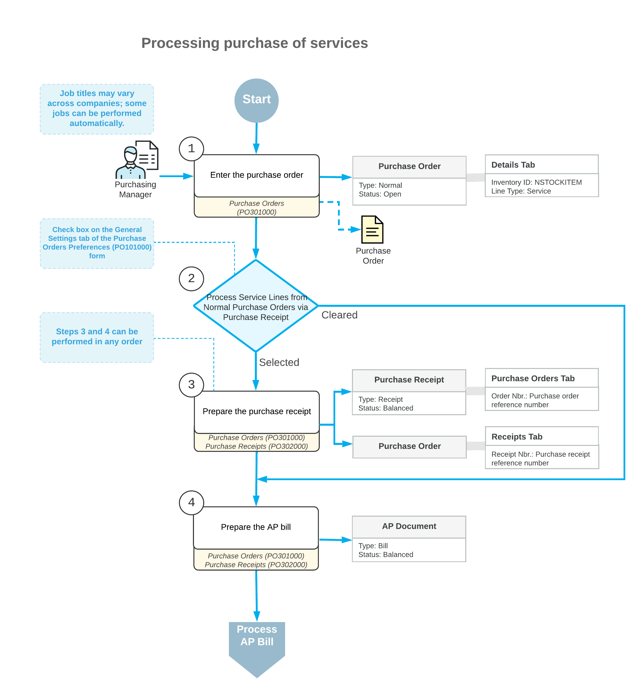

# Service Lines in Purchase Orders {#_0b171431-9c8e-4ce7-afca-e46bdee351bf .concept}

For each non-stock item, you define whether a purchase receipt is required by selecting or clearing the **Require Receipt** check box on the **General** tab of the [Non-Stock Items](IN_20_20_00.md) \(IN202000\) form. In a purchase order line on the [Purchase Orders](PO_30_10_00.md) \(PO301000\) form, when you select a non-stock item that does not a require a purchase receipt, the system inserts *Service* as the line type; also, the system inserts the *Service* line type in purchase order lines with no item specified. Although the *Service* lines are not tracked in inventory and do not require a purchase receipt, if you want to list them in purchase receipts for informational purposes, you can configure the system so that these lines are added to purchase receipts.

This topic describes how the system processes *Service* lines added to a purchase order, and explains how the lines with these items are completed.

## General Workflow and Related Documents {#servlines .section}

The following diagram illustrates how the *Service* lines in purchase orders can be processed depending on the system settings.

The remainder of this topic describes in detail the processing steps shown in the diagram and issues related to how this processing unfolds. The processing of the service order consists of the following steps:

1.  *Entering a purchase order*

    You enter a purchase order of the *Normal* type on the [Purchase Orders](PO_30_10_00.md) \(PO301000\) form, and you add a *Service* line or multiple lines to the order. The reference number for a new purchase order is generated in accordance with the numbering sequence specified on the [Purchase Orders Preferences](PO_10_10_00.md) \(PO101000\) form. If the order is created with the *On Hold* status, you should click **Remove Hold** on the form toolbar for the order to process it further.

2.  *Conditionally processing*Service*lines*

    The way the system processes *Service* lines depends on the state of the **Process Service Lines from Normal Purchase Orders via Purchase Receipt** check box on the [Purchase Orders Preferences](PO_10_10_00.md) \(IN101000\) form.

    If the check box is cleared \(the default setting\), processing *Service* lines doesn't involve creating a purchase receipt; an AP bill \(or multiple bills\) has to be created directly from the purchase order \(see Step 4\). When a user creates a purchase receipt for a purchase order with lines of different types, some of which require a purchase receipt and some of which do not require a purchase receipt, the system does not copy *Service* lines to a purchase receipt that is prepared from this purchase order. Also, in this case, *Service* lines cannot be added to the purchase receipt manually.

3.  *Preparing a purchase receipt \(optional\)*

    If the **Process Service Lines from Normal Purchase Orders via Purchase Receipt** check box is selected, a purchase receipt is required for the lines of the *Service* type. A user creates a purchase receipt from a purchase order by clicking **Enter PO Receipt** on the form toolbar of the [Purchase Orders](PO_30_10_00.md) form. The prepared purchase receipt is available for reviewing on the [Purchase Receipts](PO_30_20_00.md) \(PO302000\) form. If the purchase receipt is created with the *On Hold* status, you should click **Remove Hold** on the form toolbar for the receipt to process it further.

    As an alternative to creating the purchase receipt while viewing the purchase order, a user can create a new purchase receipt manually and add *Service* lines to it by clicking **Add PO** or **Add PO Line** on the table toolbar of the **Details** tab of the [Purchase Receipts](PO_30_20_00.md) form and using the dialog box that opens.

4.  *Preparing an AP bill*

    You prepare the AP bill by clicking **Enter AP Bill** on the form toolbar of the [Purchase Orders](PO_30_10_00.md) form. The system brings up the generated AP bill on the [Bills and Adjustments](AP_30_10_00.md) \(AP301000\) form.

## Processing of the Accounts Payable Bill for the Purchase Order { .section}

The general workflow of processing purchase orders with lines of any type is to process a purchase receipt \(if it is needed\) before creating an AP bill \(see [Purchases of Stock Items: General Information](OrderMgmt_Standard_Inventory_Purchase_GeneralInfo.md) for details\). However, if you receive bills from a particular vendor before the ordered items are received to inventory, you can configure this vendor so that for the purchase orders of this vendor, you can create and process an AP bill before the purchase receipt is released.

To do this, you need to select the **Allow AP Bill Before Receipt** check box in the vendor settings on the [Vendors](AP_30_30_00.md) \(AP303000\) form; in addition, you can select this check box for a particular vendor location on the [Vendor Locations](AP_30_30_10.md) \(AP303010\) form. The state of this check box is copied to each purchase order created for this vendor, and can be reviewed on the **Other** tab of the [Purchase Orders](PO_30_10_00.md) \(PO301000\) form. For a detailed description on how to process a purchase order with the associated bill being prepared before the receipt, see [Purchases with Billing Before Receipt: General Information](OrderMgmt_Purchase_Bill_Before_Receipt_GeneralInfo.md).

## Posting Accounts for Service Lines { .section}

When you add a *Service* line to a purchase order on the **Details** tab of the [Purchase Orders](PO_30_10_00.md) \(PO301000\) form, in the **Account** column, the system inserts the Expense account specified in the **Expense Account** box of the item on the **GL Accounts** tab of the [Non-Stock Items](IN_20_20_00.md) \(IN202000\) form. If the *Subaccounts* feature is enabled on the [Enable/Disable Features](CS_10_00_00.md) \(CS100000\) form, in the **Sub.** column of the [Purchase Orders](PO_30_10_00.md) form, the system inserts the subaccount composed as defined by the **Combine Expense Sub. From** box of the [Accounts Payable Preferences](AP_10_10_00.md) \(AP101000\) form.

## Rules for Closing and Completing Service Lines { .section}

The way the lines of the *Service* type \(including the *Service* lines with the **Inventory ID** column empty\) are completed and closed depends on whether the service lines are processed through receipts, and on the completion rule specified for each non-stock item in the **Close PO Line** box on the [Non-Stock Items](IN_20_20_00.md) \(IN202000\) form.

**Note:** If you change the **Close PO Line** setting for a non-stock item on the [Non-Stock Items](IN_20_20_00.md) form, the system does not change this setting for already existing purchase orders; the newly specified setting applies to new purchase orders only. Existing purchase orders will be billed with the settings that were specified when the order was entered.

The system determines if a line of the *Service* type should be closed and completed by using the following rules:

-   If the *Service* line is processed through a receipt and *By Amount* is selected in the **Close PO Line** box for an item, the line is completed automatically when the line is closed or on release of the purchase receipt if the user has selected the **Completed** check box manually. The line is closed in either of the following cases:
    -   When a purchase receipt for the line is released if a user has selected the **Complete PO Line** check box manually in the purchase receipt line on the **Details** tab of the [Purchase Receipts](PO_30_20_00.md) \(PO302000\) form.
    -   When an AP bill for the line is released if the billed quantity for all bills that have been released for this line is equal to or greater than the amount of the purchase order line.
-   If the *Service* line is processed through a receipt and *By Quantity* is selected in the **Close PO Line** box for an item, the line is closed when an AP bill for the line is released if the sum of the line quantities in all released bills for this line is equal to or greater than the quantity of the purchase order line \* \(**Complete On %**/100\). The line is completed in the following cases:
    -   Automatically if the system has closed the line \(that is, if the **Closed** check box is selected\)
    -   On release of the purchase receipt prepared for the line if the user has selected the **Completed** check box manually
    -   If the sum of the received quantity for the released purchase receipts prepared for the line is equal to or greater than the quantity of the purchase order line \* \(**Complete On %**/100\)
-   If the *Service* line is processed without a purchase receipt and *By Amount* is selected in the **Close PO Line** box for the line item, the line is closed on release of the AP bill if the billed amount for all released bills for this line is equal to or greater than the amount of the purchase order line. The line is completed automatically when it is closed.
-   If the *Service* line is processed without a purchase receipt and *By Quantity* is selected in the **Close PO Line** box for the line item, the line is closed on release of the AP bill if the sum of the quantities in released bills for this line is equal to or greater than the quantity of the purchase order line \* \(**Complete On %**/100\). The line is completed automatically when it is closed.

If a user processes the lines of a purchase order partially, multiple related purchase receipts and AP bills can be prepared for a single purchase order. The system determines which purchase order lines should be added to the prepared purchase receipt or AP bill depending on the status of the **Completed** and **Closed** check boxes in each line, as follows:

-   Completed purchase order lines are not added to the purchase receipt.
-   Closed lines are added to neither purchase receipts nor AP bills.

If all purchase order lines have the **Completed** check box selected, and at least one line still has the **Closed** check box cleared, the purchase order is assigned the *Completed* status. If all purchase order lines have the **Completed** and **Closed** check boxes selected, the purchase order is assigned the *Closed* status.

**Parent topic:**[Managing Purchase Documents](../UserGuide/PO__MNG_Managing_Document.md)

