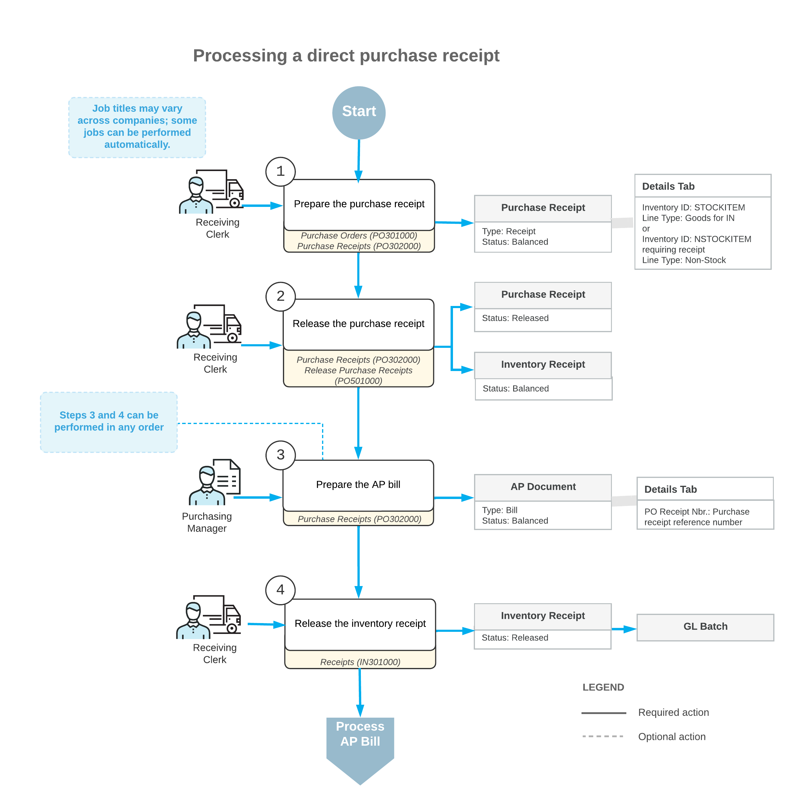

# Purchases with Direct Purchase Receipts {#_447d6f62-67a3-446f-9d19-212a3a1627c6 .concept}

In Acumatica ERP, you can process direct purchase receipts that do not have corresponding purchase orders.

The following diagram represents the general workflow of processing a direct purchase receipt.

The remaining sections of this topic describe in detail the processing steps shown in the diagram.

## 1. Enter the Purchase Receipt { .section}

You create a new purchase receipt on the [Purchase Receipts](PO_30_20_00.md) \(PO302000\) form and assign it the *Receipt* type. On the purchase receipt, you can list the stock and non-stock items received from the particular vendor. The reference number for a new purchase receipt is generated in accordance with the numbering sequence specified on the [Purchase Orders Preferences](PO_10_10_00.md) \(PO101000\) form. If the purchase receipt is created with the *On Hold* status, you should click **Remove Hold** on the form toolbar when you are ready to process the receipt further.

## 2. Release the Purchase Receipt { .section}

To release the purchase receipt, while you are viewing it on the [Purchase Receipts](PO_30_20_00.md) \(PO302000\) form, you click **Release** on the form toolbar. Alternatively, you can release multiple purchase receipts at the same time by using the [Release Purchase Receipts](PO_50_10_00.md) \(PO501000\) form.

When the purchase receipt is released, the system automatically generates a corresponding inventory receipt, with the date and posting period of the purchase receipt, to add the received items to inventory. You can review the generated inventory receipt on the [Receipts](IN_30_10_00.md) \(IN301000\) form.

## 3. Prepare the Accounts Payable Bill { .section}

If the **Create Bill** check box is selected for the purchase receipt on the [Purchase Receipts](PO_30_20_00.md) \(PO302000\) form, when you release the purchase receipt, the system generates an accounts payable bill to the vendor automatically. Otherwise, you need to prepare the bill manually from the related purchase receipt on the [Purchase Receipts](PO_30_20_00.md) form by clicking **Enter AP Bill** on the form toolbar.

You can view the generated AP bill on the [Bills and Adjustments](AP_30_10_00.md) \(AP301000\) form. For more information on the processing of AP bills, see [Processing AP Bills](Finance_ProcessingAPBills_Mapref.md) and [Paying AP Bills](Finance_PayingAPBills_Mapref.md).

## 4. Release the Inventory Receipt { .section}

The generated inventory receipt is released automatically if the **Release IN Documents Automatically** check box is selected on the [Purchase Orders Preferences](PO_10_10_00.md) \(PO101000\) form. If this check box is cleared, you have to release the inventory receipt manually by clicking **Release** on the form toolbar of the [Receipts](IN_30_10_00.md) \(IN301000\) form. On release of the inventory receipt, a batch of GL transactions is generated.

You can release the receipt before or after you prepare the AP bill.

