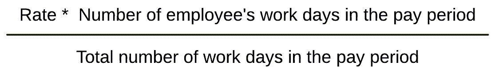
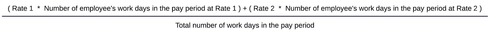

# Paychecks: General Information {#_cee53c3d-b0a1-464c-8fb0-92c3894e2e38 .concept}

You can review and modify the details of an individual paycheck on the [Paychecks and Adjustments](PR_30_20_00.md) \(PR302000\) form. Depending on the selected type of the payment and its current status, you can use the form for a number of different purposes, all related to the maintenance of paycheck information.

## Learning Objectives { .section}

In this chapter, you will learn how to calculate regular employee paychecks and how to update a previously calculated paycheck.

## Applicable Scenarios { .section}

You calculate regular paychecks to prepare necessary payroll information for a normal pay run.

## Creation of Paychecks { .section}

A payroll clerk usually creates multiple regular paychecks at a time for employees that belong to one pay group by releasing a payroll batch on the [Payroll Batches](PR_30_10_00.md) \(PR301000\) form. However, you can use the [Paychecks and Adjustments](PR_30_20_00.md) \(PR302000\) form to create an individual paycheck of one of the following types:

-   *Regular*: Paychecks of this type are used for a normal pay run. An employee may have only one regular paycheck per pay period.
-   *Special*: Paychecks of this type are used for specific payments, such as bonuses. An employee may have as many special paychecks as necessary for one pay period.
-   *Adjustment*: Paychecks of this type can have negative and positive amounts. The transactions created on the release of an adjustment paycheck impact the general ledger as usual. You can edit any value of an adjustment paycheck and release it to update the value in the employee record.
-   *Voiding Paycheck*: A paycheck of this type appears when you void a paycheck. A voiding paycheck has the same amounts as the voided paycheck but with the opposite sign.
-   *Final*: A paycheck of this type is used for a final settlement with an employee whose employment in the company has been terminated. You need to specify the termination date and termination reason for this paycheck; this information will be synchronized with the employment history of the employee.

You can create only one paycheck of the *Regular* type for an employee during a specific pay period, but you can create as many adjustments and special paychecks as needed. If you open a pay period that already has a paycheck, the system will redirect you either to the paycheck or to the payroll batch if the batch is not released yet. \(You can remove the paycheck from the batch to create one manually for the selected pay period.\)

Also, you can use this form to review and process direct deposits. The settings on this form are used for both printed checks and direct deposits; depending on the payment method selected, the system will use the default settings specified on the [Employee Payroll Settings](PR_20_30_00.md) \(PR203000\) form.

## Paycheck Calculation Logic { .section}

You can use the [Paychecks and Adjustments](PR_30_20_00.md) \(PR302000\) form for reviewing or modifying the details associated with a particular employee’s paycheck before it is printed or released. After changes are made, you need to click the **Calculate** command on the More menu.

To calculate multiple paychecks at a time, you can use the [Process Payroll Documents](PR_50_10_00.md) \(PR501000\) form where you need to select *Calculate* in the **Action** box and then process all listed documents or only selected ones.

**Tip:** If you change the settings on the **Payment** tab of the [Employee Payroll Settings](PR_20_30_00.md) \(PR203000\) form while open paychecks are available in the system, the changes will be applied to the paychecks only after the paychecks are calculated.

For each pay period, the system will automatically calculate and use the right pay rate. If the employee has been assigned a yearly salary, the system will use the number of hours per week and the number of weeks worked during the year to calculate an hourly rate. If the rate is hourly, no calculation is done.

If a salaried employee has started or stopped working in the middle of a pay period, the system uses the following formula to calculate the rate based on the number of days the employee worked during the period.

If a salaried employee's rate was changed in the middle of a pay period, the system calculates the average rate for the period by using the following formula.

Once this rate is calculated, it will be compared to rates set for the certified project if the employee worked on a certified project or to rates set for a union if the employee is part of a union. The system will select the highest rate it could find and apply it to the hours linked with the union or the project.

If some paycheck was created for a prior pay period, the system will prevent you from calculating the paycheck and force you to release the previous one. It ensures that the year-to-date, quarter-to-date, and month-to-date information is always up to date.

The calculation process will launch the overtime rules validation and create new earning lines if some rules were triggered. It will then calculate the deduction and benefit amounts to apply to the paycheck. It will make sure the package from the unions and certified projects are applied if configured. Afterward, it will call the web service to fetch the right rate to apply to the employee taxes. Finally, it will accrue the paid time off and disburse it if an earning linked to a bank was entered in the earning details.

Calculation is not automatic after each change, but the system ensures that you are asked to recalculate the paycheck every time it is necessary.

## Processing of Paychecks {#section_vv2_1y4_y4b .section}

At various stages of processing, a paycheck can have the following statuses:

-   *On Hold*: The document is a draft—it can be edited but not released. This is the default status for new documents if the **Hold Paycheck on Entry** check box is selected on the [Payroll Preferences](PR_10_10_00.md) \(PR101000\) form.
-   *Pending Calculation*: The document can be edited with this status. You click the **Calculate** command on the More menu to change the document status.
-   *Pending Payment*: A paycheck has been calculated, but a check has not been printed and an ACH batch has not been generated.
-   *Added to Payment Batch*: The paycheck has been processed and an associated payment batch has been created.

    You can make changes to a paycheck with this status, although you cannot modify the specified payment method and cash account. After the changes are saved, the status of the paycheck changes to *Pending Calculation*, and then, after the calculation, the information is correspondingly updated in the associated payment batch and the status of the paycheck changes again to *Added to Payment Batch*.

-   *Paid*: The associated payment batch has been paid and you can release the paycheck. You can edit the accounts and subaccounts specified on the **Earning** tab.
-   *Released*: The paycheck is released. That is, a payroll transaction is created and posted to the general ledger. A document with this status cannot be edited but can be voided.
-   *Liability Partially Paid*: The liabilities created by the paycheck are partially processed to be converted to AP bills.
-   *Closed*: All the liabilities linked with this paycheck have been processed to be converted to AP bills.
-   *Voided*: The paycheck has been voided. Only a document with the *Released*, *Liability Partially Paid*, or *Closed* status can be voided.

**Parent topic:**[Calculating Paychecks](../UserGuide/process_Payroll_Paychecks_mapref.md)

