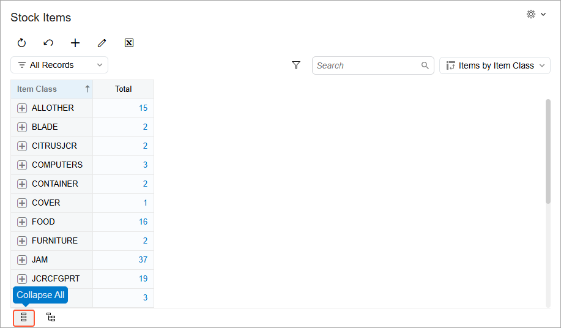

# Pivot Tables: To Create a Pivot Table {#_d1d73984-a2a9-4c98-b95b-4551004a9ee3 .task}

In this activity, you will learn how to create a pivot table and share it with other users.

**Attention:** This activity is based on the *U100* dataset. If you are using another dataset or if any system settings have been changed in *U100*, these changes can affect the workflow of the activity and the results of the processing. To avoid issues, restore the *U100* dataset to its initial state.

## Story { .section}

Suppose that you’re a technical specialist in your company who’s working on simple customizations, including the creation and modification of generic inquiry forms and pivot tables. A warehouse manager of your company has asked you to create a pivot table that:

-   Groups stock keeping units \(SKUs\) by item class
-   Shows the total number of all SKUs and the number of SKUs in each class

Also, the pivot table should be available as a data view of the predefined Stock Items \(IN2025PL\) generic inquiry form \(list of records\). This form has the *IN-StockItem* inquiry title and the *Stock Items* site map title specified on the [Generic Inquiry](SM_20_80_00.md) \(SM208000\) form.

## Configuration Overview {#section_pgv_tmv_3rb .section}

In the *U100* dataset, the following tasks have been performed to support this activity:

-   The *Inventory and Order Management* feature has been enabled on the [Enable/Disable Features](CS_10_00_00.md) \(CS100000\) form to provide support for the stock item functionality.
-   On the [Item Classes](IN_20_10_00.md) \(IN201000\) form, multiple item classes have been defined.
-   On the [Stock Items](IN_20_25_00.md) \(IN202500\) form, multiple stock items have been defined.
-   The Stock Items \(IN2025PL\) generic inquiry form has been set up as a substitute form that is opened when you click the *Stock Items* link in a workspace or a list of search results. This form displays the list of the stock items that have been created on the [Stock Items](IN_20_25_00.md) \(IN202500\) form.

## Process Overview { .section}

In the activity, on the Stock Items \(IN2025PL\) generic inquiry form, you will create the requested pivot table and save it as a shared data view of this inquiry form.

## System Preparation { .section}

Launch the Acumatica ERP website, and sign in to a tenant with the *U100* dataset preloaded as system administrator Kimberly Gibbs. You should sign in by using the *gibbs* username and the *123* password.

**Tip:** The *gibbs* user is assigned the *Administrator* role, which has sufficient access rights to manage the system configuration and to modify generic inquiries, advanced filters, pivot tables, and dashboards.

## Step 1: Creating the Pivot Table { .section}

To create the pivot table as a data view, do the following:

1.  Open the Stock Items \(IN2025PL\) generic inquiry form.
2.  Open the View List drop-down menu and click **Create View**.
3.  In the **Create View** dialog box, which opens, do the following:

    1.  In the **Name** box, type `Items by Item Class`.
    2.  Select the **Shared** check box.
    3.  Click **Create** to add the shared data view.
    The system opens the **Settings** dialog box, where you can configure the pivot table.

## Step 2: Configuring the Pivot Table { .section}

Do the following in the **Settings** dialog box:

1.  To set up the rows of the pivot table, add fields to the pivot table as follows:
    1.  Drag *Item Class* from the **Fields** pane to the **Rows** pane. The identifiers of the item classes will be displayed as row headers in the pivot table.
    2.  Drag *Inventory ID* from the **Fields** pane to the **Rows** pane as a second row after *Item Class*. This will group stock items that belong to the same item class.
2.  In the **Rows** pane, click *Item Class* to display and edit its properties in the **Properties** pane:
    1.  Make sure that the **Show Total** check box is selected. The system will add the **Total** row at the bottom of the table to display the total number of items in stock for all item classes.
    2.  Type `Total SKUs` in the **Total Label** box. This changes the caption for the **Total** row at the bottom of the table.
    3.  Select the **Collapsed** check box to collapse item class groups by default.
3.  In the **Rows** pane, click *Inventory ID* to show and edit its properties in the **Properties** pane. In this pane, clear the **Show Total** check box. The total number of stock items in a class will be displayed with the collapsed groups of item classes.
4.  To configure the values of the pivot table, add fields to the pivot table as follows:
    1.  Drag *Inventory ID* from the **Fields** pane to the **Values** pane. The pivot table will display the number of SKUs aggregated by item class.
    2.  In the **Properties** pane, clear the **Show Total** check box.
5.  Close the **Settings** dialog box to switch to view mode.

    The system displays the pivot table, which aggregates SKUs by item class. Note that:

    -   Item class groups are collapsed by default, and the total number of SKUs in each group is displayed in the **Total** column.
    -   The **Total SKUs** row, at the bottom of the table, shows the total number of SKUs available.
    -   A user can expand a particular group by clicking the plus sign next to its name or click **Expand All** at the bottom of the form \(shown below\) to expand all groups at once.
    -   The button next to **Expand All** is **Collapse All**.
    

**Parent topic:**[Managing Pivot Tables](../UserGuide/Pivot_Tables_Mapref.md)

