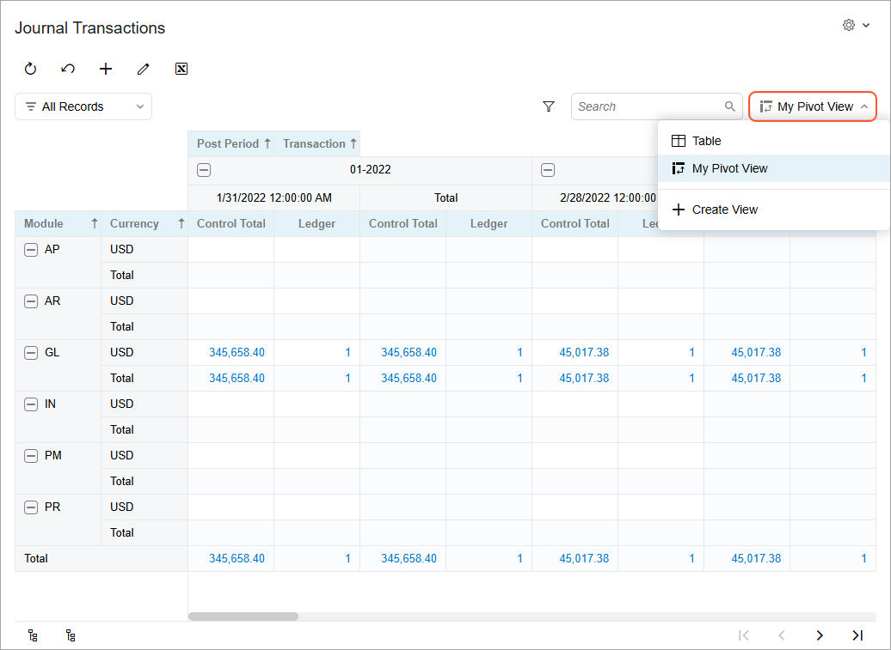

# Pivot Tables: General Information {#_66649b16-b19b-4ae3-9cfb-9c84d018448d .concept}

In Acumatica ERP, you can use pivot tables to reorganize and summarize data from generic inquiries.

## Learning Objectives { .section}

In this chapter, you’ll learn how to do the following:

-   Configure a pivot table on an inquiry form and share it with other users
-   Modify the generic inquiry that’s used as the basis for a pivot table while you are configuring the table

## Applicable Scenarios { .section}

You may find the information in this chapter useful when you’re responsible for the customization of Acumatica ERP in your company. This includes developing and modifying generic inquiries and pivot tables to give the users information they need to do their jobs effectively.

## Pivot Table Basis { .section}

You use the data from a particular generic inquiry to compose a pivot table—that is, the generic inquiry is used as the basis of the pivot table. You can use only one generic inquiry to build each pivot table. If you need to compose a pivot table with information obtained from multiple generic inquiries, you must:

1.  Create a single generic inquiry that includes all the necessary data.
2.  Use this inquiry as a basis for the pivot table.

## Pivot Tables in the Modern UI {#section_m3m_qnb_jgc .section}

In the Modern UI, you can effortlessly toggle between the table and pivot data representations of generic inquiry forms. Pivot views support in-depth analysis of information from multiple perspectives, enhancing your ability to make informed decisions. You can apply the same filter to both table data representations and pivot data representations.

By default, generic inquiry forms display data in the *Table* view. If other data views are available, they’ll be listed in the View List drop-down menu, where you can select another data representation. The menu caption changes to the name of the selected view, as you can see below.

You can create your own pivot views or use pivot views created by other users.

**Parent topic:**[Managing Pivot Tables](../UserGuide/Pivot_Tables_Mapref.md)

