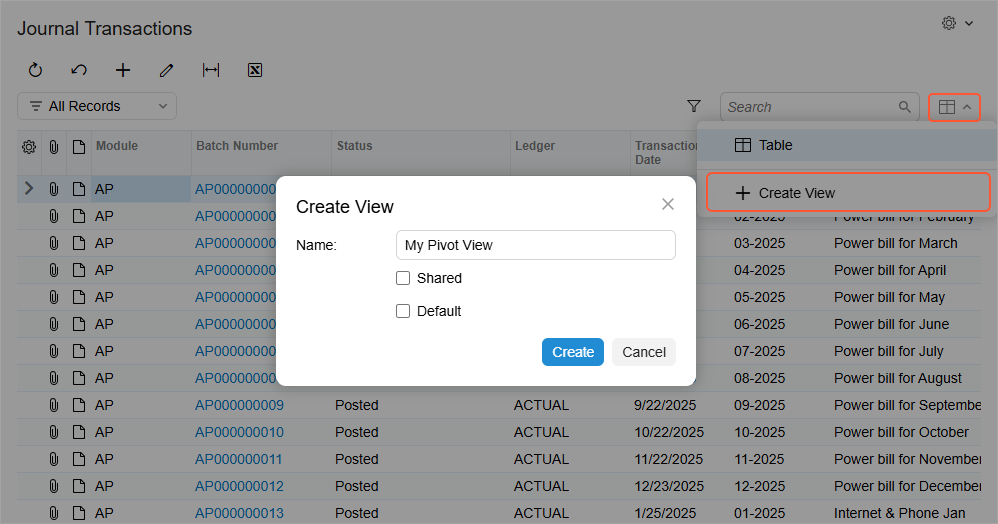
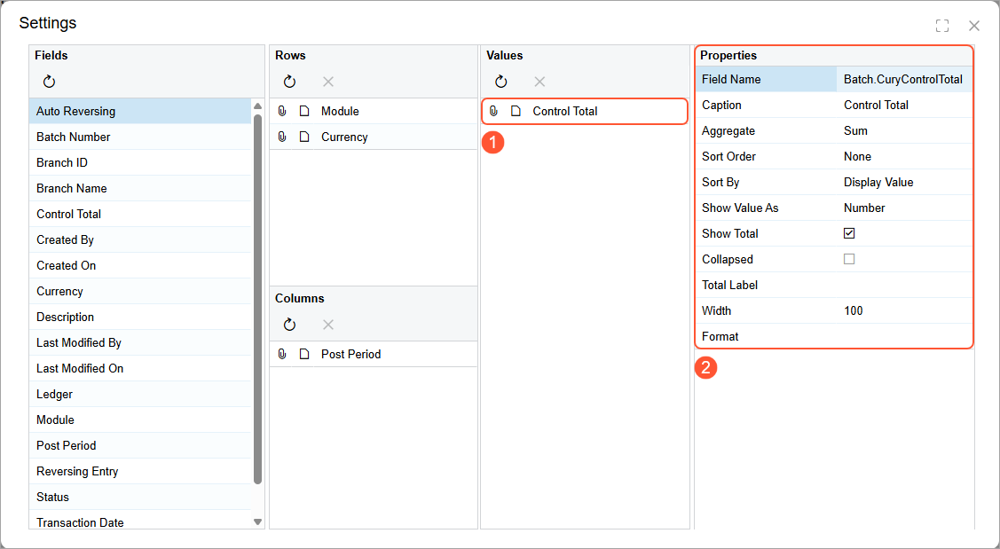
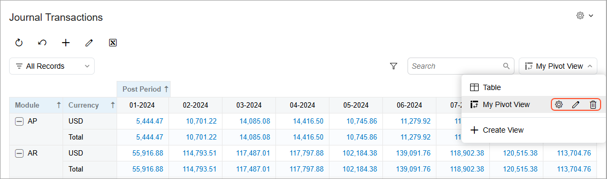

# Pivot Tables: Creation of a Pivot Table {#_2144fd22-8257-4afb-9b5a-13f00d76f2cc .concept}

Once a generic inquiry form has been created, you can create multiple pivot tables, which are saved as data views, for the inquiry form. Once you’ve created a pivot table, you can modify its configuration. You can also delete a pivot table as a data view if you don’t need it anymore.

## Access Rights to Pivot Tables as Data Views {#section_stq_grv_jgc .section}

By default, the ability to save pivot tables as data views is available to all users. If you’d like to share your pivot tables with other users, you need to have the *Administrator* role.

## Creation of a Pivot Table {#section_v11_lrv_jgc .section}

To create a new pivot view, you open the desired generic inquiry form and click **Create View** in the View List drop-down menu. The **Create View** dialog box opens, as shown below.

In the dialog box:

1.  Enter a name for the new view and then click **Save**.
2.  Optional: Select the **Default** check box if you want the system to open this view by default
3.  Optional \(if you have with the *Administrator* user role\): Select the **Shared** check box to make this view available to other users.
4.  Click **Create**. The **Settings** dialog box opens \(described in the next section\).

Once you’ve applied your settings, you’ll see the new pivot view in the View List drop-down menu of the inquiry form, as shown below.

## Configuration of the Table Layout {#section_klh_4rv_jgc .section}

Configuring the layout of a pivot table in Acumatica ERP is similar to this process in Microsoft Excel. You use multiple panes of the **Settings** dialog box to configure a pivot table:

-   The **Fields** pane lists all the fields that have been added to the related inquiry on the **Results Grid** tab of the [Generic Inquiry](SM_20_80_00.md) \(SM208000\) form, regardless of their visibility settings. You move fields between the panes by dragging them.
-   When you click a field in the **Rows**, **Columns**, or **Values** pane \(Item 1 below\), the system displays its properties in the **Properties** pane \(Item 2\).
-   By using the settings in the **Properties** pane, you define how the data of the field is to be presented in the table.

## Edit Mode of the Pivot Table { .section}

To edit an existing pivot view, you open the inquiry form's View List drop-down menu; hover over the pivot view name to display the **Settings**, **Edit**, and **Delete** buttons \(see below\).

Here’s how the buttons work:

-   **Settings**: Opens this dialog box so that you can reconfigure the pivot table.
-   **Edit**: Opens the **Edit View** dialog box, where you can rename the pivot view, set it as the default view, and share it with other users \(if you have the *Administrator* role\).
-   **Delete**: Deletes the view and its settings.

Changes made to shared pivot views affect the pivot view’s appearance for all users, while changes to non-shared pivot views affect the pivot view’s appearance for only your user account.

**Tip:** You cannot delete or reconfigure the predefined *Table* view.

## Data Filtering in Pivot Tables {#_8d66c9a5-7ed2-4688-8345-f9c658416486 .section}

In the Modern UI, you can apply the same filter to both table data representations and pivot data representations. You can create personal filters or apply any shared filter created for the generic inquiry.

**Parent topic:**[Managing Pivot Tables](../UserGuide/Pivot_Tables_Mapref.md)

