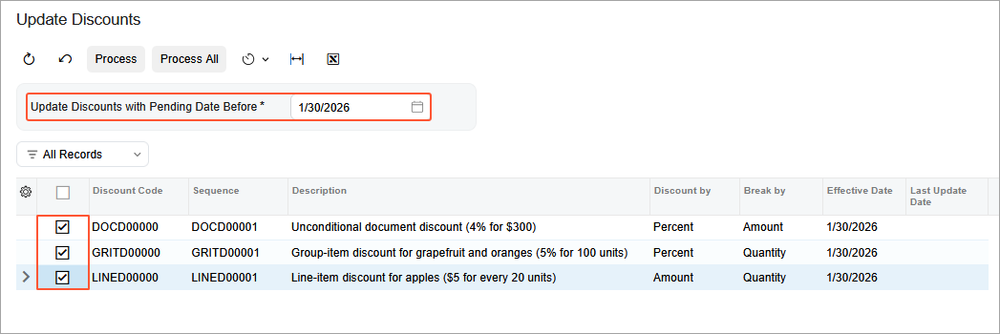
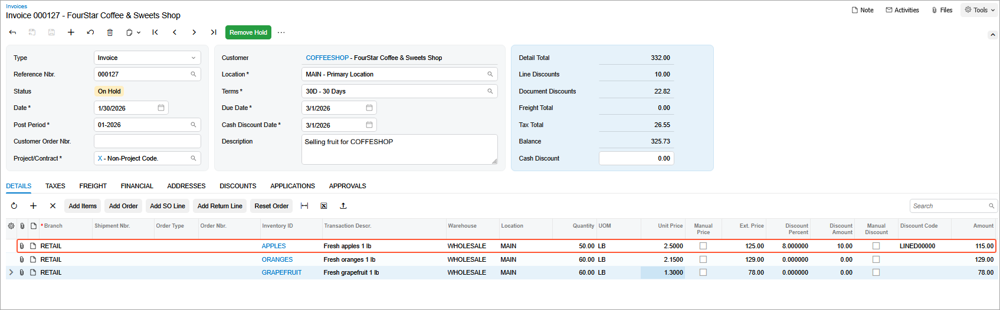
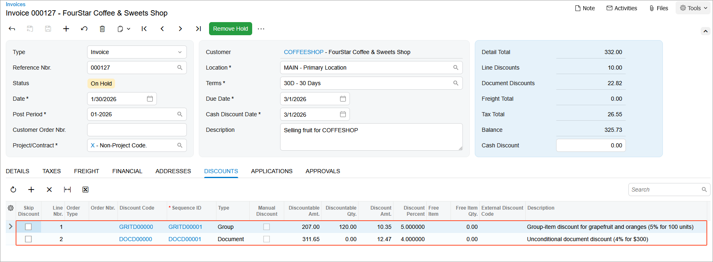
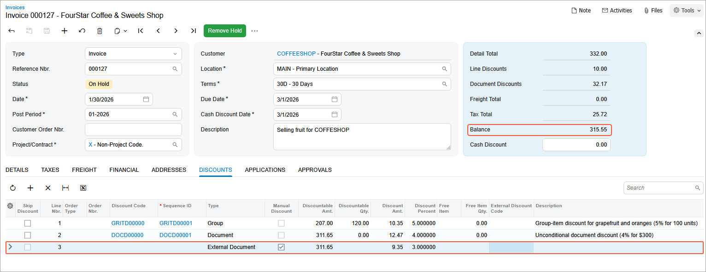

# Discounted Sales Invoice: To Create a Sales Invoice with Automatic Document and Manual Discounts {#_a25f0d13-55b7-45eb-9e76-757b49134c73 .task}

In this activity, you will create three automatic document discounts and a manual discount in Acumatica ERP. You will then explore how these discounts are applied to sales invoices when the *Advanced SO Invoices* feature is enabled in the system.

## Story { .section}

Suppose that starting in January *2026*, the SweetLife Fruits &amp; Jams company is offering the following discounts for fruit that the company's customers purchase:

-   A discount of 5% that will be applied to the cost of the fruit when the customer buys 100 pounds or more of oranges, grapefruit, or both
-   A discount of 4% if the total invoice amount of all fruit sold to the customer greater than or equal $300
-   A $5 discount for every 20 pounds of purchased apples

Suppose that in February *2023*, the FourStar Coffee &amp; Sweets Shop \(*GOODFOOD*\) company decided to have a large party with fruit and cocktails. A representative of the FourStar Coffee &amp; Sweets Shop company's purchasing department called a sales manager of the SweetLife company and submitted an order for 170 pounds of fruit. After the SweetLife sales manager confirmed the availability of the fruit in stock, the customer's manager visited the SweetLife Store and ordered the necessary fruit.

Because the customer mentioned its plans to order fruit from SweetLife for its next party, the SweetLife sales manager decided to offer an additional discount of 3% for the first order total to acknowledge the loyalty of the FourStar Coffee &amp; Sweets Shop company.

Acting as SweetLife's sales manager, you need to create the necessary discounts in the system and create a sales invoice.

## Configuration Overview {#section_tz4_djx_cnb .section}

In the *U100* dataset, the following tasks have been performed to support this activity:

-   On the [Enable/Disable Features](CS_10_00_00.md) \(CS100000\) form, the *Customer Discounts* feature has been enabled to support the discount functionality.
-   On the [Enable/Disable Features](CS_10_00_00.md) form, the *Advanced SO Invoices* feature has been enabled to support the use of sales invoices.
-   On the [Stock Items](IN_20_25_00.md) \(IN202500\) form, the *APPLES*, *ORANGES*, and *GRAPEFRUIT* stock items have been created. All these items are available in stock.
-   On the [Customers](AR_30_30_00.md) \(AR303000\) form, the *COFFEESHOP* customer has been created.
-   On the [Warehouses](IN_20_40_00.md) \(IN204000\) form, the *WHOLESALE* warehouse has been created.

## Process Overview { .section}

To set up discounts, you will define discount codes on the [Discount Codes](AR_20_90_00.md) \(AR209000\) form. You will then configure a line-item discount, group-item discount, and document discount on the [Discounts](AR_20_95_00.md) \(AR209500\) form. Then on the [Update Discounts](AR_50_25_00.md) \(AR502500\) form, you will update all these discounts to make multiple pending discounts effective at the same time.

To view how the discounts are automatically applied to the sales invoice, on the [Invoices](SO_30_30_00.md) \(SO303000\) form, you will create a sales invoice of the *Invoice* type and add the necessary items. You will also apply an external manual discount to the sales invoice.

At the end of activity, you will make the discounts inactive.

## System Preparation { .section}

Before you start the lesson, do the following:

1.  Launch the Acumatica ERP website with the *U100* dataset preloaded, and sign in to the system as a sales manager by using the *chubb* username and the *123* password.
2.  In the info area, in the upper-right corner of the top pane of the Acumatica ERP screen, make sure that the business date in your system is set to *1/30/2026*. If a different date is displayed, click the Business Date menu button and select *1/30/2026*. For simplicity, in this lesson, you will create and process all documents in the system on this business date.
3.  On the Company and Branch Selection menu, also on the top pane of the Acumatica ERP screen, make sure that the *SweetLife Store* branch is selected. If it is not selected, click the Company and Branch Selection menu button to view the list of branches that you have access to, and then click *SweetLife Store*.

## Step 1: Creating Discount Codes { .section}

To configure the automatic discounts for the GoodFood One Restaurant customer, do the following:

1.  Open the [Discount Codes](AR_20_90_00.md) \(AR209000\) form.
2.  Click **Add Row** on the form toolbar, and specify the following settings in the added row:

    -   **Discount Code**: `GRITD00000`
    -   **Description**: `Group-item discount for grapefruit and oranges (5% for 100 units)`
    -   **Discount Type**: *Group*
    -   **Applicable To**: *Item*
    -   **Manual**: *Cleared*
    -   **Auto-Numbering**: Selected
    -   **Last Number**: `GRITD00000`
    With these settings, the discounts of this discount code are group discounts that are applicable to specific items. Because the **Manual** check box is cleared \(the default setting for the row\), these group discounts will be applied automatically to applicable lines of a document.

3.  Save your changes.
4.  Again click **Add Row** on the form toolbar, and specify the following settings in the added row:

    -   **Discount Code**: `DOCD00000`
    -   **Description**: `Unconditional document discount (4% for $300)`
    -   **Discount Type**: *Document*
    -   **Applicable To**: *Unconditional*
    -   **Manual**: *Cleared*
    -   **Auto-Numbering**: Selected
    -   **Last Number**: `DOCD00000`
    With these settings, discounts of this discount code are unconditional discounts that are applicable to the entire document if the amount of goods sold equal or exceeds $300. Because the **Manual** check box is cleared \(the default setting\), these document discounts will be applied automatically to applicable documents.

5.  Save your changes.
6.  Again click **Add Row** on the form toolbar, and specify the following settings in the added row:

    -   **Discount Code**: `LINED00000`
    -   **Description**: `Line-item discount for apples ($5 for every 20 units)`
    -   **Discount Type**: *Line*
    -   **Applicable To**: *Item*
    -   **Manual**: *Cleared*
    -   **Auto-Numbering**: Selected
    -   **Last Number**: `LINED00000`
    With these settings, discounts of this discount code are line discounts that are applicable to specific items. Because the **Manual** check box is cleared, these line discounts will be applied automatically to applicable lines of a document.

7.  On the form toolbar, click **Save**.

## Step 2: Defining the Automatic Group Discount for Items { .section}

To define the automatic group discount for particular stock items \(*ORANGES* and *GRAPEFRUIT*\), do the following:

1.  On the [Discounts](AR_20_95_00.md) \(AR209500\) form, add a new record.
2.  In the Summary area, specify the following settings:

    -   **Discount Code**: *GRITD00000*
    -   **Discount By**: *Percent*
    -   **Break By**: *Quantity*
    -   **Active**: Selected
    -   **Description**: `Group-item discount for grapefruit and oranges (5% for 100 units)`
    With these settings, the discount \(of the discount code *GRITD00000*, which you defined for group discounts that are applicable to specific items sold\) is by percent, with break points by quantity.

3.  On the **Discount Breakpoints** tab, click **Add Row** on the table toolbar, and specify the following settings in the added row:
    -   **Pending Break Quantity**: `100`
    -   **Pending Discount Percent**: `5`
    -   **Pending Date**: *1/30/2026* \(inserted by default\)
4.  On the **Items** tab, click **Add Row** on the table toolbar, and select *ORANGES* in the **Inventory ID** column.
5.  Add another row, and in the **Inventory ID** column, select *GRAPEFRUIT*.

    With the settings you have specified, the 5% discount will be applied to a group of lines of a sales document if the total quantity of the *ORANGES* and *GRAPEFRUIT* items is equal to 100 or more than 100.

6.  On the form toolbar, click **Save**.

## Step 3: Defining the Automatic Unconditional Document Discount { .section}

To define the automatic unconditional document discount, do the following:

1.  On the [Discounts](AR_20_95_00.md) \(AR209500\) form, add a new record.
2.  In the Summary area, specify the following settings:

    -   **Discount Code**: *DOCD00000*
    -   **Discount By**: *Percent*
    -   **Break By**: *Amount* \(inserted by default\)
    -   **Active**: Selected
    -   **Description**: `Unconditional document discount (4% for $300)`
    With these settings, the discount \(of the discount code *DOCD00000*, which you defined for documents\) is by percent, with break points by amount.

    In this case, the value in the **Break By** box is defined automatically based on the discount code configuration and cannot be changed by the user.

3.  On the **Discount Breakpoints** tab, click **Add Row** on the table toolbar, and specify the following settings in the added row:

    -   **Pending Break Amount**: `300`
    -   **Pending Discount Percent**: `4`
    -   **Pending Date**: *1/30/2026* \(inserted by default\)
    This means that the 4% discount will be applied to the sales document if the total amount of the document is $300 or more.

4.  On the form toolbar, click **Save**.

## Step 4: Defining the Automatic Line Discount { .section}

To define the automatic line-item discount that applies to every 20 units of particular items \(*APPLES*\), do the following:

1.  On the [Discounts](AR_20_95_00.md) \(AR209500\) form, add a new record.
2.  In the Summary area, specify the following settings:

    -   **Discount Code**: *LINED00000*
    -   **Discount By**: *Amount*
    -   **Break By**: *Quantity*
    -   **Prorate Discount**: Selected
    -   **Active**: Selected
    -   **Description**: `Line-item discount for apples ($5 for every 20 units)`
    With these settings, the discount \(of the discount code *LINED00000*, which you defined for line discounts that are applicable to specific items\) is by amount, with break points by quantity.

3.  On the **Discount Breakpoints** tab, click **Add Row** on the table toolbar, and specify the following settings in the added row:
    -   **Pending Break Quantity**: `20`
    -   **Pending Discount Amount**: `5`
    -   **Pending Date**: *1/30/2026* \(inserted by default\)
4.  On the **Items** tab, click **Add Row** on the table toolbar, and in the **Inventory ID** column, select *APPLES*.

    With these settings specified, the $5 discount will be applied to the line of the sales document containing the *APPLES* item for every 20 units. For example, if 23 items are ordered, $5 will be applied, and if 45 items are ordered, $10 will be applied.

5.  On the form toolbar, click **Save**.

## Step 5: Making the Pending Discounts Effective { .section}

In this step, you will make multiple pending discounts effective at the same time. Do the following:

1.  Open the [Update Discounts](AR_50_25_00.md) \(AR502500\) form.
2.  In the **Update Discounts with Pending Date Before** box, select *1/30/2026*.

    The system displays a list of discount codes whose pending discount date is the same as or later than the current date.

3.  In the table, select the unlabeled check boxes in the rows with the *DOCD00000*, *GRITD00000*, and *LINED00000* discount codes \(as shown in the following screenshot\).

    

4.  On the form toolbar, click **Process**. After processing has completed, close the **Processing** dialog box. Notice that in the **Last Update Date** column, the current date *1/30/2026* has appeared for the processed discounts.
5.  Open the *DOCD00000*, *GRITD00000*, or *LINED00000* discount code on the [Discounts](AR_20_95_00.md) \(AR209500\) form. On the **Discount Breakpoints** tab, for the sequences *DOCD00001*, *GRITD00001*, or *LINED00001* accordingly notice that the system has cleared the **Pending Date** column and that the **Effective Date** column now contains the current date *1/30/2026*.

## Step 6: Creating a Sales Invoice with Discounts { .section}

To create a sales invoice for testing purposes and explore how the discounts are applied to it, do the following:

1.  On the [Invoices](SO_30_30_00.md) \(SO303000\) form, add a new record.
2.  In the Summary area, specify the following settings:
    -   **Order Type**: *Invoice*
    -   **Customer**: *COFFEESHOP*
    -   **Date**: *1/30/2026* \(inserted by default\)
    -   **Description**: `Selling fruit for COFFESHOP`
3.  On the **Details** tab, click **Add Row** on the table toolbar, and specify the following settings in the added row:
    -   **Branch**: *RETAIL*
    -   **Inventory ID**: *APPLES*
    -   **Warehouse**: *WHOLESALE*
    -   **Location**: *MAIN*
    -   **Quantity**: `50`
    -   **UOM**: *LB*
    -   **Unit Price**: `2.5`
4.  Again click **Add Row** on the table toolbar, and specify the following settings in the in the added row:
    -   **Branch**: *RETAIL*
    -   **Inventory ID**: *ORANGES*
    -   **Warehouse**: *WHOLESALE*
    -   **Location**: *MAIN*
    -   **Quantity**: `60`
    -   **UOM**: *LB*
    -   **Unit Price**: `2.15`
5.  Again click **Add Row** on the table toolbar, and specify the following settings in the added row:
    -   **Branch**: *RETAIL*
    -   **Inventory ID**: *GRAPEFRUIT*
    -   **Warehouse**: *WHOLESALE*
    -   **Location**: *MAIN*
    -   **Quantity**: `60`
    -   **UOM**: *LB*
    -   **Unit Price**: `1.30`
6.  Save your changes.
7.  On the **Details** tab, review the line with *LINED00000* in the **Discount Code** column.

    In the **Discount Amount** column, you can see that the line discount is $10 for the apples. This is because the break point quantity is 20 units of measure \(UOMs\) and the *COFFESHOP* company has ordered 50 units \(so the 20-unit discount of $5 was applied twice\) as shown in the following screenshot.

    

8.  Go to the **Discounts** tab. Notice that the system has applied the automatic group discount \(*GRITD00000*\), which is 5% of the total cost of fruit \(oranges and grapefruit\) or $10.35. In addition, the system has applied the automatic document discount \(*DOCD00000*\) of 4% of the discountable amount \($311.65\) because the amount exceeds $300: 4% of $311.65 is $12.47 as shown in the following screenshot.

    

## Step 7: Applying the External Manual Discount { .section}

To apply the external manual discount to the sales invoice, while you are still viewing the sales invoice on the [Invoices](SO_30_30_00.md) \(SO303000\) form, do the following:

1.  On the table toolbar of the **Discounts** tab, click **Add Row** and specify `3` in the **Discount Percent** column.
2.  Save your changes.
3.  Review the discount amount that the system has applied to the sales invoice, which is $9.35.

    Also, notice that the balance of the sales invoice has decreased from $325.73 to $315.55 \(see the following screenshot\):

    

4.  Close the [Invoices](SO_30_30_00.md) form. You do not need to process this sales invoice; you created it solely to test how the discounts are applied.

## Step 8: Making the Created Discounts Inactive { .section}

1.  Open the [Discounts](AR_20_95_00.md) \(AR209500\) form.
2.  In the Summary area, specify the following settings:
    -   **Discount Code**: *GRITD00000*
    -   **Sequence**: *GRITD000001*
3.  Clear the **Active** check box to make the discount inactive.
4.  Save your changes.
5.  In the Summary area, specify the following settings:
    -   **Discount Code**: *DOCD00000*
    -   **Sequence**: *DOCD000001*
6.  Clear the **Active** check box to make the discount inactive.
7.  Save your changes.
8.  In the Summary area, specify the following settings:
    -   **Discount Code**: *LINED00000*
    -   **Sequence**: *LINED000001*
9.  Clear the **Active** check box to make the discount inactive.
10. Save your changes.

**Parent topic:**[Configuring and Applying Customer Discounts](../UserGuide/Prices_Customer_Discounts_Mapref.md)

