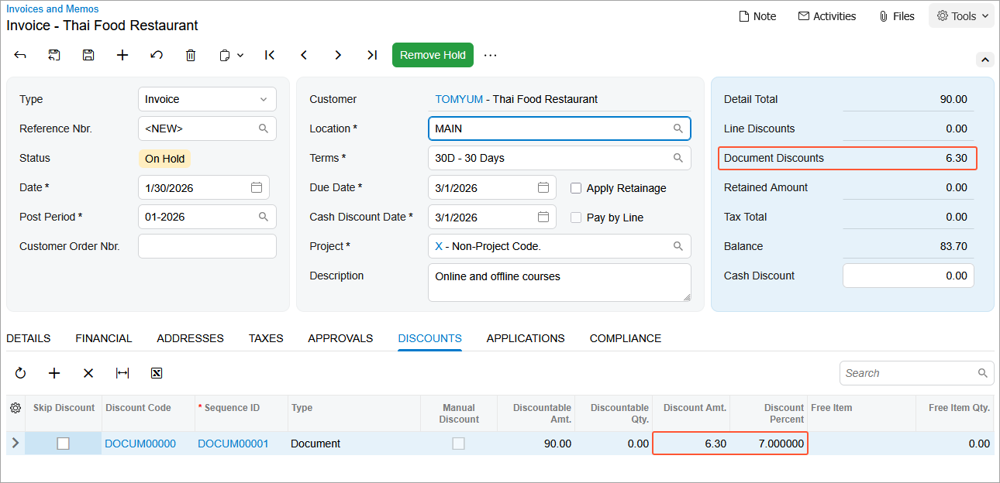
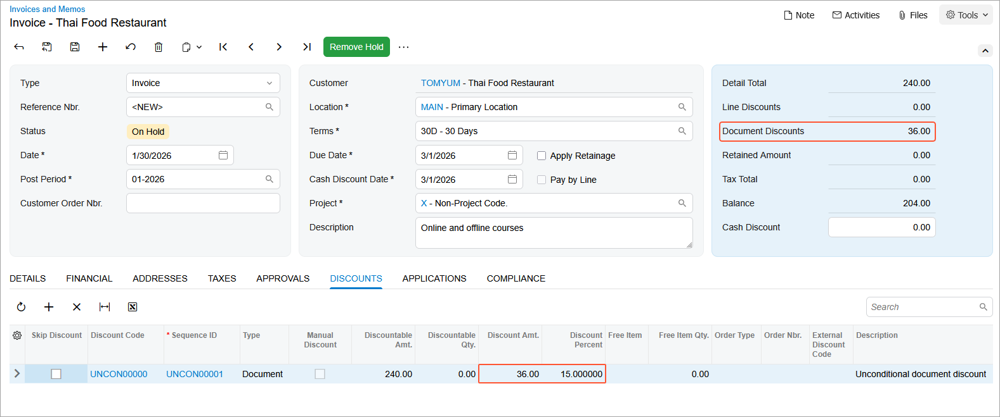

# Automatic Customer Discounts: To Set Up Automatic Customer-Specific and Unconditional Document Discounts {#_807fac08-7fc1-4289-bd0b-27d0631a8a60 .task}

In this activity, you will learn how to set up automatic document discounts, and you will explore how they are applied to AR invoices.

**Attention:** This activity is based on the *U100* dataset. If you are using another dataset or if any system settings have been changed in *U100*, these changes can affect the workflow of the activity and the results of the processing. To avoid issues, restore the *U100* dataset to its initial state.

## Story { .section}

Suppose that the SweetLife Fruits &amp; Jams company has given one of its customers, Thai Food Restaurant \(*TOMYUM*\), a 7% discount. In addition, SweetLife has offered a 15% discount to all customers who purchase $200 or more in a single order \(document\).

Acting as SweetLife's accountant, you need to set up a customer-specific document discount of 7% for the Thai Food Restaurant customer and an unconditional document discount of 15% for all customers who buy SweetLife's products for a document amount of $200 or more.

On January 30, *2026*, Thai Food Restaurant bought 2 days of the offline training course and 10 days of the online training course.

Acting as SweetLife's accountant, you need to enter an AR invoice, to which the discounts should be applied automatically.

## Configuration Overview {#section_tz4_djx_cnb .section}

In the *U100* dataset, the following tasks have been performed to support this activity:

-   On the [Enable/Disable Features](CS_10_00_00.md) \(CS100000\) form, the *Customer Discounts* feature has been enabled to support the discount functionality.
-   On the [Non-Stock Items](IN_20_20_00.md) \(IN202000\) form, the *OFLCOURSE* non-stock item has been created.
-   On the [Customers](AR_30_30_00.md) \(AR303000\) form, the *TOMYUM* customer has been created.

## Process Overview { .section}

First, you will configure discount codes on the [Discount Codes](AR_20_90_00.md) \(AR209000\) form. Then on the [Discounts](AR_20_95_00.md) \(AR209500\) form, you will configure an automatic document discount specific to the Thai Food Restaurant company and an automatic unconditional document discount for all customers.

Then you will create an AR invoice for a particular customer on the [Invoices and Memos](AR_30_10_00.md) \(AR301000\) form, and review the **Discounts** tab to see how automatic document discounts are applied.

Finally, you will deactivate the discounts.

## System Preparation { .section}

Before you start the activity, do the following:

1.  Launch the Acumatica ERP website with the *U100* dataset preloaded, and sign in to the system as an accountant by using the *johnson* username and the *123* password.
2.  In the info area, in the upper-right corner of the top pane of the Acumatica ERP screen, make sure that the business date in your system is set to *1/30/2026*. If a different date is displayed, click the Business Date menu button and select *1/30/2026*. For simplicity, in this lesson, you will create and process all documents in the system on this business date.
3.  On the Company and Branch Selection menu, also on the top pane of the Acumatica ERP screen, make sure that the *SweetLife Head Office and Wholesale Center* branch is selected. If it is not selected, click the Company and Branch Selection menu button to view the list of branches that you have access to, and then click *SweetLife Head Office and Wholesale Center*.

## Step 1: Configuring the Customer-Specific Document Discount { .section}

To configure the automatic document discount specific to the Thai Food Restaurant customer, do the following:

1.  Open the [Discount Codes](AR_20_90_00.md) \(AR209000\) form.
2.  On the form toolbar, click **Add Row**, and specify the following settings in the added row:

    -   **Discount Code**: `DOCUM00000`
    -   **Description**: `Document discount by customer`
    -   **Discount Type**: *Document*
    -   **Applicable To**: *Customer*
    -   **Auto-Numbering**: Selected
    -   **Last Number**: `DOCUM00000`
    These settings define discounts of this discount code as automatic document discounts that are applicable to specific customers \(which will be only the *TOMYUM* customer in this example\).

3.  On the form toolbar, click **Save**.
4.  Open the [Discounts](AR_20_95_00.md) \(AR209500\) form.
5.  On the form toolbar, click **Add New Record**, and specify the following settings in the Summary area:

    -   **Discount Code**: *DOCUM00000*
    -   **Discount By**: *Percent*
    -   **Active**: Selected
    -   **Break By**: Amount \(inserted by default\)
    -   **Description**: `Document discount for TOMYUM`
    These settings convey that this discount \(of the discount code which you defined for document discounts that are applicable to specific customers\) is by percent, with break points by amount. In this case, the value in the **Break By** box has been defined automatically based on the discount code configuration and cannot be changed by the user.

6.  On the **Discount Breakpoints** tab, click **Add Row** on the table toolbar, and specify the following settings in the added row:

    -   **Pending Break Amount**: `0`
    -   **Pending Discount Percent**: `7`
    -   **Pending Date**: *1/30/2026*
    With these settings, the discount of 7% is applicable to a document of any amount \(because the break amount is *0*\).

7.  On the **Customers** tab, click **Add Row** on the table toolbar, and in the **Customer** column, select *TOMYUM*.
8.  On the form toolbar, click **Save**.
9.  On the form toolbar, click **Update Discounts** to make the discount you have just added effective, and in the **Update Discounts** dialog box, which opens, leave *1/30/2026* in the **Filter Date** box, and click **OK**.

    On the **Discount Breakpoints** tab, notice that the system has cleared the **Pending Date** column and that the **Effective Date** column now contains *1/30/2026*.

## Step 2: Configuring the Unconditional Document Discount { .section}

To configure the automatic unconditional document discount of 15% for documents of $200 or more, do the following:

1.  Open the [Discount Codes](AR_20_90_00.md) \(AR209000\) form.
2.  On the form toolbar, click **Add Row**, and specify the following settings in the added row:

    -   **Discount Code**: `UNCON00000`
    -   **Description**: `Unconditional document discount`
    -   **Discount Type**: *Document*
    -   **Applicable To**: *Unconditional*
    -   **Auto-Numbering**: Selected
    -   **Last Number**: `UNCON00000`
    With these settings, discounts of this discount code are unconditional automatic document discounts. In this case, *Unconditional* conveys that the discount code is not applicable to a limited set of entities. However, a discount of this discount code may have particular break points defined for specific discounts, as is the case in this example.

3.  On the form toolbar, click **Save**.
4.  Open the [Discounts](AR_20_95_00.md) \(AR209500\) form.
5.  On the form toolbar, click **Add New Record**, and specify the following settings in the Summary area:

    -   **Discount Code**: *UNCON00000*
    -   **Discount By**: *Percent*
    -   **Break By**: Amount \(inserted by default\)
    -   **Active**: Selected
    -   **Description**: `Unconditional document discount`
    These settings convey that this discount \(of the discount code you just defined for unconditional document discounts\) is by percent, with break points by amount. In this case, the value in the **Break By** box has been defined automatically based on the discount code configuration and cannot be changed by the user.

6.  On the **Discount Breakpoints** tab, click **Add Row** on the table toolbar, and specify the following settings in the added row:

    -   **Pending Break Amount**: `200`
    -   **Pending Discount Percent**: `15`
    -   **Pending Date**: *1/30/2026*
    The discount of 15% is applicable to a document with an amount greater than or equal to $200.

7.  On the form toolbar, click **Save**.
8.  On the form toolbar, click **Update Discounts**, and in the **Update Discounts** dialog box, which opens, leave *1/30/2026* in the **Filter Date** box, and click **OK**.

    On the **Discount Breakpoints** tab, notice that the system has cleared the **Pending Date** column and that the **Effective Date** column now contains this date \(*1/30/2026*\).

## Step 3: Creating the AR Invoice and Explore the Discount Application { .section}

To create the AR invoice for the Thai Food Restaurant customer and explore how the system automatically applies the discounts you have created, do the following:

1.  Open the [Invoices and Memos](AR_30_10_00.md) \(AR301000\) form.
2.  On the form toolbar, click **Add New Record**, and specify the following settings in the Summary area:
    -   **Type**: *Invoice*
    -   **Customer**: *TOMYUM*
    -   **Date**: *1/30/2026*
    -   **Post Period**: *01-2026*
    -   **Description**: `Online and offline courses`
3.  On the **Details** tab, click **Add Row** on the table toolbar, and specify the following settings in the added row:

    -   **Branch**: *HEADOFFICE*
    -   **Inventory ID**: *OFLCOURSE*
    -   **Quantity**: `2`
    -   **UOM**: *DAY*
    -   **Unit Price**: `45`
    On the **Discounts** tab, notice that a row with the *DOCUM00000* discount code, which you configured in Step 1, has been added, meaning that the discount has been applied to this document.

    The **Discount Percent** column shows the discount percent \(7%\), the **Discount Amt.** column shows the discount amount \(*6.30*\), and the same amount is shown in the **Document Discounts** box in the Summary area \(see the following screenshot\).

    

4.  On the **Details** tab, click **Add Row** on the table toolbar, and specify the following settings in the added row:

    -   **Branch**: *HEADOFFICE*
    -   **Inventory ID**: *ONLCOURSE*
    -   **Quantity**: `10`
    -   **UOM**: *DAY*
    -   **Unit Price**: `15`
    On the **Discounts** tab, notice that a row with the *UNCON00000* discount code, which you configured in Step 2, has been added, meaning that the discount has been applied to this document. The 7% discount that was applied after you added the first document line has now disappeared.

    Also notice that the **Discount Percent** column shows the discount percent \(15%\), the **Discount Amt.** column shows the discount amount \(*36*\), and the same amount is now shown in the **Document Discounts** box in the Summary area \(see the following screenshot\). This discount has been applied because it is the best available discount for this document.

    

5.  On the form toolbar, click **Remove Hold** and then click **Release** to release the invoice.

## Step 4: Making the Created Discounts Inactive { .section}

1.  Open the [Discounts](AR_20_95_00.md) \(AR209500\) form.
2.  In the Summary area, specify the following settings:
    -   **Discount Code**: *DOCUM00000*
    -   **Sequence**: *DOCUM00001*
3.  Clear the **Active** check box to make the discount inactive.
4.  Save your changes.
5.  In the Summary area, specify the following settings:
    -   **Discount Code**: *UNCON00000*
    -   **Sequence**: *UNCON00001*
6.  Clear the **Active** check box to make the discount inactive.
7.  Save your changes.

**Parent topic:**[Configuring and Applying Customer Discounts](../UserGuide/Prices_Customer_Discounts_Mapref.md)

