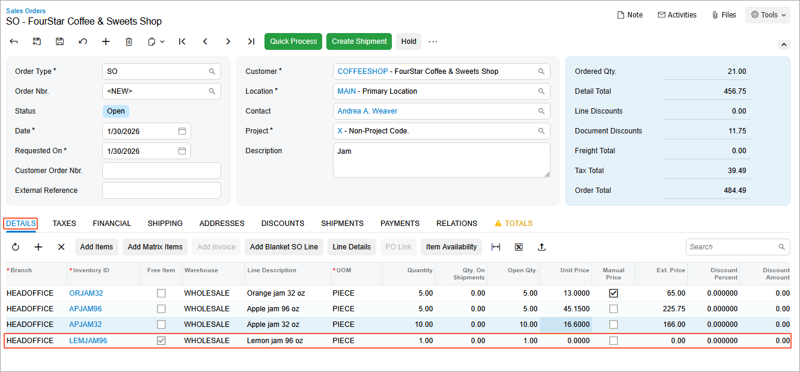
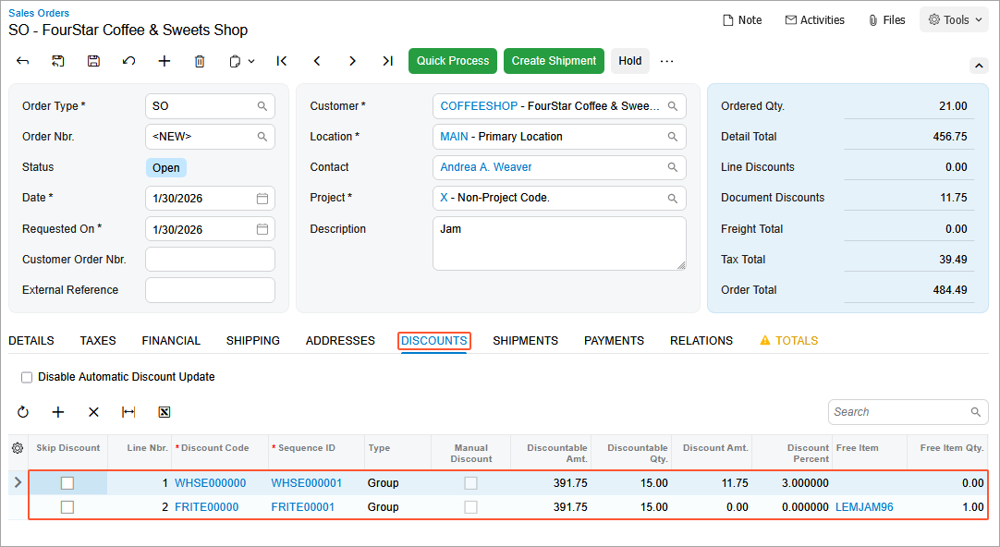

# Automatic Customer Discounts: To Set Up an Automatic Group Discount and a Free-Item Group Promotional Discount {#_78b11114-4206-48a5-8d7a-f86d257730c5 .task}

In this activity, you will learn how to set up and apply an automatic group discount for particular stock items sold from a specific warehouse and a free-item group promotional discount, and how the system applies these discounts to a sales order.

**Attention:** This activity is based on the *U100* dataset. If you are using another dataset or if any system settings have been changed in *U100*, these changes can affect the workflow of the activity and the results of the processing. To avoid issues, restore the *U100* dataset to its initial state.

## Story { .section}

Suppose that on January 30, 2026, the SweetLife Fruits &amp; Jams company starts selling 32-ounce and 96-ounce jars of apple jam at a 3% discount from the Wholesale warehouse \(*WHOLESALE*\). Also, for sales orders with dates from *1/30/2026* to *2/15/2026*, the company also wants to add a free jar of 96-ounce of lemon jam for the customers who have bought the apple jam for the amount of $350 and more.

Acting as SweetLife's accountant, you need to configure an automatic group discounts of 3% for the *APJAM32* and *APJAM96* stock items sold from the Wholesale warehouse, and a free-item promotional group discount for sales orders in which the total amount of the *APJAM32* and *APJAM96* stock items exceeds $350. You also need to create a sales order to see how the discounts are applied.

**Tip:** A group discount is based on the amount or quantity that is in one line or the sum of multiple lines. In this case, a group discount is used because the free-item discount is based on the sum of amounts of the 32-ounce jars of apple jam and the 96-ounce jars of apple jam.

## Configuration Overview {#section_tz4_djx_cnb .section}

In the *U100* dataset, the following tasks have been performed to support this activity:

-   On the [Enable/Disable Features](CS_10_00_00.md) \(CS100000\) form, the *Customer Discounts* feature has been enabled to support the discount functionality.
-   On the [Stock Items](IN_20_25_00.md) \(IN202500\) form, the *APJAM32*, *APJAM96*, *ORJAM32*, and *LEMJAM96* stock items have been created.
-   On the [Customers](AR_30_30_00.md) \(AR303000\) form, the *COFFEESHOP* customer has been created.
-   On the [Warehouses](IN_20_40_00.md) \(IN204000\) form, the *WHOLESALE* warehouse has been created.

## Process Overview { .section}

To set up a free-item group promotional discount and a warehouse-specific group discount, you will configure a discount code on the [Discount Codes](AR_20_90_00.md) \(AR209000\) form and then configure the needed discount on the [Discounts](AR_20_95_00.md) \(AR209500\) form.

To review how the discounts are applied to the sales order, you will then create a sales order on the [Sales Orders](SO_30_10_00.md) \(SO301000\) form and add items to observe the application of discounts. You will not need to save or process this sales order.

Finally, you will deactivate the discounts.

## System Preparation { .section}

Before you start the lesson, do the following:

1.  Launch the Acumatica ERP website with the *U100* dataset preloaded, and sign in to the system as an accountant by using the *johnson* username and the *123* password.
2.  In the info area, in the upper-right corner of the top pane of the Acumatica ERP screen, make sure that the business date in your system is set to *1/30/2026*. If a different date is displayed, click the Business Date menu button and select *1/30/2026*. For simplicity, in this lesson, you will create and process all documents in the system on this business date.
3.  On the Company and Branch Selection menu, also on the top pane of the Acumatica ERP screen, make sure that the *SweetLife Head Office and Wholesale Center* branch is selected. If it is not selected, click the Company and Branch Selection menu button to view the list of branches that you have access to, and then click *SweetLife Head Office and Wholesale Center*.

## Step 1: Configuring the Warehouse-Specific Group Discount for Particular Items { .section}

To configure the warehouse-specific group discount for particular stock items \(for the *WHOLESALE* warehouse and the *APJAM96* and *APJAM32* items\), do the following:

1.  Open the [Discount Codes](AR_20_90_00.md) \(AR209000\) form.
2.  On the form toolbar, click **Add Row**, and specify the following settings in the added row:

    -   **Discount Code**: `WHSE000000`
    -   **Description**: `Warehouse discount by items`
    -   **Discount Type**: *Group*
    -   **Applicable To**: *Warehouse and Item*
    -   **Auto-Numbering**: Selected
    -   **Last Number**: `WHSE000000`
    These settings define discounts of this discount code as automatic group discounts that are applicable to specific items sold in specific warehouses \(which will be just one warehouse in this example\).

3.  On the form toolbar, click **Save**.
4.  Open the [Discounts](AR_20_95_00.md) \(AR209500\) form.
5.  On the form toolbar, click **Add New Record**, and specify the following settings in the Summary area:

    -   **Discount Code**: *WHSE000000*
    -   **Discount By**: *Percent*
    -   **Break By**: *Amount*
    -   **Active**: Selected
    -   **Description**: `Warehouse discount for apple jam`
    With these settings, the discount \(of the discount code you just defined for group discounts that are applicable to specific items sold in particular warehouses\) is by percent, with break points by amount.

6.  On the **Discount Breakpoints** tab, click **Add Row** on the table toolbar, and specify the following settings in the added row:

    -   **Pending Break Amount**: `0`
    -   **Pending Discount Percent**: `3`
    -   **Pending Date**: *1/30/2026*
    The discount of 3% is applicable to all groups \(because the break amount is 0\).

7.  On the **Items** tab, click **Add Row** on the table toolbar, and in the **Inventory ID** column, select *APJAM32*.
8.  Add another row, and in the **Inventory ID** column, select *APJAM96*.
9.  On the **Warehouses** tab, click **Add Row** on the table toolbar, and in the **Warehouse** column, select *WHOLESALE*. Because this is the only row on the tab, the discount is applicable to only the *WHOLESALE* warehouse.
10. On the form toolbar, click **Save**.
11. On the form toolbar, click **Update Discounts** to make the discount you have just added effective.
12. In the **Update Discounts** dialog box, which opens, leave the *1/30/2026* default value, and click **OK**.

    On the **Discount Breakpoints** tab, notice that the system has cleared the **Pending Date** column and that the **Effective Date** column now contains this date \(*1/30/2026*\).

## Step 2: Configuring the Free-Item Group Promotional Discount { .section}

To configure the free-item group promotional discount in which the *LEMJAM96* stock item is the free item, do the following:

1.  Open the [Discount Codes](AR_20_90_00.md) \(AR209000\) form.
2.  On the form toolbar, click **Add Row**, and specify the following settings in the added row:

    -   **Discount Code**: `FRITE00000`
    -   **Description**: `Free-item promotional discount`
    -   **Discount Type**: *Group*
    -   **Applicable To**: *Item*
    -   **Auto-Numbering**: Selected
    -   **Last Number**: `FRITE00000`
    Discounts of this discount code are automatic group discounts that are promotional and are applicable to specific items.

3.  On the form toolbar, click **Save**.
4.  Open the [Discounts](AR_20_95_00.md) \(AR209500\) form.
5.  On the form toolbar, click **Add New Record**, and specify the following settings in the Summary area:

    -   **Discount Code**: *FRITE00000*
    -   **Discount By**: *Free Item*
    -   **Break By**: *Amount*
    -   **Promotional**: Selected
    -   **Promotion Period**: *1/30/2026—_2/15/2026_*
    -   **Description**: `Free-item promotional discount (lemon jam)`
    The free-item discount \(of the discount code you just defined for group discounts that are applicable to specific items\) is a promotional discount. It is effective for the specified date range, with break points by amount.

6.  On the **Discount Breakpoints** tab, click **Add Row** on the table toolbar, and specify the following settings in the added row:

    -   **Break Amount**: `350`
    -   **Free Item Quantity**: `1`
    With these settings, the discount of one free item is applicable to a group with an amount greater than or equal to $350.

7.  On the **Items** tab, click **Add Row** on the table toolbar, and select *APJAM32* in the **Inventory ID** column.
8.  Add another row, and select *APJAM96* in the **Inventory ID** column.
9.  On the **Free Items** tab, in the **Free Item** box, select *LEMJAM96*.
10. In the Summary area of the form, select the **Active** check box.
11. On the form toolbar, click **Save**.

## Step 3: Creating a Sales Order and Exploring an Application of the Automatic Group Discounts { .section}

To create a sales order for testing purposes and explore how the automatic group discounts are applied to it, do the following:

1.  Open the [Sales Orders](SO_30_10_00.md) \(SO301000\) form.
2.  On the form toolbar, click **Add New Record**, and specify the following settings in the Summary area:
    -   **Order Type**: *SO*
    -   **Customer**: *COFFEESHOP*
    -   **Date**: *1/30/2026*
    -   **Requested On**: *1/30/2026*
    -   **Description**: `Jam`
3.  On the **Details** tab, click **Add Row** on the table toolbar, and specify the following settings in the added row:

    -   **Branch**: *HEADOFFICE*
    -   **Inventory ID**: *ORJAM32*
    -   **UOM**: *PIECE*
    -   **Quantity**: `5`
    -   **Unit Price**: `13`
    Notice that the values in the **Discount Percent** and **Discount Amount** columns are *0*, indicating that no discounts have been applied to this stock item, because there are no active discounts in the system for this stock item.

4.  On the **Details** tab, click **Add Row** on the table toolbar, and specify the following settings for the added row:
    -   **Branch**: *HEADOFFICE*
    -   **Inventory ID**: *APJAM96*
    -   **UOM**: *PIECE*
    -   **Quantity**: `5`
    -   **Unit Price**: `45.15`
5.  On the **Details** tab, click **Add Row** on the table toolbar, and specify the following settings in the added row:

    -   **Branch**: *HEADOFFICE*
    -   **Inventory ID**: *APJAM32*
    -   **UOM**: *PIECE*
    -   **Quantity**: `10`
    -   **Unit Price**: `16.60`
    Notice that another row, which contains the *LEMJAM96* stock item, has been automatically added to the order, and the **Free Item** check box has been selected in the row \(see the following screenshot\).

    

6.  On the **Discounts** tab, review the discounts, which you configured earlier in this lesson and which have been applied to the sales order.

    The system does not select the best available group discount. Instead, it adds all group discounts that are applicable to sales orders.

    The warehouse-specific discount *WHSE000000* has been applied because the *APJAM32* and *APJAM96* stock items were sold from the *WHOLESALE* warehouse specified in the discount.

    As shown in the screenshot below, the free-item discount *FRITE00000* has been applied because the order date \(*1/30/2026*\) is within the range of effective dates of the promotional discount and the total price for *APJAM32* and *APJAM96* exceeds $350, the break point.

    

    You do not need to save or process this sales order; you created it solely to test how the discounts are applied.

## Step 4: Making the Created Discounts Inactive { .section}

1.  Open the [Discounts](AR_20_95_00.md) \(AR209500\) form.
2.  In the Summary area, specify the following settings:
    -   **Discount Code**: *WHSE000000*
    -   **Sequence**: *WHSE000001*
3.  Clear the **Active** check box to make the discount inactive.
4.  Save your changes.
5.  In the Summary area, specify the following settings:
    -   **Discount Code**: *FRITE00000*
    -   **Sequence**: *FRITE00001*
6.  Clear the **Active** check box to make the discount inactive.
7.  Save your changes.

**Parent topic:**[Configuring and Applying Customer Discounts](../UserGuide/Prices_Customer_Discounts_Mapref.md)

