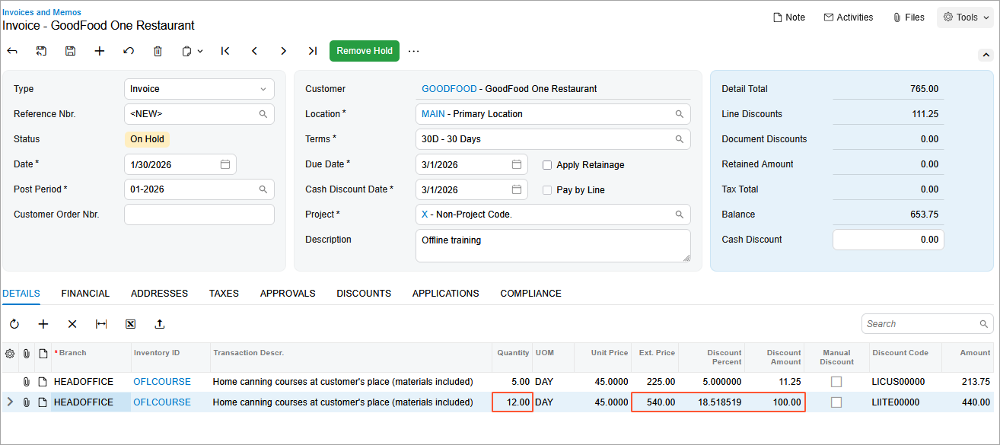

# Automatic Customer Discounts: To Set Up Automatic Line Discounts {#_25f0c957-0afc-4576-90af-04a15b261358 .task}

In this activity, you will learn how to set up automatic line discounts of different types \(discount by percent with a break point by amount and discount by amount with a break point by quantity\) and explore how these discounts are applied to AR invoices.

**Attention:** This activity is based on the *U100* dataset. If you are using another dataset or if any system settings have been changed in *U100*, these changes can affect the workflow of the activity and the results of the processing. To avoid issues, restore the *U100* dataset to its initial state.

## Story { .section}

Suppose that starting in January 2026, the SweetLife Fruits &amp; Jams company is offering the following discounts, which will be applied to AR invoices, for the offline training courses that the company sells to its customers:

-   An automatic line discount of 5% that will be applied to the GoodFood One Restaurant \(*GOODFOOD*\) customer when the invoice line amount exceeds $200. That is, it is a discount by percent with a break point by amount.
-   An automatic line discount of $100 that will be applied to local customers who order 10 or more days of offline training. That is, it is a discount by amount with a break point by quantity.

On January 30, 2026, GoodFood One Restaurant purchased 16 days of the home canning course \(that is, the offline course\).

Acting as SweetLife's accountant, you need to configure automatic line discounts and create an invoice for GoodFood One Restaurant, noticing how the discounts are applied.

## Configuration Overview {#section_tz4_djx_cnb .section}

In the *U100* dataset, the following tasks have been performed to support this activity:

-   On the [Enable/Disable Features](CS_10_00_00.md) \(CS100000\) form, the *Customer Discounts* feature has been enabled to support the discount functionality.
-   On the [Non-Stock Items](IN_20_20_00.md) \(IN202000\) form, the *OFLCOURSE* non-stock item has been created.
-   On the [Customer Price Classes](AR_20_80_00.md) \(AR208000\) form, the *LOCAL* customer price class has been created.
-   On the [Customers](AR_30_30_00.md) \(AR303000\) form, the *GOODFOOD* customer has been created and assigned to the *LOCAL* customer price class.

## Process Overview { .section}

You will create discount codes on the [Discount Codes](AR_20_90_00.md) \(AR209000\) form and configure line discounts by percent and by amount on the [Discounts](AR_20_95_00.md) \(AR209500\) form.

Then on the [Invoices and Memos](AR_30_10_00.md) \(AR301000\) form, you will create an AR invoice with lines to which discounts may be applied. You will review how the discounts you have configured are applied automatically.

Finally, you will deactivate the line discounts.

## System Preparation { .section}

To prepare the system, do the following:

1.  Launch the Acumatica ERP website with the *U100* dataset preloaded, and sign in to the system as an accountant by using the *johnson* username and the *123* password.
2.  In the info area, in the upper-right corner of the top pane of the Acumatica ERP screen, make sure that the business date in your system is set to *1/30/2026*. If a different date is displayed, click the Business Date menu button and select *1/30/2026*. For simplicity, in this lesson, you will create and process all documents in the system on this business date.
3.  On the Company and Branch Selection menu, also on the top pane of the Acumatica ERP screen, make sure that the *SweetLife Head Office and Wholesale Center* branch is selected. If it is not selected, click the Company and Branch Selection menu button to view the list of branches that you have access to, and then click *SweetLife Head Office and Wholesale Center*.

## Step 1: Configuring the Automatic Line Discount by Percent for a Particular Customer { .section}

To configure the automatic line discount by percent for the GoodFood One Restaurant customer and make it effective, do the following:

1.  Open the [Discount Codes](AR_20_90_00.md) \(AR209000\) form.
2.  On the form toolbar, click **Add Row**, and specify the following settings in the added row:

    -   **Discount Code**: `LICUS00000`
    -   **Description**: `Line discount by customer`
    -   **Discount Type**: *Line*
    -   **Applicable To**: *Customer*
    -   **Auto-Numbering**: Selected
    -   **Last Number**: `LICUS00000`
    With these settings, the automatic line discounts of this discount code are line discounts that are applicable to specific customers. Because the **Manual** check box is cleared, these line discounts will be applied automatically.

3.  On the form toolbar, click **Save**.
4.  Open the [Discounts](AR_20_95_00.md) \(AR209500\) form.
5.  On the form toolbar, click **Add New Record**, and specify the following settings in the Summary area:

    -   **Discount Code**: *LICUS00000*
    -   **Discount By**: *Percent*
    -   **Break By**: *Amount*
    -   **Active**: Selected
    -   **Description**: `Line discount for GOODFOOD`
    These settings convey that this automatic line discount \(of the discount code that you defined for line discounts that are applicable to particular customers\) is by percent, with break points by line amount.

6.  On the **Discount Breakpoints** tab, click **Add Row** on the table toolbar, and specify the following settings in the added row:

    -   **Pending Break Amount**: `200`
    -   **Pending Discount Percent**: `5`
    -   **Pending Date**: *1/1/2026*
    With these settings, the discount of 5% is applicable to a line with an amount greater than or equal to $200.

7.  On the **Customers** tab, click **Add Row** on the table toolbar, and in the **Customer** column, select *GOODFOOD*. Because this is the only row defined on this tab, this discount can be applied to only the *GOODFOOD* customer.
8.  On the form toolbar, click **Save**.
9.  On the form toolbar, click **Update Discounts**.
10. In the **Update Discounts** dialog box, which opens, leave the default value \(*1/30/2026*\) in the **Filter Date** box, and click **OK**.

    On the **Discount Breakpoints** tab, notice that the system has cleared the **Pending Date** column and that the **Effective Date** column now contains *1/1/2026*.

## Step 2: Configuring the Automatic Line Discount by Amount for a Particular Customer Price Class { .section}

To configure the automatic line discount by amount for the *LOCAL* customer price class, do the following:

1.  Open the [Discount Codes](AR_20_90_00.md) \(AR209000\) form.
2.  On the form toolbar, click **Add Row**, and specify the following settings in the added row:

    -   **Discount Code**: `LIITE00000`
    -   **Description**: `Line discount by item and customer price class`
    -   **Discount Type**: *Line*
    -   **Applicable To**: *Customer Price Class and Item*
    -   **Auto-Numbering**: Selected
    -   **Last Number**: `LIITE00000`
    Discounts of this discount code are automatic line discounts that are applicable if the line refers to a specific item and the document refers to a customer of a specific price class.

3.  On the form toolbar, click **Save**.
4.  Open the [Discounts](AR_20_95_00.md) \(AR209500\) form.
5.  On the form toolbar, click **Add New Record**, and specify the following settings in the Summary area:

    -   **Discount Code**: *LIITE00000*
    -   **Discount By**: *Amount*
    -   **Break By**: *Quantity*
    -   **Active**: Selected
    -   **Description**: `Line discount for local customers by item`
    With these settings, the automatic line discount \(of the discount code you just defined for line discounts that are applicable to a specific item and a customer of a particular price class\) is by amount, with break points by quantity.

6.  On the **Discount Breakpoints** tab, click **Add Row** on the table toolbar, and specify the following settings in the added row:

    -   **Pending Break Quantity**: `10`
    -   **Pending Discount Amount**: `100`
    -   **Pending Date**: *1/1/2026*
    The discount of $100 is applicable to a line with a quantity greater than or equal to 10.

7.  On the **Items** tab, click **Add Row** on the table toolbar, and in the **Inventory ID** column, select *OFLCOURSE*. Because this is the only row on the tab, this discount applies to only the *OFLCOURSE* item.
8.  On the **Customer Price Classes** tab, click **Add Row** on the table toolbar, and in the **Price Class ID** column, select *LOCAL*. The discount applies to only customers of the *LOCAL* customer price class.
9.  On the form toolbar, click **Save**.
10. On the form toolbar, click **Update Discounts** to make the discounts you have just added effective; otherwise, the system considers your discounts pending.
11. In the **Update Discounts** dialog box, which opens, leave the default value \(*1/30/2026*\) in the **Filter Date** box, and click **OK**.

    On the **Discount Breakpoints** tab, notice that the system has cleared the **Pending Date** column and that the **Effective Date** column now contains *1/1/2026*.

## Step 3: Creating the AR Invoice and Exploring Discount Application { .section}

To create the AR invoice to GoodFood One Restaurant and explore how the automatic line discounts are applied, do the following:

1.  Open the [Invoices and Memos](AR_30_10_00.md) \(AR301000\) form.
2.  On the form toolbar, click **Add New Record**, and specify the following settings in the Summary area:
    -   **Type**: *Invoice*
    -   **Customer**: *GOODFOOD*
    -   **Date**: *1/30/2026*
    -   **Description**: `Offline training`
3.  On the **Details** tab, click **Add Row**, and specify the following settings in the added row:

    -   **Branch**: *HEADOFFICE*
    -   **Inventory ID**: *OFLCOURSE*
    -   **Quantity**: `5`
    -   **UOM**: *DAY*
    -   **Unit Price**: `45`
    The **Discount Percent** column contains the 5% discount \(which is $11.25 in the **Discount Amount** column\) that you configured in Step 1. The discount has been applied automatically, because the amount in the **Ext. Price** column exceeds the break point of $200.

4.  On the table toolbar, click **Add Row**, and specify the following settings in the row:

    -   **Branch**: *HEADOFFICE*
    -   **Inventory ID**: *OFLCOURSE*
    -   **Quantity**: `12`
    -   **UOM**: *DAY*
    -   **Unit Price**: `45`
    The **Discount Amount** column contains the $100 discount that you configured in Step 2. The discount has been applied automatically to this line, because the quantity exceeds 10 and the customer belongs to the *LOCAL* price class. Since this line meets the criteria for more than one discount, the system has applied the best available discount, as shown in the following screenshot.

    

5.  On the form toolbar, click **Remove Hold**, and then click **Release** to release the invoice.
6.  On the **Financial** tab, click the link in the **Batch Nbr.** box to review the GL batch, which the system opens on the [Journal Transactions](GL_30_10_00.md) \(GL301000\) form.

    The *11000 - Accounts Receivable* account is debited in the amount of $653.75, and the *40000 - Sales Revenue* account is credited in the same amount in total \($213.75 + $440\).

## Step 4: Making the Created Discounts Inactive { .section}

1.  Open the [Discounts](AR_20_95_00.md) \(AR209500\) form.
2.  In the Summary area, specify the following settings:
    -   **Discount Code**: *LICUS00000*
    -   **Sequence**: *LICUS00001*
3.  Clear the **Active** check box to make the discount inactive.
4.  Save your changes.
5.  In the Summary area, specify the following settings:
    -   **Discount Code**: *LIITE00000*
    -   **Sequence**: *LIITE00001*
6.  Clear the **Active** check box to make the discount inactive.
7.  Save your changes.

**Parent topic:**[Configuring and Applying Customer Discounts](../UserGuide/Prices_Customer_Discounts_Mapref.md)

