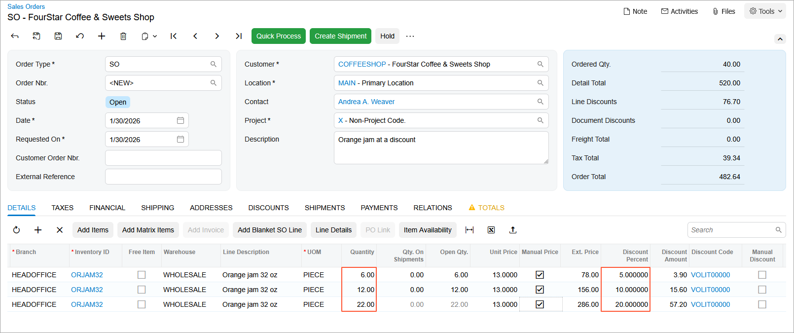

# Automatic Customer Discounts: To Set Up Automatic Volume Line Discounts {#_c4c185c9-718b-465d-bf47-b43081f7d9ba .task}

In this activity, you will learn how to set up an automatic volume line discount for a particular stock item, and you will explore how it is applied to a sales order.

**Attention:** This activity is based on the *U100* dataset. If you are using another dataset or if any system settings have been changed in *U100*, these changes can affect the workflow of the activity and the results of the processing. To avoid issues, restore the *U100* dataset to its initial state.

## Story { .section}

Suppose that at the end of January, warehouse personnel at SweetLife Fruits &amp; Jams found out that the Wholesale warehouse \(*WHOLESALE*\) contains a large lot of 32-ounce jars of orange jam with an approaching expiration date. Company personnel have decided to sell these jars at the following discounts:

-   5% for 5 to 10 jars
-   10% for 11 to 19 jars
-   20% for 20 jars or more

Because no one can predict when the entire lot will be sold, this discount should be configured to start on January 30, *2026* and extend indefinitely.

Acting as SweetLife's accountant, you need to configure this discount in the system and create a sales order to see how the discount is applied. You will then deactivate the discount.

## Configuration Overview {#section_tz4_djx_cnb .section}

In the *U100* dataset, the following tasks have been performed to support this activity:

-   On the [Enable/Disable Features](CS_10_00_00.md) \(CS100000\) form, the *Customer Discounts* feature has been enabled to support the discount functionality.
-   On the [Stock Items](IN_20_25_00.md) \(IN202500\) form, the *ORJAM32* stock item has been created.
-   On the [Customers](AR_30_30_00.md) \(AR303000\) form, the *COFFEESHOP* customer has been created.
-   On the [Warehouses](IN_20_40_00.md) \(IN204000\) form, the *WHOLESALE* warehouse has been created.

## Process Overview { .section}

To set up an automatic volume discount for a particular stock item, you will create the needed discount code on the [Discount Codes](AR_20_90_00.md) \(AR209000\) form. Then you will define an automatic volume discount for the particular item on the [Discounts](AR_20_95_00.md) \(AR209500\) form.

To see how the discount is applied, on the [Sales Orders](SO_30_10_00.md) \(SO301000\) form, you will create a sales order with lines that have different quantities.

Finally, you will deactivate the discount.

## System Preparation { .section}

To prepare the system, do the following:

1.  Launch the Acumatica ERP website with the *U100* dataset preloaded, and sign in to the system as an accountant by using the *johnson* username and the *123* password.
2.  In the info area, in the upper-right corner of the top pane of the Acumatica ERP screen, make sure that the business date in your system is set to *1/30/2026*. If a different date is displayed, click the Business Date menu button and select *1/30/2026*. For simplicity, in this lesson, you will create and process all documents in the system on this business date.
3.  On the Company and Branch Selection menu, also on the top pane of the Acumatica ERP screen, make sure that the *SweetLife Head Office and Wholesale Center* branch is selected. If it is not selected, click the Company and Branch Selection menu button to view the list of branches that you have access to, and then click *SweetLife Head Office and Wholesale Center*.

## Step 1: Configuring the Automatic Volume Discount { .section}

To set up the automatic volume discount on the 32-ounce jars of orange jam, do the following:

1.  Open the [Discount Codes](AR_20_90_00.md) \(AR209000\) form.
2.  On the form toolbar, click **Add Row**, and specify the following settings in the row:

    -   **Discount Code**: `VOLIT00000`
    -   **Description**: `Volume discount by item`
    -   **Discount Type**: *Line*
    -   **Applicable To**: *Item*
    -   **Auto-Numbering**: Selected
    -   **Last Number**: `VOLIT00000`
    A discount of this discount code is an automatic line discount that is applicable to a specific item.

3.  On the form toolbar, click **Save**.
4.  Open the [Discounts](AR_20_95_00.md) \(AR209500\) form.
5.  On the form toolbar, click **Add New Record**, and specify the following settings in the Summary area:

    -   **Discount Code**: *VOLIT00000*
    -   **Discount By**: *Percent*
    -   **Break By**: *Quantity*
    -   **Active**: Selected
    -   **Description**: `Volume discount for ORJAM32`
    With these settings, the discount \(of the discount code you just defined for line discounts that apply to a specific item\) is by percent, with break points by quantity.

6.  On the **Discount Breakpoints** tab, click **Add Row** on the table toolbar, and specify the following settings in the added row:

    -   **Pending Break Quantity**: `5`
    -   **Pending Discount Percent**: `5`
    -   **Pending Date**: *1/30/2026*
    This 5% discount applies to a line with a quantity of 5 or more.

7.  Click **Add Row** on the table toolbar, and specify the following settings in the added row:

    -   **Pending Break Quantity**: `11`
    -   **Pending Discount Percent**: `10`
    -   **Pending Date**: *1/30/2026*
    This 10% discount applies to a line with a quantity of 11 or more.

8.  Click **Add Row** on the table toolbar, and specify the following settings in the added row:

    -   **Pending Break Quantity**: `20`
    -   **Pending Discount Percent**: `20`
    -   **Pending Date**: *1/30/2026*
    This 20% discount applies to a line with a quantity of 20 or more.

9.  On the **Items** tab, click **Add Row** on the table toolbar, and in the **Inventory ID** column, select *ORJAM32*.
10. On the form toolbar, click **Save**.
11. On the form toolbar, click **Update Discounts** to make the discounts you have just added effective.
12. In the **Update Discounts** dialog box, which opens, leave *1/30/2026* in the **Filter Date** box, and click **OK**.

    On the **Discount Breakpoints** tab, notice that the system has cleared the **Pending Date** column and the **Effective Date** column now contains *1/30/2026*.

## Step 2: Creating a Sales Order and Exploring the Application of the Discount { .section}

To create a sales order for testing purposes and explore how the automatic volume line discount is applied, do the following:

1.  Open the [Sales Orders](SO_30_10_00.md) \(SO301000\) form.
2.  Click **Add New Record** on the form toolbar, and specify the following settings in the Summary area:
    -   **Order Type**: *SO*
    -   **Customer**: *COFFEESHOP*
    -   **Date**: *1/30/2026*
    -   **Requested On**: *1/30/2026*
    -   **Description**: `Orange jam at a discount`
3.  On the **Details** tab, click **Add Row** on the table toolbar, and specify the following settings in the added row:

    -   **Branch**: *HEADOFFICE*
    -   **Inventory ID**: *ORJAM32*
    -   **Warehouse**: *WHOLESALE*
    -   **UOM**: *PIECE*
    -   **Quantity**: `6`
    -   **Unit Price**: `13`
    In the **Discount Percent** column, notice that the 5% discount you configured in Step 1 has been applied, because the quantity in the line is between 5 and 10.

4.  Click **Add Row** on the table toolbar, and specify the following settings in the added row:

    -   **Branch**: *HEADOFFICE*
    -   **Inventory ID**: *ORJAM32*
    -   **Warehouse**: *WHOLESALE*
    -   **UOM**: *PIECE*
    -   **Quantity**: `12`
    -   **Unit Price**: `13`
    In the **Discount Percent** column, notice that the 10% discount you configured in Step 1 has been applied, because the quantity in the line is between 11 and 19.

5.  Add one more row with the following settings:

    -   **Branch**: *HEADOFFICE*
    -   **Inventory ID**: *ORJAM32*
    -   **Warehouse**: *WHOLESALE*
    -   **UOM**: *PIECE*
    -   **Quantity**: `22`
    -   **Unit Price**: `13`
    In the **Discount Percent** column, which is shown in the following screenshot, notice that the 20% discount you configured in Step 1 has been applied, because the quantity in the line is more than 20.

    

    You do not need to save or process the sales order. You created it solely to learn how the discounts are applied.

## Step 3: Making the Created Discount Inactive { .section}

1.  Open the [Discounts](AR_20_95_00.md) \(AR209500\) form.
2.  In the Summary area, specify the following settings:
    -   **Discount Code**: *VOLIT00000*
    -   **Sequence**: *VOLIT00001*
3.  Clear the **Active** check box to make the discount inactive.
4.  Save your changes.

**Parent topic:**[Configuring and Applying Customer Discounts](../UserGuide/Prices_Customer_Discounts_Mapref.md)

