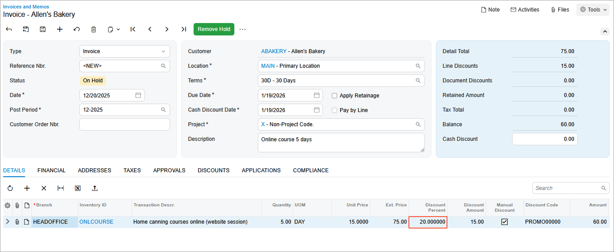

# Manual Customer Discounts: To Create AR Invoice with a Manual Promotional Discount {#_79926f48-ec2e-4b3a-b504-dcba67ee035a .task}

In this activity, you will learn how to set up and apply a manual promotional discount. These discounts may be useful, for example, if you want to provide customer discounts based on promotional coupons.

**Attention:** This activity is based on the *U100* dataset. If you are using another dataset or if any system settings have been changed in *U100*, these changes can affect the workflow of the activity and the results of the processing. To avoid issues, restore the *U100* dataset to its initial state.

## Story { .section}

Suppose that the SweetLife Fruits &amp; Jams company has decided to sell online training courses at a 20% discount, for which it has distributed promotional coupons. This discount is applicable from *12/15/2025* to *1/10/2026* for all customers.

Acting as SweetLife's accountant, you need to configure the discount code and discount in the system. You also need to enter an AR invoice for five days of the online home canning course for the Allen's Bakery \(*ABAKERY*\) customer on December 20, 2025.

## Configuration Overview {#section_tz4_djx_cnb .section}

In the *U100* dataset, the following tasks have been performed to support this activity:

-   On the [Non-Stock Items](IN_20_20_00.md) \(IN202000\) form, the *ONLCOURSE* non-stock item has been created.
-   On the [Customers](AR_30_30_00.md) \(AR303000\) form, the *ABAKERY* customer has been created.

## Process Overview { .section}

You will create a discount code on the [Discount Codes](AR_20_90_00.md) \(AR209000\) form and then configure a manual promotional discount on the [Discounts](AR_20_95_00.md) \(AR209500\) form.

To test how the configured manual promotional discount is applied, on the [Invoices and Memos](AR_30_10_00.md) \(AR301000\) form, you will create an AR invoice and apply the manual promotional discount you have configured.

## System Preparation { .section}

Before you start the activity, do the following:

1.  Launch the Acumatica ERP website with the *U100* dataset preloaded, and sign in to the system as an accountant by using the *johnson* username and the *123* password.
2.  In the info area, in the upper-right corner of the top pane of the Acumatica ERP screen, make sure that the business date in your system is set to *12/20/2025*. If a different date is displayed, click the Business Date menu button and select *12/20/2025*. For simplicity, in this lesson, you will create and process all documents in the system on this business date.
3.  On the Company and Branch Selection menu, also on the top pane of the Acumatica ERP screen, make sure that the *SweetLife Head Office and Wholesale Center* branch is selected. If it is not selected, click the Company and Branch Selection menu button to view the list of branches that you have access to, and then click *SweetLife Head Office and Wholesale Center*.

## Step 1: Activating the Customer Discounts Feature { .section}

To activate the *Customer Discounts* feature to use the customer discount functionality, do the following:

1.  Open the [Enable/Disable Features](CS_10_00_00.md) \(CS100000\) form.
2.  On the form toolbar, click **Modify**.
3.  Under **Advanced Financials**, select the **Customer Discounts** check box.
4.  On the form toolbar, click **Enable**.

## Step 2: Configuring the Manual Promotional Discount { .section}

To configure the 20% manual promotional discount, do the following:

1.  Open the [Discount Codes](AR_20_90_00.md) \(AR209000\) form.
2.  On the form toolbar, click **Add Row**, and specify the following settings in the row:

    -   **Discount Code**: `PROMO00000`
    -   **Description**: `Promotional discount by item`
    -   **Discount Type**: *Line*
    -   **Applicable To**: *Item*
    -   **Manual**: Selected
    -   **Auto-Numbering**: Selected
    -   **Last Number**: `PROMO00000`
    Discounts of this discount code are manual line discounts that are applicable if the document refers to a specific item.

3.  On the form toolbar, click **Save**.
4.  Open the [Discounts](AR_20_95_00.md) \(AR209500\) form.
5.  On the form toolbar, click **Add New Record**, and specify the following settings in the Summary area:

    -   **Discount Code**: *PROMO00000*
    -   **Discount By**: *Percent*
    -   **Break By**: *Quantity*
    -   **Active**: Selected
    -   **Promotional**: Selected
    -   **Promotion Period**: *12/15/2025*—*1/10/2026*
    -   **Description**: `Promo discount for online course`
    With these settings, the discount \(of the discount code that you defined for manual promotional discount that apply to a specific item\) is by percent, with break points by quantity. It also is promotional, effective from December 15, 2025 to January 10, 2026.

6.  On the **Discount Breakpoints** tab, click **Add Row** on the table toolbar, and specify the following settings in the row:

    -   **Break Quantity**: `0`
    -   **Discount Percent**: `20`
    Because the break quantity is 0, this discount of 20% applies to any quantity of items.

7.  On the **Items** tab, click **Add Row** on the table toolbar, and in the **Inventory ID** column, select *ONLCOURSE*. This is the only item to which the discount applies.
8.  On the form toolbar, click **Save**.

## Step 3: Creating the AR Invoice and Applying the Manual Discount {#section_yfw_bbv_3pb .section}

To create the needed AR invoice for the Allen's Bakery customer and apply the manual promotional discount, do the following:

1.  Open the [Invoices and Memos](AR_30_10_00.md) \(AR301000\) form.
2.  On the form toolbar, click **Add New Record**, and specify the following settings in the Summary area:
    -   **Type**: *Invoice*
    -   **Customer**: *ABAKERY*
    -   **Date**: *12/20/2025*
    -   **Post Period**: *12-2025*
    -   **Description**: `Online course 5 days`
3.  On the **Details** tab, click **Add Row** on the table toolbar, and specify the following settings in the added row:

    -   **Branch**: *HEADOFFICE*
    -   **Inventory ID**: *ONLCOURSE*
    -   **Quantity**: `5`
    -   **UOM**: *DAY*
    -   **Unit Price**: `15`
    -   **Discount Code**: *PROMO00000*
    The **Discount Percent** column reflects the 20% discount that has been applied to the line, as shown in the following screenshot.

    

4.  On the form toolbar, click **Remove Hold**, and then click **Release** to release the invoice.

**Parent topic:**[Configuring and Applying Customer Discounts](../UserGuide/Prices_Customer_Discounts_Mapref.md)

