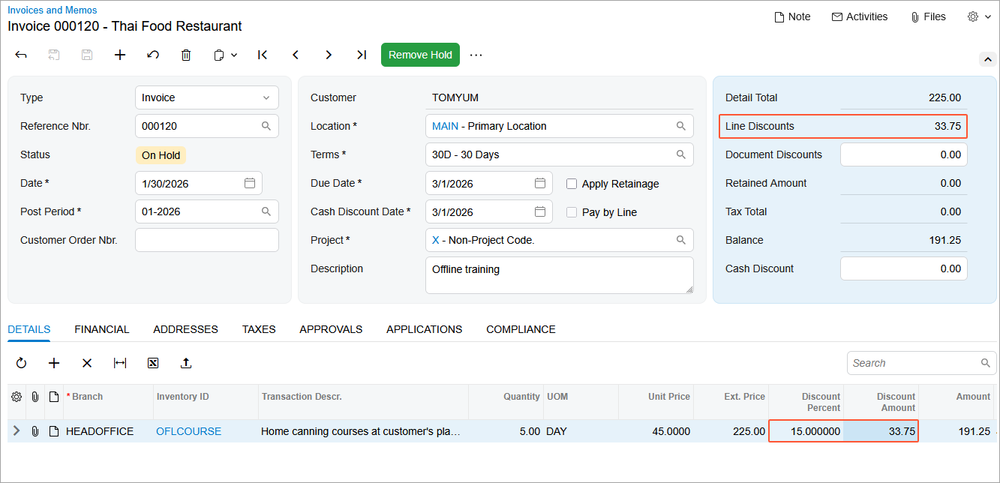
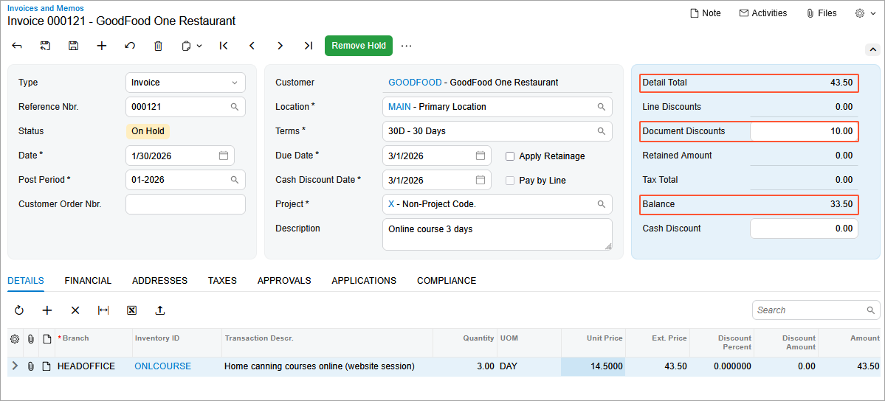

# Manual Customer Discounts: To Create AR Invoices with Manual Discounts {#_a7ec3e4a-ef7f-4767-baa9-f253dadd9171 .task}

In this activity, you will create and release two invoices: one with a manual line discount, and the other with a manual document discount.

**Attention:** This activity is based on the *U100* dataset. If you are using another dataset or if any system settings have been changed in *U100*, these changes can affect the workflow of the activity and the results of the processing. To avoid issues, restore the *U100* dataset to its initial state.

## Story { .section}

Suppose that the SweetLife Fruits &amp; Jams company has offered five days of the offline training course at a 15% discount to one of its customers, Thai Food Restaurant \(*TOMYUM*\), which wants to purchase the offline training course.

Another customer, GoodFood One Restaurant \(*GOODFOOD*\), also wants to purchase three days of the online training course, and the SweetLife sales personnel agreed to give the customer a $10 discount.

Acting as SweetLife's accountant, you need to enter invoices for these customers and manually enter these discounts.

## Configuration Overview {#section_tz4_djx_cnb .section}

In the *U100* dataset, the following tasks have been performed to support this activity:

-   On the [Enable/Disable Features](CS_10_00_00.md) \(CS100000\) form, the *Customer Discounts* feature has been disabled to support the manual discount functionality.
-   On the [Non-Stock Items](IN_20_20_00.md) \(IN202000\) form, the *OFLCOURSE* and *ONLCOURSE* non-stock items have been created.
-   On the [Customers](AR_30_30_00.md) \(AR303000\) form, the *TOMYUM* and *GOODFOOD* customers have been created.

## Process Overview { .section}

You will specify a manual line discount and a manual document discount on the [Invoices and Memos](AR_30_10_00.md) \(AR301000\) form.

To specify a manual line discount, on the **Details** tab, you will enter either a **Discount Amount** or a **Discount Percent** for the line.

To specify a manual document discount, you will enter the amount in the **Document Discounts** box in the Summary area of the [Invoices and Memos](AR_30_10_00.md) form.

## System Preparation { .section}

To prepare the system, do the following:

1.  Launch the Acumatica ERP website with the *U100* dataset preloaded, and sign in to the system as an accountant by using the *johnson* username and the *123* password.
2.  In the info area, in the upper-right corner of the top pane of the Acumatica ERP screen, make sure that the business date in your system is set to *1/30/2026*. If a different date is displayed, click the Business Date menu button and select *1/30/2026*. For simplicity, in this lesson, you will create and process all documents in the system on this business date.
3.  On the Company and Branch Selection menu, which is also on the top pane of the Acumatica ERP screen, make sure that the *SweetLife Head Office and Wholesale Center* branch is selected. If it is not selected, click the Company and Branch Selection menu to view the list of branches that you have access to, and then click *SweetLife Head Office and Wholesale Center*.

## Step 1: Creating the AR Invoice with a Manual Line Discount { .section}

To create the AR invoice for Thai Food Restaurant and apply a manual line discount in it, do the following:

1.  Open the [Invoices and Memos](AR_30_10_00.md) \(AR301000\) form.
2.  On the form toolbar, click **Add New Record**, and specify the following settings in the Summary area:
    -   **Type**: *Invoice*
    -   **Customer**: *TOMYUM*
    -   **Date**: *1/30/2026*
    -   **Post Period**: *01-2026*
    -   **Description**: `Offline training`
3.  On the **Details** tab, click **Add Row** on the table toolbar, and specify the following settings in the new invoice line:
    -   **Branch**: *HEADOFFICE*
    -   **Inventory ID**: *OFLCOURSE*
    -   **Quantity**: `5`
    -   **UOM**: *DAY*
    -   **Unit Price**: `45`
    -   **Discount Percent**: `15`
4.  Save the invoice.

    The system has calculated the 15% manual line discount and applied it to the invoice line. The line amount is $191.25 \($225 - $33.75\). The value of the discount, which is reflected in the **Discount Amount** column, has been calculated automatically based on the discount percentage. Notice that discount amount in the **Line Discounts** box of the Summary area is *33.75*, as shown in the following screenshot.

    

    For a manual line discount, you can specify either a discount percent or a discount amount. Just as in this example, the system calculated the discount amount based on the discount percent you entered for the line. If you enter a discount amount, the system automatically calculates the corresponding discount percent.

5.  On the form toolbar, click **Remove Hold** and then click **Release** to release the invoice.
6.  On the **Financial** tab, click the link in the **Batch Nbr.** box to review the generated GL batch, which the system opens on the [Journal Transactions](GL_30_10_00.md) \(GL301000\) form.

    The *11000 - Accounts Receivable* account has been debited with the amount of $191.25, which is the invoice amount less the manual line discount you applied to the invoice.

## Step 2: Creating the AR Invoice with a Manual Document Discount { .section}

To create the AR invoice for GoodFood One Restaurant with a manual document discount, do the following:

1.  While you are still on the [Invoices and Memos](AR_30_10_00.md) \(AR301000\) form, click **Add New Record** on the form toolbar, and specify the following settings in the Summary area:
    -   **Type**: *Invoice*
    -   **Customer**: *GOODFOOD*
    -   **Date**: *1/30/2026*
    -   **Post Period**: *01-2026*
    -   **Description**: `Online course 3 days`
2.  On the **Details** tab, click **Add Row** on the table toolbar, and specify the following settings in the new row:
    -   **Branch**: *HEADOFFICE*
    -   **Inventory ID**: *ONLCOURSE*
    -   **Quantity**: `3`
    -   **UOM**: *DAY*
    -   **Unit Price**: `14.50`
3.  On the form toolbar, click **Save**.
4.  In the **Document Discounts** box in the Summary area, enter `10`.

    This is the $10 manual document discount you have agreed to give your customer. The total amount of the invoice before the discount is displayed in the **Detail Total** box \(*43.50*\), and the amount due \(with the manual document discount applied\) is displayed in the **Balance** box \(*33.50*\), as shown in the following screenshot.

    

5.  On the form toolbar, click **Remove Hold** and then click **Release** to release the invoice.
6.  On the **Financial** tab, click the link in the **Batch Nbr.** box to review the generated GL batch, which the system opens on the [Journal Transactions](GL_30_10_00.md) \(GL301000\) form.

    The *53000 - Discount Given* account has been debited in the amount of the document discount you specified for this invoice \($10\).

**Parent topic:**[Configuring and Applying Customer Discounts](../UserGuide/Prices_Customer_Discounts_Mapref.md)

