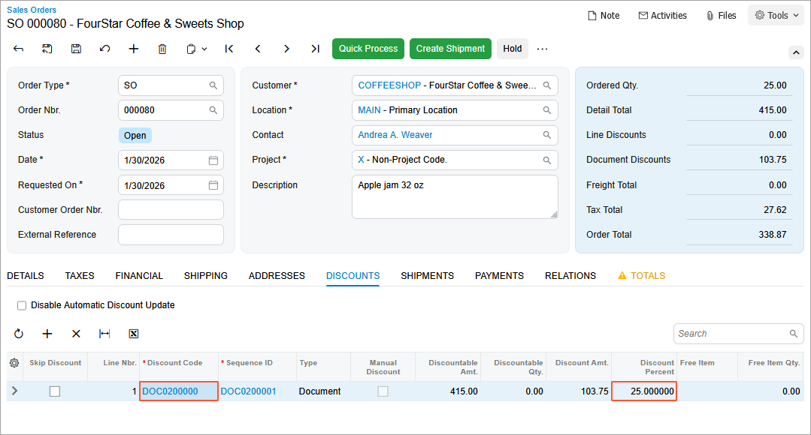
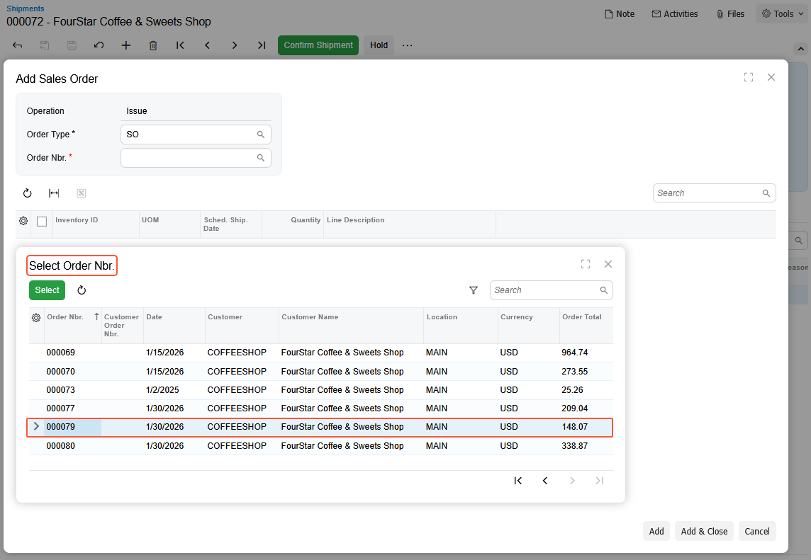
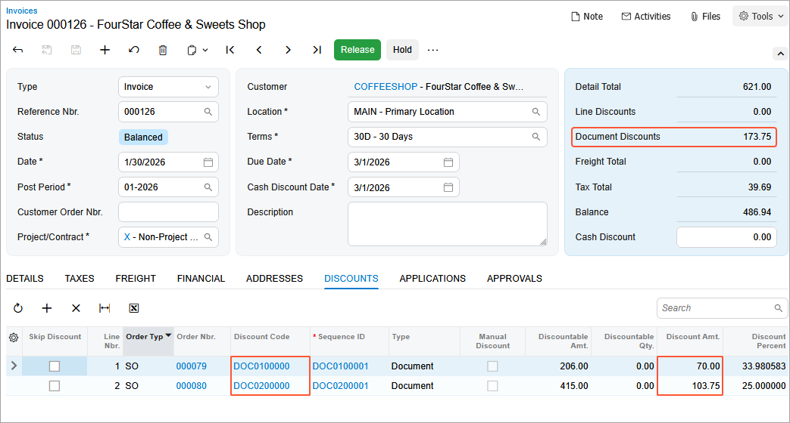

# Sales Invoice for Discounted Orders: To Add Discounted Sales Orders to a Sales Invoice {#_66091363-d6da-43bf-a6ad-71410c2f23f2 .task}

In this activity, you will configure two automatic document discounts. You will then explore how these discounts are applied to sales orders and learn how the system applies discounts to sales invoices that are prepared based on sales orders with different document discounts. Also, you will learn how to update the discount amount.

**Attention:** This activity is based on the *U100* dataset. If you are using another dataset or if any system settings have been changed in *U100*, these changes can affect the workflow of the activity and the results of the processing. To avoid issues, restore the *U100* dataset to its initial state.

## Story { .section}

Suppose that to facilitate sales in 2026, the SweetLife Fruits &amp; Jams company has decided to introduce discounts for some customers. For FourStar Coffee &amp; Sweets Shop \(*COFFEESHOP*\), $70 discount should be applied to sales orders when the total amount of all lines is $200 or more. For local customers, SweetLife is offering a 20% discount for sales orders when the total amount of all lines is $400 or more.

Thus, as SweetLife's accountant, you need to configure the following discounts in the system:

-   A customer-specific document discount of $70
-   A document discount of 20% specific for the *LOCAL* customer price class

You also need to create two sales orders for the FourStar Coffee &amp; Sweets Shop customer, and notice how these discounts are applied.

Further suppose that before you have processed the sales orders, the sales manager has informed you that the discount percent for the second order changed to 25%. You need to update the discount percent in the second sales order and issue one invoice for both sales orders.

## Configuration Overview {#section_tz4_djx_cnb .section}

In the *U100* dataset, the following tasks have been performed to support this activity:

-   On the [Enable/Disable Features](CS_10_00_00.md) \(CS100000\) form, the *Customer Discounts* feature has been enabled to support the discount functionality.
-   On the [Stock Items](IN_20_25_00.md) \(IN202500\) form, the *APJAM08* and *APJAM32* stock items have been created.
-   On the [Customer Price Classes](AR_20_80_00.md) \(AR208000\) form, the *LOCAL* customer price class has been created.
-   On the [Customers](AR_30_30_00.md) \(AR303000\) form, the *COFFEESHOP* customer has been created and assigned to the *LOCAL* customer price class.

## Process Overview { .section}

You will add discount codes on the [Discount Codes](AR_20_90_00.md) \(AR209000\) form, and then configure automatic document discounts on the [Discounts](AR_20_95_00.md) \(AR209500\) form. You will create sales orders for a particular customer on the [Sales Orders](SO_30_10_00.md) \(SO301000\) form, to which discounts can be applied.

You will update the discount on the [Discounts](AR_20_95_00.md) form. On the [Sales Orders](SO_30_10_00.md) form, you will recalculate the prices of the sales order being prepared.

To complete the processing of the sales orders, you will create and confirm a shipment for the sales orders on the [Shipments](SO_30_20_00.md) \(SO302000\) form. On the [Invoices](SO_30_30_00.md) \(SO303000\) form, you will create a sales invoice for two sales orders, making sure that the automatic document discounts for these sales orders are applied, and then release the invoice.

Finally, you will deactivate the discounts.

## System Preparation { .section}

To prepare the system, do the following:

1.  Launch the Acumatica ERP website with the *U100* dataset preloaded, and sign in to the system as an accountant by using the *johnson* username and the *123* password.
2.  In the info area, in the upper-right corner of the top pane of the Acumatica ERP screen, make sure that the business date in your system is set to *1/30/2026*. If a different date is displayed, click the Business Date menu button and select *1/30/2026*. For simplicity, in this lesson, you will create and process all documents in the system on this business date.
3.  On the Company and Branch Selection menu, also on the top pane of the Acumatica ERP screen, make sure that the *SweetLife Head Office and Wholesale Center* branch is selected. If it is not selected, click the Company and Branch Selection menu button to view the list of branches that you have access to, and then click *SweetLife Head Office and Wholesale Center*.

## Step 1: Configuring the $70 Automatic Document Discount { .section}

You will configure the $70 automatic document discount to be applicable to only specific customers \(at this time, only the FourStar Coffee &amp; Sweets Shop\). Do the following:

1.  Open the [Discount Codes](AR_20_90_00.md) \(AR209000\) form.
2.  On the form toolbar, click **Add Row**, and specify the following settings in the added row:

    -   **Discount Code**: `DOC0100000`
    -   **Description**: `Automatic document discount by customer`
    -   **Discount Type**: *Document*
    -   **Applicable To**: *Customer*
    -   **Auto-Numbering**: Selected
    -   **Last Number**: `DOC0100000`
    These settings define discounts of this discount code as automatic document discounts that are applicable to specific customers \(which will be only the FourStar Coffee &amp; Sweets Shop in this example\).

3.  On the form toolbar, click **Save**.
4.  Open the [Discounts](AR_20_95_00.md) \(AR209500\) form.
5.  On the form toolbar, click **Add New Record**, and specify the following settings in the Summary area:

    -   **Discount Code**: *DOC0100000*
    -   **Discount By**: *Amount*
    -   **Break By**: *Amount* \(inserted by default\)
    -   **Active**: Selected
    -   **Description**: `Automatic document discount for COFFEESHOP (by amount)`
    With these settings, the discount \(of the discount code you just defined for automatic document discounts that are applicable to specific customers\) is by amount, with break points by amount.

    In this case, the value in the **Break By** box is inserted automatically based on the discount code configuration and cannot be changed by the user.

6.  On the **Discount Breakpoints** tab, click **Add Row** on the table toolbar, and specify the following settings in the added row:

    -   **Pending Break Amount**: `200`
    -   **Pending Discount Amount**: `70`
    -   **Pending Date**: *1/30/2026*
    The automatic document discount of $70 is applicable to a document with an amount greater than or equal to $200.

7.  On the **Customers** tab, click **Add Row** on the table toolbar, and in the **Customer** column, select *COFFEESHOP*. This automatic document discount is applicable to only this customer.
8.  On the form toolbar, click **Save**.
9.  On the form toolbar, click **Update Discounts** to make the discounts you have just added effective.
10. In the **Update Discounts** dialog box, which opens, leave *1/30/2026* in the **Filter Date** box, and click **OK**.

    On the **Discount Breakpoints** tab, notice that the system has cleared the **Pending Date** column and the **Effective Date** column now contains 1/30/2026.

## Step 2: Configuring the 20% Automatic Document Discount { .section}

To configure the 20% automatic document discount for local customers, do the following:

1.  Open the [Discount Codes](AR_20_90_00.md) \(AR209000\) form.
2.  On the form toolbar, click **Add Row**, and specify the following settings in the added row:

    -   **Discount Code**: `DOC0200000`
    -   **Description**: `Automatic document discount by customer price class`
    -   **Discount Type**: *Document*
    -   **Applicable To**: *Customer Price Class*
    -   **Auto-Numbering**: Selected
    -   **Last Number**: `DOC0200000`
    These settings define discounts of this discount code as automatic document discounts that are applicable to specific customer price classes \(which will be only the *LOCAL* customer price class in this example\).

3.  On the form toolbar, click **Save**.
4.  Open the [Discounts](AR_20_95_00.md) \(AR209500\) form.
5.  On the form toolbar, click **Add New Record**, and specify the following settings in the Summary area:

    -   **Discount Code**: *DOC0200000*
    -   **Discount By**: *Percent*
    -   **Break By**: *Amount* \(inserted by default\)
    -   **Active**: Selected
    -   **Description**: `Automatic document discount for local customers (by percent)`
    With these settings, the discount \(of the discount code you just defined for automatic document discounts that are applicable to specific customer price classes\) is by percent, with break points by amount.

    In this case, the value in the **Break By** box is defined automatically based on the discount code configuration and cannot be changed by the user.

6.  On the **Discount Breakpoints** tab, click **Add Row** on the table toolbar, and specify the following settings in the added row:

    -   **Pending Break Amount**: `400`
    -   **Pending Discount Percent**: `20`
    -   **Pending Date**: *1/30/2026*
    The automatic document discount of 20% is applicable to a document with an amount greater than or equal to $400.

7.  On the **Customer Price Classes** tab, click **Add Row** on the table toolbar, and in the **Price Class ID** column, select *LOCAL*. This is the only price class to which the discount is applicable.
8.  On the form toolbar, click **Save**.
9.  On the form toolbar, click **Update Discounts** to make the discount you have just added effective.
10. In the **Update Discounts** dialog box, which opens, leave *1/30/2026* in the **Filter Date** box, and click **OK**.

## Step 3: Creating Sales Orders and Exploring Discount Application { .section}

To create two sales orders for the *COFFEESHOP* customer and observe how discounts are applied, do the following:

1.  Open the [Sales Orders](SO_30_10_00.md) \(SO301000\) form.
2.  On the form toolbar, click **Add New Record** and specify the following settings in the Summary area:
    -   **Order Type**: *SO*
    -   **Customer**: *COFFEESHOP*
    -   **Date**: *1/30/2026*
    -   **Description**: `Apple jam 8 oz`
3.  On the **Details** tab, click **Add Row** on the table toolbar, and specify the following settings in the added row:
    -   **Branch**: *HEADOFFICE*
    -   **Inventory ID**: *APJAM08*
    -   **Warehouse**: *WHOLESALE*
    -   **Quantity**: `40`
    -   **UOM**: *PIECE*
    -   **Unit Price**: `5.15`
4.  On the **Discounts** tab, review the document discount that has been applied to this sales order.

    The *DOC0100000* discount in the amount of $70 has been applied because the total amount of the order lines exceeds the break point of $200 \(the value in the **Discountable Amt.** column is $206\).

5.  On the form toolbar, click **Save** to save the sales order.
6.  Create another sales order by clicking **Add New Record** on the form toolbar and specifying the following settings in the Summary area:
    -   **Order Type**: *SO*
    -   **Customer**: *COFFEESHOP*
    -   **Date**: *1/30/2026*
    -   **Description**: `Apple jam 32 oz`
7.  On the **Details** tab, click **Add Row** on the table toolbar, and specify the following settings in the added row:
    -   **Branch**: *HEADOFFICE*
    -   **Inventory ID**: *APJAM32*
    -   **Warehouse**: *WHOLESALE*
    -   **Quantity**: `25`
    -   **UOM**: *PIECE*
    -   **Unit Price**: `16.60`
8.  On the **Discounts** tab, review the document discount that has been applied to this sales order.

    The *DOC0200000* discount in the amount of $83 \(which is 20%\) has been applied because the total amount of the order line meets the break point criterion of being $400 or more \(the value in the **Discountable Amt.** column is *415*\).

9.  On the form toolbar, click **Save** to save the sales order.

## Step 4: Updating the Discount Percent in a Sales Order { .section}

To update the discount percent for the *DOC0200000* discount code in the sales order, do the following:

1.  While you are still on the [Sales Orders](SO_30_10_00.md) \(SO301000\) form, on the **Discounts** tab, make sure that the sales order with the *DOC0200000* discount code applied is opened.
2.  Click the *DOC0200000* code in the **Discount Code** column. The [Discounts](AR_20_95_00.md) \(AR209500\) form will open in a pop-up window.
3.  For the only row in the table on the [Discounts](AR_20_95_00.md) form, specify the following settings:
    -   **Pending Break Amount**: `400`
    -   **Pending Discount Percent**: `25`
    -   **Pending Date**: *1/30/2026*
4.  On the form toolbar, click **Update Discounts** to make the updated discount effective.
5.  In the **Update Discounts** dialog box, which opens, leave *1/30/2026* in the **Filter Date** box, and click **OK**.

    On the **Discount Breakpoints** tab, notice that the system has cleared the **Pending Date** column and the **Effective Date** column now contains *1/30/2026*.

6.  Close the pop-up window and return to the sales order on the [Sales Orders](SO_30_10_00.md) form.
7.  On the More menu \(under **Other**\), click **Recalculate Prices**.
8.  In the **Recalculate Prices** dialog box, which opens, leave the default values and click **OK**.

    On the **Discounts** tab, notice that the amount in the **Discount Percent** column has been updated to reflect the new value of 25%.

    

9.  On the form toolbar, click **Save** to save the sales order.

## Step 5: Preparing a Sales Invoice for Both Sales Orders { .section}

To prepare a sales invoice for both sales orders, do the following:

1.  While you are still on the [Sales Orders](SO_30_10_00.md) \(SO301000\) form, on the form toolbar, click **Create Shipment**.
2.  In the **Specify Shipment Parameters** dialog box, leave the default values and click **OK**.
3.  On the [Shipments](SO_30_20_00.md) \(SO302000\) form, which opens with the newly created shipment, review the shipment details in the Summary area.
4.  On the **Details** tab, click **Add Order** on the table toolbar.
5.  In the Summary area of the **Add Sales Order** dialog box, which opens, open the lookup table for the **Order Nbr.** box, and select the sales order in the amount of $148.07 \(see the following screenshot\). You created this order in Step 3.

    

6.  In the table of the dialog box, select the unlabeled check box for the sales order line with the *APJAM08* item and click **Add &amp; Close**.
7.  On the form toolbar, click **Save**.
8.  On the form toolbar, click **Confirm Shipment**.

    You have created and confirmed a single shipment for the sales orders that you created earlier in this activity.

9.  On the form toolbar, click **Prepare Invoice**.
10. On the [Invoices](SO_30_30_00.md) \(SO303000\) form, which opens with the prepared invoice, review the invoice that has been created for both sales orders.
11. On the **Discounts** tab, review the discounts that have been applied to the invoice generated from the sales orders.

    As the following screenshot shows, the table contains two lines, one with the *DOC0100000* automatic document discount in the amount of $70, and the other with the *DOC0200000* automatic document discount by percent \(25%\) in the amount of $103.75.

    

    **Tip:** The amounts may be different from the ones in this step if some lessons in this course were skipped or the sales prices of stock items listed in the *Configuration Overview* section have not been defined in the system.

12. On the form toolbar, click **Release** to release the invoice and complete the processing of sales order.

## Step 6: Making the Created Discounts Inactive { .section}

1.  Open the [Discounts](AR_20_95_00.md) \(AR209500\) form.
2.  In the Summary area, specify the following settings:
    -   **Discount Code**: *DOC0100000*
    -   **Sequence**: *DOC0100001*
3.  Clear the **Active** check box to make the discount inactive.
4.  Save your changes.
5.  In the Summary area, specify the following settings:
    -   **Discount Code**: *DOC0200000*
    -   **Sequence**: *DOC0200001*
6.  Clear the **Active** check box to make the discount inactive.
7.  Save your changes.

**Parent topic:**[Configuring and Applying Customer Discounts](../UserGuide/Prices_Customer_Discounts_Mapref.md)

