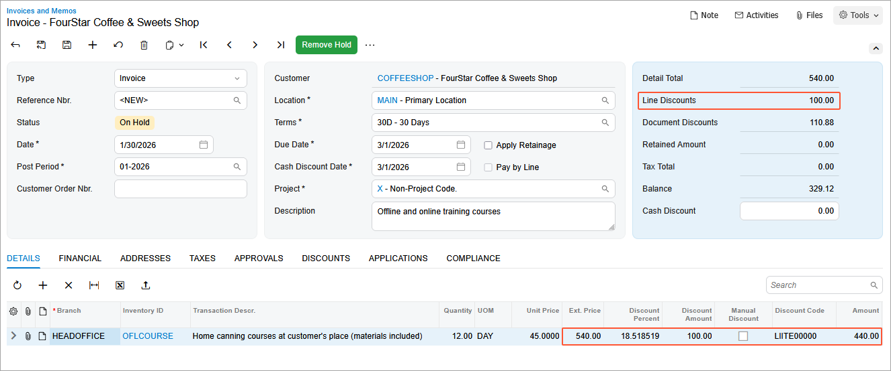
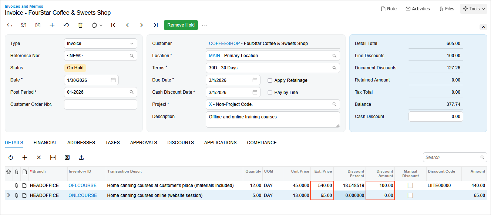
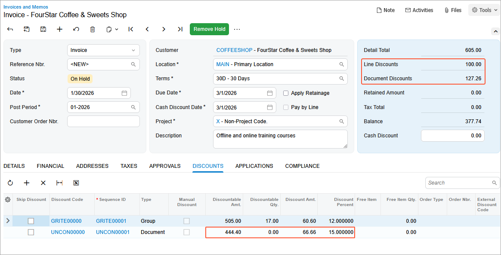
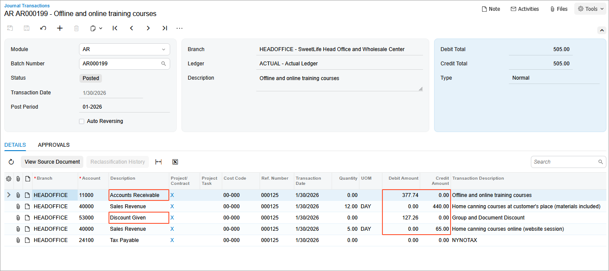

# Multiple Customer Discounts: To Create Multiple Discounts and Explore Their Application {#_8b47bf80-fbee-4c35-8206-dae111c7b95f .task}

In this activity, you will create discounts of multiple types and learn how the system applies a combination of discounts to an AR invoice.

## Story {#section_dt1_hck_gtb .section}

Starting in January 2026, the SweetLife Fruits &amp; Jams company is offering a discount of $100 to local customers who order 10 or more days of the offline training course.

In addition, SweetLife has offered a 15% discount to all customers who purchase $200 or more in a single order.

Suppose that on January 30, 2026, one of the SweetLife's local customers, FourStar Coffee &amp; Sweets Shop \(*COFFEESHOP*\), bought 12 days of the offline training course and 5 days of the online training course for which your company is offering a 12% discount effective on *1/30/2026* for more than 5 days of training.

Acting as SweetLife's accountant, you need to define the discounts for the *OFLCOURSE* and *ONLCOURSE* non-stock items, which will be applied automatically.

Finally, you need to create and post the AR invoice for FourStar Coffee &amp; Sweets Shop in the system, making sure that the three discounts are applied to this invoice.

## Configuration Overview {#section_tz4_djx_cnb .section}

In the *U100* dataset, the following tasks have been performed to support this activity:

-   On the [Enable/Disable Features](CS_10_00_00.md) \(CS100000\) form, the *Customer Discounts* feature has been enabled to support the discount functionality.
-   On the [Non-Stock Items](IN_20_20_00.md) \(IN202000\) form, the *ONLCOURSE* and *OFLCOURSE* non-stock items have been created.
-   On the [Customer Price Classes](AR_20_80_00.md) \(AR208000\) form, the *LOCAL* customer price class has been created.
-   On the [Customers](AR_30_30_00.md) \(AR303000\) form, the *COFFEESHOP* customer has been created and assigned to the *LOCAL* customer price class.

## Process Overview {#section_hzg_2nv_3pb .section}

To configure a group discount for particular non-stock items, you will create a discount code on the [Discount Codes](AR_20_90_00.md) \(AR209000\) form, and then configure this discount on the [Discounts](AR_20_95_00.md) \(AR209500\) form. You will activate the automatic line discount \(*LIITE00000*\) and automatic unconditional document discount \(*UNCON00000*\), which you deactivated earlier.

You then will create an AR invoice on the [Invoices and Memos](AR_30_10_00.md) \(AR301000\) form and review how the discounts defined in the system are applied to the invoice. You will release the invoice on this form, and you will review the GL batch on the [Journal Transactions](GL_30_10_00.md) \(GL301000\) form.

Finally, you will deactivate the discounts.

## System Preparation {#section_et1_hck_gtb .section}

To prepare the system, do the following:

1.  As a prerequisite activity, complete the [Automatic Customer Discounts: To Set Up Automatic Line Discounts](Prices_Customer_Discounts_To_Configure_Automatic_Line_Discount.md) to configure the discount by quantity for the *LOCAL* customer price class.
2.  As a prerequisite activity, complete the [Automatic Customer Discounts: To Set Up Automatic Customer-Specific and Unconditional Document Discounts](Prices_Customer_Discounts_To_Configure_Automatic_Document_Discount.md) to configure the unconditional document discount of 15% for documents of $200 or more.
3.  Launch the Acumatica ERP website with the *U100* dataset preloaded, and sign in to the system as an accountant by using the *johnson* username and the *123* password.
4.  In the info area, in the upper-right corner of the top pane of the Acumatica ERP screen, make sure that the business date in your system is set to *1/30/2026*. If a different date is displayed, click the Business Date menu button and select *1/30/2026*. For simplicity, in this lesson, you will create and process all documents in the system on this business date.
5.  On the Company and Branch Selection menu, also on the top pane of the Acumatica ERP screen, make sure that the *SweetLife Head Office and Wholesale Center* branch is selected. If it is not selected, click the Company and Branch Selection menu button to view the list of branches that you have access to, and then click *SweetLife Head Office and Wholesale Center*.

## Step 1: Activating the Automatic Line Discount by Amount for a Particular Customer Price Class {#section_ft1_hck_gtb .section}

To activate the *LIITE00000* automatic line discount by amount for a particular customer price class, do the following:

1.  Open the [Discounts](AR_20_95_00.md) \(AR209500\) form.
2.  In the **Discount Code** box, select *LIITE00000*.
3.  In the **Sequence** box, select *LIITE00001*.
4.  In the Summary area, select the **Active** check box.
5.  On the form toolbar, click **Save** to save your changes.

## Step 2: Activating the Automatic Unconditional Document Discount {#section_gt1_hck_gtb .section}

To activate the *UNCON00000* unconditional document discount, do the following:

1.  Open the [Discounts](AR_20_95_00.md) \(AR209500\) form.
2.  In the **Discount Code** box, select *UNCON00000*.
3.  In the **Sequence** box, select *UNCON00001*.
4.  In the Summary area, select the **Active** check box.
5.  On the form toolbar, click **Save** to save your changes.

## Step 3: Configuring the Automatic Group Discount for Particular Non-Stock Items {#section_z2n_bdy_stb .section}

To create the automatic group discount for the *OFLCOURSE* and *ONLCOURSE* non-stock items, do the following:

1.  Open the [Discount Codes](AR_20_90_00.md) \(AR209000\) form.
2.  On the form toolbar, click **Add Row**, and specify the following settings in the added row:

    -   **Discount Code**: `GRITE00000`
    -   **Description**: `Automatic group discount for items`
    -   **Discount Type**: *Group*
    -   **Applicable To**: *Item*
    -   **Auto-Numbering**: Selected
    -   **Last Number**: `GRITE00000`
    These settings define discounts of this discount code as automatic group discounts that are applicable to specific items.

3.  On the form toolbar, click **Save**.
4.  Open the [Discounts](AR_20_95_00.md) \(AR209500\) form.
5.  On the form toolbar, click **Add New Record**, and specify the following settings in the Summary area:

    -   **Discount Code**: *GRITE00000*
    -   **Discount By**: *Percent*
    -   **Break By**: *Quantity*
    -   **Active**: Selected
    -   **Description**: `Automatic group discount for courses`
    With these settings, the discount \(of the discount code you just defined for automatic group discounts that are applicable to specific items\) is by percent, with break points by quantity.

6.  On the **Discount Breakpoints** tab, click **Add Row** on the table toolbar, and specify the following settings in the added row:

    -   **Pending Break Quantity**: `5`
    -   **Pending Discount Percent**: `12`
    -   **Pending Date**: *1/30/2026*
    The discount of 12% is applicable to a group with a quantity of 5 or more.

7.  On the **Items** tab, click **Add Row** on the table toolbar, and in the **Inventory ID** column, select *OFLCOURSE*.
8.  Add another row, and in the **Inventory ID** column, select *ONLCOURSE*.
9.  On the form toolbar, click **Save**.
10. On the form toolbar, click **Update Discounts** to make the discount you have just added effective.
11. In the **Update Discounts** dialog box, which opens, leave *1/30/2026* in the **Filter Date** box, and click **OK**.

    On the **Discount Breakpoints** tab, notice that the system has cleared the **Pending Date** column and the **Effective Date** column now contains 1/30/2026.

## Step 4: Creating the AR Invoice and Exploring Discount Application {#section_ht1_hck_gtb .section}

To create the AR invoice for FourStar Coffee &amp; Sweets Shop and observe how the system automatically applies the discounts, do the following:

1.  Open the [Invoices and Memos](AR_30_10_00.md) \(AR301000\) form.
2.  On the form toolbar, click **Add New Record**, and specify the following settings in the Summary area:
    -   **Type**: *Invoice*
    -   **Customer**: *COFFEESHOP*
    -   **Date**: *1/30/2026*
    -   **Post Period**: *01-2026*
    -   **Description**: `Offline and online training courses`
3.  On the **Details** tab, click **Add Row** on the table toolbar, and specify the following settings in the added row:

    -   **Branch**: *HEADOFFICE*
    -   **Inventory ID**: *OFLCOURSE*
    -   **Quantity**: `12`
    -   **UOM**: *DAY*
    -   **Unit Price**: `45`
    Notice that the **Discount Code** column in the line now contains *LIITE00000*. This is the automatic line discount of $100 that you configured for 10 or more days of offline training on January 30, *2026*.

    The **Ext. Price** column shows the amount before the discount \(*540*\) and the **Amount** column shows the amount with the automatic line discount applied \(*440*\).

    The **Discount Amount** column shows the discount amount \($100\). The same amount is shown in the **Line Discounts** box in the Summary area \(see the screenshot below\).

    

4.  Click **Add Row** on the table toolbar, and specify the following settings in the added row:

    -   **Branch**: *HEADOFFICE*
    -   **Inventory ID**: *ONLCOURSE*
    -   **Quantity**: `5`
    -   **UOM**: *DAY*
    -   **Unit Price**: `13`
    Review the **Discounts** tab. Notice that lines have been added for the following discount codes, whose automatic discounts have been also applied to the AR invoice:

    -   The *GRITE00000* discount code \(the group discount of 12% for offline training on *1/30/2026*\).

        The **Discountable Amt.** for this discount is *505*, which is the total amount for the *OFLCOURSE* and *ONLCOURSE* non-stock items after the line discount is applied \($540 + $65 - $100\) \(see the **Ext. Price** and **Discount Amount** columns on the **Details** tab in the following screenshot\).

        

        The **Discount Percent** column of the **Discounts** tab contains the discount percent \(*12*\), and the **Discount Amt.** column contains the discount amount, which is automatically calculated by the system \(*60.60*\).

    -   The *UNCON00000* discount code \(the unconditional document discount of 15% for amounts of $200 or more on *1/30/2026*\).

        The **Discountable Amt.** for this discount is *444.40*, which is the total amount for the *OFLCOURSE* and *ONLCOURSE* non-stock items after the group discount is applied \($505 - $60.60\). The **Discount Percent** column shows the discount percent \(*15*\), and the **Discount Amt.** column shows the discount amount \(*66.66*\), which is automatically calculated by the system \(see the following screenshot\).

        

5.  On the form toolbar, click **Remove Hold** to assign the invoice the *Balanced* status, and then click **Save**.

## Step 5: Releasing the AR Invoice and Reviewing the GL Transaction {#section_it1_hck_gtb .section}

To release the invoice, review the corresponding GL transaction, and analyze which accounts were updated, do the following:

1.  While you are still on the [Invoices and Memos](AR_30_10_00.md) \(AR301000\) form, click **Release** on the form toolbar to release the invoice.
2.  On the **Financial** tab, click the link in the **Batch Nbr.** box.
3.  On the [Journal Transactions](GL_30_10_00.md) \(GL301000\) form, which opens, review the GL batch.

    The *40000 - Sales Revenue* account is credited in the amount of $505 \($440 + $65\), and the *11000 Accounts Receivable* account is debited in the amount of $377.74 \(the balance of the invoice\). The *53000 - Discount Given* account is debited in the amount of the group and document discounts applied to the invoice \($127.26\), as shown in the following screenshot.

    

    **Tip:** The applied discounts and the document amounts may differ if you have skipped any steps in this activity or previously configured any other applicable discounts.

## Step 6: Making the Created Discounts Inactive {#section_jt1_hck_gtb .section}

1.  Open the [Discounts](AR_20_95_00.md) \(AR209500\) form.
2.  In the Summary area, specify the following settings:
    -   **Discount Code**: *LIITE00000*
    -   **Sequence**: *LIITE00001*
3.  Clear the **Active** check box to make the discount inactive.
4.  Save your changes.
5.  In the Summary area, specify the following settings:
    -   **Discount Code**: *UNCON00000*
    -   **Sequence**: *UNCON00001*
6.  Clear the **Active** check box to make the discount inactive.
7.  Save your changes.
8.  In the Summary area, specify the following settings:
    -   **Discount Code**: *GRITE00000*
    -   **Sequence**: *GRITE00001*
9.  Clear the **Active** check box to make the discount inactive.
10. Save your changes.

**Parent topic:**[Configuring and Applying Customer Discounts](../UserGuide/Prices_Customer_Discounts_Mapref.md)

