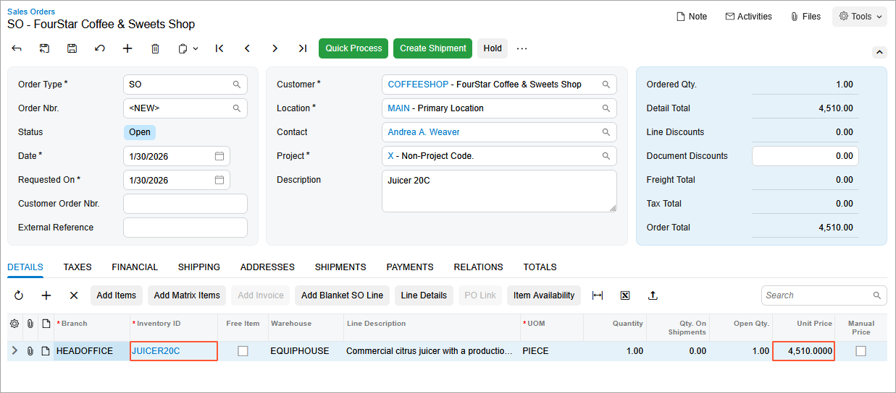

# Mass-Update of Sales Prices: Process Activity {#_daba6bc9-24a4-4153-9d19-11ff7f37bf7a .task}

In this activity, you will calculate new sales prices based on the manufacturer's suggested retail price \(MSRP\).

## Story { .section}

Suppose that on January 30, 2026 you, as SweetLife's accountant, need to update the price of one of the juicers that the Service and Equipment Sales Center of SweetLife sells to customers.

The company wants to sell this commercial juicer \(*JUICER20C*\) at 110% of the MSRP.

## Configuration Overview {#section_tz4_djx_cnb .section}

In the *U100* dataset, the following tasks have been performed to support this activity:

-   On the [Stock Items](IN_20_25_00.md) \(IN202500\) form, the *JUICER20C* stock item has been created.
-   On the [Customer Price Classes](AR_20_80_00.md) \(AR208000\) form, the *LOCAL* customer price class has been created.
-   On the [Customers](AR_30_30_00.md) \(AR303000\) form, the *COFFEESHOP* customer has been created.

## Process Overview { .section}

On the [Sales Price Worksheets](AR_20_20_10.md) \(AR202010\) form, you will create a sales price worksheet and populate it with the price records that you want to recalculate. Then on the [Sales Orders](SO_30_10_00.md) \(SO301000\) form, you will calculate the sales prices based on the MSRP of the items and create a sales order.

## System Preparation { .section}

1.  Launch the Acumatica ERP website with the *U100* dataset preloaded, and sign in to the system as an accountant by using the *johnson* username and the *123* password.
2.  In the info area, in the upper-right corner of the top pane of the Acumatica ERP screen, make sure that the business date in your system is set to *1/30/2026*. If a different date is displayed, click the Business Date menu button and select *1/30/2026*. For simplicity, in this lesson, you will create and process all documents in the system on this business date.
3.  On the Company and Branch Selection menu, also on the top pane of the Acumatica ERP screen, make sure that the *SweetLife Head Office and Wholesale Center* branch is selected. If it is not selected, click the Company and Branch Selection menu button to view the list of branches that you have access to, and then click *SweetLife Head Office and Wholesale Center*.

## Step 1: Reviewing the MSRP for JUICER20C { .section}

To review the MSRP that has been specified for the *JUICER20C* stock item, do the following:

1.  Open the [Stock Items](IN_20_25_00.md) \(IN202500\) form.
2.  In the **Inventory ID** box, select *JUICER20C*.
3.  On the **Price/Cost** tab, make sure that the **MSRP** box in the **Price Management** section contains a price \(*4,100*\).

## Step 2: Recalculating the Existing Sales Prices for JUICER20C Based on Its MSRP { .section}

To recalculate the prices in the system for the *JUICER20C* stock item:

1.  Open the [Sales Price Worksheets](AR_20_20_10.md) \(AR202010\) form.
2.  On the form toolbar, click **Add New Record**, and specify the following settings in the Summary area:
    -   **Effective Date**: *1/30/2026*
    -   **Overwrite Overlapping Prices**: Selected
    -   **Description**: `Sales price for JUICER20C`
3.  On the table toolbar, click **Add Items**.
4.  In the **Add Item to Worksheet** dialog box, which opens, specify the following settings:
    -   **Item Class ID**: *JUICER*
    -   **Price Type**: *Base*
5.  In the table of this dialog box, select the unlabeled check box for the row with the *JUICER20C* stock item; click **Add &amp; Close**.

    The stock item you selected has been added to the worksheet.

6.  On the table toolbar, click **Calculate Pending Prices**.
7.  In the **Calculate Pending Prices** dialog box, which opens, specify the following settings:
    -   **MSRP**: Selected
    -   **Multiplier \(% of Price Basis\)**: `110`
    -   **Decimal Places**: `2`
8.  Click **Update**.

    The current price is now shown in the **Source Price** column \(*4,000*\) and the price calculated based on MSRP is shown in the **Pending Price** column \(*4,510*\).

9.  On the form toolbar, click **Remove Hold**, and then click **Release** to release the sales price worksheet.

## Step 3: Creating a Sales Order and Reviewing the Suggested Price { .section}

To create a sales order for the *JUICER20C* stock item, do the following:

1.  Open the [Sales Orders](SO_30_10_00.md) \(SO301000\) form.
2.  On the form toolbar, click **Add New Record**, and specify the following settings in the Summary area:
    -   **Order Type**: *SO*
    -   **Customer**: *COFFEESHOP*
    -   **Date**: *1/30/2026*
    -   **Requested On**: *1/30/2026*
    -   **Description**: `Juicer 20C`
3.  On the **Details** tab, click **Add Row** on the table toolbar, and specify the following settings in the added row:

    -   **Branch**: *HEADOFFICE*
    -   **Inventory ID**: *JUICER20C*
    -   **Quantity**: `1`
    Notice the value in the **Unit Price** column, which is shown in the following screenshot. The system has copied the price of $4,510 that you configured for this stock item in this activity.

    

4.  Close the form without saving your changes to the sales order, which was created solely for testing purposes.

**Parent topic:**[Mass-Update of Sales Prices](../UserGuide/Prices_Mass_Updating_Existing_Sales_Prices_Mapref.md)

