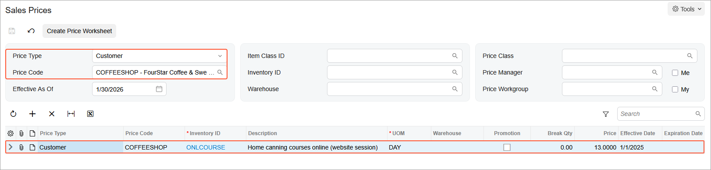
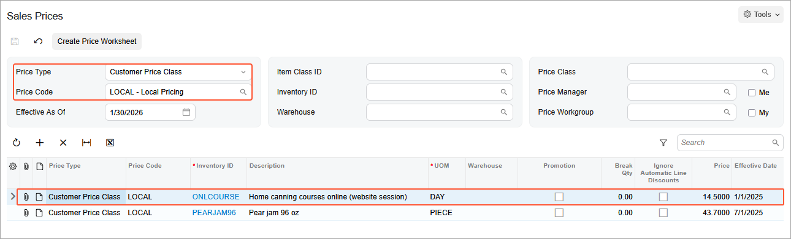
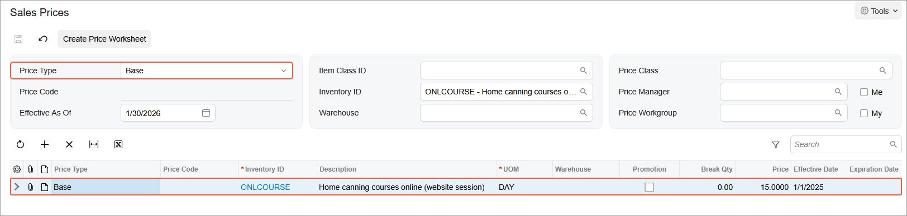
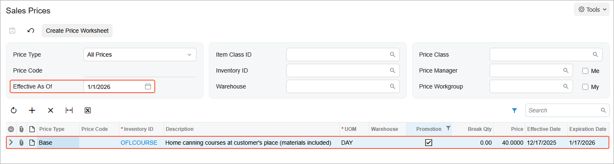
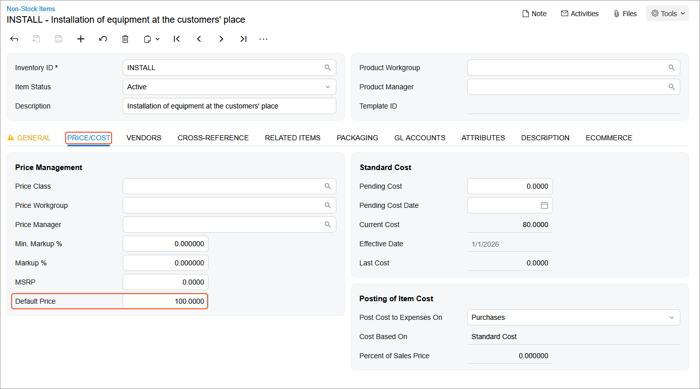

# Sales Prices: To Review Existing Prices {#_5f8913aa-4671-4381-9f6b-00588832a3d8 .task}

In this activity, you will learn how to view sales prices that have been defined in the system.

**Attention:** This activity is based on the *U100* dataset. If you are using another dataset or if any system settings have been changed in *U100*, these changes can affect the workflow of the activity and the results of the processing. To avoid issues, restore the *U100* dataset to its initial state.

## Story { .section}

Suppose that the SweetLife Fruits &amp; Jams company has sales prices that were last updated in 2025. Acting as SweetLife’s accountant, you want to review what prices exist in the system for the *ONLCOURSE* online training course for a particular customer, for a customer price class, and as the base price of this item.

Also, you are interested in whether any promotional prices exist in the system for another training course, *OFLCOURSE*.

Because SweetLife is going to start installing juicers for customers in 2026, you want to make sure that the default price of the installation service \(*INSTALL*\) has been specified in the system.

## Configuration Overview {#section_tz4_djx_cnb .section}

In the *U100* dataset, the following tasks have been performed to support this activity:

-   On the [Enable/Disable Features](CS_10_00_00.md) \(CS100000\) form, the *Volume Pricing* and *Multiple Warehouses* features have been enabled.
-   On the [Non-Stock Items](IN_20_20_00.md) \(IN202000\) form, the *ONLCOURSE*, *OFLCOURSE*, and *INSTALL* non-stock items have been created.
-   On the [Customer Price Classes](AR_20_80_00.md) \(AR208000\) form, the *LOCAL* customer price class has been created.
-   On the [Customers](AR_30_30_00.md) \(AR303000\) form, the *COFFEESHOP* customer has been created.

## Process Overview { .section}

For a particular item, on the [Sales Prices](AR_20_20_00.md) \(AR202000\) form, you will view the prices specified for a customer and for a customer price class. You will also view base prices and promotional prices for the item. You will view the default price of a particular non-stock item on the [Non-Stock Items](IN_20_20_00.md) \(IN202000\) form.

## System Preparation { .section}

To prepare the system, do the following:

1.  Launch the Acumatica ERP website with the *U100* dataset preloaded, and sign in to the system as an accountant by using the *johnson* username and the *123* password.
2.  In the info area, in the upper-right corner of the top pane of the Acumatica ERP screen, make sure that the business date in your system is set to *1/30/2026*. If a different date is displayed, click the Business Date menu button and select *1/30/2026*. For simplicity, in this lesson, you will create and process all documents in the system on this business date.
3.  On the Company and Branch Selection menu, also on the top pane of the Acumatica ERP screen, make sure that the *SweetLife Head Office and Wholesale Center* branch is selected. If it is not selected, click the Company and Branch Selection menu button to view the list of branches that you have access to, and then click *SweetLife Head Office and Wholesale Center*.

## Step 1: Viewing Sales Prices for a Particular Customer { .section}

To view the sales prices defined for a particular customer, *COFFEESHOP*, do the following:

1.  Open the [Sales Prices](AR_20_20_00.md) \(AR202000\) form.
2.  In the **Price Type** box of the Selection area, select *Customer*.
3.  In the **Price Code** box, select *COFFEESHOP*.
4.  In the form table, review the price of your company's online training course \(*ONLCOURSE*\) for the *COFFEESHOP* customer \($13\), as shown in the following screenshot.

    

## Step 2: Viewing Sales Prices for a Customer Price Class { .section}

To view the sales prices defined for local customers \(that is, customers assigned to the *LOCAL* customer price class\), do the following:

1.  While you are still on the [Sales Prices](AR_20_20_00.md) \(AR202000\) form, in the **Price Type** box of the Selection area, select *Customer Price Class*.
2.  In the **Price Code** box, select *LOCAL*.
3.  In the table, review the price of your company's online course \(*ONLCOURSE*\) for local customers \($14.50\), as shown in the following screenshot.

    

## Step 3: Viewing an Item's Base Price { .section}

To view the base price of a particular item, *ONLCOURSE*, do the following:

1.  While you are still on the [Sales Prices](AR_20_20_00.md) \(AR202000\) form, in the **Price Type** box of the Selection area, select *Base*.
2.  In the **Inventory ID** box, select *ONLCOURSE*.
3.  In the table, review the base price of the *ONLCOURSE* non-stock item in the system \($15\) as shown in the following screenshot.

    

## Step 4: Viewing an Item's Promotional Prices { .section}

To view the promotional prices in the system as of 1/1/2026, do the following:

1.  While you are still on the [Sales Prices](AR_20_20_00.md) \(AR202000\) form, clear the **Inventory ID** box of the Selection area.
2.  In the **Price Type** box, select *All Prices*.
3.  In the **Effective As Of** box, select *1/1/2026*.
4.  In the table, click the **Promotion** column, and in the dialog box that opens, select *True* and click **Apply**.
5.  In the table, review the promotional price for the *OFLCOURSE* item \($40\), and notice its effective dates \(*12/17/2025 - 1/17/2026*\).

    

## Step 5: Viewing the Default Price of an Item { .section}

To view the price set up as the default price of the *INSTALL* non-stock item, do the following:

1.  Open the [Non-Stock Items](IN_20_20_00.md) \(IN202000\) form.
2.  In the **Inventory ID** box, select *INSTALL*.
3.  On the **Price/Cost** tab, which is shown in the following screenshot, in the **Default Price** box, review the default price of the installation services \($100\).

    

**Parent topic:**[Reviewing Sales Prices](../UserGuide/Prices_Reviewing_Sales_Prices_Mapref.md)

