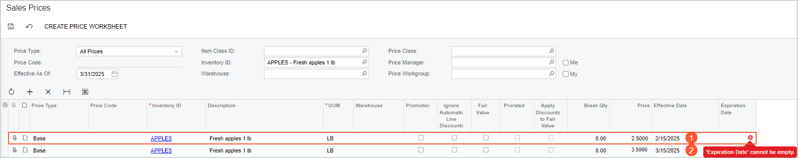
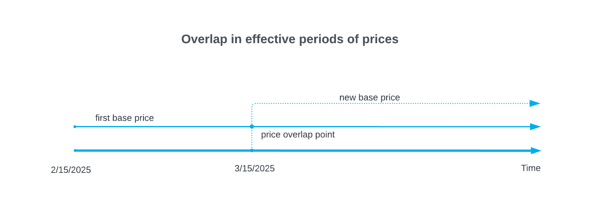
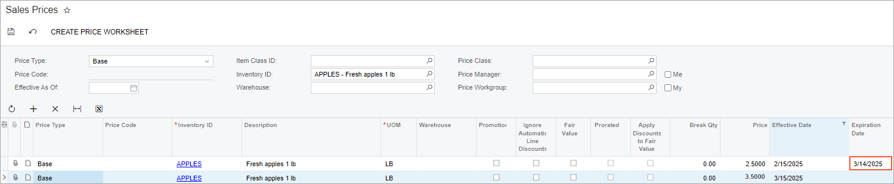
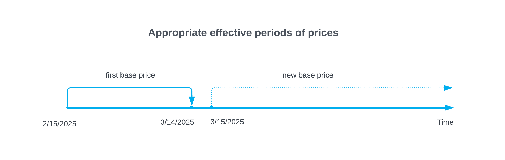
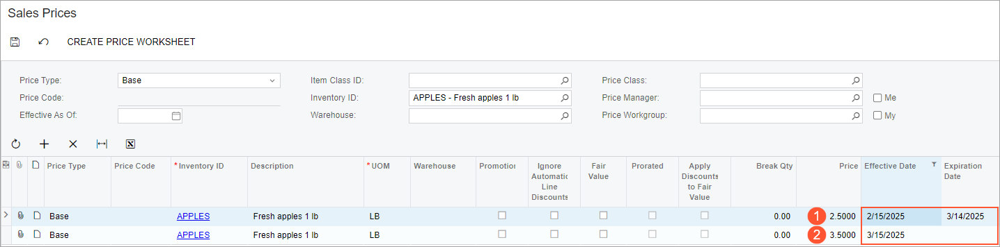
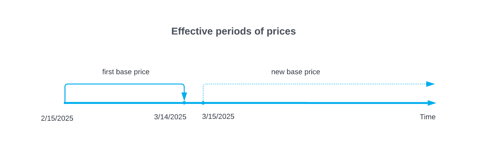
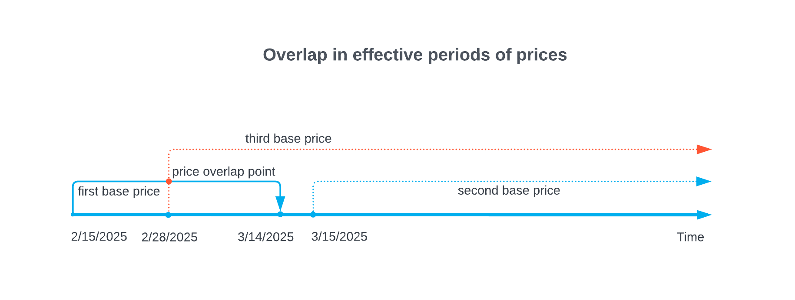
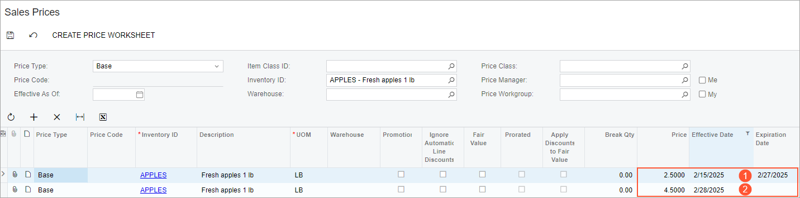
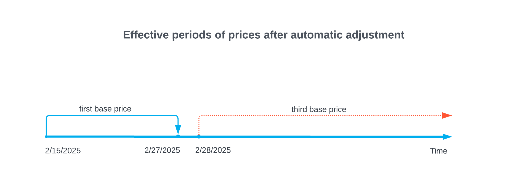

# Sales Prices: Effective Period of Prices {#_7aacb762-b1f3-41d2-93ff-d4be7fd1c80a .concept}

In Acumatica ERP, a price is effective during some period of time. To define this period, you can specify either or both of the following dates in the price record:

-   The price’s effective date, which is the first day of the effective period
-   The price’s expiration date; this date is the last day of the effective period

The period can be open, meaning that no expiration date is specified, regardless of whether an effective date is specified. A closed period has an expiration date specified.

In this topic, you will read about how the system validates a regular price record and a promotional price record—both when you add the price manually and when you add it by using the worksheet functionality.

**Tip:** In this chapter, *regular price* is used to refer to a non-default price that is not promotional. A regular price may have any of the following types: *Base*, *Customer*, or *Customer Price Class*.

## Validation of a Manually Added Price Record { .section}

With the system’s validation of prices, you can ensure that your pricing strategy is executed as you have planned it. When you add a new price record for an item by using the [Sales Prices](AR_20_20_00.md) \(AR202000\) form, the system checks whether the record overlaps in time with existing records that have the same price type, code \(if applicable\), and currency. If the new record duplicates an existing one, the system displays an error when you attempt to save your changes. To save them, you need to adjust the date range of either the new record or an existing one.

Consider the following example \(as shown in the following screenshot\). The first row contains a base price for the *APPLES* item that is effective on *2/15/2026*, with no expiration date specified \(Item 1\). Suppose that for the same item, you add a row with a new base price that will be effective on *3/15/2026* \(Item 2\). Because these prices have overlapping effective periods, an expiration date needs to be specified for one or both of them.

The overlapping effective periods of both prices from the example are presented in the following diagram.

To successfully save your changes, you need to close the open period of the existing price record—that is, manually specify an expiration date that is before the effective period of the new record. In this example, an expiration date of *3/14/2026* can be used to fix the overlap \(see the following screenshot\). Then you can save the new record.

The following diagram shows the effective periods of both prices after the addition of this expiration date.

## Automatic Price Record Adjustment { .section}

By using the [Sales Price Worksheets](AR_20_20_10.md) \(AR202010\) form, you can add mass-add or mass-update records by recalculating prices. When you release a worksheet with new or updated records, the system checks whether each record overlaps in time with existing records that have the same price type, code \(if applicable\), and currency. However, the check is performed only within the records of the selected worksheet.

**Important:** The system does not warn you if price records in the worksheet overlap in time with sales price records; instead, it automatically resolves any overlaps.

The way the system automatically fixes overlap depends on whether the **Overwrite Overlapping Prices** check box is selected on the [Sales Price Worksheets](AR_20_20_10.md) form:

-   If the check box is cleared, the system automatically closes the open period of the existing price record with which a new record overlaps. This is the same operation that you have to perform manually when you add the price record by using the [Sales Prices](AR_20_20_00.md) \(AR202000\) form.
-   If the check box is selected, the system removes the price records with which the new record overlaps completely and adjusts the periods of the records with which a new record overlaps partially. This process is described in the example that follows.

Suppose that two base prices have been defined for an item on the [Sales Prices](AR_20_20_00.md) \(AR202000\) form. The first price \($2.5\) is effective from *2/15/2026* through *3/14/2026* \(see Item 1 in the following screenshot\). The second price \($3.5\) is effective starting on *3/15/2026* \(Item 2\).

The effective periods of both prices from the example do not overlap \(as shown in the following diagram\) and no errors occurred on the [Sales Prices](AR_20_20_00.md) form when the user entered these prices.

Now suppose that you want to update prices for this item by adding a new base price, $4.5, which is effective starting on *2/28/2026*. The new price record overlaps partially \(from *2/28/2026* through *3/14/2026*\) with the first one shown above and completely \(from *3/15/2026* indefinitely into the future\) with the second one. The overlapping effective periods of prices from the example are presented in the following diagram.

You create a worksheet with the new price record and select the **Overwrite Overlapping Prices** check box. When you release the worksheet, the system automatically adjusts the effective period of the first record \(see Item 1 in the following screenshot\) and overwrites the second one with the new record \(Item 2\).

The effective periods of the first and third prices after the automatic adjustment are presented in the following diagram.

## Validation of Promotional Price Records { .section}

Promotional price records may overlap in time with regular price records. When you add records manually by using the [Sales Prices](AR_20_20_00.md) \(AR202000\) form, the system validates promotional price records in the same way as it validates regular prices.

When you update promotional prices by using the [Sales Price Worksheets](AR_20_20_10.md) \(AR202010\) form \(that is, when the **Promotional** check box is selected for the worksheet\), the **Overwrite Overlapping Prices** check box is selected by default and cannot be cleared. Thus, the system always removes price records with which a new record overlaps completely and adjusts the periods of the records with which a new record overlaps partially.

**Parent topic:**[Reviewing Sales Prices](../UserGuide/Prices_Reviewing_Sales_Prices_Mapref.md)

