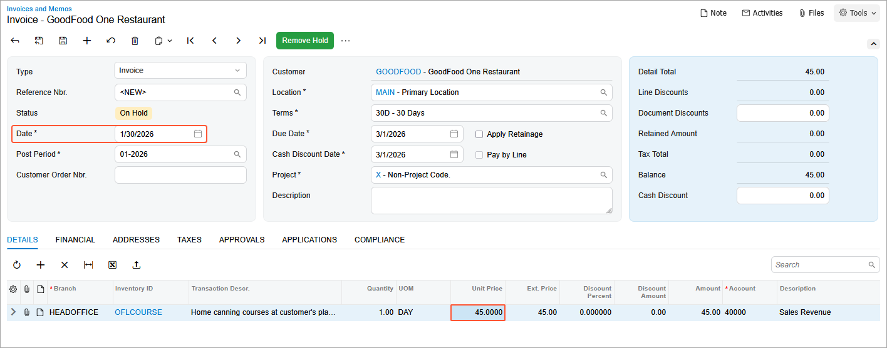

# Sales Prices: To Explore Regular and Promotional Prices {#_f37bcab6-5791-4e67-82fb-a26062c11b0c .task}

In this activity, you will create several invoices to see how the system suggests a price in each particular case depending on which prices exist in the system and which of them has the highest priority.

**Tip:** In this chapter, *regular price* is used to refer to a non-default price that is not promotional. A regular price may have any of the following types: *Base*, *Customer*, or *Customer Price Class*.

**Attention:** This activity is based on the *U100* dataset. If you are using another dataset or if any system settings have been changed in *U100*, these changes can affect the workflow of the activity and the results of the processing. To avoid issues, restore the *U100* dataset to its initial state.

## Story { .section}

Suppose that in January 2026, three customers FourStar Coffee &amp; Sweets Shop \(*COFFEESHOP*\), GoodFood One Restaurant \(*GOODFOOD*\), and Allen's Bakery \(*ABAKERY*\) purchased one-day online courses from SweetLife. The GoodFood One Restaurant customer also purchased a one-day offline course with a promotional price.

Acting as SweetLife's accountant, you need to process an invoice for each of these customers for these purchases.

## Configuration Overview {#section_tz4_djx_cnb .section}

In the *U100* dataset, the following tasks have been performed to support this activity:

-   On the [Non-Stock Items](IN_20_20_00.md) \(IN202000\) form, the *ONLCOURSE* and *OFLCOURSE* non-stock items have been created.
-   On the [Customer Price Classes](AR_20_80_00.md) \(AR208000\) form, the *LOCAL* and *INTERN* customer price classes have been created.
-   On the [Customers](AR_30_30_00.md) \(AR303000\) form, the *COFFEESHOP*, *GOODFOOD*, and *ABAKERY* customers have been predefined.
-   On the **Shipping** tab of the [Customers](AR_30_30_00.md) \(AR303000\) form, the *GOODFOOD* and *COFFEESHOP* customers have been assigned to the *LOCAL* customer price class.

## Process Overview { .section}

In this activity, on the [Customers](AR_30_30_00.md) \(AR303000\) form, you will update the settings of the *ABAKERY* customer. Then on the [Invoices and Memos](AR_30_10_00.md) \(AR301000\) form, you will start the creation of AR invoices for each of the customers that purchased the one-day online and offline courses. Finally, you will review the price that the system suggests in each invoice.

## System Preparation { .section}

To prepare the system, do the following:

1.  Launch the Acumatica ERP website with the *U100* dataset preloaded, and sign in to the system as an accountant by using the *johnson* username and the *123* password.
2.  In the info area, in the upper-right corner of the top pane of the Acumatica ERP screen, make sure that the business date in your system is set to *1/30/2026*. If a different date is displayed, click the Business Date menu button and select *1/30/2026*. For simplicity, in this lesson, you will create and process all documents in the system on this business date.
3.  On the Company and Branch Selection menu, also on the top pane of the Acumatica ERP screen, make sure that the *SweetLife Head Office and Wholesale Center* branch is selected. If it is not selected, click the Company and Branch Selection menu button to view the list of branches that you have access to, and then click *SweetLife Head Office and Wholesale Center*.

## Step 1: Specifying Price Class for the ABAKERY Customer { .section}

To specify the *INTERN* price class for the Allen's Bakery customer, do the following:

1.  Open the [Customers](AR_30_30_00.md) \(AR303000\) form.
2.  In the **Customer ID** box, select *ABAKERY*.
3.  In the **Price Class** box of the **Shipping** tab, select *INTERN*.
4.  On the form toolbar, click **Save** to save the changes.

## Step 2: Creating an AR Invoice for the COFFEESHOP Customer { .section}

To create an AR invoice for the FourStar Coffee &amp; Sweets Shop customer and analyze which sales price the system inserts in it, do the following:

1.  Open the [Invoices and Memos](AR_30_10_00.md) \(AR301000\) form.
2.  On the form toolbar, click **Add New Record**, and specify the following settings in the Summary area:
    -   **Type**: *Invoice*
    -   **Customer**: *COFFEESHOP*
    -   **Date**: *1/30/2026*
    -   **Post Period**: *01-2026*
    -   **Description**: `One-day online course`
3.  On the table toolbar of the **Details** tab, click **Add Row**, and specify the following settings in the added row:

    -   **Branch**: *HEADOFFICE*
    -   **Inventory ID**: *ONLCOURSE*
    -   **Quantity**: `1`
    -   **UOM**: *DAY*
    Notice that in the **Unit Price** column, the system has inserted the sales price defined for this customer \($13\).

    You do not need to save the invoice. You created it solely to test how the sales prices are applied.

## Step 3: Creating an AR Invoice for the GOODFOOD Customer { .section}

To create an AR invoice for the GoodFood One Restaurant customer and analyze which sales price the system inserts in it, do the following:

1.  While you are still on the [Invoices and Memos](AR_30_10_00.md) \(AR301000\) form, click **Add New Record** on the form toolbar to create a new invoice.
2.  In the Summary area, specify the following settings:
    -   **Type**: *Invoice*
    -   **Customer**: *GOODFOOD*
    -   **Date**: *1/30/2026*
    -   **Post Period**: *01-2026*
    -   **Description**: `One-day online course`
3.  On the table toolbar of the **Details** tab, click **Add Row**, and specify the following settings in the added row:

    -   **Branch**: *HEADOFFICE*
    -   **Inventory ID**: *ONLCOURSE*
    -   **Quantity**: `1`
    -   **UOM**: *DAY*
    Notice that in the **Unit Price** column, the system has inserted the sales price defined for the *LOCAL* customer price class \($14.50\), because the *GOODFOOD* customer belongs to this price class and no customer-specific price has been specified for the *ONLCOURSE* item for this customer.

    You do not need to save the invoice. You created it solely to test how the sales prices are applied.

## Step 4: Creating an AR Invoice for the ABAKERY Customer { .section}

To create an AR invoice for the Allen's Bakery customer and analyze which sales price the system inserts, do the following:

1.  While you are still on the [Invoices and Memos](AR_30_10_00.md) \(AR301000\) form, click **Add New Record** on the form toolbar to create a new invoice.
2.  In the Summary area, specify the following settings:
    -   **Type**: *Invoice*
    -   **Customer**: *ABAKERY*
    -   **Date**: *1/30/2026*
    -   **Post Period**: *01-2026*
    -   **Description**: `One-day online course`
3.  On the table toolbar of the **Details** tab, click **Add Row** on the table toolbar, and specify the following settings in the added row:

    -   **Branch**: *HEADOFFICE*
    -   **Inventory ID**: *ONLCOURSE*
    -   **Quantity**: `1`
    -   **UOM**: *DAY*
    Notice that in the **Unit Price** column, the system has inserted the base sales price defined in the system for this non-stock item \($15\), because the Allen's Bakery customer belongs to the *INTERN* customer price class, and no price for this item is specified for this customer or for this price class.

    You do not need to save the invoice. You created it solely to test how the sales prices are applied.

## Step 5: Creating an AR Invoice with a Promotional Price {#section_ij3_qy5_3pb .section}

To create an AR invoice with the *OFLCOURSE* non-stock item, do the following:

1.  While you are still on the [Invoices and Memos](AR_30_10_00.md) \(AR301000\) form, click **Add New Record** on the form toolbar to create a new invoice.
2.  In the Summary area, specify the following settings:
    -   **Type**: *Invoice*
    -   **Customer**: *GOODFOOD*
    -   **Date**: *1/13/2026*
    -   **Post Period**: *01-2026*
    -   **Description**: `One-day offline course`
3.  On the table toolbar of the **Details** tab, click **Add Row** on the table toolbar, and specify the following settings in the added row:

    -   **Branch**: *HEADOFFICE*
    -   **Inventory ID**: *OFLCOURSE*
    -   **Quantity**: `1`
    -   **UOM**: *DAY*
    Notice that in the **Unit Price** column, the system has inserted the promotional price for this non-stock item \($40\), because the invoice date \(*1/13/2026*\) is within the range of the effective dates specified for this promotional price.

4.  In the **Date** box of the Summary area, change the date to *1/30/2026* \(the current business date\).

    The system has updated the price in the **Unit Price** column, because now the invoice date \(*1/30/2026*\) is outside of the range of the effective dates specified for the promotional price. Thus, the system has copied the default price of the item \($45\), because there are no other sales prices effective on this date and applicable to the *GOODFOOD* customer \(see the following screenshot\).

    

5.  Close the form without saving your changes to the invoice, which was created solely for testing purposes.

**Parent topic:**[Exploring Automatic Price Selection in Documents](../UserGuide/Prices_Sales_Price_Selection_Mapref.md)

