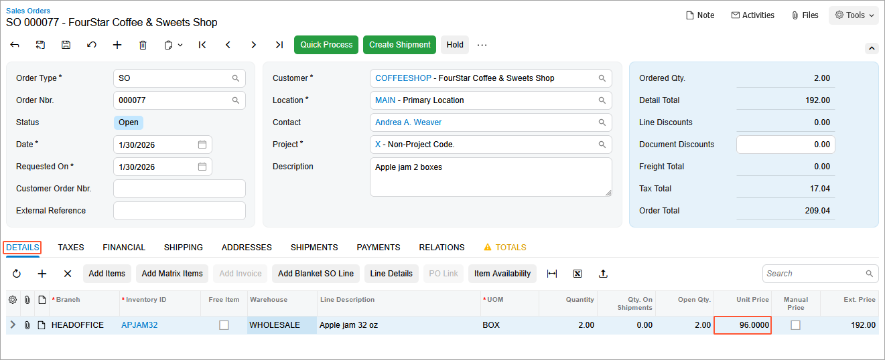

# Sales Prices: To Explore UOM-Specific Prices {#_e2309109-4546-4c44-85d9-7b19d03dbd8c .task}

In this activity, you will learn how to define sales prices for different units of measure \(UOMs\) for a particular item and how to update prices in an existing sales order. You will also review how the system suggests a price when prices in multiple units of measure exist in the system.

**Attention:** This activity is based on the *U100* dataset. If you are using another dataset or if any system settings have been changed in *U100*, these changes can affect the workflow of the activity and the results of the processing. To avoid issues, restore the *U100* dataset to its initial state.

## Story { .section}

Suppose that as the accountant of SweetLife Fruits &amp; Jams, you have to record the sale of two boxes of 32-ounce jars of apple jam.

The system contains the sales price for 1 jar of apple jam \($16.60\), and one box has been defined to be equal to six 32-ounce jars.

After you have created the sales order, you will define a sales price for one box of apple jam \($96.00\) and update the price in this sales order.

## Configuration Overview {#section_tz4_djx_cnb .section}

In the *U100* dataset, the following tasks have been performed to support this activity:

-   On the [Units of Measure](CS_20_35_00.md) \(CS203500\) form, the *PIECE* and *BOX* units of measure have been created.
-   On the [Stock Items](IN_20_25_00.md) \(IN202500\) form, the *APJAM32* stock item has been created with *PIECE* as a base unit and *BOX* as a sales unit. One box is defined to be equal to 6 pieces.
-   On the [Customers](AR_30_30_00.md) \(AR303000\) form, the *COFFEESHOP* customer has been created.
-   On the [Warehouses](IN_20_40_00.md) \(IN204000\) form, the *WHOLESALE* warehouse has been created.

## Process Overview { .section}

To define a sales price for a unit of measure that is not defined for a particular stock item, in order to include the item with the new unit of measure in a sales order, you will first review the existing sales price for the stock item on the [Sales Prices](AR_20_20_00.md) \(AR202000\) form.

You will then create a sales order for the sale of a particular stock item on the [Sales Orders](SO_30_10_00.md) \(SO301000\) form. After that, you will define a sales price for a particular unit of measure of a stock item on the [Sales Prices](AR_20_20_00.md) form.

Finally, you will update the price in the sales order on the [Sales Orders](SO_30_10_00.md) form.

## System Preparation { .section}

To prepare the system, do the following:

1.  Launch the Acumatica ERP website with the *U100* dataset preloaded, and sign in to the system as an accountant by using the *johnson* username and the *123* password.
2.  In the info area, in the upper-right corner of the top pane of the Acumatica ERP screen, make sure that the business date in your system is set to *1/30/2026*. If a different date is displayed, click the Business Date menu button and select *1/30/2026*. For simplicity, in this lesson, you will create and process all documents in the system on this business date.
3.  On the Company and Branch Selection menu, also on the top pane of the Acumatica ERP screen, make sure that the *SweetLife Head Office and Wholesale Center* branch is selected. If it is not selected, click the Company and Branch Selection menu button to view the list of branches that you have access to, and then click *SweetLife Head Office and Wholesale Center*.

## Step 1: Viewing Existing Prices for a Particular Item { .section}

To view the existing sales price for the *APJAM32* stock item, do the following:

1.  Open the [Sales Prices](AR_20_20_00.md) \(AR202000\) form.
2.  In the **Inventory ID** box of the Selection area, select *APJAM32*. In the table, review the price of this stock item that is valid on the current business date \($16.60\) and the UOM \(*PIECE*\), which is a jar in this case.
3.  Open the [Stock Items](IN_20_25_00.md) \(IN202500\) form.
4.  In the **Inventory ID** box, select *APJAM32*.
5.  On the **General** tab \(**Unit of Measure** section\) of the [Stock Items](IN_20_25_00.md) form, notice that the sales unit for this item is *BOX*. In the conversion table, review how this unit of measure is converted for this item \(according to the settings, one box contains 6 pieces\).

## Step 2: Creating a Sales Order { .section}

To create a sales order for apple jam, do the following:

1.  Open the [Sales Orders](SO_30_10_00.md) \(SO301000\) form.
2.  On the form toolbar, click **Add New Record**, and specify the following settings in the Summary area:
    -   **Order Type**: *SO*
    -   **Customer**: *COFFEESHOP*
    -   **Date**: *1/30/2026*
    -   **Requested On**: *1/30/2026*
    -   **Description**: `Apple jam 2 boxes`
3.  On the **Details** tab, click **Add Row** on the table toolbar, and specify the following settings in the added row:

    -   **Branch**: *HEADOFFICE*
    -   **Inventory ID**: *APJAM32*
    -   **Warehouse**: *WHOLESALE*
    -   **UOM**: *BOX*
    -   **Quantity**: `2`
    Notice the value in the **Unit Price** column \($99.60\). Since the price that is set for *APJAM32* is $16.60 for one piece, the unit price of one box \(6 pieces\) is equal to $99.60 \($16.60 x 6\).

4.  On the form toolbar, click **Save**.

## Step 3: Defining a Sales Price for a Particular Unit of Measure { .section}

To define a sales price for a box of apple jam, do the following:

1.  Open the [Sales Prices](AR_20_20_00.md) \(AR202000\) form.
2.  In the table toolbar, click **Add Row**, and specify the following settings in the added row:
    -   **Price Type**: *Base*
    -   **Inventory ID**: *APJAM32*
    -   **UOM**: *BOX*
    -   **Price**: `96`
    -   **Effective Date**: *1/30/2026*
3.  On the form toolbar, click **Save**.

## Step 4: Updating the Prices in the Sales Order {#section_imj_zy5_3pb .section}

To update the prices in the sales order, do the following:

1.  Open the Sales Orders \(SO3010PL\) form.
2.  Find the sales order you created in Step 2, and open it.
3.  On the More menu \(under **Other**\), click **Recalculate Prices**.
4.  In the **Recalculate Prices** dialog box, which opens, leave the default values, and click **OK**. On the **Details** tab, which is shown in the following screenshot, review the price in the **Unit Price** column of the table. Because a sales price \($96.00\) has been defined in the system for this unit of measure \(*BOX*\) of this stock item \(*APJAM32*\), the system has updated the previous price from $99.60 to $96.00.

    

5.  On the form toolbar, click **Save**.

**Parent topic:**[Exploring Automatic Price Selection in Documents](../UserGuide/Prices_Sales_Price_Selection_Mapref.md)

