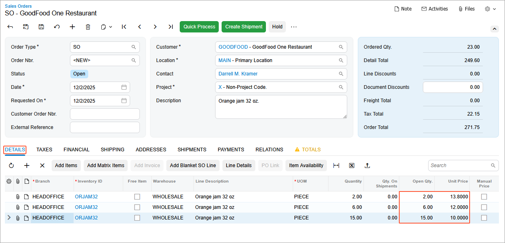

# Sales Prices: To Explore Volume-Based Prices {#_cee56c19-e21c-4e5b-91e1-d880f94ab506 .task}

In this activity, you will learn how to define volume-based sales prices for a particular stock item.

**Attention:** This activity is based on the *U100* dataset. If you are using another dataset or if any system settings have been changed in *U100*, these changes can affect the workflow of the activity and the results of the processing. To avoid issues, restore the *U100* dataset to its initial state.

## Story { .section}

Suppose that on December 2, 2025, the SweetLife Fruits &amp; Jams company decided to introduce volume-based prices for 32-ounce jars of orange jam.

Acting as SweetLife's accountant, you need to define the following prices in the system:

-   From 1 to 4 pieces: $13.80
-   From 5 to 9 pieces: $12.00
-   More than 9 pieces: $10.00

## Configuration Overview {#section_tz4_djx_cnb .section}

In the *U100* dataset, the following tasks have been performed to support this activity:

-   On the [Enable/Disable Features](CS_10_00_00.md) \(CS100000\) form, the *Volume Pricing* feature has been enabled.
-   On the [Stock Items](IN_20_25_00.md) \(IN202500\) form, the *ORJAM32* stock item has been created.
-   On the [Units of Measure](CS_20_35_00.md) \(CS203500\) form, the *PIECE* unit of measure has been created.
-   On the [Customer Price Classes](AR_20_80_00.md) \(AR208000\) form, the *LOCAL* customer price class has been created.
-   On the **Shipping** tab of the [Customers](AR_30_30_00.md) \(AR303000\) form, the *GOODFOOD* customer has been created and assigned to the *LOCAL* customer price class.
-   On the [Warehouses](IN_20_40_00.md) \(IN204000\) form, the *WHOLESALE* warehouse has been created.

## Process Overview { .section}

First, you will view the sales prices that have been defined for a particular stock item on the [Sales Prices](AR_20_20_00.md) \(AR202000\) form. Then on the same form, you will enter volume-based prices for this stock item.

To test the volume-based prices you have entered, you will create a sales order on the [Sales Orders](SO_30_10_00.md) \(SO301000\) form, and add lines with different quantities to make sure that the system uses the needed prices for each line.

## System Preparation { .section}

To prepare the system, do the following:

1.  Launch the Acumatica ERP website with the *U100* dataset preloaded, and sign in to the system as an accountant by using the *johnson* username and the *123* password.
2.  In the info area, in the upper-right corner of the top pane of the Acumatica ERP screen, make sure that the business date in your system is set to *12/2/2025*. If a different date is displayed, click the Business Date menu button and select *12/2/2025*. For simplicity, in this lesson, you will create and process all documents in the system on this business date.
3.  On the Company and Branch Selection menu, also on the top pane of the Acumatica ERP screen, make sure that the *SweetLife Head Office and Wholesale Center* branch is selected. If it is not selected, click the Company and Branch Selection menu button to view the list of branches that you have access to, and then click *SweetLife Head Office and Wholesale Center*.

## Step 1: Viewing the Sales Prices of a Particular Stock Item { .section}

To view the sales price that has been defined for the *ORJAM32* stock item and set its expiration date, do the following:

1.  Open the [Sales Prices](AR_20_20_00.md) \(AR202000\) form.
2.  In the **Inventory ID** box of the Selection area, select *ORJAM32* and make sure that **Effective As Of** is set to *12/2/2025*.

    Notice that the table shows only one row with the base price of $13, which was effective starting on 3/30/2025.

3.  In the **Expiration Date** column, select *12/1/2025.*
4.  On the form toolbar, click **Save**. Notice that the price has disappeared from the list because it is no longer active on the date that is selected in the **Effective As Of** box.

## Step 2: Defining Volume-Based Prices for a Particular Stock Item { .section}

To define volume-based prices for the *ORJAM32* stock item, do the following.

1.  While you are still viewing the [Sales Prices](AR_20_20_00.md) \(AR202000\) form, on the table toolbar, click **Add Row**, and specify the following settings in the added row, which apply to fewer than 5 pieces of the stock item:
    -   **Price Type**: *Base*
    -   **Inventory ID**: *ORJAM32*
    -   **UOM**: *PIECE*
    -   **Break Qty.**: `0`
    -   **Price**: `13.80`
    -   **Effective Date**: *12/2/2025*
2.  On the table toolbar, click **Add Row**, and specify the following settings in the row, which apply to 5 to 9 pieces of the stock item:
    -   **Price Type**: *Base*
    -   **Inventory ID**: *ORJAM32*
    -   **UOM**: *PIECE*
    -   **Break Qty.**: `5`
    -   **Price**: `12`
    -   **Effective Date**: *12/2/2025*
3.  On the table toolbar, click **Add Row**, and specify the following settings in the row, which apply to more than 9 pieces of the stock item:
    -   **Price Type**: *Base*
    -   **Inventory ID**: *ORJAM32*
    -   **UOM**: *PIECE*
    -   **Break Qty.**: `10`
    -   **Price**: `10`
    -   **Effective Date**: *12/2/2025*
4.  On the form toolbar, click **Save**.
5.  In the Selection area, clear the **Effective As Of** box. Review all the prices that now exist in the system for this stock item.

    The base price for this item, which was effective from 3/30/2025 to 12/1/2025, is $13.00. Starting on 12/2/2025, the following volume-based prices are effective

    -   $13.80 for fewer than 5 pieces
    -   $12.00 for 5 to 9 pieces
    -   $10.00 for more than 9 pieces

## Step 3: Creating a Sales Order {#section_lzq_3z5_3pb .section}

To begin the creation of a sales order in order to test the prices of different quantities of the *ORJAM32* stock item, do the following:

1.  Open the [Sales Orders](SO_30_10_00.md) \(SO301000\) form.
2.  On the form toolbar, click **Add New Record**, and specify the following settings in the Summary area:
    -   **Order Type**: *SO*
    -   **Customer**: *GOODFOOD*
    -   **Date**: *12/2/2025*
    -   **Requested On**: *12/2/2025*
    -   **Description**: `Orange jam 32 oz.`
3.  On the **Details** tab, click **Add Row** on the table toolbar, and specify the following settings for the first line:

    -   **Branch**: *HEADOFFICE*
    -   **Inventory ID**: *ORJAM32*
    -   **Warehouse**: *WHOLESALE*
    -   **UOM**: *PIECE*
    -   **Quantity**: `2`
    In the **Unit Price** column, the system has inserted the price you specified in Step 2 on the [Sales Prices](AR_20_20_00.md) \(AR202000\) form for the break quantity of *0*, which means that the unit price is $13.80 when the quantity of this stock item in the order line is less than the quantity specified in the second tier.

4.  On the **Details** tab, click **Add Row** on the table toolbar, and specify the following settings in the second line:

    -   **Branch**: *HEADOFFICE*
    -   **Inventory ID**: *ORJAM32*
    -   **Warehouse**: *WHOLESALE*
    -   **UOM**: *PIECE*
    -   **Quantity**: `6`
    In the **Unit Price** column, the system has inserted the price you specified in Step 2 on the [Sales Prices](AR_20_20_00.md) form for the break quantity of *5*. This means that the unit price is $12 when the quantity of this stock item in the order line is not less that 5 but does not reach the quantity in the third tier \(10\).

5.  On the **Details** tab, click **Add Row** on the table toolbar, and specify the following settings in the third line:

    -   **Branch**: *HEADOFFICE*
    -   **Inventory ID**: *ORJAM32*
    -   **Warehouse**: *WHOLESALE*
    -   **UOM**: *PIECE*
    -   **Quantity**: `15`
    In the **Unit Price** column, the system has inserted the price you specified in Step 2 on the [Sales Prices](AR_20_20_00.md) form for the break quantity of *10*, which means that the unit price is $10 when the quantity of this stock item in the order line is 10 or more \(see the following screenshot\).

    

6.  Close the form without saving your changes to the sales order, which was created solely for testing purposes.

**Parent topic:**[Exploring Automatic Price Selection in Documents](../UserGuide/Prices_Sales_Price_Selection_Mapref.md)

