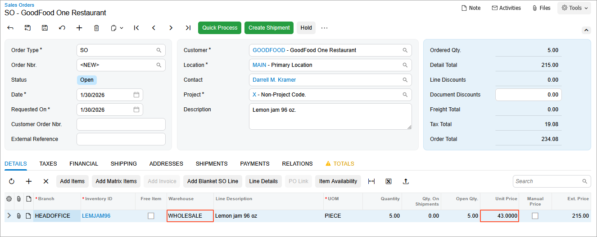
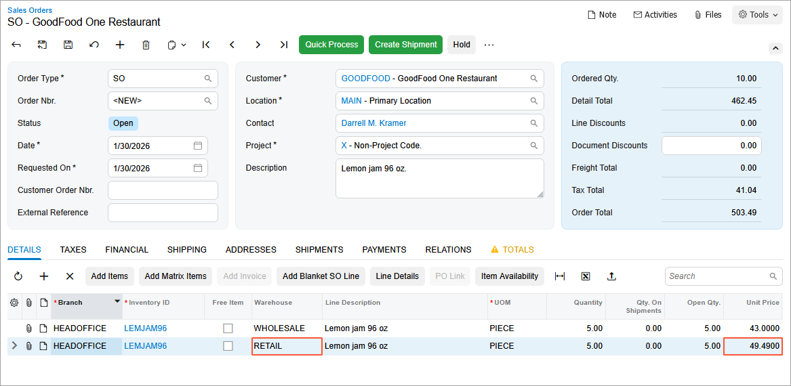

# Sales Prices: To Explore Warehouse-Specific Prices {#_b0ddb4a4-446a-40d2-8396-ffae16f47fcd .task}

In this activity, you will learn how to define sales prices for a particular warehouse.

**Attention:** This activity is based on the *U100* dataset. If you are using another dataset or if any system settings have been changed in *U100*, these changes can affect the workflow of the activity and the results of the processing. To avoid issues, restore the *U100* dataset to its initial state.

## Story { .section}

Suppose that the sales manager of the SweetLife company decided that on January 30, 2026, the company will start selling one of its products \(a 96-ounce jar of lemon jam, defined in the system as *LEMJAM96*\) from the Wholesale warehouse \(*WHOLESALE*\) at special prices.

Acting as SweetLife's accountant, you need to define the sales price of the *LEMJAM96* stock item for this particular warehouse effective on the specified date. You also need to record the sale of 10 jars of lemon jam, 5 of which are sold from the Wholesale warehouse.

## Configuration Overview {#section_tz4_djx_cnb .section}

In the *U100* dataset, the following tasks have been performed to support this activity:

-   On the [Warehouses](IN_20_40_00.md) \(IN204000\) form, the *WHOLESALE* and *RETAIL* warehouses have been created.
-   On the [Stock Items](IN_20_25_00.md) \(IN202500\) form, the *LEMJAM96* stock item has been created.
-   On the [Units of Measure](CS_20_35_00.md) \(CS203500\) form, the *PIECE* unit of measure has been created.
-   On the [Customer Price Classes](AR_20_80_00.md) \(AR208000\) form, the *LOCAL* customer price class has been created.
-   On the [Customers](AR_30_30_00.md) \(AR303000\) form, the *GOODFOOD* customer has been created and assigned to the *LOCAL* customer price class.

## Process Overview { .section}

On the [Sales Prices](AR_20_20_00.md) \(AR202000\) form, you will first view sales prices defined for a particular warehouse. By using the same form, you will define a sales price of a particular item from a particular warehouse \(that is, a warehouse-specific sales price\).

To test this configuration, you will then create a sales order on the [Sales Orders](SO_30_10_00.md) \(SO301000\) form, add lines to it \(at least one for the item being sold from the particular warehouse for which you have added the sales price, and at least one for the item at another warehouse\), and review the sales prices the system inserts for these lines.

## System Preparation { .section}

To prepare the system, do the following:

1.  Launch the Acumatica ERP website with the *U100* dataset preloaded, and sign in to the system as an accountant by using the *johnson* username and the *123* password.
2.  In the info area, in the upper-right corner of the top pane of the Acumatica ERP screen, make sure that the business date in your system is set to *1/30/2026*. If a different date is displayed, click the Business Date menu button and select *1/30/2026*. For simplicity, in this lesson, you will create and process all documents in the system on this business date.
3.  On the Company and Branch Selection menu, also on the top pane of the Acumatica ERP screen, make sure that the *SweetLife Head Office and Wholesale Center* branch is selected. If it is not selected, click the Company and Branch Selection menu button to view the list of branches that you have access to, and then click *SweetLife Head Office and Wholesale Center*.

## Step 1: Viewing Sales Prices for a Particular Warehouse { .section}

To view the sales prices that have been defined for the *WHOLESALE* warehouse, do the following:

1.  Open the [Sales Prices](AR_20_20_00.md) \(AR202000\) form.
2.  In the **Warehouse** box of the Selection area, select *WHOLESALE*.

    Notice that the table shows no records because no sales prices that are specific to this warehouse have been defined in the system.

## Step 2: Defining a Sales Price of a Particular Item at the Wholesale Warehouse { .section}

To create a sales price for the *LEMJAM96* stock item at the Wholesale warehouse, do the following:

1.  On the [Sales Prices](AR_20_20_00.md) \(AR202000\) form, click **Add Row** on the table toolbar, and specify the following settings in the added row:
    -   **Price Type**: *Base*
    -   **Inventory ID**: *LEMJAM96*
    -   **UOM**: *PIECE*
    -   **Warehouse**: *WHOLESALE*
    -   **Price**: `43`
    -   **Effective Date**: *1/30/2026*
2.  On the form toolbar, click **Save**.
3.  In the Selection area, select *LEMJAM96* in the **Inventory ID** box, and clear the value in the **Warehouse** box. Review the prices that are defined in the system for the *LEMJAM96* item.

Now in the **Price** column, two prices are shown: the *LEMJAM96* price \(for which the warehouse is not specified\) of $49.49, and the *LEMJAM96* price \(for which the *WHOLESALE* warehouse is specified\) of $43.00.

## Step 3: Creating a Sales Order {#section_mxc_fz5_3pb .section}

To make sure the system is inserting a different price for the item when it is sold from the *WHOLESALE* warehouse than when it is sold from another warehouse, you will create a sales order with two lines from different warehouses. Do the following:

1.  Open the [Sales Orders](SO_30_10_00.md) \(SO301000\) form.
2.  On the form toolbar, click **Add New Record**, and specify the following settings in the Summary area:
    -   **Order Type**: *SO*
    -   **Customer**: *GOODFOOD*
    -   **Date**: *1/30/2026*
    -   **Requested On**: *1/30/2026*
    -   **Description**: `Lemon jam 96 oz.`
3.  On the table toolbar of the **Details** tab, click **Add Row**, and specify the following settings for the first order line:

    -   **Branch**: *HEADOFFICE*
    -   **Inventory ID**: *LEMJAM96*
    -   **Warehouse**: *WHOLESALE*
    -   **UOM**: *PIECE*
    -   **Quantity**: `5`
    Notice the value in the **Unit Price** column. Because you specified the *WHOLESALE* warehouse, the system has inserted the unit price \($43\) that you have specified for this warehouse in Step 2, as shown in the following screenshot.

    

4.  On the table toolbar of the **Details** tab, click **Add Row**, and specify the following settings for the second order line:

    -   **Branch**: *HEADOFFICE*
    -   **Inventory ID**: *LEMJAM96*
    -   **Warehouse**: *RETAIL*
    -   **UOM**: *PIECE*
    -   **Quantity**: `5`
    Notice the value in the **Unit Price** column, which is shown in the following screenshot. Because no sales price has been specified for this stock item that is specific to the *RETAIL* warehouse, the system has inserted the base price for this stock item \($49.49\).

    

5.  On the form toolbar, click **Save** to save the sales order.

**Parent topic:**[Exploring Automatic Price Selection in Documents](../UserGuide/Prices_Sales_Price_Selection_Mapref.md)

