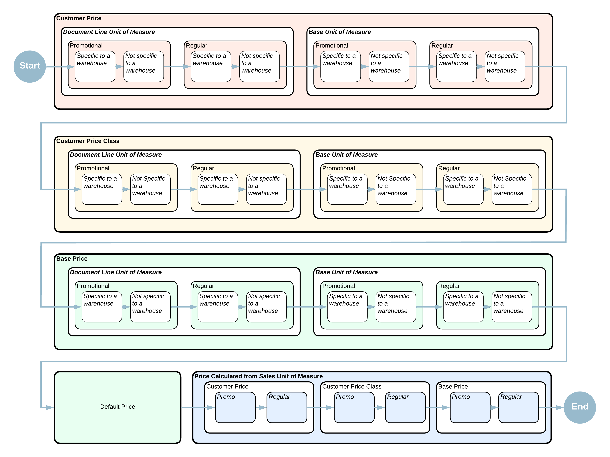

# Sales Prices: Rules of Price Selection {#_e0863703-06d1-415e-8e5a-c736fc4a965f .concept}

In Acumatica ERP, the system automatically suggests a price in a sales order or an AR invoice from the sales prices existing in the system.

## Learning Objectives { .section}

You will learn how the system selects a price to suggest in a sales order or AR invoice based on the price’s priority.

## Applicable Scenarios { .section}

In Acumatica ERP, you can maintain sales prices for both non-stock items and stock items.

You can maintain sales prices for stock items if the *Inventory* feature is enabled on the [Enable/Disable Features](CS_10_00_00.md) \(CS100000\) form.

## Price Selection Rules { .section}

You can define multiple prices, each with a different goal, for an item. When a user selects an item in a document line \(or modifies the item's quantity\), the system searches for an applicable price that is effective on the date of the document. The system bases this search on the price’s priority \(highest to lowest\) and stops when it finds an applicable price for the item. The search proceeds as follows:

1.  The system searches for an item price defined for the *Customer* price type by using the following rules:
    1.  A promotional price for the item has a higher priority than a regular price of the same type for the item.

        **Tip:** In this chapter, *regular price* is used to refer to a non-default price that is not promotional. A regular price may have any of the following types: *Base*, *Customer*, or *Customer Price Class*.

    2.  A price specified for the item with the unit of measure selected in the document line has a higher priority than a price specified for the item with the base unit of measure.
    3.  If multiple warehouses are defined in the system, an item price specific to the warehouse selected in the document has a higher priority than a price of the same type that is not specific to a warehouse.

        **Attention:** The system does not use any of the warehouse-specific prices in accounts receivable documents, because these documents do not have information about warehouses.

2.  The system searches for an item price defined for the *Customer Price Class* price type by using the following rules:
    1.  A promotional price for the item has a higher priority than a regular price of the same type for the item.
    2.  A price specified for the item with the unit of measure selected in the document line has a higher priority than a price specified for the item with the base unit of measure.
    3.  If multiple warehouses are defined in the system, an item price specific to the warehouse selected in the document has a higher priority than a price of the same type that is not specific to a warehouse.
3.  The system searches for an item price defined for the *Base* price type by using the following rules:
    1.  A promotional price for the item has a higher priority than a regular price of the same type for the item.
    2.  A price specified for the item with the unit of measure selected in the document line has a higher priority than a price specified for the item with the base unit of measure.
    3.  If multiple warehouses are defined in the system, an item price specific to the warehouse selected in the document has a higher priority than a price of the same type that is not specific to a warehouse.
4.  The system searches for the default price specified for the item on the [Non-Stock Items](IN_20_20_00.md) \(IN202000\) or [Stock Items](IN_20_25_00.md) \(IN202500\) form \(**Price/Cost** tab\).
5.  The system searches for a price calculated for the item with the sales unit of measure in the following order:
    1.  Customer price: A promotional price has a higher priority than a regular price of the same type.
    2.  Customer price class: A promotional price has a higher priority than a regular price of the same type.
    3.  Base price: A promotional price has a higher priority than a regular price of the same type.

**Tip:** If price tiers are defined in the applicable price list, the system applies the price from the tier that applies to the item quantity.

Once the system finds an applicable price, it stops the search and inserts this price into the document, but you can override this price. The price search priority is illustrated in the diagram below.

**Parent topic:**[Exploring Automatic Price Selection in Documents](../UserGuide/Prices_Sales_Price_Selection_Mapref.md)

