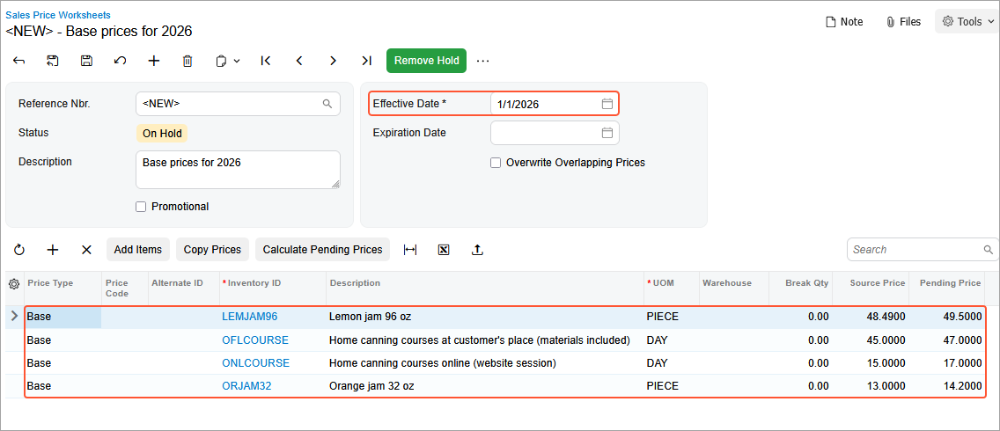
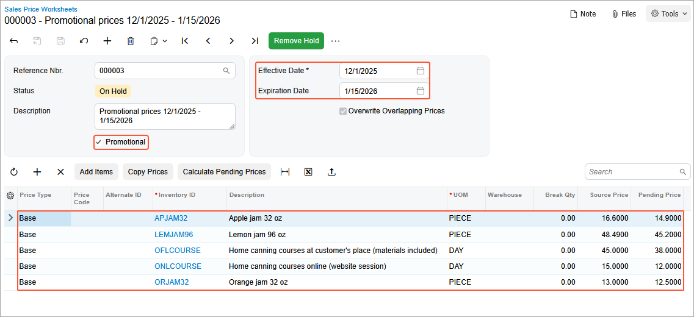
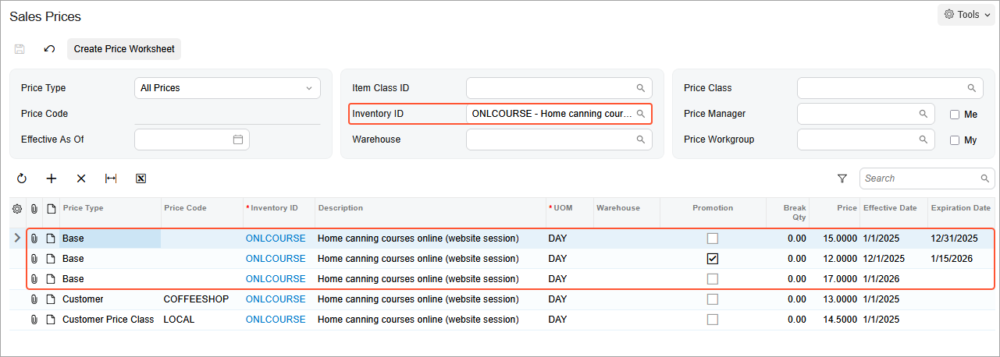
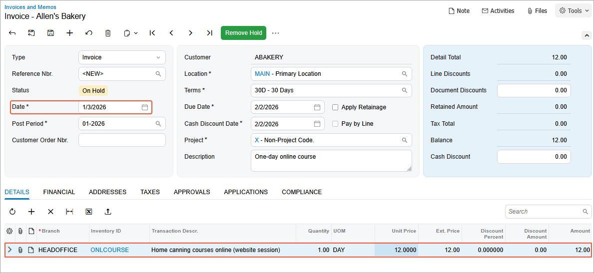

# Sales Price Uploading: Process Activity {#_22c38a82-5e0f-476a-b120-897641dafed2 .task}

In this activity, you will learn how to upload sales price lists with regular prices and promotional prices. You will also review how the history of updated prices is kept in the system.

**Tip:** In this chapter, *regular price* is used to refer to a non-default price that is not promotional. A regular price may have any of the following types: *Base*, *Customer*, or *Customer Price Class*.

**Attention:** This activity is based on the *U100* dataset. If you are using another dataset or if any system settings have been changed in *U100*, these changes can affect the workflow of the activity and the results of the processing. To avoid issues, restore the *U100* dataset to its initial state.

## Story { .section}

Suppose that the SweetLife Fruits &amp; Jams company has decided to update regular sales prices for 2026 and set up promotional prices for some items during the holiday season.

Acting as SweetLife's accountant, you need to upload two Excel files with both sales price worksheets and see how the system uses them. You also want to review how the sales prices are retained in the system.

## Configuration Overview {#section_tz4_djx_cnb .section}

In the *U100* dataset, the following tasks have been performed to support this activity:

-   On the [Non-Stock Items](IN_20_20_00.md) \(IN202000\) form, the *ONLCOURSE* non-stock item has been created.
-   On the [Customer Price Classes](AR_20_80_00.md) \(AR208000\) form, the *LOCAL* customer price class has been created.
-   On the [Customers](AR_30_30_00.md) \(AR303000\) form, the *ABAKERY* and *COFFEESHOP* customers have been created.

## Process Overview { .section}

First, you will create sales price worksheets by uploading Excel files on the [Sales Price Worksheets](AR_20_20_10.md) \(AR202010\) form. Then you will release each sales price worksheet and review the new prices on the [Sales Prices](AR_20_20_00.md) \(AR202000\) form.

Finally, to analyze how the system selects prices, you will create an AR invoice on the [Invoices and Memos](AR_30_10_00.md) \(AR301000\) form.

## System Preparation { .section}

1.  Download the [PricesAndDiscounts\_SalesPrices\_Base\_2026\_01\_01.xlsx](Files/PricesAndDiscounts_SalesPrices_Base_2026_01_01.xlsx) and [PricesAndDiscounts\_SalesPrices\_Promotion\_2025\_12\_01.xlsx](Files/PricesAndDiscounts_SalesPrices_Promotion_2025_12_01.xlsx) files to your computer.
2.  Launch the Acumatica ERP website with the *U100* dataset preloaded, and sign in to the system as an accountant by using the *johnson* username and the *123* password.
3.  In the info area, in the upper-right corner of the top pane of the Acumatica ERP screen, make sure that the business date in your system is set to *1/30/2026*. If a different date is displayed, click the Business Date menu button and select *1/30/2026*. For simplicity, in this lesson, you will create and process all documents in the system on this business date.
4.  On the Company and Branch Selection menu, also on the top pane of the Acumatica ERP screen, make sure that the *SweetLife Head Office and Wholesale Center* branch is selected. If it is not selected, click the Company and Branch Selection menu to view the list of branches that you have access to, and then click *SweetLife Head Office and Wholesale Center*.

## Step 1: Importing a Sales Price Worksheet with Base Prices { .section}

To import a sales price worksheet with base prices effective from 1/1/2026, do the following:

1.  Open the [Sales Price Worksheets](AR_20_20_10.md) \(AR202010\) form.
2.  On the form toolbar, click **Add New Record**.
3.  In the **Effective Date** box, select *1/1/2026*.
4.  In the **Description** box, enter *Base prices for 2026*.
5.  On the table toolbar, click **Load Records from File**.
6.  In Step 1 of the **Import Data** dialog box, which opens, click **Upload File \(\*.csv, \*.xlsx\)**.
7.  In the dialog box that opens, find the [PricesAndDiscounts\_SalesPrices\_Base\_2026\_01\_01.xlsx](Files/PricesAndDiscounts_SalesPrices_Base_2026_01_01.xlsx) file and select it for upload.
8.  In Step 2, leave the default values and click **Next**.
9.  In Step 3, for the **Price** column name, specify the **Pending Price** property name and click **Finish**.
10. Make sure that the worksheet contains four lines \(see the following screenshot\), and save it.

    

11. On the form toolbar, click **Remove Hold**, and then click **Release** to release the worksheet.

## Step 2: Importing a Sales Price Worksheet with Promotional Prices { .section}

To import a sales price worksheet with promotional prices that are effective from *12/1/2025* to *1/15/2026*, do the following:

1.  While you are still on the [Sales Price Worksheets](AR_20_20_10.md) \(AR202010\) form, on the form toolbar, click **Add New Record**.
2.  In the **Effective Date** box, select *12/1/2025*.
3.  In the **Expiration Date** box, select *1/15/2026*.
4.  Select the **Promotional** check box.
5.  In the **Description** box, enter *Promotional prices 12/1/2025 - 1/15/2026*.
6.  On the table toolbar, click **Load Records from File**.
7.  In Step 1 of the **Import Data** dialog box, which opens, click **Upload File \(\*.csv, \*.xlsx\)**.
8.  In the dialog box that opens, find the [PricesAndDiscounts\_SalesPrices\_Promotion\_2025\_12\_01.xlsx](Files/PricesAndDiscounts_SalesPrices_Promotion_2025_12_01.xlsx) file, and select it for upload.
9.  In Step 2, leave the default values and click **Next**.
10. In Step 3, for the **Price** column name, specify the **Pending Price** property name and click **Finish**.
11. Make sure that the worksheet contains five lines and save it.

    

12. On the form toolbar, click **Remove Hold**, and then click **Release**.

## Step 3: Reviewing How the System Retains the Sales Prices { .section}

To review the sales prices for the *ONLCOURSE* non-stock item, do the following:

1.  Open the [Sales Prices](AR_20_20_00.md) \(AR202000\) form.
2.  In the **Price Type** box of the Selection area, make sure that *All Prices* is selected.
3.  In the **Inventory ID** box, select *ONLCOURSE*.
4.  In the Selection area, clear the **Effective As Of** box. In the table, review the prices that exist for the *ONLCOURSE* non-stock item.

    The base price of $15 is effective from 1/1/2025 to 12/31/2025.

    For the period from 12/1/2025 to 1/15/2026, the promotional price of $12, which you uploaded in the previous step, is effective.

    Also, starting from 1/1/2026, a new base price of $17, which you uploaded in Step 1, is effective.

    Besides, the customer-specific price configured for *COFFEESHOP* \($13.00\) and the price for the *LOCAL* customer price class \($14.50\) are also effective in the system starting from 1/1/2025, as shown in the screenshot.

    

## Step 4: Creating an Invoice with the New Price { .section}

To create an AR invoice with a new sales price, do the following:

1.  Open the [Invoices and Memos](AR_30_10_00.md) \(AR301000\) form.
2.  On the form toolbar, click **Add New Record** and specify the following settings in the Summary area:
    -   **Type**: *Invoice*
    -   **Customer**: *ABAKERY*
    -   **Date**: *1/30/2026*
    -   **Post Period**: *01-2026*
    -   **Description**: `One-day online course`
3.  On the **Details** tab, click **Add Row** on the table toolbar, and specify the following settings in the added row:

    -   **Branch**: *HEADOFFICE*
    -   **Inventory ID**: *ONLCOURSE*
    -   **Quantity**: `1`
    Review the price in the **Unit Price** column. It shows the new base price \($17\) effective from 1/1/2026, which you uploaded in Step 1.

4.  In the **Date** box of the Summary area, change the date to *1/3/2026*.
5.  On the **Details** tab, review the price in the **Unit Price** column. It now shows the new promotional price \($12\) effective from *12/1/2025* to *1/15/2026*, as shown in the following screenshot, because the invoice date is within this date range, and promotional prices have a priority over base prices.

    

6.  Close the form without saving your changes to the invoice, which was created solely for testing purposes.

**Parent topic:**[Uploading a Sales Price List](../UserGuide/Prices_Uploading_Sales_Price_Lists_Mapref.md)

