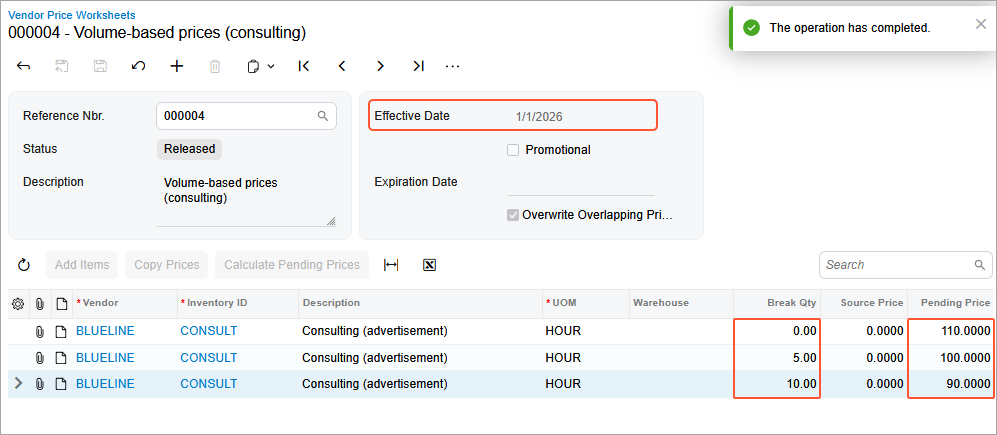
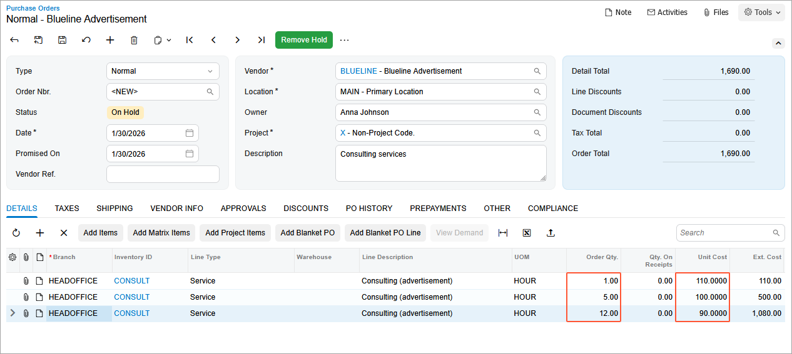
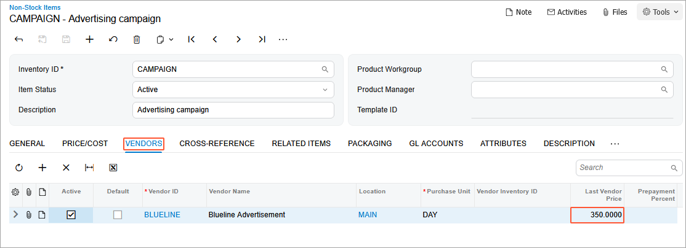
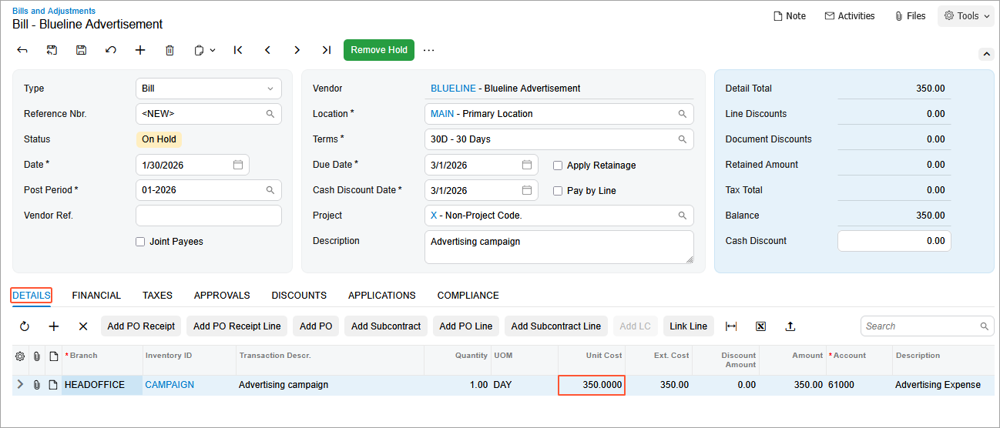
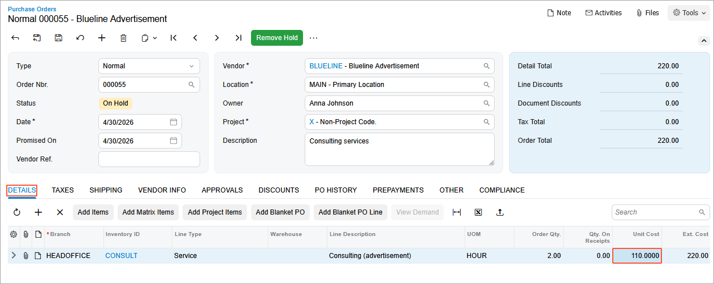

# Vendor Prices: To Upload a Price List and Explore Price Selection {#_d72f6f33-a78d-4455-9247-631b7e2ac83b .task}

In this activity, you will learn how to upload vendor price lists with regular prices and promotional prices and analyze how the system suggests vendor prices in bills and purchase orders.

**Tip:** In this chapter, a *regular* vendor price refers to a non-promotional price.

**Attention:** This activity is based on the *U100* dataset. If you are using another dataset or if any system settings have been changed in *U100*, these changes can affect the workflow of the activity and the results of the processing. To avoid issues, restore the *U100* dataset to its initial state.

## Story { .section}

Suppose that, to make work with vendor documents easier, the SweetLife Fruits &amp; Jams company decided to create a catalog of vendor prices for non-stock items. The system should be able to automatically suggest the vendor price of a specific non-stock item when a user enters this item in a line of a purchase order. SweetLife ordered advertising services from the Blueline Advertisement agency \(*BLUELINE*\) before and wants to keep these prices in the system.

Also, the agency offers prices that depend on the number of purchased hours of consulting services:

-   $110 per hour for 0 to 4 hours of consulting services
-   $100 per hour for 5 to 9 hours of consulting services
-   $90 per hour for 10 or more hours of consulting services

On January 30, 2026, the marketing manager of SweetLife decided to purchase consulting services from Blueline Advertisement agency and you, acting as SweetLife's accountant, need to create a purchase order for this agency in the system.

## Configuration Overview {#section_tz4_djx_cnb .section}

In the *U100* dataset, the following tasks have been performed to support this activity:

-   On the [Enable/Disable Features](CS_10_00_00.md) \(CS100000\) form, the *Volume Pricing* feature has been enabled.
-   On the [Non-Stock Items](IN_20_20_00.md) \(IN202000\) form, the *CONSULT*, *CAMPAIGN*, and *ADVERT* non-stock items have been created.
-   On the [Vendors](AP_30_30_00.md) \(AP303000\) form, the *BLUELINE* vendor has been created.

## Process Overview { .section}

You will create a list of regular prices on the [Vendor Price Worksheets](AP_20_20_10.md) \(AP202010\) form. You will then configure the price retention settings on the [Accounts Payable Preferences](AP_10_10_00.md) \(AP101000\) form, and on the [Vendor Prices](AP_20_20_00.md) \(AP202000\) form, you will analyze how the system keeps a history of vendor prices depending on the specified settings.

You will create a list of vendor prices broken down by item quantity on the [Vendor Price Worksheets](AP_20_20_10.md) form and review how the system suggests these prices when you create a purchase order for the vendor on the [Purchase Orders](PO_30_10_00.md) \(PO301000\) form. You will configure the standard cost for an item on the [Non-Stock Items](IN_20_20_00.md) \(IN202000\) form, and then analyze how the system suggests the last purchase price and standard cost on the [Purchase Orders](PO_30_10_00.md) form.

Finally, you will add a promotional price for this vendor on the [Vendor Prices](AP_20_20_00.md) form, create a purchase order for this vendor on the [Purchase Orders](PO_30_10_00.md) form, and analyze how the system suggests the vendor prices.

## System Preparation { .section}

1.  Launch the Acumatica ERP website with the *U100* dataset preloaded, and sign in to the system as an accountant by using the *johnson* username and the *123* password.
2.  In the info area, in the upper-right corner of the top pane of the Acumatica ERP screen, make sure that the business date in your system is set to *1/30/2026*. If a different date is displayed, click the Business Date menu button and select *1/30/2026*. For simplicity, in this lesson, you will create and process all documents in the system on this business date.
3.  On the Company and Branch Selection menu, also on the top pane of the Acumatica ERP screen, make sure that the *SweetLife Head Office and Wholesale Center* branch is selected. If it is not selected, click the Company and Branch Selection menu button to view the list of branches that you have access to, and then click *SweetLife Head Office and Wholesale Center*.

## Step 1: Enabling the Needed Features { .section}

To enable the *Vendor Discounts* feature, do the following:

1.  Open the [Enable/Disable Features](CS_10_00_00.md) \(CS100000\) form.
2.  On the form toolbar, click **Modify**.
3.  Under the **Advanced Financials** group of features, select the **Vendor Discounts** check box.
4.  On the form toolbar, click **Enable**.

## Step 2: Uploading a List of Regular Prices for the Vendor { .section}

To upload a list of regular vendor prices, do the following:

1.  Open the [Vendor Price Worksheets](AP_20_20_10.md) \(AP202010\) form.
2.  Click **Add New Record** on the form toolbar, and specify the following settings in the Summary area:
    -   **Effective Date**: *1/1/2026*
    -   **Description**: `Regular prices of Blueline Advertisement, January`
3.  On the table toolbar, click **Load Records from File**.
4.  In Step 1 of the **Import Data** dialog box, which opens, click **Upload File \(\*.csv, \*.xlsx\)**.
5.  In the window that opens, find the [PricesAndDiscounts\_VendorPrices\_BLUELINE\_2026\_01\_01.xlsx](Files/PricesAndDiscounts_VendorPrices_BLUELINE_2026_01_01.xlsx) file and select it for upload.
6.  In Step 2, leave the default values and click **Next**.
7.  In Step 3, leave the default column mapping and click **Finish**.
8.  Make sure that the worksheet contains five lines and save the worksheet.
9.  On the form toolbar, click **Remove Hold**, and then click **Release** to release the worksheet and make the prices effective in the system. The prices from the worksheet will be suggested in documents starting on *1/1/2026*.

## Step 3: Analyzing How the System Keeps the History of Prices { .section}

To analyze how the system keeps the history of vendor prices, do the following:

1.  Open the [Accounts Payable Preferences](AP_10_10_00.md) \(AP101000\) form.
2.  On the **Pricing** tab, make sure that *Last Price* is selected in the **Retention Type** box.

    This is the default setting, which means that the system keeps both the new price defined in the worksheet and the previous regular price.

3.  Open the [Vendor Price Worksheets](AP_20_20_10.md) \(AP202010\) form.
4.  On the form toolbar, click **Add New Record**, and specify the following settings for a worksheet that is effective starting on *6/1/2026*:
    -   **Effective Date**: *6/1/2026*
    -   **Description**: `Regular prices of Blueline Advertisement, June`
5.  On the table toolbar, click **Load Records from File**.
6.  In Step 1 of the **Import Data** dialog box, which opens, click **Upload File \(\*.csv, \*.xlsx\)**.
7.  In the window that opens, find the [PricesAndDiscounts\_VendorPrices\_BLUELINE\_2026\_06\_01.xlsx](Files/PricesAndDiscounts_VendorPrices_BLUELINE_2026_06_01.xlsx) file and select it for upload.
8.  In Step 2, leave the default values and click **Next**.
9.  In Step 3, leave the default column mapping and click **Finish**.
10. Make sure that the worksheet contains five lines and save the worksheet.
11. On the form toolbar, click **Remove Hold**, and then click **Release** on the form toolbar to release the worksheet and make the prices effective in the system.
12. Open the [Vendor Prices](AP_20_20_00.md) \(AP202000\) form.
13. Clear the **Effective As Of** box.
14. In the table, review the prices that are now defined in the system for the non-stock items.

    The prices that you uploaded in Step 1 expire on *5/31/2026*, because you have uploaded new prices effective from *6/1/2026*.

15. Open the [Vendor Price Worksheets](AP_20_20_10.md) form again and, on the form toolbar, click **Add New Record** and specify the following settings for a worksheet effective starting on *9/1/2026*:
    -   **Effective Date**: *9/1/2026*
    -   **Description**: `Regular prices of Blueline Advertisement, September`
16. On the table toolbar, click **Load Records from File**.
17. In Step 1 of the **Import Data** dialog box, which opens, click **Upload File \(\*.csv, \*.xlsx\)**.
18. In the window that opens, find the [PricesAndDiscounts\_VendorPrices\_BLUELINE\_2026\_09\_01.xlsx](Files/PricesAndDiscounts_VendorPrices_BLUELINE_2026_09_01.xlsx) file and select it for upload.
19. In Step 2, leave the default values and click **Next**.
20. In Step 3, leave the default column mapping and click **Finish**.
21. Make sure that the worksheet contains five lines and save the worksheet.
22. On the form toolbar, click **Remove Hold**, and then click **Release** to release the worksheet and make the prices effective in the system.
23. Open the [Vendor Prices](AP_20_20_00.md) form.
24. In the **Vendor** box of the Summary area, select *BLUELINE*.
25. In the **Inventory ID** box, select *ADVERT*.
26. Clear the **Effective As Of** box and, in the table, review how the system has updated the prices.

    The system has kept two prices—the most recent price \($45\) effective from *9/1/2026* and the previous price \($30\) that expired on *8/31/2026*.

    The system sets the expiration date automatically if you release a new price from a worksheet. If you add a new price directly on the [Vendor Prices](AP_20_20_00.md) form, you have to specify the expiration date for the previous price manually.

## Step 4: Creating a List of Vendor Prices Broken Down by Item Quantity { .section}

To create a list of vendor prices broken down by item quantity, do the following:

1.  Open the [Vendor Price Worksheets](AP_20_20_10.md) \(AP202010\) form.
2.  On the form toolbar, click **Add New Record**, and specify the following settings in the Summary area:
    -   **Effective Date**: *1/1/2026*
    -   **Description**: `Volume-based prices (consulting)`
3.  On the table toolbar, click **Add Row**, and specify the following settings for 0 to 4 hours of consulting services:
    -   **Vendor**: *BLUELINE*
    -   **Inventory ID**: *CONSULT*
    -   **UOM**: *HOUR*
    -   **Break Qty**: `0.00`
    -   **Pending Price**: `110.00`
4.  On the table toolbar, click **Add Row**, and specify the following settings for 5 to 9 hours of consulting services:
    -   **Vendor**: *BLUELINE*
    -   **Inventory ID**: *CONSULT*
    -   **UOM**: *HOUR*
    -   **Break Qty**: `5.00`
    -   **Pending Price**: `100.00`
5.  On the table toolbar, click **Add Row**, and specify the following settings for 10 or more hours of consulting services:
    -   **Vendor**: *BLUELINE*
    -   **Inventory ID**: *CONSULT*
    -   **UOM**: *HOUR*
    -   **Break Qty**: `10.00`
    -   **Pending Price**: `90.00`
6.  On the form toolbar, click **Remove Hold**, and then click **Release** to release the worksheet \(see the following screenshot\).

    

7.  Open the [Purchase Orders](PO_30_10_00.md) \(PO301000\) form.
8.  On the form toolbar, click **Add New Record**, and specify the following settings in the Summary area:
    -   **Type**: *Normal*
    -   **Vendor**: *BLUELINE*
    -   **Date**: *1/30/2026*
    -   **Description**: `Consulting services`
9.  On the **Details** tab, click **Add Row** on the table toolbar, and specify the following settings for 1 hour of consulting services:
    -   **Branch**: *HEADOFFICE*
    -   **Inventory ID**: *CONSULT*
    -   **Order Qty.**: `1`
10. Click **Add Row** on the table toolbar, and specify the following settings for 5 hours of consulting services:
    -   **Branch**: *HEADOFFICE*
    -   **Inventory ID**: *CONSULT*
    -   **Order Qty.**: `5`
11. Click **Add Row** on the table toolbar, and specify the following settings for 12 hours of consulting services:

    -   **Branch**: *HEADOFFICE*
    -   **Inventory ID**: *CONSULT*
    -   **Order Qty.**: `12`
    Depending on the quantity, the system suggests the different unit costs that you configured for these quantities \(see the following screenshot\).

    

    You do not need to save or process this purchase order. You created it solely to test how the vendor prices are selected.

## Step 5: Analyzing How the System Suggests the Last Purchase Price and Standard Cost { .section}

To analyze how the system suggests the last purchase price and standard cost, do the following:

1.  Open the [Non-Stock Items](IN_20_20_00.md) \(IN202000\) form.
2.  In the **Inventory ID** box, select *CAMPAIGN*.
3.  On the **Price/Cost** tab, specify `390` in the **Pending Cost** box in the **Standard Cost** section and *1/20/2026* in the **Pending Cost Date** box.
4.  On the More menu \(under **Other**\), click **Update Cost**.
5.  Open the [Purchase Orders](PO_30_10_00.md) \(PO301000\) form.
6.  On the form toolbar, click **Add New Record**, and specify the following settings in the Summary area:
    -   **Type**: *Normal*
    -   **Vendor**: *BLUELINE*
    -   **Date**: *1/30/2026*
    -   **Description**: `Advertising campaign`
7.  On the **Details** tab, click **Add Row** on the table toolbar, and specify the following settings in the added row:

    -   **Branch**: *HEADOFFICE*
    -   **Inventory ID**: *CAMPAIGN*
    -   **Order Qty.**: `1`
    In the **Unit Cost** column, the system has suggested the $390 standard cost because there is no regular or promotional price effective for this vendor on the specified date.

8.  In the **Unit Cost** column, change the value to `350` and save the purchase order.
9.  On the form toolbar, click **Remove Hold**, and then on the More menu \(under **Processing**\), click **Enter AP Bill** to create an AP bill for the order.
10. On the [Bills and Adjustments](AP_30_10_00.md) \(AP301000\) form, which opens, click **Remove Hold**, and then on the form toolbar, click **Release** to release the bill.
11. Open the [Non-Stock Items](IN_20_20_00.md) form.
12. In the **Inventory ID** box, select *CAMPAIGN*.
13. On the **Vendors** tab, review the information displayed on the tab. The last purchase price \($350\) has been saved in the **Last Vendor Price** column for the *BLUELINE* vendor \(see the following screenshot\).

    

14. Open the [Bills and Adjustments](AP_30_10_00.md) form.
15. On the form toolbar, click **Add New Record**, and specify the following settings in the Summary area:
    -   **Type**: *Bill*
    -   **Vendor**: *BLUELINE*
    -   **Date**: *1/30/2026*
    -   **Description**: `Advertising campaign`
16. On the **Details** tab, click **Add Row** on the table toolbar, and specify the following settings in the added row:

    -   **Branch**: *HEADOFFICE*
    -   **Inventory ID**: *CAMPAIGN*
    -   **Quantity**: `1`
    In the **Unit Cost** column, the system has suggested the last purchase price, which is now $350, because there is no regular or promotional price effective for this vendor on the specified date.

    

    You do not need to save or process this bill. You created it solely to test how the purchase price is suggested.

## Step 6: Adding a Promotional Price and Creating a Purchase Order { .section}

To add a promotional price for the *BLUELINE* vendor and create a purchase order, do the following:

1.  Add a promotional price of $95/hour for the consulting services as follows:
    1.  Open the [Vendor Prices](AP_20_20_00.md) \(AP202000\) form.
    2.  On the table toolbar, click **Add Row**, and specify the following settings in the added row:
        -   **Vendor**: *BLUELINE*
        -   **Inventory ID**: *CONSULT*
        -   **UOM**: *HOUR*
        -   **Promotional**: Selected
        -   **Price**: `95.00`
        -   **Effective Date**: *1/1/2026*
        -   **Expiration Date**: *3/31/2026*
    3.  On the form toolbar, click **Save** to save the price.
2.  Open the [Purchase Orders](PO_30_10_00.md) \(PO301000\) form.
3.  On the form toolbar, click **Add New Record**, and specify the following parameters in the Summary area:
    -   **Type**: *Normal*
    -   **Vendor**: *BLUELINE*
    -   **Date**: *1/30/2026*
    -   **Description**: `Consulting services`
4.  On the **Details** tab, click **Add Row** on the table toolbar, and specify the following settings in the added row:
    -   **Branch**: *HEADOFFICE*
    -   **Inventory ID**: *CONSULT*
    -   **UOM**: *HOUR*
    -   **Order Qty.**: `2`
5.  On the form toolbar, click **Save** to save the purchase order.

    Because the system contains a vendor price for this non-stock item for the *BLUELINE* vendor, the system has copied this price \($95\) to the **Unit Cost** column. This is a promotional price for this vendor that you have set up in this step, it is effective from *1/1/2026* to *3/31/2026* and overrides regular vendor price defined in the system.

6.  In the **Date** box in the Summary area, change the date to *4/30/2026*.
7.  In the **Warning** message that opens, click **Yes**.
8.  Review the value in the **Unit Cost** column.

    The unit cost of this item has changed to $110, because it is the regular vendor price for 0 to 4 hours of consulting services, which you set up in Step 3, as shown in the following screenshot.

    

    You do not need to save or process this purchase order. You created it solely to test how the unit costs are suggested.

**Parent topic:**[Maintaining Vendor Prices](../UserGuide/Prices_Vendor_Prices_Mapref.md)

