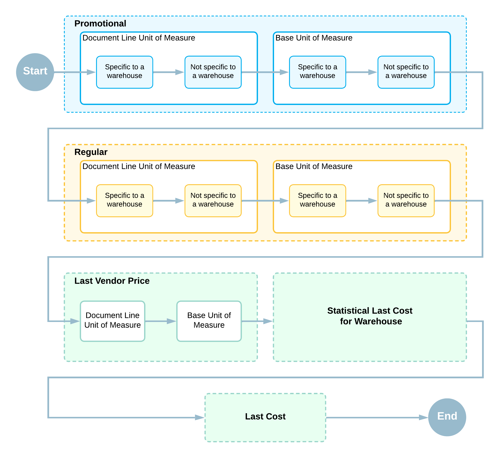

# Vendor Prices: Automatic Price Selection {#_75003a13-2613-4725-b2fe-07c5afe0f1f5 .concept}

In this topic, you will read about automatic price selection in Acumatica ERP.

Multiple prices of different types might be effective for an item at a particular time. When a user selects an item in a document line \(or modifies the item's quantity\), the system searches for an applicable price of the item that is effective on the date of the document. The system bases this search on the price search priority \(highest to lowest\) and stops searching when it finds an applicable price. The search for the item's price proceeds as follows:

1.  The system searches for a promotional price for the item in the following order:
    1.  A price specified for the item with the unit of measure that is selected in the document line. If multiple warehouses are defined in the system, the price specific to the warehouse selected in the document has a higher priority than the price that is not specific to a warehouse.
    2.  A price specified for the item with its base unit of measure. If multiple warehouses are defined in the system, the price specific to the warehouse selected in the document has a higher priority than the price that is not specific to a warehouse.
2.  The system searches for a regular price for the item in the following order:

    1.  A price specified for the item with the unit of measure that is selected in the document line. If multiple warehouses are defined in the system, the price specific to the warehouse selected in the document has a higher priority than the price that is not specific to a warehouse.
    2.  A price specified for the item with its base unit of measure. If multiple warehouses are defined in the system, the price specific to the warehouse selected in the document has a higher priority than the price that is not specific to a warehouse.
    **Tip:** In this chapter, a *regular* vendor price refers to a non-promotional price.

3.  The system searches for a last vendor price for the item in the following order:
    1.  A price specified for the item with the unit of measure that is selected in the document line
    2.  A price specified for the base unit of measure
4.  The system searches for the statistical last cost of the item for the warehouse specified in the document.
5.  The system searches for the last cost of the item.

Once the system finds an applicable price, it stops the search and inserts this price into the document line, but you can override this price. The price search priority is illustrated in the following diagram.

**Parent topic:**[Maintaining Vendor Prices](../UserGuide/Prices_Vendor_Prices_Mapref.md)

