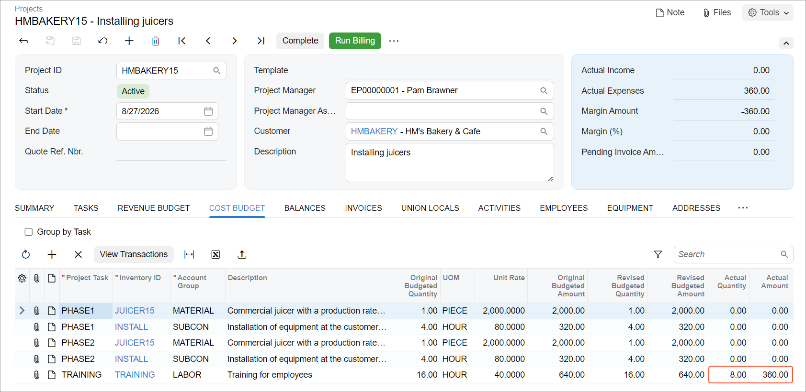

# Project Tasks: To Add a Project Task to a Project {#_91b1ba6c-86ed-42e7-abda-83b72c271e96 .task}

In the following implementation activity, you will learn how to add a project task to an existing project.

**Attention:** This activity is based on the *U100* dataset. If you are using another dataset or if any system settings have been changed in *U100*, these changes can affect the workflow of the activity and the results of the processing. To avoid issues, restore the *U100* dataset to its initial state.

## Story { .section}

Suppose that the SweetLife Fruits &amp; Jams company is managing a project for the HM's Bakery and Cafe customer, which has ordered the installation of two juicers. A project for this work is currently in progress; the installation of the juicers is 75% completed and is supposed to be completed by 1/30/2026.

Further suppose that the customer notifies you that its employees need training on operating the juicers; you need to add a project task for this activity to the project and add to the cost budget a cost budget line related to this task. You want to bill the customer separately for the conducted training, and to close the project task based on the budgeted quantity, which is 16 hours of training, eight of which has been already provided to the employee.

Acting as a SweetLife project accountant, you need to add a new project task for the employee training to the existing project, and specify the settings of the project task. Because the other project tasks are going to be completed soon, you also will set the newly added project task as the default task of the project. Also you need to record the training session that has been already conducted.

## Process Overview { .section}

In this activity, you will add a new project task to the existing project on the [Projects](PM_30_10_00.md) \(PM301000\) form, and specify the standard settings of the project task. Then you will enter specific settings for the project task on the [Project Tasks](PM_30_20_00.md) \(PM302000\) form, and add the task to the project budget. Finally, you will process a transaction on the [Project Transactions](PM_30_40_00.md) \(PM304000\) form to update the cost budget.

## Configuration Overview { .section}

In the *U100* dataset, the following tasks have been performed to support this activity:

-   On the [Enable/Disable Features](CS_10_00_00.md) \(CS100000\) form, the *Projects* feature has been enabled to support the project accounting functionality.
-   On the [Projects](PM_30_10_00.md) \(PM301000\) form, the *HMBAKERY15* project has been created.
-   On the [Project Tasks](PM_30_20_00.md) \(PM302000\) form, the *PHASE1* and *PHASE2* project tasks have been created for the *HMBAKERY15* project. For both tasks, in the **Task Properties** section of the **Summary** tab, **Completed \(%\)**, which represents the completion percentage, is 75%, and the **Start Date** is 1/30/2026.
-   On the [Non-Stock Items](IN_20_20_00.md) \(IN202000\) form, the *TRAINING* non-stock item has been defined.

## System Preparation { .section}

To sign in to the system and prepare to perform the instructions of the activity, do the following:

1.  Launch the Acumatica ERP website, and sign in to a company with the *U100* dataset preloaded; you should sign in as Pam Brawner by using the *brawner* username and the *123* password.
2.  In the info area at the upper-right corner of the top pane of the Acumatica ERP screen, make sure that the business date is set to *1/30/2026*. If a different date is displayed, click the Business Date menu button and select *1/30/2026* from the calendar. For simplicity, you'll create and process all documents in this activity using this business date.

## Step 1: Adding a Project Task to the Project { .section}

To add a new project task to a project, do the following:

1.  On the [Projects](PM_30_10_00.md) \(PM301000\) form, open the *HMBAKERY15* project.
2.  On the **Tasks** tab, add a new row, and specify the following settings in the row:
    -   **Task ID**: *TRAINING*
    -   **Type**: *Cost and Revenue Task*
    -   **Description**: `Employee training`
    -   **Billing Rule**: *TM* \(specified automatically\)
    -   **Status**: *Active*
    -   **Start Date**: 1/30/2026
    -   **Default**: Selected
3.  Save your changes.

## Step 2: Configuring Advanced Settings for the Project Task { .section}

To review the newly added project task and specify advanced settings for it, do the following:

1.  On the [Project Tasks](PM_30_20_00.md) \(PM302000\) form, select *HMBAKERY15* as the **Project ID** and *TRAINING* as the **Task ID**.
2.  On the **Summary** tab, in the **Completion Method** box, select *Budgeted Quantity*.
3.  In the **Billing and Allocation Settings** section, select the **Bill Separately** check box to make the system create a separate invoice for this project task during the billing of the project.
4.  Save your changes.

## Step 3: Adding the Related Cost Budget Line { .section}

To add the costs related to conducting the training to the budget, do the following:

1.  On the [Projects](PM_30_10_00.md) \(PM301000\) form, open the *HMBAKERY15* project.
2.  On the **Cost Budget** tab, add a line with the following settings:
    -   **Project Task**: *TRAINING* \(selected automatically as the default project task\)
    -   **Inventory ID**: *TRAINING*
    -   **Account Group**: *LABOR*
    -   **Description**: `Training for employees`
    -   **Original Budgeted Quantity**: `16`
    -   **UOM**: *HOUR*
    -   **Unit Rate**: `40`
    -   **Auto-Completed \(%\)**: Selected
3.  Save your changes to the project.

You have added a new project task to the project, configured the project task settings, and budgeted the new project task.

## Step 4: Processing a Project Transaction { .section}

To record the provided training, perform the following steps:

1.  On the [Project Transactions](PM_30_40_00.md) \(PM304000\) form, create a new record.
2.  In the Summary area, make sure that *PM* is selected in the **Source** box, and enter `An 8-hour training session` as the **Description**.
3.  On the **Details** tab, add a new line with the following settings:
    -   **Project**: *HMBAKERY15*
    -   **Project Task**: *TRAINING* \(selected automatically as the default project task\)
    -   **Cost Code**: *00-000*
    -   **Account Group**: *LABOR*
    -   **Inventory ID**: *TRAINING*
    -   **UOM**: *HOUR*

        **Attention:** The unit of measure must be the same as the one specified in the cost budget line.

    -   **Quantity**: `8.00`
    -   **Billable**: Selected
    -   **Unit Rate**: `45.00`
4.  Make sure that the **Total Amount** in the Summary area is *360.00*, and save the project transaction.
5.  On the form toolbar, click **Release**.
6.  On the [Projects](PM_30_10_00.md) \(PM301000\) form, open the *HMBAKERY15* project.
7.  On the **Cost Budget** tab, review the cost budget line with the *TRAINING* project task. Notice that **Actual Amount** in this line is now *360.00* and the **Actual Quantity** is *8*, meaning that the project transaction that you have processed has affected the cost budget \(see below\).

    

8.  On the **Tasks** tab, review the **Completed \(%\)** column in the line with the *TRAINING* task, and notice that 50% of the task has been completed.

You have added a new project task to the existing project and processed a transaction that updates the cost budget line with this project task.

**Parent topic:**[Creating Project Tasks](../UserGuide/Project_Tasks_Mapref.md)

