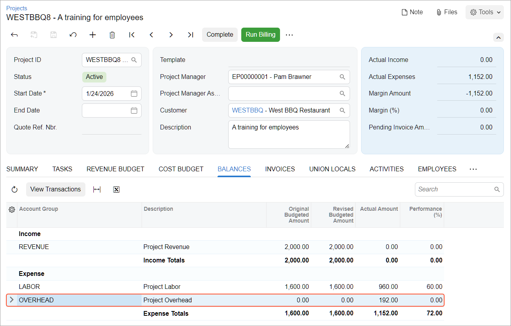

# Overhead in the Project Budget: Process Activity {#_d080755a-1ab3-411d-9fe8-d113c321b13b .task}

In this activity, you will learn how to estimate the project overhead calculated based on the project costs.

**Attention:** This activity is based on the *U100* dataset. If you are using another dataset or if any system settings have been changed in *U100*, these changes can affect the workflow of the activity and the results of the processing. To avoid issues, restore the *U100* dataset to its initial state.

## Story { .section}

Suppose that the West BBQ Restaurant customer ordered 40 hours of new-employee training on operating juicers from the SweetLife Fruits &amp; Jams company. The parties agreed that the project should be billed in the amount of $2,000 when the services were provided.

SweetLife's project manager created a project to account for the provided services. Then suppose that starting from 1/27/2026, a consultant of SweetLife provided three days of training \(24 hours\) and SweetLife's project accountant entered the corresponding project transaction.

Acting as the project accountant, while preparing monthly reports for the project manager, you need to estimate the project costs that have been already incurred considering the administrative overhead, which is 20% of labor costs.

## Configuration Overview { .section}

In the *U100* dataset, the following tasks have been performed to support this activity:

-   For the purposes of this activity, on the [Enable/Disable Features](CS_10_00_00.md) \(CS100000\) form, the *Projects* feature has been enabled to support the project management functionality.
-   On the [Projects](PM_30_10_00.md) \(PM301000\) form, the *WESTBBQ8* project has been created an the *TRAINING* task has been created for the project.
-   On the [Account Groups](PM_20_10_00.md) \(PM201000\) form, the *OVERHEAD* account group has been created.
-   On the [Allocation Rules](PM_20_75_00.md) \(PM207500\) form, the *OVERHEAD* allocation rule has been created. This allocation rule is configured to process project transactions that represent labor expenses and post the overhead that is calculated as 20% of the transaction amount to the *OVERHEAD* account group. \(For an example of allocation rule configuration, see [Overhead in the Project Budget: Implementation Activity](Projects_Allocation_Overhead_Implem_Activity.md).\)
-   On the [Project Transactions](PM_30_40_00.md) \(PM304000\) form, the *PM00000023* batch of project transactions related to the project has been created and released.

## Process Overview { .section}

In this activity, you will first specify the allocation rule for the project task on the [Projects](PM_30_10_00.md) \(PM301000\) form. On the same form, you will then perform allocation for the project.

## System Preparation { .section}

To sign in to the system and prepare to perform the instructions of the activity, do the following:

1.  Launch the Acumatica ERP website, and sign in to a company with the *U100* dataset preloaded; you should sign in as project accountant by using the *brawner* username and the *123* password.
2.  In the info area at the upper-right corner of the top pane of the Acumatica ERP screen, make sure that the business date is set to *1/30/2026*. If a different date is displayed, click the Business Date menu button and select *1/30/2026* from the calendar. For simplicity, you'll create and process all documents in this activity using this business date.

## Step: Capturing Project Overhead { .section}

To set up the project for allocation and capture the project overhead, do the following:

1.  On the [Projects](PM_30_10_00.md) \(PM301000\) form, open the *WESTBBQ8* project.
2.  On the **Tasks** tab, in the line with the *TRAINING* task, select the *OVERHEAD* allocation rule in the **Allocation Rule** column.
3.  Save your changes to the project.

    On the **Balances** tab, notice that there is only one expense line with the *LABOR* account group, and the actual amount is $960.

4.  On the More menu, under **Billing and Allocations**, click **Run Allocation**.

    The system performs the allocation using the allocation rule you have specified for the project task.

    When the allocation is completed, on the **Balances** tab, review the project balance again \(see below\). Notice that one more expense line with the *OVERHEAD* account group has appeared in the table. The actual amount of the line is $192, which is 20% of $960.

    

5.  In the table, click the line with the *OVERHEAD* account group, and on the tab toolbar, click **View Transactions**.

    On the [Project Transaction Details](PM_40_10_00.md) \(PM401000\) form, which opens, review the created allocation transaction in the amount of $192.00 that corresponds to the account group. The original document type of the transaction is *Allocation* and the debit account group is *OVERHEAD*.

You have estimated the project overhead.

**Parent topic:**[Capturing Project Overhead](../UserGuide/Projects_Allocation_Overhead_Mapref.md)

