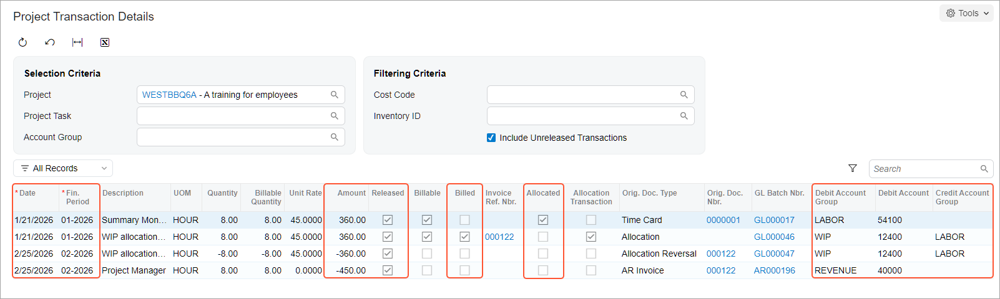

# WIP Labor Costs in Cost-Plus Projects: Process Activity {#_1b50755a-1ab3-461d-9fe8-d113c321b13b .task}

In this activity, you will learn how to temporarily allocate project expenses to a work-in-progress account group and then use the allocation transactions for billing.

**Attention:** This activity is based on the *U100* dataset. If you are using another dataset or if any system settings have been changed in *U100*, these changes can affect the workflow of the activity and the results of the processing. To avoid issues, restore the *U100* dataset to its initial state.

## Story { .section}

Suppose that in January, the West BBQ Restaurant customer ordered training for new employees on the operation of juicers from the SweetLife Fruits &amp; Jams company. The customer didn’t know the exact number of employees or the number of training sessions that would be needed. The SweetLife company agreed with the customer to provide as many training sessions as the customer needed in January and February. Further, both parties agreed that on *2/25/2026*, the customer would pay for all the hours of training sessions that took place.

The project manager of SweetLife created a project for this work. Then suppose that on *1/21/2026*, a consultant of SweetLife provided eight hours of training and logged the time spent by creating and releasing a time card in Acumatica ERP. In February, no additional training sessions were needed.

Acting as SweetLife's project accountant, you need to bill the customer, and you want the project expense incurred in January to be recorded in the same financial period as the project revenue—that is, in February. You will allocate the project expenses and bill the project.

## Configuration Overview { .section}

In the *U100* dataset, the following tasks have been performed to support this activity:

-   On the [Enable/Disable Features](CS_10_00_00.md) \(CS100000\) form, the *Projects* feature has been enabled to support the project management functionality.
-   On the [Projects](PM_30_10_00.md) \(PM301000\) form, the *WESTBBQ6A* project has been created and the *TRAINING* task has been created for the project.
-   On the [Account Groups](PM_20_10_00.md) \(PM201000\) form, the *WIP* and *LABOR* account groups have been created; the *12400 - Work in Progress* account has been mapped to the *WIP* account group.
-   On the [Allocation Rules](PM_20_75_00.md) \(PM207500\) form, the *WIPTM* allocation rule has been created. This allocation rule will be used to allocate project transactions that represent a particular type of expenses to the *12400 - Work in Progress* account.

    **Tip:** For an example of the configuration of an allocation rule see [WIP Labor Costs in Cost-Plus Projects: Implementation Activity](Projects_Allocation_WIP_CP_Implem_Activity.md).

-   On the [Billing Rules](PM_20_70_00.md) \(PM207000\) form, the *WIP* billing rule has been created, which processes the allocated transactions from the *WIP* account group during the project billing.
-   On the [Employee Time Cards](EP_30_50_00.md) \(EP305000\) form, the *0000001* time card, reflecting the work of Pam Brawner on the *WESTBBQ6A* project, has been created. The time card has also been released, and the *PM00000019* batch of project transactions that corresponds to the time card has been created.

## Process Overview { .section}

In this activity, you will first specify the allocation rule and billing rule for the project task on the [Project Tasks](PM_30_20_00.md) \(PM302000\) form. You will review existing project transactions to be allocated on the [Project Transaction Details](PM_40_10_00.md) \(PM401000\) form and then perform allocation for the project on the [Projects](PM_30_10_00.md) \(PM301000\) form. On the same form, you will bill the project and release the AR invoice created as a result of the billing on the [Invoices and Memos](AR_30_10_00.md) \(AR301000\) form. The system will create the reversing allocation transactions that you review on the [Project Transaction Details](PM_40_10_00.md) form.

## System Preparation { .section}

To sign in to the system and prepare to perform the instructions of the activity, do the following:

1.  Launch the Acumatica ERP website, and sign in to a company with the *U100* dataset preloaded; you should sign in as project accountant by using the *brawner* username and the *123* password.
2.  In the info area, in the upper-right corner of the top pane of the Acumatica ERP screen, make sure that the business date in your system is set to *2/25/2026*. If a different date is displayed, click the Business Date menu button, and select *2/25/2026* on the calendar. For simplicity, in this activity, you will create and process all documents in the system during this business date.

## Step 1: Configuring the Project for Allocation and Allocating the Project { .section}

To configure the project for allocation and allocate project transactions, do the following:

1.  On the [Projects](PM_30_10_00.md) \(PM301000\) form, open the *WESTBBQ6A* project, and do the following:
    1.  In the table on the **Tasks** tab, click the *TRAINING* link in the **Task ID** column.

        The system opens the task on the [Project Tasks](PM_30_20_00.md) \(PM302000\) form.

    2.  In the **Billing and Allocation Settings** section on the **Summary** tab, specify the following settings:
        -   **Allocation Rule**: *WIPTM*
        -   **Billing Rule**: *WIP*
        -   **Non-Billable WIP Account Group**: Empty
    3.  Save your changes, close the form, and return to the *WESTBBQ6A* project on the [Projects](PM_30_10_00.md) form.
2.  On the **Cost Budget** tab, click the only line in the table, and on the table toolbar, click **View Transactions**.

    On the [Project Transaction Details](PM_40_10_00.md) \(PM401000\) form, which opens, review the only project transaction, and notice the values in the following columns:

    -   **Orig. Doc. Type**: The value in this column is *Time Card* because the transaction has been created based on the release of the time card created for Pam Brawner for the *WESTBBQ6A* project.
    -   **Fin. Period**: The transaction has been posted to the *01-2026* financial period.
    -   **Debit Account Group**: The transaction has debited the *LABOR* account group.
    -   **Billed**: This check box is cleared, indicating that the transaction hasn’t been billed yet.
    -   **Allocated**: This check box is cleared, indicating that the transaction hasn’t been allocated yet.
3.  Close the form and return to the *WESTBBQ6A* project on the [Projects](PM_30_10_00.md) form.
4.  On the **Balances** tab, review the project balance. Notice that the actual amount of the project expenses \($360\) is currently posted to the *LABOR* account group.
5.  On the More menu, under **Billing and Allocations**, click **Run Allocation** to perform the allocation for the selected project.

    When the allocation is completed, on the **Balances** tab, review the project balance again. Notice that the actual amount of the project expenses has been moved from the *LABOR* account group to the *WIP* account group.

6.  On the **Cost Budget** tab, click the only line in the table, and on the table toolbar, click **View Transactions**.

    On the [Project Transaction Details](PM_40_10_00.md) \(PM401000\) form, which opens, notice that the second transaction has appeared. Review the transactions, noticing the values in the following columns:

    -   **Orig. Doc. Type**: The value in this column is *Allocation* for the new transaction, which means the transaction is an allocation transaction.
    -   **Date**: The date of the allocation transaction is the same as the date of the original transaction. Thus, the allocation transaction has been posted to *01-2026*, which is the same financial period to which the original transaction was posted.
    -   **Debit Account Group**: The allocation transaction has debited the *WIP* account group.
    -   **Credit Account Group**: The allocation transaction has credited the *LABOR* account group, which is the debit account group of the original transaction.
    -   **Billed**: This check box is cleared, indicating that the allocation transaction hasn’t been billed yet \(as is the case with the original transaction\).
    -   **Allocated**: This check box is selected for the original transaction with the *Time Card* original document type, indicating that the transaction has been used as the source for allocation.
7.  Close the form and return to the *WESTBBQ6A* project on the [Projects](PM_30_10_00.md) form.

## Step 2: Billing the Project { .section}

To bill the project, do the following:

1.  While you are still reviewing the *WESTBBQ6A* project on the [Projects](PM_30_10_00.md) \(PM301000\) form, click **Run Billing** on the form toolbar.

    The system creates an AR invoice and opens it on the [Invoices and Memos](AR_30_10_00.md) \(AR301000\) form.

2.  In the Summary area of the form, make sure that the **Date** of the invoice is *2/25/2026*, which is the current business date, and that the **Post Period** is *02-2026*.
3.  On the form toolbar, click **Remove Hold** to assign the invoice the *Balanced* status, and then click **Release** to release the AR invoice.
4.  Open the [Project Transaction Details](PM_40_10_00.md) \(PM401000\) form; in the Selection area, select *WESTBBQ6A* in the **Project** box, and make sure the other boxes are cleared.

    In the table, notice that two new transactions have been created \(see below\).

    

    Review the transactions, noticing the values in the following columns:

    -   **Orig. Doc. Type**: The values in this column are *Allocation Reversal* and *Invoice* for the new transactions, which means that the first one is a reversing transaction for the allocation transaction, and the second one originates from the released invoice.
    -   **Date**: The date of the new transactions is the invoice date. Thus, the transactions have been posted to the *02-2026* financial period.
    -   **Debit Account Group**: The transaction with the *Allocation Reversal* original document type has cleared the *WIP* account group \(debited the account group with an opposite amount\) and debited the *LABOR* account group. This reversing allocation transaction, which moved the expenses back to the original account group, was created on release of the AR invoice, based on the **Reverse Allocation** setting of the allocation rule on the **Allocation Settings** tab of the [Allocation Rules](PM_20_75_00.md) \(PM207500\) form.

        The transaction with the *Invoice* original document type has debited the *REVENUE* account group with the amount calculated with the billing rule of the project task.

    -   **Released**: This check box is selected for all the transactions, including the transaction with the *Allocation Reversal* original document type, indicating that all the transactions have been released.
    -   **Billed**: This check box is selected for the transaction with the *Allocation* original document type, indicating that the allocation transaction has been used in billing.
5.  On the [Projects](PM_30_10_00.md) form, open the *WESTBBQ6A* project, and on the **Balances** tab, review the project balance. Notice that the actual amount of project expenses \($360\) has been moved back from the *WIP* account group to the *LABOR* account group. The actual amount of the *REVENUE* account group has been updated and is now $450.

You have allocated project expenses to a work-in-progress account group and then performed billing based on the allocation transactions.

**Parent topic:**[Accounting for WIP Labor Costs in Cost-Plus Projects](../UserGuide/Projects_Allocation_WIP_CP_Mapref.md)

