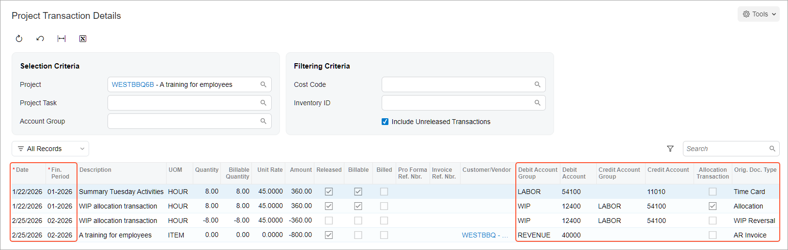

# WIP Labor Costs in Fixed-Price Projects: Process Activity {#_6b50755a-1ab3-411d-9fe8-d113c321b13b .task}

In this activity, you will learn how to temporarily allocate project expenses to a work-in-progress account group and bill the project without using allocation transactions as a basis for billing.

**Attention:** This activity is based on the *U100* dataset. If you are using another dataset or if any system settings have been changed in *U100*, these changes can affect the workflow of the activity and the results of the processing. To avoid issues, restore the *U100* dataset to its initial state.

## Story { .section}

Suppose that in January, the West BBQ Restaurant customer ordered training on operating juicers for 10 employees from the SweetLife Fruits &amp; Jams company. The parties were not able to determine how many training sessions would be needed for the employees to master the use of the juicers. The SweetLife company agreed with the customer to provide as many training sessions as the customer needed in January and February, and that *2/25/2026*, the customer would pay $80 for each employee who attended these training sessions.

SweetLife's project manager has created a project for this work. Then suppose that *1/21/2026*, a consultant of SweetLife provided eight hours of training and logged the time spent by creating and releasing a time card in Acumatica ERP. All 10 of the customer's employees attended that training session, and no more training sessions were needed in February.

Acting as SweetLife's project accountant, you need to bill the customer, and you want the project expense incurred in January to be recorded in the same financial period as the project revenue—that is, in February. You will allocate the project expenses and bill the project.

## Configuration Overview { .section}

In the *U100* dataset, the following tasks have been performed to support this activity:

-   On the [Enable/Disable Features](CS_10_00_00.md) \(CS100000\) form, the *Projects* feature has been enabled to support the project management functionality.
-   On the [Projects](PM_30_10_00.md) \(PM301000\) form, the *WESTBBQ6B* project has been created and the *TRAINING* task has been created for the project.
-   On the [Account Groups](PM_20_10_00.md) \(PM201000\) form, the *WIP* and *LABOR* account groups have been created; also, the *12400 - Work in Progress* account has been mapped to the *WIP* account group.
-   On the [Allocation Rules](PM_20_75_00.md) \(PM207500\) form, the *WIPPROGRESS* allocation rule has been created. This allocation rule will be used to allocate project transactions that represent a particular type of expenses to the *WIP* account group.

    **Tip:** For an example of allocation rule configuration, see [WIP Labor Costs in Fixed-Price Projects: Implementation Activity](Projects_Allocation_WIP_FP_Implem_Activity.md).

-   On the [Billing Rules](PM_20_70_00.md) \(PM207000\) form, the *PROGRESS* billing rule has been created. The billing rule has been configured for progress billing and has been assigned to the *TRAINING* task of the *WESTBBQ6B* project.
-   On the [Employee Time Cards](EP_30_50_00.md) \(EP305000\) form, the *0000001* time card, reflecting the work of Pam Brawner on the *WESTBBQ6B* project, has been created. The time card has been also released and the *PM00000019* batch of project transactions that corresponds to the time card has been created.

## Process Overview { .section}

In this activity, you will first specify the allocation rule, the billing rule, and the non-billable WIP account group for the project task on the [Project Tasks](PM_30_20_00.md) \(PM302000\) form. You will review existing project transactions to be allocated on the [Project Transaction Details](PM_40_10_00.md) \(PM401000\) form and then perform allocation for the project on the [Projects](PM_30_10_00.md) \(PM301000\) form. On the same form, you will bill the project and release the AR invoice created as a result of the billing on the [Invoices and Memos](AR_30_10_00.md) \(AR301000\) form. The system will create the reversing allocation transactions that you review on the [Project Transaction Details](PM_40_10_00.md) form and release on the [Project Transactions](PM_30_40_00.md) \(PM304000\) form.

## System Preparation { .section}

To sign in to the system and prepare to perform the instructions of the activity, do the following:

1.  Launch the Acumatica ERP website, and sign in to a company with the *U100* dataset preloaded; you should sign in as project accountant by using the *brawner* username and the *123* password.
2.  In the info area, in the upper-right corner of the top pane of the Acumatica ERP screen, make sure that the business date in your system is set to *2/25/2026*. If a different date is displayed, click the Business Date menu button, and select *2/25/2026* on the calendar. For simplicity, in this activity, you will create and process all documents in the system during this business date.

## Step 1: Configuring the Project for Allocation and Allocating the Project { .section}

To configure the project for allocation and allocate project transactions, do the following:

1.  On the [Projects](PM_30_10_00.md) \(PM301000\) form, open the *WESTBBQ6B* project and do the following:
    1.  In the table on the **Tasks** tab, click the *TRAINING* link in the **Task ID** column.

        The system opens the project task on the [Project Tasks](PM_30_20_00.md) \(PM302000\) form.

    2.  In the **Billing and Allocation Settings** section on the **Summary** tab, specify the following settings.

        -   **Allocation Rule**: *WIPPROGRESS*
        -   **Non-Billable WIP Account Group**: *WIP*
        Notice that the *PROGRESS* billing rule is selected in the **Billing Rule**. You do not need to change the progress billing rule because the allocation transactions are not used in the billing of fixed-price projects.

    3.  On the form toolbar, click **Save** to save your changes to the project task settings and close the form.
2.  On the [Project Transaction Details](PM_40_10_00.md) \(PM401000\) form, in the Selection area, select *WESTBBQ6B* in the **Project** box.

    In the table, review the only project transaction and notice the values in the following columns:

    -   **Fin. Period**: The transaction has been posted to the 01-2026 financial period.
    -   **Debit Account Group**: The transaction has debited the *LABOR* account group.
    -   **Allocated**: This check box is cleared, indicating that the transaction has not been allocated.
    -   **Orig. Doc. Type**: The value in this column is *Time Card* because the transaction has been created based on the release of the time card created for Pam Brawner for the *WESTBBQ6B* project.
    -   **Billed**: This check box is cleared, indicating that the transaction has not been billed.
3.  On the [Projects](PM_30_10_00.md) form, open the *WESTBBQ6B* project.

    On the **Balances** tab, review the project balance. Notice that the actual amount of project expenses \($360\) is posted to the *LABOR* account group.

4.  On the More menu, under **Billing and Allocations**, click **Run Allocation** to perform the allocation for the selected project.

    When the allocation is completed, on the **Balances** tab, review the project balance again. Notice that the actual amount of project expenses has been moved from the *LABOR* account group to the *WIP* account group.

5.  On the [Project Transaction Details](PM_40_10_00.md) form, in the Summary area, make sure *WESTBBQ6B* is selected in the **Project** box.

    In the table, notice that a new transaction has appeared. Review the transaction, noticing the values in the following columns:

    -   **Date**: The date of the allocation transaction is the same as the date of the original transaction. Thus, the allocation transaction has been posted to 01-2026, which is the same financial period to which the original transaction was posted.
    -   **Debit Account Group**: The allocation transaction has debited the *WIP* account group.
    -   **Credit Account Group**: The allocation transaction has credited the *LABOR* account group, which is the debit account group of the original transaction.
    -   **Allocated**: This check box is now selected for the original transaction with the *Time Card* original document type, indicating that the transaction has been used as the source for allocation. For the allocation transaction, the check box is cleared.
    -   **Orig. Doc. Type**: The value in this column is *Allocation* for the new transaction, which means the transaction is an allocation transaction.
    -   **Billed**: This check box is cleared, indicating that the allocation transaction has not been billed yet along with the original transaction.

## Step 2: Billing the Project { .section}

To update the progress of project completion and bill the project in an amount that corresponds to the progress, do the following:

1.  On the [Projects](PM_30_10_00.md) \(PM301000\) form, open the *WESTBBQ6B* project.
2.  On the **Revenue Budget** tab, specify `100.00` in the **Completed \(%\)** column of the revenue budget line. That is, the project has been entirely completed.

    Notice that the system calculates the **Pending Invoice Amount** in the row \($800\).

3.  On the form toolbar, click **Save** to your changes to the project, and then click **Run Billing**.

    The system creates an AR invoice and opens it on the [Invoices and Memos](AR_30_10_00.md) \(AR301000\) form.

4.  In the Summary area of the form, make sure that the **Date** of the invoice is *2/25/2026*, which is the current business date, and that the **Post Period** is *02-2026*.
5.  On the form toolbar, click **Remove Hold** to assign the accounts receivable invoice the *Balanced* status, and then click **Release** to release the AR invoice.
6.  Open the [Project Transaction Details](PM_40_10_00.md) \(PM401000\) form, and in the Selection area, select *WESTBBQ6B* in the **Project** box.

    In the table, notice that two new transactions have been created, as shown below.

    

    Review the transactions, noticing the values in the following columns.

    -   **Orig. Doc. Type**: The value in this column is *WIP Reversal* and *AR Invoice* for the new transactions, which means that the first one is a reversing transaction and the second one originates from the released invoice.
    -   **Date**: The date of the new transactions is the invoice date. Thus, the transactions have been posted to the *02-2026* financial period.
    -   **Debit Account Group**: The transaction with the *WIP Reversal* original document type has cleared the *WIP* account group \(debited the account group with an opposite amount\) and the *LABOR* account group \(credited the account group with an opposite amount\)\). This reversing transaction was created on project billing to clear the WIP account group selected for the project task.

        The transaction with the *AR Invoice* original document type has debited the *REVENUE* account group with the amount calculated with the billing rule of the project task. The transaction was created on release of the AR invoice.

    -   **Billed**: This check box is cleared for all the transactions, including the original and the allocation transactions, indicating that the transactions have not been used in billing because you have billed the project for progress.
    -   **Released**: This check box is cleared for the reversing transaction with the *WIP Reversal* original document type, indicating that it has not been released yet.
7.  Release the reversing allocation transaction as follows:
    1.  In the table, in the row with the *WIP Reversal* original document type, click the link in the **Ref. Number** column to open the project transaction.
    2.  On the form toolbar of the [Project Transactions](PM_30_40_00.md) \(PM304000\) form, which opens, click **Release**. The system releases the project transaction.
8.  On the [Projects](PM_30_10_00.md) form, open the *WESTBBQ6B* project, and on the **Balances** tab, review the project balance. Notice that the actual amount of project expenses \($360\) has been moved back from the *WIP* account group to the *LABOR* account group. The actual amount of the *REVENUE* account group has been updated.

**Parent topic:**[Accounting for WIP Labor Costs in Fixed-Price Projects](../UserGuide/Projects_Allocation_WIP_FP_Mapref.md)

