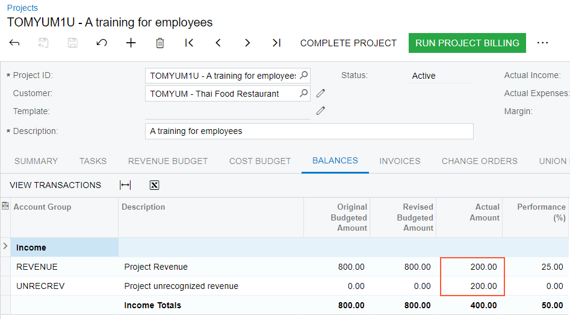

# Progress Billing: To Bill a Project for Unrecognized Revenue {#_9d5289cb-e6e0-4f7e-b921-ce58861ee1a7 .task}

This activity will walk you through the process of billing a project for unrecognized revenue and then recognizing this revenue in the project budget.

**Attention:** This activity is based on the *U100* dataset. If you are using another dataset or if any system settings have been changed in *U100*, these changes can affect the workflow of the activity and the results of the processing. To avoid issues, restore the *U100* dataset to its initial state.

## Story { .section}

Suppose that the Thai Food Restaurant customer has ordered 16 hours of training of the company's employees on operating a juicer. Two training sessions of eight hours each have been planned and budgeted.

According to the business requirements of the SweetLife company, the revenue for the project should be recognized when AR invoices are issued to the customer. The SweetLife project accountant has created a project to handle the tracking and billing of the provided services and has defined a billing rule so that the unrecognized revenue is temporarily stored in a separate project budget line.

Acting as the project accountant, you need to update the progress of the project and prepare a pro forma invoice for the customer for the first stage of the project so that the customer can review and agree upon the amounts. Later, when the customer agrees to the terms of the provided pro forma invoice and a part of the training \(four hours of the first training session\) has been conducted, you need to recognize the revenue and record the actual values in the project budget.

## Configuration Overview { .section}

In the *U100* dataset, the following tasks have been performed to support this activity:

-   On the [Enable/Disable Features](CS_10_00_00.md) \(CS100000\) form, the *Projects* feature has been enabled.
-   On the [Account Groups](PM_20_10_00.md) \(PM201000\) form, the *UNRECREV* account group of the *Income* type has been created.
-   On the [Chart of Accounts](GL_20_25_00.md) \(GL202500\) form, the *21050 – Project unrecognized revenue* account has been created and associated with the *UNRECREV* account group.
-   On the [Billing Rules](PM_20_70_00.md) \(PM207000\) form, the *UNRECREV* billing rule has been created. In the billing rule, **Use Sales Account From** is set to *Project*.
-   On the [Allocation Rules](PM_20_75_00.md) \(PM207500\) form, the *REVREC* allocation rule with the *Allocate Budget* allocation method has been configured.
-   On the [Customers](AR_30_30_00.md) \(AR303000\) form, the *TOMYUM* customer has been defined.
-   On the [Projects](PM_30_10_00.md) \(PM301000\) form, the *TOMYUM1U* project has been created for this customer, and two project tasks \(*PHASE1* and *PHASE2*\) have been added. The *UNRECREV* billing rule and the *REVREC* allocation rule have been assigned to both project tasks. Also, on the **Summary** tab, the **Create Pro Forma Invoice on Billing** check box has been selected, indicating that a pro forma invoice is created when the project is billed. On the **Defaults** tab, the **Default Sales Account** is set to *21050 – Project unrecognized revenue*.

## Process Overview { .section}

You will update the progress of the project on the [Projects](PM_30_10_00.md) \(PM301000\) form and run the project billing. You will review the created pro forma invoice and release it on the [Pro Forma Invoices](PM_30_70_00.md) \(PM307000\) form. On the [Invoices and Memos](AR_30_10_00.md) \(AR301000\) form, you will review the prepared accounts receivable invoice and release the invoice. Then on the [Projects](PM_30_10_00.md) \(PM301000\) form, you will review how the unrecognized revenue has been recorded in the project budget. Finally, you will run the allocation rule and review how the revenue is recognized in the project budget.

## System Preparation { .section}

To sign in to the system and prepare to perform the instructions of the activity, do the following:

1.  Launch the Acumatica ERP website, and sign in to a company with the *U100* dataset preloaded; you should sign in as Pam Brawner by using the *brawner* username and the *123* password.
2.  In the info area at the upper-right corner of the top pane of the Acumatica ERP screen, make sure that the business date is set to *1/30/2026*. If a different date is displayed, click the Business Date menu button and select *1/30/2026* from the calendar. For simplicity, you'll create and process all documents in this activity using this business date.

## Step 1: Billing for Unrecognized Revenue { .section}

To update the progress of project completion and bill the project, do the following:

1.  On the [Projects](PM_30_10_00.md) \(PM301000\) form, open the *TOMYUM1U* project.
2.  On the **Revenue Budget** tab, in the revenue budget line with the *PHASE1* project task, specify `400` as the **Pending Invoice Amount**.
3.  Save your changes to the project
4.  On the form toolbar, click **Run Billing**. The system creates a pro forma invoice and opens it on the [Pro Forma Invoices](PM_30_70_00.md) \(PM307000\) form. Review the detail lines of the invoice on the **Progress Billing** tab, and notice the following:
    -   **Amount to Invoice** in the only line is equal to **Pending Invoice Amount** for the corresponding revenue budget line of the *TOMYUM1U* project on the **Revenue Budget** tab of the [Projects](PM_30_10_00.md) form.
    -   In the **Sales Account** column of this line, *21050* is specified. This is the account for recording unrecognized project revenue that the system has copied from the settings of the project task.
5.  On the form toolbar, click **Remove Hold** to assign the pro forma invoice the *Open* status, and then click **Release** to release the pro forma invoice. The system creates the accounts receivable invoice based on the pro forma invoice and assigns the *Closed* status to the pro forma invoice.
6.  On the [Projects](PM_30_10_00.md) \(PM301000\) form, again open the *TOMYUM1U* project. On the **Revenue Budget** tab, notice the following:
    -   **Pending Invoice Amount** in the line with the *PHASE1* task and *REVENUE* account group has become zero. **Draft Invoice Amount** and **Actual Amount** are zero as well. That is, the pending amount has been billed, but has not yet been recorded to this revenue budget line.
    -   A new line with the *PHASE1* task and *UNRECREV* account group has appeared in the project revenue budget. This line temporarily stores the unrecognized revenue. The **Draft Invoice Amount** column shows the amount that has been billed \($400\).
7.  On the **Invoices** tab, click the link in the **AR Reference Nbr.** column of the only line to open the accounts receivable invoice that was created on the [Invoices and Memos](AR_30_10_00.md) \(AR301000\) form.
8.  On the form toolbar of the [Invoices and Memos](AR_30_10_00.md) form, click **Remove Hold** to assign the invoice the *Balanced* status, and then click **Release** to release the accounts receivable invoice.
9.  On the [Projects](PM_30_10_00.md) form, open the *TOMYUM1U* project, and on the **Balances** tab, review the amounts in the budget lines that have been updated as a result of the billing. **Actual Amount** for the *UNRECREV* account group is now $400.

## Step 2: Recording Revenue to the Project Budget { .section}

To recognize the revenue, while you are still reviewing the *TOMYUM1U* project on the [Projects](PM_30_10_00.md) \(PM301000\) form, do the following:

1.  On the **Tasks** tab, in the line with the *PHASE1* project task, specify `50` in the **Completed %** column.
2.  Save your changes to the project.
3.  On the More menu, click **Run Allocation**.
4.  On the **Balances** tab, review the project budget and notice that an actual amount of *200.00* is now shown for the line with the *REVENUE* account group \(see the following screenshot\). The recognized part of the revenue has been recorded to the project budget.

    

5.  On the [Project Transaction Details](PM_40_10_00.md) \(PM401000\) form, in the Selection area, select *TOMYUM1U* in the **Project** box, and make sure the **Account Group** and **Project Task** boxes are empty.
6.  In the table, review the first project transaction line \(which has *AR* specified in the **Module** column\). Notice the values in the following columns:
    -   **Orig. Doc. Type**: *Invoice* is specified because the transaction has been created on release of the AR invoice.
    -   **Debit Account Group**: The transaction has debited the *UNRECREV* accrual account group.
    -   **Debit Account**: The transaction has debited the accrual account.
    -   **Amount**: The amount of the transaction is *–400.00* because the transaction debits the account of the liability type.
7.  Review the second project transaction line \(which has *PM* specified in the **Module** column\). Notice the values in the following columns:
    -   **Orig. Doc. Type**: *Allocation* is specified because this transaction has been created by the allocation procedure.
    -   **Debit Account Group**: The allocation transaction has debited the *UNRECREV* accrual account group.
    -   **Debit Account**: The allocation transaction has debited the accrual account to clear the part of the unrecognized revenue.
    -   **Credit Account Group**: The allocation transaction has credited the *REVENUE* account group, which is the debit account group of the original transaction.
    -   **Credit Account**: The allocation transaction has credited the sales account to record the recognized part of the revenue to the project budget.
    -   **Amount**: The amount of the allocation transaction is *200.00*. This is the recognized part of the revenue.

You have finished billing the project and recording the revenue to project budget.

**Parent topic:**[Billing Projects by Progress](../UserGuide/Projects_Billing_Project_by_Progress_Mapref.md)

