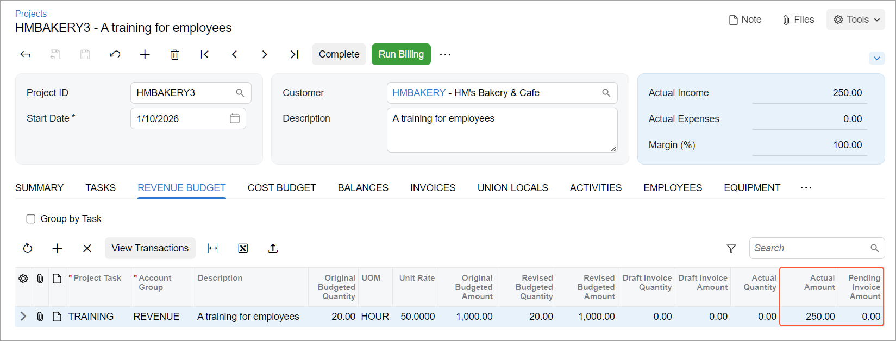

# Progress Billing: To Bill a Project by Progress {#_c53c0b58-16c1-4385-a86e-d9cecd34d4c0 .task}

This activity will walk you through the process of billing a project by its progress.

**Attention:** This activity is based on the *U100* dataset. If you are using another dataset or if any system settings have been changed in *U100*, these changes can affect the workflow of the activity and the results of the processing. To avoid issues, restore the *U100* dataset to its initial state.

## Story { .section}

Suppose that the HM's Bakery and Cafe customer has ordered 20 hours of new-employee training on operating juicers from the SweetLife Fruits &amp; Jams company. SweetLife's project accountant has created a project to handle the tracking and billing of the provided services; the project should be billed on demand as the services are provided. Before each invoice is sent to the customer for payment, the customer has requested that a pro forma invoice be submitted for acceptance.

Then suppose that on *1/30/2026*, SweetLife's consultant has provided five hours of the training. As the project accountant, you need to update the progress of the project and bill the customer for the provided training.

## Configuration Overview { .section}

In the *U100* dataset, the following tasks have been performed to support this activity:

-   On the [Enable/Disable Features](CS_10_00_00.md) \(CS100000\) form, the *Projects* feature has been enabled to support the project management functionality.
-   On the [Billing Rules](PM_20_70_00.md) \(PM207000\) form, the *PROGRESS* billing rule has been configured.
-   On the [Customers](AR_30_30_00.md) \(AR303000\) form, the *HMBAKERY* customer has been created.
-   On the [Projects](PM_30_10_00.md) \(PM301000\) form, the *HMBAKERY3* project has been created. On the **Tasks** tab, the *TRAINING* project task has been added, and the *PROGRESS* billing rule is specified for this task. Also, on the **Summary** tab, the **Create Pro Forma Invoice on Billing** check box is selected, indicating that a pro forma invoice is created when the project is billed, and the **Billing Period** is set to *On Demand*.

## Process Overview { .section}

You will update the progress of the project on the [Projects](PM_30_10_00.md) \(PM301000\) form to indicate that services have been provided partially. Then you will run project billing and review the prepared pro forma invoice on the [Pro Forma Invoices](PM_30_70_00.md) \(PM307000\) form. After that, you will release the pro forma invoice, which causes the corresponding accounts receivable invoice to be created. After you review and release the AR invoice on the [Invoices and Memos](AR_30_10_00.md) \(AR301000\) form, you will review the project and make sure that the project balances have been updated.

## System Preparation { .section}

To sign in to the system and prepare to perform the instructions of the activity, do the following:

1.  Launch the Acumatica ERP website, and sign in to a company with the *U100* dataset preloaded; you should sign in as project accountant by using the *brawner* username and the *123* password.
2.  In the info area at the upper-right corner of the top pane of the Acumatica ERP screen, make sure that the business date is set to *1/30/2026*. If a different date is displayed, click the Business Date menu button and select *1/30/2026* from the calendar. For simplicity, you'll create and process all documents in this activity using this business date.

## Step 1: To Run Project Billing { .section}

To update the progress of project completion and bill the project in an amount corresponding to the progress, do the following:

1.  On the [Projects](PM_30_10_00.md) \(PM301000\) form, open the *HMBAKERY3* project.
2.  On the **Revenue Budget** tab, specify `25` as the **Completed \(%\)** in the only revenue budget line to indicate that 25 percent of the project task has been completed \(5 hours of 20\). The system calculates the **Pending Invoice Amount** as $250. Because the project has a nonzero **Pending Invoice Amount** in the revenue budget line, you can now bill the project.
3.  Save your changes to the project.
4.  On the form toolbar, click **Run Billing**.

    The system creates a pro forma invoice and opens it on the [Pro Forma Invoices](PM_30_70_00.md) \(PM307000\) form.

## Step 2: To Process a Pro Forma Invoice and the Corresponding AR Invoice { .section}

To process the pro forma invoice, while you are still viewing the prepared pro forma invoice on the [Pro Forma Invoices](PM_30_70_00.md) \(PM307000\) form, do the following:

1.  On the **Progress Billing** tab, review the only line. The system has added this line based on the corresponding revenue budget line of the project on the [Projects](PM_30_10_00.md) form \(PM301000\) that has been billed by its progress. The **Amount to Invoice** in the only progress billing line and the **Progress Billing Total** on the Summary area of the invoice is $250.
2.  On the form toolbar, click **Remove Hold** to assign the pro forma invoice the *Open* status, and then click **Release**. The system closes the pro forma invoice \(and assigns it the *Closed* status\), and creates a corresponding accounts receivable invoice based on the pro forma invoice.
3.  On the **Financial** tab, click the **AR Ref. Nbr.** link to open the accounts receivable invoice that has been created on the [Invoices and Memos](AR_30_10_00.md) \(AR301000\) form.
4.  On the form toolbar, click **Remove Hold** to assign the accounts receivable invoice the *Balanced* status, and then click **Release**.

## Step 3: To Review the Updated Project Details { .section}

To review how the project billing has affected the project budget, do the following:

1.  On the [Projects](PM_30_10_00.md) form, open the *HMBAKERY3* project.
2.  On the **Revenue Budget** tab, review the only revenue budget line. Notice that the **Pending Invoice Amount** is now 0, and the **Actual Amount** is $250 \(see below\). Also notice that **Actual Income** in the Summary area has been updated and is now $250.

    

You have billed the project by its progress.

**Parent topic:**[Billing Projects by Progress](../UserGuide/Projects_Billing_Project_by_Progress_Mapref.md)

