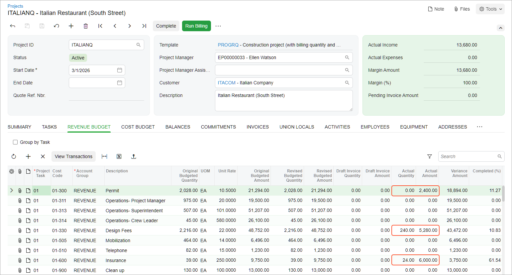

# Progress Billing: To Bill a Project by Quantity and Amount {#_f0740aad-d4cd-4d46-b9ea-dc4d4aee0cf0 .task}

This activity will walk you through the process of performing progress billing for a project based on the pending amounts and quantities.

**Attention:** This activity is based on the *U100* dataset. If you are using another dataset or if any system settings have been changed in *U100*, these changes can affect the workflow of the activity and the results of the processing. To avoid issues, restore the *U100* dataset to its initial state.

## Story { .section}

Suppose that ToadGreen Building Group, a general contractor, is building an Italian restaurant for its customer, the Italian Company. A ToadGreen manager has agreed upon a budget with the customer and decided that the project manager will bill the customer monthly based on the progress of work for each project task during the billing period. The work on the project starts on March 1, 2026.

At the start of the project, the construction project manager made sure that the construction permit was promptly obtained for the construction site, the design plans and specifications were prepared and agreed upon, and the documents for construction insurance have been prepared. Then the construction project manager will bill the customer for the performed work. The customer should be billed as follows:

-   In the amount of $4800 for the work related to obtaining construction permits
-   For 240 working hours spent on preparing design plans
-   For 24 working hours spent on preparing documents for construction insurance

Acting as a system administrator, you need to create the new project and make sure that billing settings are specified correctly for the project. Then acting as a construction project manager, you need to record the current progress of the project and perform billing for the first billing period.

## Configuration Overview { .section}

In the *U100* dataset, the following tasks have been performed to support this activity:

-   On the [Enable/Disable Features](CS_10_00_00.md) \(CS100000\) form, the *Projects* and *Construction* features have been enabled.
-   On the [Customers](AR_30_30_00.md#) \(AR303000\) form, the *ITACOM* customer has been created.
-   On the [Billing Rules](PM_20_70_00.md) \(PM207000\) form, the *PROGRESS* billing rule has been defined. This rule is defined to gradually bill the projects at a fixed contract amount based on the progress of performed work.
-   On the [Project Templates](PM_20_80_00.md) \(PM208000\) form, the *PROGRQ* project template has been configured with multiple project template tasks, revenue budget lines, and cost budget lines.

## Process Overview { .section}

Acting as a system administrator, on the [Projects](PM_30_10_00.md) \(PM301000\) form, you will create a new project based on a project template and review the billing settings that apply to particular revenue budget lines. Then acting as a construction project manager, you will specify the pending invoice amounts and quantities on the [Projects](PM_30_10_00.md#) \(PM301000\) form to indicate the project's progress and run the project billing. On the [Invoices and Memos](AR_30_10_00.md) \(AR301000\) form, you will review and release the prepared AR invoice. Finally, you will review the project budget again and make sure that the project balances have been updated with the actual values.

## System Preparation { .section}

To prepare to perform the instructions of this activity, do the following:

1.  Launch the Acumatica ERP website, and sign in to a company with the *U100* dataset preloaded. You should sign in as a system administrator by using the *gibbs* username and the *123* password.
2.  In the info area, in the upper-right corner of the top pane of the Acumatica ERP screen, make sure that the business date in your system is set to *3/1/2026*. If a different date is displayed, click the Business Date menu button, and select *3/1/2026* on the calendar. For simplicity, in this activity, you will create and process all documents in the system on this business date.

## Step 1: Creating a Project and Specifying Its General Settings { .section}

To create a new project and specify the basic settings for it, do the following:

1.  On the [Projects](PM_30_10_00.md) \(PM301000\) form, create a new record.
2.  In the Summary area, specify the following settings:
    -   **Project ID**: `ITALIANQ`
    -   **Start Date**: *3/1/2026*
    -   **Customer**: *ITACOM*
    -   **Template**: *PROGRQ*
    -   **Description**: `Italian Restaurant (South Street)`
3.  On the **Summary** tab, make sure the following settings are specified:
    -   **Billing Period**: *On Demand*
    -   **Create Pro Forma Invoice on Billing**: Cleared

        You are clearing this check box because you want to create accounts receivable invoices when you bill the project without the preliminary creation of pro forma invoices.

4.  In the **Branch** box, specify *TBGROUP*.
5.  Save your changes to the project.
6.  On the **Tasks** tab, make sure that the *PROGRESS* billing rule is assigned to each task. This means that the project will be billed based on the progress that you will specify in the revenue budget lines.
7.  On the table toolbar, click **Activate Tasks** to activate the project tasks.
8.  On the **Revenue Budget** tab, make sure that multiple budget lines have been added based on the project template. Also, in the **Progress Billing Basis** column, notice that the revenue budget has mixed settings. That is, some lines will be billed based on the pending amount and other lines will be billed based on the pending quantity.
9.  Save your changes to the project. In the Summary area, notice that it has the *In Planning* status.
10. On the form toolbar, click **Activate** to activate the project.

## Step 2: Billing the Project Based on Progress { .section}

To perform progress billing by quantity and amount, while reviewing the project on the [Projects](PM_30_10_00.md#) \(PM301000\) form, do the following:

1.  On the **Revenue Budget** tab, in the line of the table with the *01-300* cost code and the *Permit* description, enter `2400` in the **Pending Invoice Amount** column.
2.  In the line with the *01-330* cost code and the *Design Fees* description, enter `240` in the **Pending Invoice Quantity** column. The system calculates the line's pending invoice amount to be *5,280* based on this quantity and the unit rate specified in the line.
3.  In the line with the *01-600* cost code and the *Insurance* description, enter `24` in the **Pending Invoice Quantity** column. The system calculates the line's pending invoice amount to be *6,000*.
4.  In the Summary area, make sure that the **Pending Invoice Amount** is *13,680.00*, and save your changes.
5.  On the form toolbar, click **Run Billing** to bill the project. The system prepares an AR invoice and opens it on the [Invoices and Memos](AR_30_10_00.md#) \(AR301000\) form.

    The AR invoice includes three lines on the **Details** tab. The first line was billed based on amount, so the quantity in this line is *0*, and the **Ext. Price** column shows the **Pending Invoice Amount** copied from the respective revenue budget line. In the second and third lines, the **Quantity** column shows the **Pending Invoice Quantity** copied from the respective revenue budget line, and the **Ext. Price** for each line is calculated as the unit price in this line multiplied by the quantity.

6.  On the form toolbar, click **Remove Hold** to assign the accounts receivable invoice the *Balanced* status.
7.  On the form toolbar, click **Release** to release the invoice.
8.  On the [Projects](PM_30_10_00.md) form, open the *ITALIANQ* project, and on the **Revenue Budget** tab, review the actual values in the budget lines that have been updated as the result of the billing \(see below\).

    

You have finished billing the project's progress based on the quantities and amounts in the budget lines.

**Parent topic:**[Billing Projects by Progress](../UserGuide/Projects_Billing_Project_by_Progress_Mapref.md)

