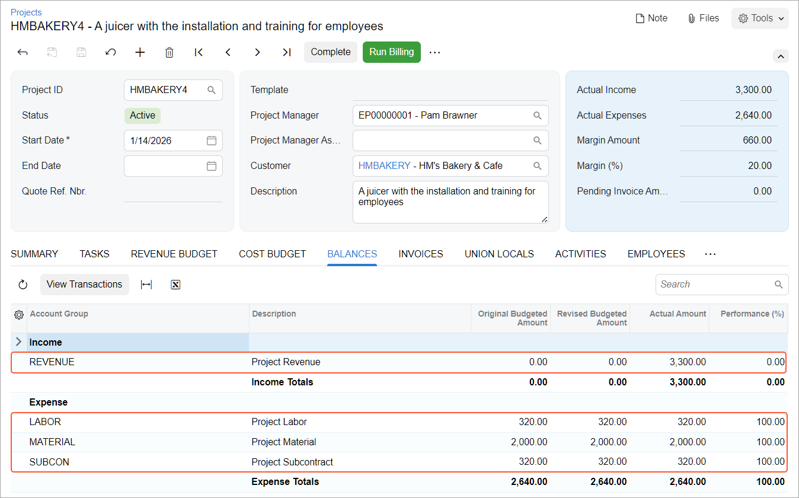

# Time and Material Billing: To Bill a Project for Time and Material {#_c53c0b58-26c1-4385-a86e-d9cecd34d4c0 .task}

This activity will walk you through the process of billing a project for time and material.

**Attention:** This activity is based on the *U100* dataset. If you are using another dataset or if any system settings have been changed in *U100*, these changes can affect the workflow of the activity and the results of the processing. To avoid issues, restore the *U100* dataset to its initial state.

## Story { .section}

Suppose that the HM's Bakery and Cafe customer has ordered a juicer from the SweetLife Fruits &amp; Jams company, along with the services of installation and employee training on operating the juicer. SweetLife's project accountant has created the project to handle the tracking and billing of the juicer and the provided services. Then the project accountant has entered a project transaction to record the delivery and installation of the juicer, and eight hours of training have been provided by SweetLife consultants on January 14, 2026. Acting as the project accountant, you need to bill the customer for the project so that the billing includes the materials used and the work time spent on the project.

## Configuration Overview { .section}

In the *U100* dataset, the following tasks have been performed to support this activity:

-   On the [Enable/Disable Features](CS_10_00_00.md) \(CS100000\) form, the *Projects* feature has been enabled to support the project management functionality.
-   On the [Billing Rules](PM_20_70_00.md) \(PM207000\) form, the *TM* billing rule has been configured. The billing rule includes three steps, each billing a particular account group \(*MATERIAL*, *LABOR*, and *SUBCON*\); for each group, the amount to be invoiced is calculated by multiplying the project transaction amount by 1.25.
-   On the [Customers](AR_30_30_00.md) \(AR303000\) form, the *HMBAKERY* customer has been defined.
-   On the [Projects](PM_30_10_00.md) \(PM301000\) form, the *HMBAKERY4* project has been created for the *HMBAKERY* customer, and the *PHASE1* and *PHASE2* tasks have been added to the project. On the **Tasks** tab, the *TM* billing rule has been specified for both project tasks. Also, on the **Summary** tab, the **Create Pro Forma Invoice on Billing** check box is selected, indicating that a pro forma invoice is created when the project is billed.
-   On the [Project Transactions](PM_30_40_00.md) \(PM304000\) form, the *PM00000007* batch of project transactions related to the project has been created and released to record the services provided for the project.

## Process Overview { .section}

You will make sure that the project is pending billing and run the project billing on the [Projects](PM_30_10_00.md) \(PM301000\) form, which causes the system to create a pro forma invoice. On the [Pro Forma Invoices](PM_30_70_00.md) \(PM307000\) form, you will review the lines that have been added to this pro forma invoice and release it. Then you will review the corresponding accounts receivable invoice and release it on the [Invoices and Memos](AR_30_10_00.md) \(AR301000\) form, and review how this affects the project’s actual values. Finally, you'll review the project transactions and the updated project balance.

## System Preparation { .section}

To sign in to the system and prepare to perform the instructions of the activity, do the following:

1.  Launch the Acumatica ERP website, and sign in to a company with the *U100* dataset preloaded; you should sign in as project accountant by using the *brawner* username and the *123* password.
2.  In the info area at the upper-right corner of the top pane of the Acumatica ERP screen, make sure that the business date is set to *1/30/2026*. If a different date is displayed, click the Business Date menu button and select *1/30/2026* from the calendar. For simplicity, you'll create and process all documents in this activity using this business date.

## Step 1: Reviewing Project Transactions Pending Billing {#section_ivm_hvl_yqb .section}

To review the project transactions that have not been billed yet, do the following:

1.  Open the [Project Transaction Details](PM_40_10_00.md) \(PM401000\) form.
2.  In the Selection area, select *HMBAKERY4* as the **Project**, and make sure that the **Project Task** and **Account Group** boxes are cleared. In the table, the system lists the following project transactions dated *1/14/2026*:

    -   The *JUICER15* line in the amount of $2,000
    -   The *TRAINING* line in the amount of $320
    -   Two lines with the *INSTALL* item related to the *PHASE1* project task, with amounts of $80 and $240
    Notice that in all lines, the **Billable** check box is selected and the **Billed** check box is cleared, indicating that these project transactions are pending billing.

## Step 2: Billing the Project and Processing the Related Documents { .section}

To bill the project, do the following:

1.  On the [Projects](PM_30_10_00.md) \(PM301000\) form, open the *HMBAKERY4* project. In the Summary area, notice that the actual expenses of the project are $2,640 \(which is the total of the processed project transactions\), while the actual income of the project is $0 because the project has not been billed yet.
2.  On the form toolbar, click **Run Billing**. The system creates a pro forma invoice and opens it on the [Pro Forma Invoices](PM_30_70_00.md) \(PM307000\) form.
3.  On the **Time and Material** tab of the form, review the lines that the system has created based on the project transactions. The pro forma invoice includes three lines:
    -   The *JUICER15* line with the billed amount of $2,500
    -   The *TRAINING* line with the billed amount of $400
    -   The *INSTALL* line \(which aggregates two project transactions\) in the amount of $400
4.  On the form toolbar, click **Remove Hold** to assign the pro forma invoice the *Open* status, and then click **Release**. The system creates a corresponding accounts receivable invoice based on the pro forma invoice. The pro forma invoice is assigned the *Closed* status.
5.  On the **Financial** tab, click the **AR Ref. Nbr.** link to open the accounts receivable invoice that has been created on the [Invoices and Memos](AR_30_10_00.md) \(AR301000\) form.
6.  On the form toolbar, click **Remove Hold** to assign the invoice the *Balanced* status, and then click **Release**.

## Step 3: Reviewing the Project Transactions and the Updated Project Balance { .section}

To review the project transactions and project balance, do the following:

1.  On the [Project Transaction Details](PM_40_10_00.md) \(PM401000\) form, in the Selection area, select *HMBAKERY4* as the **Project**. In the table, review the project transactions that have been created based on the released accounts receivable invoice \(these are the lines that have *AR* specified in the **Source** column and negative amounts\). In the **GL Batch Nbr.** column, the reference number of the corresponding GL batch is shown. Also notice that the project transactions based on which you have performed time and material billing now have the **Billed** check box selected, indicating that these transactions have been billed.
2.  On the [Projects](PM_30_10_00.md) \(PM301000\) form, open the *HMBAKERY4* project. In the Summary area, notice that the actual income is now $3,300. On the **Revenue Budget** tab, notice that the system has automatically created two revenue budget lines \(one for each project task\), and filled in the **Actual Amount** for the rows.
3.  On the **Balances** tab \(see below\), review the project income and expenses aggregated by account groups.

    

You have billed the project for time and material.

**Parent topic:**[Billing Projects for Time and Material](../UserGuide/Projects_Billing_for_Time_and_Material_Mapref.md)

