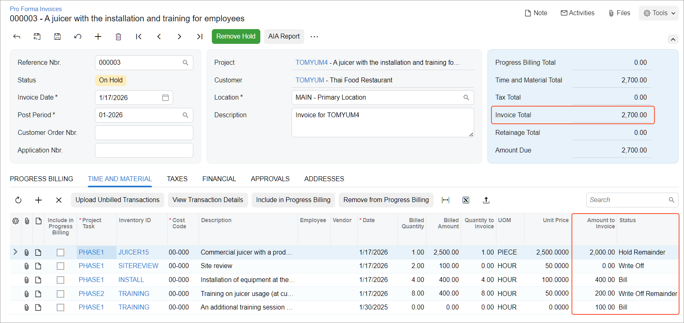

# Time and Material Billing: To Postpone and Write Off Amounts {#_c53c0b58-16c1-4385-a86e-d9c13d34d4c0 .task}

This activity will walk you through the process of postponing and writing off amounts in a pro forma invoice.

**Attention:** This activity is based on the *U100* dataset. If you are using another dataset or if any system settings have been changed in *U100*, these changes can affect the workflow of the activity and the results of the processing. To avoid issues, restore the *U100* dataset to its initial state.

## Story { .section}

Suppose that the Thai Food Restaurant customer has ordered a juicer, along with the services of installation and employee training on operating the juicer from the SweetLife Fruits &amp; Jams company. SweetLife's project accountant has created a project. The juicer has been delivered and installed, and a consultant has provided the training. The project accountant has billed the customer and sent the created pro forma invoice for approval.

SweetLife and the customer have agreed on the following adjustments to the pro forma invoice:

-   The customer will pay $2,000 of the cost of the juicer with the first invoice \(the accounts receivable invoice corresponding to this pro forma invoice\) and the rest of the juicer's cost with the second invoice next month.
-   The cost of the site review should be written off of the invoice, because the project manager agreed to provide the customer a free site review.
-   A 50% discount will be applied to the cost of the training.
-   The customer will pay $100 for an additional training session in Phase 1 of the project.

Acting as the project accountant, you will make the needed corrections to the pro forma invoice and bill the customer. You will then bill the customer for the second time with the amount postponed in the first invoice.

## Configuration Overview { .section}

In the *U100* dataset, the following tasks have been performed to support this activity:

-   On the [Enable/Disable Features](CS_10_00_00.md) \(CS100000\) form, the *Projects* feature has been enabled to provide support for the project management functionality.
-   On the [Projects](PM_30_10_00.md) \(PM301000\) form, the *TOMYUM4* project has been created and the *PHASE1* and *PHASE2* project tasks have been created for the project.
-   On the [Project Transactions](PM_30_40_00.md) \(PM304000\) form, the *PM00000001* batch of project transactions related to the project has been created and released.
-   On the [Pro Forma Invoices](PM_30_70_00.md) \(PM307000\) form, the *000003* pro forma invoice has been created for the *TOMYUM4* project and saved with the *On Hold* status.
-   On the [Stock Items](IN_20_25_00.md) \(IN202500\) form, the *JUICER15* stock item has been created.
-   On the [Non-Stock Items](IN_20_20_00.md) \(IN202000\) form, the *SITEREVIEW*, *INSTALL*, and *TRAINING* non-stock items have been created.

## Process Overview { .section}

In this activity, you will make corrections to the pro forma invoice and release the invoice on the [Pro Forma Invoices](PM_30_70_00.md) \(PM307000\) form. On the [Invoices and Memos](AR_30_10_00.md) \(AR301000\) form, you will review the accounts receivable invoice that was created based on the pro forma invoice; you will then release the accounts receivable invoice. You will then create one more pro forma invoice for the customer with the amount postponed in the first pro forma invoice.

## System Preparation { .section}

Before you begin performing the steps of this activity, perform the following instructions to prepare the system:

1.  Launch the Acumatica ERP website, and sign in to a company with the *U100* dataset preloaded; you should sign in as project accountant by using the *brawner* username and the *123* password.
2.  In the info area at the upper-right corner of the top pane of the Acumatica ERP screen, make sure that the business date is set to *1/30/2026*. If a different date is displayed, click the Business Date menu button and select *1/30/2026* from the calendar. For simplicity, you'll create and process all documents in this activity using this business date.

## Step 1: Adjusting the Pro Forma Invoice { .section}

To adjust the pro forma invoice according to the agreements that have been reached with the customer, do the following:

1.  On the [Projects](PM_30_10_00.md) \(PM301000\) form, open the *TOMYUM4* project.
2.  On the **Invoices** tab, click the link in the **Pro Forma Reference Nbr.** column of the only row to open the pro forma invoice that you need to adjust.
3.  On the **Time and Material** tab of the [Pro Forma Invoices](PM_30_70_00.md) \(PM307000\) form, which opens, adjust the invoice lines as follows \(see below\):
    1.  In the line with the *PHASE1* project task and the *JUICER15* inventory item, change **Amount to Invoice** to `2000`. When you enter an **Amount to Invoice** that is less than the **Billed Amount**, the system specifies *Hold Remainder* as the **Status** in this line; the difference between the **Billed Amount** and the **Amount to Invoice** will be billed later.
    2.  In the line with the *PHASE1* project task and the *SITEREVIEW* inventory item, select *Write Off* as the **Status** to write off the full amount of the line and exclude it from billing. The system inserts *0* in the **Amount to Invoice** column for this line.
    3.  In the line with the *PHASE2* project task and the *TRAINING* inventory item, do the following:
        1.  Change **Amount to Invoice** to `200.00`.
        2.  Select *Write Off Remainder* as the **Status** to write off the difference between the **Billed Amount** and the **Amount to Invoice** and exclude this difference from billing.
4.  Add a new line with the following settings \(also shown below\):

    -   **Project Task**: *PHASE1*
    -   **Inventory ID**: *TRAINING*
    -   **Cost Code**: `00-000`
    -   **Description**: `An additional training session within phase 1`
    -   **Amount to Invoice**: `100.00`
    After all the adjustments you have made, the invoice total in the Summary area should be $2,700.

    

5.  Save your changes to the pro forma invoice.
6.  On the form toolbar, click **Remove Hold** to assign the pro forma invoice the *Open* status, and then click **Release** to release the pro forma invoice.

    The system creates the accounts receivable invoice based on the pro forma invoice and assigns the *Closed* status to the pro forma invoice.

7.  On the **Financial** tab, click the **AR Ref. Nbr.** link to open the accounts receivable invoice that has been created.
8.  On the form toolbar of the [Invoices and Memos](AR_30_10_00.md) \(AR301000\) form, which opens, click **Remove Hold** to assign the invoice the *Balanced* status, and then click **Release** to release the accounts receivable invoice.

## Step 2: Billing the Project for the Remainder { .section}

To bill the customer the postponed amount \(which is $500 of the juicer cost\), do the following:

1.  On the [Projects](PM_30_10_00.md) \(PM301000\) form, open the *TOMYUM4* project, and on the **Cost Budget** tab, review the updated cost budget of the project. Click the cost budget line with the *PHASE1* project task and the *JUICER15* inventory item, and on the table toolbar, click **View Transactions**.
2.  On the [Project Transaction Details](PM_40_10_00.md) \(PM401000\) form, which opens, review the list of project transactions that correspond to the selected line.

    The transaction with an original document type of *Unbilled Remainder* has been created on release of the AR invoice that corresponds to the pro forma invoice from which the unbilled remainder originates. The identifier of the AR invoice is shown in the **Orig. Doc. Nbr.** column of the line. The transaction has the **Billable** check box selected and the **Billed** check box cleared, which means the transaction can be billed.

3.  Close the form to return to the [Projects](PM_30_10_00.md) form with the *TOMYUM4* project selected, and on the form toolbar, click **Run Billing** to bill the project for the remainder.

    The system creates a pro forma invoice and opens it on the [Pro Forma Invoices](PM_30_70_00.md) \(PM307000\) form.

4.  On the **Time and Material** tab, review the pro forma invoice line that the system has created based on the unbilled remainder transaction. Only one line with the *PHASE1* project task and *JUICER15* inventory item has been added to the pro forma invoice. The amount of the line is $500.

    **Tip:** The line with the *PHASE1* project task and the *SITEREVIEW* inventory item hasn’t been added because you’ve written it off in the full amount. The line with the *PHASE2* project task and the *TRAINING* inventory item has been written off partially, and thus also hasn’t been added to the pro forma invoice.

You’ve corrected the pro forma invoice and billed the project for the unbilled remainder.

**Parent topic:**[Billing Projects for Time and Material](../UserGuide/Projects_Billing_for_Time_and_Material_Mapref.md)

