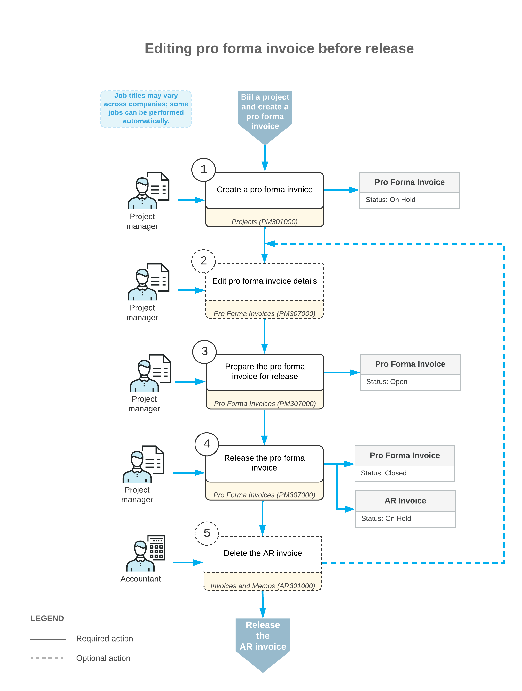

# Time and Material Billing: Adjustments, Remainders, and Write-Offs {#_c17cd276-2ac9-4e6e-a687-fa3ccdaa1e16 .concept}

You may need to modify a pro forma invoice if you send this invoice to the customer for acceptance and if the customer requests some adjustments.

On the [Pro Forma Invoices](PM_30_70_00.md) \(PM307000\) form, you can edit the lines of a pro forma invoice if it is assigned the *On Hold* status. If a pro forma invoice has the *Closed* status but you haven’t released the created accounts receivable document yet, you can delete the AR document to be able to edit the pro forma invoice.

**Tip:** You can also rearrange the time and material lines of the pro forma invoice by dragging them to the appropriate positions.

The following sections describe how you can review and modify the pro forma invoice lines before you prepare the AR invoice for this pro forma invoice.

## Increasing the Billed Amounts { .section}

On the **Time and Material** tab of the [Pro Forma Invoices](PM_30_70_00.md) \(PM307000\) form, you can increase the billed amounts by doing any of the following:

-   Increasing the **Amount to Invoice** of the pro forma invoice line to bill the customer in a greater amount.
-   Adding a new line to the pro forma invoice based on an unbilled transaction. To do this, you click **Upload Unbilled Transactions** on the table toolbar. In the **Upload Unbilled Transactions** dialog box, which opens, you select the lines with the project transactions that haven’t been billed yet, and click **Upload &amp; Close**. The system creates new lines for these project transactions.
-   Manually adding to a pro forma invoice an adjustment line that doesn’t originate from the project transactions.

## Postponing the Billed Amounts { .section}

To postpone the full amount of any pro forma invoice line, delete this line from the pro forma invoice on the **Time and Material** tab of the [Pro Forma Invoices](PM_30_70_00.md) \(PM307000\) form. This line will appear in the next pro forma invoice prepared for the project.

To postpone a partial amount of the pro forma invoice line, decrease the **Amount to Invoice** and select *Hold Remainder* in the **Status** column. The unbilled remainder \(that is, the difference between the original amount and the edited amount\) will be postponed until the next billing for the project. For an unbilled remainder to be billed, the corresponding AR invoice that contains the line from which this remainder originates must be released.

You cannot postpone the partial amount of the pro forma invoice lines that have no link to a project transaction.

**Tip:** A pro forma invoice line with no link to a project transaction may be added manually by the user or generated by a billing rule that includes multiple time and material steps that have been configured for the same account group.

## Writing Off the Billed Amounts { .section}

To write off the full amount of the pro forma invoice line, you select *Write Off* in the **Status** column for the line on the **Time and Material** tab of the [Pro Forma Invoices](PM_30_70_00.md) \(PM307000\) form. This line will no longer appear in pro forma invoices prepared for the project.

To write off a partial amount of the pro forma invoice line, decrease the **Amount to Invoice** and select *Write Off Remainder* in the **Status** column. The unbilled remainder \(that is, the difference between the original amount and edited amount\) will be written off and will no longer appear in pro forma invoices prepared for the project.

You cannot fully or partially write off the amount of the pro forma invoice lines that have no link to a project transaction.

## Decreasing the Billed Amounts { .section}

On the **Time and Material** tab of the [Pro Forma Invoices](PM_30_70_00.md) \(PM307000\) form, you can click a pro forma invoice line and click **View Transaction Details** on the table toolbar. The system opens the **Transaction Details** dialog box, which shows the list of project transactions that correspond to this line. The **Billed Quantity** and **Billed Amount** values for each project transaction in the list were calculated by using the formula of the billing rule. These values are totaled to populate the **Billed Quantity** and **Billed Amount** of the pro forma invoice line.

To reduce the billed quantity and amount of the pro forma invoice lines, you delete the particular transaction from the list. The deleted project transaction is unlinked from the pro forma invoice line and will appear in the next pro forma invoice prepared for the project.

## Workflow of Changing Pro Forma Invoices {#section_i3l_d4p_mcb .section}

The following diagram illustrates the workflow of making changes to a pro forma invoice.

**Parent topic:**[Billing Projects for Time and Material](../UserGuide/Projects_Billing_for_Time_and_Material_Mapref.md)

