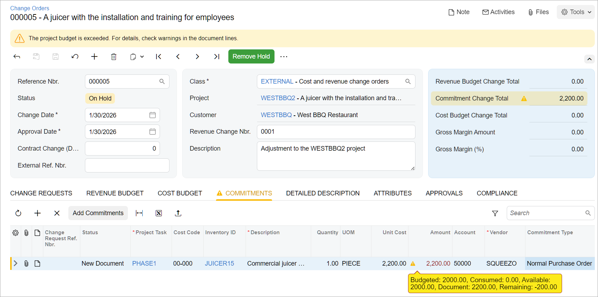
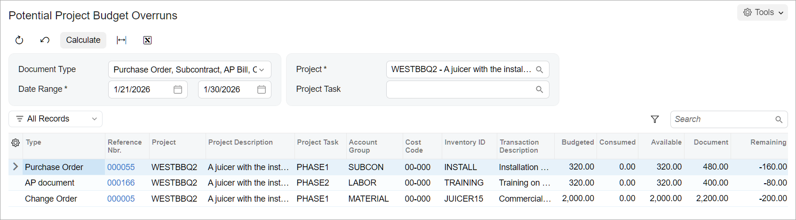

# Project Budget Control: To Review the Budget Overruns {#_c53c0b58-16c1-4385-a86e-d9cecdcec4c0 .task}

This activity will walk you through the process of receiving notifications that indicate whether a newly entered document fits the existing project budget.

**Attention:** This activity is based on the *U100* dataset. If you are using another dataset or if any system settings have been changed in *U100*, these changes can affect the workflow of the activity and the results of the processing. To avoid issues, restore the *U100* dataset to its initial state.

## Story { .section}

Suppose that the West BBQ Restaurant customer has ordered a juicer from the SweetLife Fruits &amp; Jams company, along with the following services: juicer installation, and employee training on operating the juicer. The SweetLife company has contracted the Squeezo Inc. vendor to perform all the services. SweetLife's project accountant has created the project. The vendor has delivered and installed the juicer, and Squeezo's consultant has provided the training. Then suppose that the project accountant noticed that the juicer has cost an extra $200 beyond the budgeted amount, and that the installation and the training have taken two hours more than the budgeted number of hours.

Acting as SweetLife's project accountant, you will enter a change order to adjust the cost of the juicer, an accounts payable bill for the provided training, and a purchase order for the installation service. As you enter these project-related documents, you will check whether the costs are within the project budget.

## Configuration Overview { .section}

In the *U100* dataset, the following tasks have been performed to support this activity:

-   On the [Enable/Disable Features](CS_10_00_00.md) \(CS100000\) form, the following features have been enabled:
    -   *Projects*, which provides the project management functionality
    -   *Inventory and Order Management*, which provides the ability to maintain stock items and to create and process purchasing documents that include stock items
-   On the [Change Order Classes](PM_20_30_00.md) \(PM203000\) form, the *DEFAULT* change order class has been created.
-   On the [Projects](PM_30_10_00.md) \(PM301000\) form, the *WESTBBQ2* project has been created, the *PHASE1* and *PHASE2* project tasks have been created for the project, and three cost budget lines have been added. The change order workflow has been enabled for the project.
-   On the [Non-Stock Items](IN_20_20_00.md) \(IN202000\) form, the *INSTALL* and *TRAINING* non-stock item have been defined.
-   On the [Stock Items](IN_20_25_00.md) \(IN202500\) form, the *JUICER15* stock item has been defined.
-   On the [Vendors](AP_30_30_00.md) \(AP303000\) form, the *SQUEEZO* vendor has been created.

## Process Overview { .section}

In this activity, you will capture project costs by processing a change order on the [Change Orders](PM_30_80_00.md) \(PM308000\) form, an accounts payable bill on the [Bills and Adjustments](AP_30_10_00.md) \(AP301000\) form, and a purchase order on the [Purchase Orders](PO_30_10_00.md) \(PO301000\) form. While you process these documents, you will review potential budget overruns on the entry forms. You will then review all the project budget overruns at once on the [Potential Project Budget Overruns](PM_40_40_00.md) \(PM404000\) form.

## System Preparation { .section}

To sign in to the system and prepare to perform the instructions of the activity, do the following:

1.  Implement the two-tier change management and configure change order classes by performing the following prerequisite activity: [Change Requests: Implementation Activity](Projects_Two_Tier_Change_Management_Implem_Activity.md).
2.  Sign in to the system as Pam Brawner, the project accountant, by using the *brawner* username and the *123* password.
3.  In the info area at the upper-right corner of the top pane of the Acumatica ERP screen, make sure that the business date is set to *1/30/2026*. If a different date is displayed, click the Business Date menu button and select *1/30/2026* from the calendar. For simplicity, you'll create and process all documents in this activity using this business date.
4.  On the [Projects Preferences](PM_10_10_00.md) \(PM101000\) form, go to the **General** tab \(**General Settings** section\) and set **Budget Control** to *Show a Warning*.

    With this setting, the system shows warnings if documents of the following types exceed the project budget: commitments within change orders, purchase orders, accounts payable bills, and subcontracts.

5.  Save your changes to the project accounting preferences.

## Step 1: Creating a Change Order for the Project { .section}

To review the project and create a change order for the project, do the following:

1.  On the [Projects](PM_30_10_00.md) \(PM301000\) form, open the *WESTBBQ2* project. On the **Cost Budget** tab, review the cost budget of the project, which has the following lines:

    -   The *JUICER15* line, with a budgeted amount of *2,000*
    -   The *TRAINING* line, with a budgeted amount of *320*
    -   The *INSTALL* line, with a budgeted amount of *320*
    The actual values of the budget lines are *0*, and the budget lines have no changes or related commitments.

2.  On the More menu, under **Change Management**, click **Create Change Order**. The system creates a change order and opens it on the [Change Orders](PM_30_80_00.md) \(PM308000\) form. Make sure that *EXTERNAL* is specified in the **Class** box of the Summary area.
3.  In the Summary area, enter `Adjustment to the WESTBBQ2 project` as the **Description**.
4.  On the **Commitments** tab, click **Add Row** and add a commitment line with the following settings:
    -   **Project Task**: *PHASE1*
    -   **Cost Code**: *00-000*
    -   **Inventory ID**: *JUICER15*
    -   **Quantity**: `1.00`
    -   **Unit Cost**: `2,200.00`
    -   **Vendor**: *SQUEEZO*
    -   **Commitment Type**: *Normal Purchase Order*
5.  Save your changes to the change order.

    A notification has appeared in the **Amount** column \(see below\) indicating the following:

    -   The budget for the juicer \(*Budgeted*\) is *2,000*.
    -   The amount of the commitment line \(*Document*\) with the *New Document* status is *2,200*. This line will result in a purchase order line.
    -   The amount by which the change exceeds the available budget \(*Remaining*\) is *200*.
    A warning is also shown in the Summary area of the form.

    

## Step 2: Creating a Bill for the Project { .section}

To create a bill for the project, do the following:

1.  On the [Bills and Adjustments](AP_30_10_00.md) \(AP301000\) form, add a new record.
2.  In the Summary area, specify the following settings:
    -   **Type**: *Bill*
    -   **Date**: *1/30/2026* \(inserted by default\)
    -   **Vendor**: *SQUEEZO*
3.  On the **Details** tab, click **Add Row** on the table toolbar and specify the following settings in the added row:
    -   **Inventory ID**: *TRAINING*
    -   **Quantity**: `10`
    -   **Project**: *WESTBBQ2*
    -   **Project Task**: *PHASE2*
    -   **Cost Code**: *00-000*
4.  Save your changes to the bill.

    A notification has appeared in the **Ext. Cost** column indicating the following:

    -   The budget for the training \(*Budgeted*\) is *320*.
    -   The amount of the bill line \(*Document*\) is *400*.
    -   The amount by which the bill line exceeds the available budget \(*Remaining*\) is *80*.
    А warning has also appeared in the Summary area of the form.

## Step 3: Creating a Purchase Order for the Project { .section}

To create a purchase order for the project, do the following:

1.  On the [Purchase Orders](PO_30_10_00.md) \(PO301000\) form, add a new record.
2.  In the Summary area, specify the following settings:
    -   **Type**: *Normal*
    -   **Date**: *1/30/2026* \(inserted by default\)
    -   **Vendor**: *SQUEEZO*
3.  On the **Details** tab, click **Add Row** on the table toolbar and specify the following settings in the added row:
    -   **Inventory ID**: *INSTALL*
    -   **Order Qty.**: `6.00`
    -   **Project**: *WESTBBQ2*
    -   **Project Task**: *PHASE1*
    -   **Cost Code**: *00-000*
4.  Save your changes to the purchase order.

    Notice that a warning has appeared in the **Ext. Cost** column indicating the following:

    -   The budget for the installation \(*Budgeted*\) is *320*.
    -   The amount of the purchase order line \(*Document*\) is *480*.
    -   The amount by which the purchase order line exceeds the available budget \(*Remaining*\) is *160*.
    А warning has also appeared in the Summary area of the form.

## Step 4: Reviewing Potential Budget Overruns { .section}

To review all the budget overruns for the project in a single place, do the following:

1.  Open the [Potential Project Budget Overruns](PM_40_40_00.md) \(PM404000\) form.
2.  In the **Project** box, select *WESTBBQ2*.
3.  On the form toolbar, click **Calculate** to review all project-related documents that exceed the budget \(see below\).

You have configured the tracking of budget overruns and found the documents that exceed the project budget. In the next step of the process in a production environment, which is beyond the scope of this activity, a project manager would approve or reject these changes to the budgeted amounts.

**Parent topic:**[Controlling the Project Budget](../UserGuide/Projects_Budget_Control_Mapref.md)

