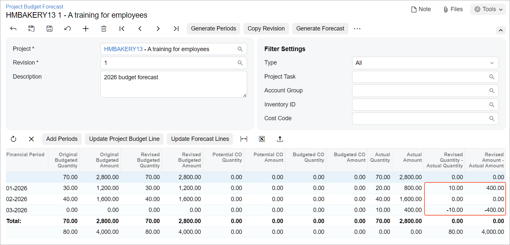

# Project Budget Forecasts: Process Activity {#_c53c0111-16c1-4385-a86e-d9cecd31d1c0 .task}

This activity will walk you through the process of creating and processing a project budget forecast.

**Attention:** This activity is based on the *U100* dataset. If you are using another dataset or if any system settings have been changed in *U100*, these changes can affect the workflow of the activity and the results of the processing. To avoid issues, restore the *U100* dataset to its initial state.

## Story { .section}

Suppose that the HM's Bakery and Cafe customer has ordered 80 hours of new-employee training on operating juicers from the SweetLife Fruits &amp; Jams company. SweetLife's project manager has created a project to account for the provided training.

The project accountant of SweetLife has been asked to prepare a budget forecast by periods to be able to compare and analyze monthly budgets versus actual costs within the project work breakdown structure. Because the training will take place in January and February, the project accountant wants to distribute the total budget across the periods when this work is going to be performed for further review and analysis of budget performance.

Acting as the project accountant, you will create a project budget forecast. Distributing the budget across periods, you will realize that the budget requires an update. You will update the project budget based on the budget forecast. When the training takes place, you will update the progress of the project and review the budget forecast.

## Configuration Overview { .section}

In the *U100* dataset, the following tasks have been performed to support this activity:

-   On the [Enable/Disable Features](CS_10_00_00.md) \(CS100000\) form, the *Projects* feature has been enabled to support the project management functionality.
-   On the [Projects](PM_30_10_00.md#) \(PM301000\) form, the *HMBAKERY13* project has been created and the *TRAINING* project task has been created for the project. Also, the revenue budget and the cost budget are defined for the project with a line with the *TRAINING* inventory item and the *LABOR* account group.
-   On the [Project Transactions](PM_30_40_00.md) \(PM304000\) form, the *PM00000020* batch of project transactions related to the project has been created.

## Process Overview { .section}

In this activity, you will create the first revision of the budget forecast and generate periods for the revision on the [Project Budget Forecast](PM_20_96_00.md#) \(PM209600\) form. On this form, you will then distribute budgeted amounts by period and update the project budget based on the distributed values. You will update actual values of the project by releasing transactions on the [Project Transactions](PM_30_40_00.md) \(PM304000\) form. You will finally update the budget forecast on the [Project Budget Forecast](PM_20_96_00.md#) form based on the updated actual values.

## System Preparation { .section}

Before you begin performing the steps of this activity, perform the following instructions to prepare the system:

1.  Download the [HMBAKERY13\_Project\_Transactions](Files/HMBAKERY13_Project_Transactions.xlsx) file to your computer.
2.  Launch the Acumatica ERP website, and sign in to a company with the *U100* dataset preloaded; you should sign in as project accountant by using the *brawner* username and the *123* password.
3.  In the info area at the upper-right corner of the top pane of the Acumatica ERP screen, make sure that the business date is set to *1/30/2026*. If a different date is displayed, click the Business Date menu button and select *1/30/2026* from the calendar. For simplicity, you'll create and process all documents in this activity using this business date.
4.  Open the [Enable/Disable Features](CS_10_00_00.md) \(CS100000\) form, and on the form toolbar, click **Modify**.
5.  In the **Projects** group of features, select the **Budget Forecast** check box to enable the *Budget Forecast* feature, which gives you the ability to create budget forecasts for projects.
6.  On the form toolbar, click **Enable**.

## Step 1: Creating a Project Budget Forecast and Generating Periods { .section}

To create a forecast revision for the project, do the following:

1.  On the [Projects](PM_30_10_00.md#) \(PM301000\) form, open the *HMBAKERY13* project.

    On the **Revenue Budget** and **Cost Budget** tabs, notice that the project has a single revenue budget line and a single cost budget line.

2.  On the More menu, under **Budget Operations**, click **Project Budget Forecast**.

    The system opens the [Project Budget Forecast](PM_20_96_00.md#) \(PM209600\) form with the *HMBAKERY13* project selected in the Summary area. The project has no budget forecast revision yet, so you need to create a new one.

3.  In the Summary area, specify the following settings for the revision:

    -   **Revision**: `1`
    -   **Description**: ``2026`budget forecast`
    When you specify the revision number, the system adds to the revision all the project budget lines. In the table, the system displays all the cost and revenue budget lines of the forecast revision because *All* is selected in the **Type** box of the Summary area.

4.  In the Summary area, select *Expense* as the **Type**, and on the form toolbar, click **Generate Periods** to make the system add period lines for the cost budget line only.

    Notice that the system has added a line with the 01-2026 period. Also, the **Total** and **Delta** lines are now shown.

5.  In the table, click the budget line with the *LABOR* account group, and on the table toolbar, click **Add Periods** to add period lines to the selected budget line.
6.  In the **Add Periods** dialog box, which opens, select 02-2026 in the **Period To** box, and click **OK**.

    The system closes the dialog box and adds one more period line to the budget line.

7.  In the Summary area, select *All* in the **Type** box. The system displays in the table all the budget lines of the forecast revision. As a result, the revenue budget line with the *REVENUE* account group has again appeared in the table. Notice that no period lines have been added to the revenue budget line.
8.  Save your changes to the forecast revision.

## Step 2: Distributing Amounts Across the Periods { .section}

To distribute budgeted amounts across periods of the forecast revision, do the following:

1.  While you are still viewing the project budget forecast on the [Project Budget Forecast](PM_20_96_00.md#) \(PM209600\) form, on the form toolbar, click **Generate Forecast**.
2.  In the **Generate Forecast** dialog box, which opens, leave the default settings and click **OK**.

    For the budget line with the *LABOR* account group, which have period lines, the system equally distributes original and revised budgeted quantities \(40\) and amounts \($1,600\) among period lines.

3.  For the 01-2026 period line, adjust the automatically distributed values as follows:

    -   **Original Budgeted Quantity**: `30.00`
    -   **Original Budgeted Amount**: `1200.00`
    -   **Revised Budgeted Quantity**: `30.00`
    -   **Revised Budgeted Amount**: `1200.00`
    Notice the system has calculated values in the **Total** and **Delta** lines based on the changes you made. The total budgeted quantity of the period lines is 70, the total budgeted amount is $2,800, the delta of the budgeted quantity is 10, and the delta of the budgeted amount is $400.

4.  Save your changes to the forecast revision. The original and revised values in the cost budget of the project haven’t yet been updated.
5.  In the table, click the budget line with the *LABOR* account group, and on the table toolbar, click **Update Project Budget Line**.

    The system updates the corresponding budget line of the project with the values from the **Total** line of the selected line of the forecast revision. The values in the **Delta** line become *0*, and the **Delta** line disappears from the forecast.

6.  Save your changes to the forecast revision.
7.  On the [Projects](PM_30_10_00.md#) form, open the *HMBAKERY13* project.
8.  On the **Cost Budget** tab, notice that the **Original Budgeted Quantity** and **Revised Budgeted Quantity** of the cost budget line are 70 and the **Original Budgeted Amount** and **Revised Budgeted Amount** are $2,800.

## Step 3: Updating Actual Values of the Project { .section}

To upload and process the transactions that represent the training provided within the project, do the following:

1.  On the [Project Transactions](PM_30_40_00.md) \(PM304000\) form, add a new record.
2.  In the Summary area, specify the following settings:
    -   **Source**: *PM*
    -   **Description**: `A training for employees of HM's Bakery and Cafe`
3.  On the table toolbar, click **Load Records from File**, and upload the transactions from the `HMBAKERY13_Project_Transactions.xlsx` file, which you have downloaded. While you are uploading the transactions, leave the default column mapping.
4.  Make sure that the **Total Amount** in the Summary area is *2,800.00*.

    Notice that 20 hours of the training were provided in the 01-2026 period, 40 hours were provided in the 02-2026 period, and 10 hours were provided in the 03-2026 period.

5.  On the form toolbar, click **Save** to save the project transaction, and then click **Release** to release it.
6.  On the [Project Budget Forecast](PM_20_96_00.md#) \(PM209600\) form, select *HMBAKERY13* in the **Project** box and *1* as the **Revision**.

    In the table, find the **Actual Quantity** and **Actual Amount** columns, and notice that for the project budget line with the *LABOR* account group, the values in the **Delta** line in these columns \(*10* and *400*, respectively\) are highlighted in red. This means that at least one period for which actual values exist isn’t displayed in the forecast revision.

7.  In the table, click the budget line with the *LABOR* account group, and on the table toolbar, click **Update Forecast Lines**.

    The system updates budget line of the forecast revision selected in the table and adds the 03-2026 period with the actual quantity of 10 and the actual amount of $400.

8.  To analyze monthly cost budget versus actual expenses and control the cost budget performance by periods, for the budget line with the *LABOR* account group, review the value in the **Revised Quantity - Actual Quantity** and **Revised Amount - Actual Amount** columns for the following financial periods \(see below\):

    -   01-2026: The company provided 10 hours of training less than it was planned.
    -   02-2026: The training was performed as it was planned.
    -   03-2026: The company provided 10 hours of training more than it was planned.
    

9.  Save your changes to the forecast revision.

You have finished creating a forecasting budget for the project for the specified periods.

**Parent topic:**[Forecasting Budgets by Periods](../UserGuide/Projects_Budget_Forecasts_Mapref.md)

