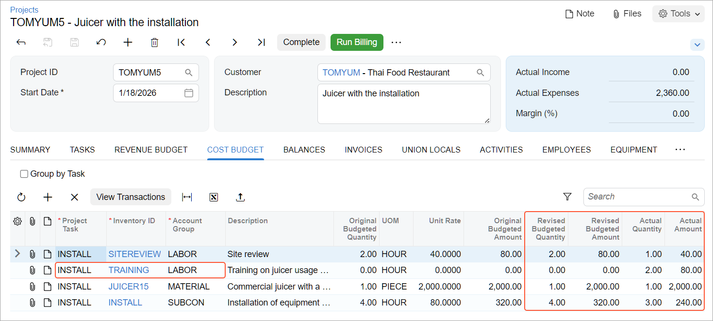
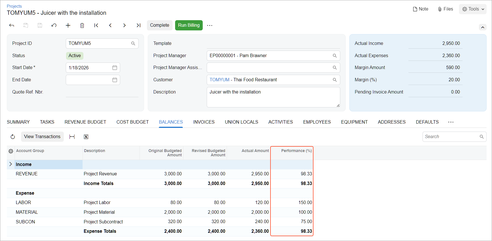

# Project Budget: To Configure and Update the Budget {#_fb50755a-1813-11fd-9fe8-df13c321b13b .task}

In this activity, you will learn how to configure the project budget, update actual values of the project budget, and review project performance.

**Attention:** This activity is based on the *U100* dataset. If you are using another dataset or if any system settings have been changed in *U100*, these changes can affect the workflow of the activity and the results of the processing. To avoid issues, restore the *U100* dataset to its initial state.

## Story { .section}

Suppose that the Thai Food Restaurant customer has ordered a juicer along with the site review and installation services from the SweetLife Fruits &amp; Jams company. SweetLife's project accountant has created a project to handle the tracking and billing of the provided materials and services.

Acting as the project accountant, you will configure the revenue budget for the project to plan the expected revenue and the cost budget to plan the materials and services to be spent on the project. Then, when the juicer is delivered and the services are provided, you will enter project transactions to capture project costs and will check the expenses within the budget values. You will then bill the project and compare the project income with the budgeted values.

## Configuration Overview { .section}

In the *U100* dataset, the following tasks have been performed to support this activity:

-   On the [Enable/Disable Features](CS_10_00_00.md) \(CS100000\) form, the *Projects* feature has been enabled to provide support for the project management functionality.
-   On the [Projects](PM_30_10_00.md) \(PM301000\) form, the *TOMYUM5* project has been created and the *INSTALL* project task has been created for the project and configured as the default task. Also, *Task* is selected as the **Revenue Budget Level** of the project and *Task and Item* is selected as the **Cost Budget Level** of the project.
-   On the [Account Groups](PM_20_10_00.md) \(PM201000\) form, the *REVENUE*, *SUBCON*, *LABOR*, and *MATERIAL* account groups have been created.
-   On the [Non-Stock Items](IN_20_20_00.md) \(IN202000\) form, the *SITEREVIEW*, *INSTALL* and *TRAINING* non-stock items have been configured.
-   On the [Stock Items](IN_20_25_00.md) \(IN202500\) form, the *JUICER15* stock item has been configured.

## Process Overview { .section}

In this activity, you will configure the project budget on the [Projects](PM_30_10_00.md) \(PM301000\) form. You will then release project transactions on the [Project Transactions](PM_30_40_00.md) \(PM304000\) form that will update the actual values of the project budget. You will then bill the project on the [Projects](PM_30_10_00.md) \(PM301000\) form and release the created accounts receivable invoice on the [Invoices and Memos](AR_30_10_00.md) \(AR301000\) form.

## System Preparation { .section}

To sign in to the system and prepare to perform the instructions of the activity, do the following:

1.  Download the [TOMYUM5\_Project\_Transactions](Files/TOMYUM5_Project_Transactions.xlsx) file to your computer.
2.  Launch the Acumatica ERP website, and sign in to a company with the *U100* dataset preloaded; you should sign in as Pam Brawner by using the *brawner* username and the *123* password.
3.  In the info area at the upper-right corner of the top pane of the Acumatica ERP screen, make sure that the business date is set to *1/30/2026*. If a different date is displayed, click the Business Date menu button and select *1/30/2026* from the calendar. For simplicity, you'll create and process all documents in this activity using this business date.
4.  On the [Projects Preferences](PM_10_10_00.md) \(PM101000\) form, specify the following settings on the **General** tab \(**General Settings** section\):
    -   **Revenue Budget Update**: *Summary*
    -   **Cost Budget Update**: *Detailed*
5.  Save your changes to the project accounting preferences.

## Step 1: Configuring the Project Budget { .section}

To specify the revenue and cost budgets for the project, do the following:

1.  On the [Projects](PM_30_10_00.md) \(PM301000\) form, open the *TOMYUM5* project.

    On the **Summary** tab \(**Project Properties** section\), notice that the **Revenue Budget Level** of the project is *Task* and the **Cost Budget Level** of the project is *Task and Item*.

2.  On the **Revenue Budget** tab, click **Add Row** on the table toolbar and specify the following settings for the added row:

    -   **Project Task**: *INSTALL* \(selected automatically as the default project task\)
    -   **Account Group**: *REVENUE*
    -   **Original Budgeted Amount**: `3000`
    The added line represents the price of the juicer, the site review, and the installation service.

    **Tip:** Notice that because of the selected revenue budget level, the revenue budget does not include inventory items and you cannot add another line with the same project task and account group to the revenue budget.

3.  On the **Cost Budget** tab, click **Add Row** and specify the settings shown in the following table in the three cost budget lines you add.

    |Project Task|**Inventory ID**|**Original Budgeted Quantity**|**Unit Rate**|
    |------------|----------------|------------------------------|-------------|
    |*INSTALL*|*JUICER15*|`1`|`2000`|
    |*INSTALL*|*SITEREVIEW*|`2`|`40`|
    |*INSTALL*|*INSTALL*|`4`|`80`|

    When you select an inventory item in a budget line, the system automatically selects an account group for the line based on the expense account of the non-stock item or the COGS account of the stock item that is mapped to the account group.

    **Tip:** Notice that because of the selected cost budget level you must specify an inventory item in a cost budget line. You cannot add another line with the same budget key \(project task, inventory item, and account group\) to the cost budget of the project.

4.  On the form toolbar, click **Save**.
5.  In the table selection area, select the **Group by Task** check box. In the table, the only line to which the system grouped budget lines is shown. The **Original Budgeted Amount** of the line with the *INSTALL* project task is *2,400.00*.

## Step 2: Uploading Project Transactions { .section}

To upload and process the transactions to update actual values of the cost budget of the project, do the following:

1.  On the [Project Transactions](PM_30_40_00.md) \(PM304000\) form, add a new record.
2.  In the Summary area, make sure *PM* is selected as the **Source**.
3.  In the **Description** box, type `The juicer with the installation for the TOMYUM5 project`.
4.  On the table toolbar of the **Details** tab, click **Load Records from File**.
5.  In the **Import Data** dialog box, which opens, click **Upload File** and select the `TOMYUM5_Project_Transactions.xlsx` file.
6.  On the Specify Common Settings page, which opens, leave the default settings, and click **Next**.
7.  On the Map Properties to Columns page, which opens, leave the current column mapping, and click **Finish**.

    The system uploads four lines with the project transactions. In these lines, notice that the quantity of the provided services is less than you have budgeted—that is, an hour of the site review instead of two hours and three hours of the installation instead of four hours. Also notice that an extra line for two hours of training \(which have not initially been budgeted\) have been added.

8.  In the Summary area, make sure that the **Total Amount** of the uploaded transactions is *2,360.00*.
9.  On the form toolbar, click **Save**, and then click **Release**.
10. On the [Projects](PM_30_10_00.md) \(PM301000\) form, open the *TOMYUM5* project, and in the Summary area, notice that the **Actual Expenses** box shows *2,360.00*, which is the total amount of the released transactions.

    On the **Cost Budget** tab, review the cost budget of the project. Notice that the system has created a new budget line with the *TRAINING* item because the *Detailed* level of the cost budget update is specified in the project accounting preferences. The system has also updated the **Actual Quantity** and **Actual Amount** of the budget lines based on the released transactions \(see below\). You can compare revised budgeted values with actual ones and track the performance by budget line in the **Performance \(%\)** column.

    

11. While remaining on the **Cost Budget** tab, in the table selection area, select the **Group by Task** check box and review totals by project task. The revised budgeted amount for the project task is *2,400.00*, while the actual amount is *2,360.00*.

## Step 3: Billing the Project { .section}

To bill the project and process the invoice, do the following:

1.  While you are still viewing the *TOMYUM5* project on the [Projects](PM_30_10_00.md) \(PM301000\) form, on the form toolbar, click **Run Billing**.

    The system creates an accounts receivable invoice and opens it on the [Invoices and Memos](AR_30_10_00.md) \(AR301000\) form.

    Notice that the **Detail Total** in the Summary area is *2,950.00*.

2.  On the form toolbar, click **Remove Hold** to assign the accounts receivable invoice the *Balanced* status, and then click **Release**.
3.  Return to the [Projects](PM_30_10_00.md) form with the *TOMYUM5* project opened, and press Esc to refresh the form. In the Summary area, notice that the **Actual Income** box shows *2,950.00*, which is the total amount of the released invoice. The system also calculates the project margin as the difference of actual income and expenses \($590\).

    On the **Revenue Budget** tab, review the revenue budget of the project. Notice that the system has updated the **Actual Amount** of the revenue budget line based on the released invoice.

4.  On the **Balances** tab, review the project budget by account group \(see below\). You can track the performance by account group as well as by income and expense totals in the **Performance \(%\)** column.

    

You have finished working with the project budget.

**Parent topic:**[Managing the Project Budget](../UserGuide/Projects_Budget_Mapref.md)

