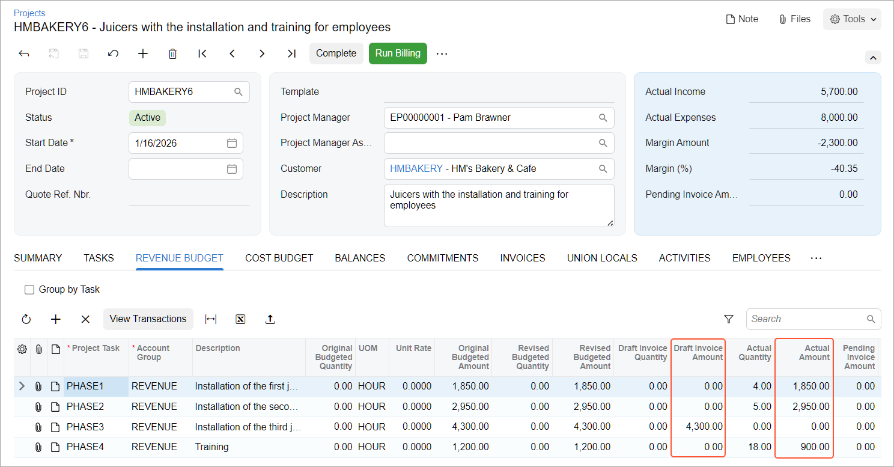
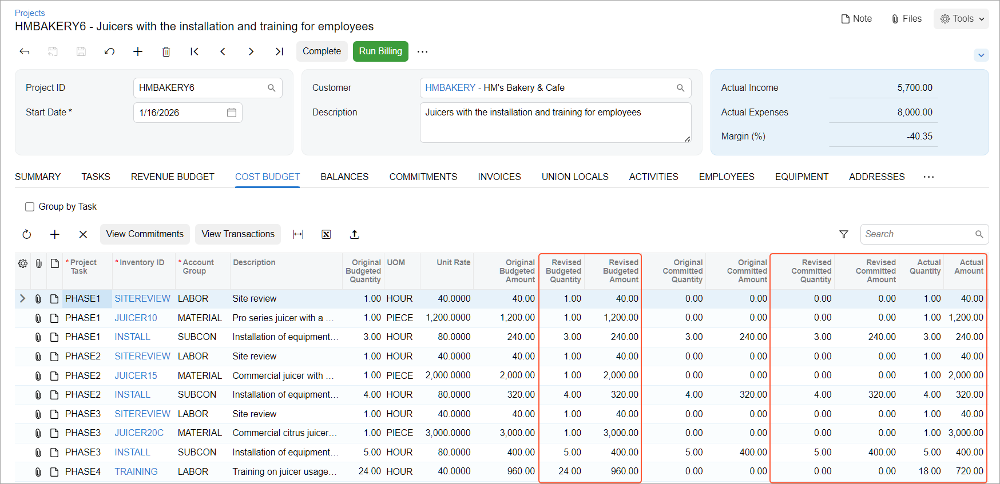

# Project Budget: To Review Project Balances {#_b1180e6e-0153-4411-9489-81a04dc6ad6a .task}

In this activity, you will review project balances by using Acumatica ERP reports and forms.

**Attention:** This activity is based on the *U100* dataset. If you are using another dataset or if any system settings have been changed in *U100*, these changes can affect the workflow of the activity and the results of the processing. To avoid issues, restore the *U100* dataset to its initial state.

## Story { .section}

Suppose that the HM's Bakery and Cafe customer has ordered juicers, along with the following services: site review, installation, and employee training on operating the juicers from the SweetLife Fruits &amp; Jams company. SweetLife's project accountant has created a project to handle the tracking and billing of the provided materials and services. The juicers have been delivered. The installation has been performed by Squeezo Inc. Then, SweetLife's consultant has provided the training. The project accountant of SweetLife has created purchase orders, entered project transactions, and partially billed the customer.

When the project accountant has got a sick leave, another SweetLife's project accountant continues working on the project. The first accountant has no possibility to hand over the project to the new accountant. Acting as the new project accountant, you need to review the project balances to become familiar with the project and gather all the information about performed work.

## Configuration Overview { .section}

In the *U100* dataset, the following tasks have been performed to support this activity:

-   On the [Enable/Disable Features](CS_10_00_00.md) \(CS100000\) form, the *Projects* feature has been enabled to support the project management functionality.
-   On the [Projects](PM_30_10_00.md) \(PM301000\) form, the *HMBAKERY6* project has been created and the *PHASE1*, *PHASE2*, *PHASE3*, and *PHASE4* project tasks have been created for the project.
-   On the [Purchase Orders](PO_30_10_00.md) \(PO301000\) form, the *000020* and *000021* purchase orders \(which are related to the project\) have been created and billed.
-   On the [Project Transactions](PM_30_40_00.md) \(PM304000\) form, the *PM00000009*, *PM00000010*, and *PM00000011* batches of project transactions related to the project have been created and released.

    Project transactions related to the *PHASE1*, *PHASE2*, and *PHASE4* tasks of the project have been billed—that is, a pro forma invoice and the corresponding accounts receivable invoice have been created and released on the [Pro Forma Invoices](PM_30_70_00.md) \(PM307000\) form and the [Invoices and Memos](AR_30_10_00.md) \(AR301000\) form, respectively. Also, on the [Pro Forma Invoices](PM_30_70_00.md) form, a pro forma invoice for project transactions related to the *PHASE3* task has been created.

## Process Overview { .section}

You will review a project's cost and revenue budget on the [Projects](PM_30_10_00.md) \(PM301000\) form along with the corresponding project transactions on the [Project Transaction Details](PM_40_10_00.md) \(PM401000\) form. You will review the list of invoices prepared for the project to understand if it has amounts pending billing. Then you will review the list of project commitments on the [Commitments](PM_30_60_00.md) \(PM306000\) form. Finally, you will review the project budget broken down by account group on the **Balances** tab of the [Projects](PM_30_10_00.md) form.

## System Preparation { .section}

To sign in to the system and prepare to perform the instructions of the activity, do the following:

1.  Launch the Acumatica ERP website, and sign in to a company with the *U100* dataset preloaded; you should sign in as project accountant by using the *brawner* username and the *123* password.
2.  In the info area at the upper-right corner of the top pane of the Acumatica ERP screen, make sure that the business date is set to *1/30/2026*. If a different date is displayed, click the Business Date menu button and select *1/30/2026* from the calendar. For simplicity, you'll create and process all documents in this activity using this business date.
3.  On the [Projects Preferences](PM_10_10_00.md) \(PM101000\) form, select the **Internal Cost Commitment Tracking** check box, and save your changes to the project accounting preferences. This exposes the committed values of the budget, which you will need during the process of the budget review.

## Step: Reviewing the Project Balances { .section}

To review project reports, do the following:

1.  On the [Projects](PM_30_10_00.md) \(PM301000\) form, open the *HMBAKERY6* project.

    In the Summary area, notice that the actual income is $5,700 and the actual expenses are $8,000.

2.  On the **Revenue Budget** tab, pay attention to the values in the **Actual Amount** and **Draft Invoice Amount** columns \(see below\).

    The lines with the *PHASE1*, *PHASE2*, and *PHASE4* tasks have nonzero actual amounts \($1,850, $2,950, and $900, respectively\), which means the work performed within these tasks have been billed. You can compare the actual amount and the revised budgeted amount of the lines to estimate the completion of the revenue budget.

    The line with the *PHASE3* task has a nonzero draft invoice amount \($4,300\), which means a pro forma invoice has been already prepared for this line but the corresponding AR invoice has not been created or has not been released yet.

    

    **Tip:** To review the list of project transactions that correspond to a revenue budget line, you can click the line, and on the table toolbar, click **View Transactions**. The system shows the transactions on the [Project Transaction Details](PM_40_10_00.md) \(PM401000\) form.

3.  On the **Invoices** tab, review the invoices created for the project. Notice that the second pro forma invoice has not been released yet and has no related accounts receivable invoice.
4.  On the **Commitments** tab, review the purchase orders related to the project. Notice that both purchase orders have been processed and assigned the *Closed* status.
5.  On the **Cost Budget** tab, pay attention to the values in the **Revised Budgeted Amount**, **Revised Committed Amount** and **Actual Amount** columns \(see below\). Notice the following:

    -   The line with the *TRAINING* inventory item is the only line with the actual amount less than the revised budgeted amount, which means that the planned training has not been provided fully.
    -   The remaining lines have an actual amount that is equal to the revised budgeted amount and the performance is 100%, which means that all the budgeted materials and services have been provided.
    -   The lines with the *INSTALL* inventory item have nonzero committed values, which means these lines have related purchase orders. The **Revised Committed Amount** shows the amount of the purchase \($240 in Phase 1, $320 in Phase 2 and $400 in Phase 3\). The **Committed Invoiced Amount** shows the amount on the purchase that has been already billed.
    

6.  Click the line with the *PHASE4* project task and the *TRAINING* inventory item, and on the table toolbar, click **View Transactions** to review the project transactions that correspond to the cost budget line on the [Project Transaction Details](PM_40_10_00.md) \(PM401000\) form, which opens. Make sure that three project transactions correspond to the cost budget line.
7.  Close the browser tab with the form, and return to the project on the [Projects](PM_30_10_00.md) form.
8.  Click the line with the *PHASE2* project task and the *INSTALL* inventory item, and on the table toolbar, click **View Commitments** to review the list of commitments that correspond to the cost budget line.
9.  On the [Commitments](PM_30_60_00.md) \(PM306000\) form, which opens, make sure that two commitments correspond to the cost budget line.
10. Close the browser tab with the form, and return to the project on the [Projects](PM_30_10_00.md) form.
11. In the selection area of the **Cost Budget** tab, select the **Group by Task** check box. The system groups the cost budget lines by task. You can review the total budgeted values by task. Notice that the *PHASE4* has the performance of 75%, which means not all the budgeted expenses have been incurred within the task.
12. On the **Balances** tab, review the project budget broken down by account group. Notice that the **Actual Amount** in the line with the *REVENUE* group is $5,700, while the original budgeted amount is $10,300, which means that not all the budgeted revenue has been billed.

You have finished reviewing the information for the project.

**Parent topic:**[Managing the Project Budget](../UserGuide/Projects_Budget_Mapref.md)

