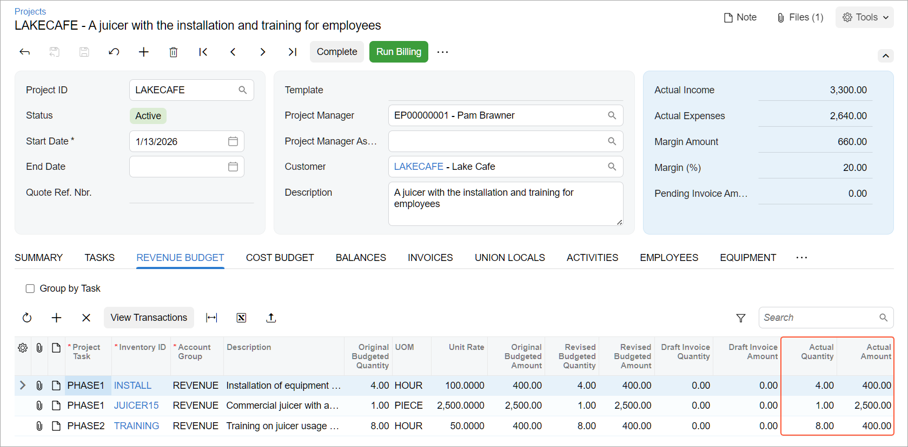

# Project Budget: To Restructure the Budget {#_d14c0111-16c1-3485-a86e-d9cecd43d3c0 .task}

This activity will walk you through the process of reestablishing the budget structure of a project.

**Attention:** This activity is based on the *U100* dataset. If you are using another dataset or if any system settings have been changed in *U100*, these changes can affect the workflow of the activity and the results of the processing. To avoid issues, restore the *U100* dataset to its initial state.

## Story { .section}

Suppose that the Lake Cafe customer has ordered a juicer, along with the services of installation and training of employees on operating the juicer from the SweetLife Fruits &amp; Jams company. SweetLife's project accountant has decided that the revenue budget level of the project should include inventory items, created the project to account for the provided material and work, and entered project transactions.

Suppose that later the project accountant realizes that an extra level of detail of the revenue budget is not necessary. After restructuring the revenue budget and removing inventory items from the budget detail, the project accountant bills the customer. After the billing, it becomes clear that the previous level of detail of the revenue budget fitted the reporting requirements better and it is necessary to restructure the budget again.

Acting as the project accountant, you will restructure the project budget before and after the billing.

## Configuration Overview { .section}

In the *U100* dataset, the following tasks have been performed to support this activity:

-   On the [Enable/Disable Features](CS_10_00_00.md) \(CS100000\) form, the *Projects* feature has been enabled to support the project management functionality.
-   On the [Projects](PM_30_10_00.md) \(PM301000\) form, the *LAKECAFE* project has been created and the *PHASE1* and *PHASE2* project tasks have been created for the project. The *Task and Item* revenue budget level has been specified for the project and three revenue budget lines have been added.
-   On the [Project Transactions](PM_30_40_00.md) \(PM304000\) form, the *PM00000024* batch of project transactions related to the project has been created and released.

## Process Overview { .section}

You will adjust the project budget and save project budget revisions on the [Projects](PM_30_10_00.md) \(PM301000\) form. On the same form, you will initiate the project billing. You will complete the billing on the [Invoices and Memos](AR_30_10_00.md) \(AR301000\) form. You will then adjust the project budget one more time on the [Projects](PM_30_10_00.md) form and recalculate the project balances on the [Recalculate Project Balances](PM_50_40_00.md) \(PM504000\) form.

## System Preparation { .section}

To sign in to the system and prepare to perform the instructions of the activity, do the following:

1.  Download the [LAKECAFE\_Budget\_1.xlsx](Files/LAKECAFE_Budget_1.xlsx) and [LAKECAFE\_Budget\_2.xlsx](Files/LAKECAFE_Budget_2.xlsx) files to your computer.
2.  Launch the Acumatica ERP website, and sign in to a company with the *U100* dataset preloaded; you should sign in as project accountant by using the *brawner* username and the *123* password.
3.  In the info area at the upper-right corner of the top pane of the Acumatica ERP screen, make sure that the business date is set to *1/30/2026*. If a different date is displayed, click the Business Date menu button and select *1/30/2026* from the calendar. For simplicity, you'll create and process all documents in this activity using this business date.

## Step 1: Restructuring the Project Budget { .section}

To save the original version of the project budget and restructure the budget, do the following:

1.  Open the [Projects](PM_30_10_00.md) \(PM301000\) form.
2.  In the **Project ID** box, select *LAKECAFE*.
3.  To create a backup of the original revenue budget of the project, do the following:
    1.  On the table toolbar of the **Revenue Budget** tab, click **Export to Excel**.

        The system exports the revenue budget to an Excel file.

    2.  On your computer, locate the created file, and rename it to `LAKECAFE_Revenue_Budget_1.xlsx`.
4.  To attach to the project the file with the exported revenue budget, do the following:
    1.  On the form title bar, click **Files**.
    2.  In the **Files** dialog box, click **Upload Files**, and select the `LAKECAFE_Revenue_Budget_1.xlsx` file that you have just downloaded.

        The system uploads the selected file to the project and shows the file in the table of the dialog box.

    3.  In the line with the uploaded `LAKECAFE_Revenue_Budget_1.xlsx` file, click the *Edit* link.
    4.  On the **Versions** tab of the [File Maintenance](SM_20_25_10.md) \(SM202510\) form, which opens, enter `Revision 1 of the revenue budget` in the **Comment** column for the uploaded file.
    5.  Save your changes to the file, and close the browser tab with the [File Maintenance](SM_20_25_10.md) form to return to the [Projects](PM_30_10_00.md) form.
    6.  Close the **Files** dialog box.
5.  On the **Revenue Budget** tab, delete each of the three budget lines by clicking the line and then clicking **Delete Row** on the table toolbar.
6.  On the **Summary** tab \(**Project Properties** section\), select *Task* as the **Revenue Budget Level**.
7.  On the table toolbar of the **Revenue Budget** tab, click **Load Records from File**, and upload the revenue budget from the `LAKECAFE_Budget_1.xlsx` file, which you have downloaded with the course. While you are uploading the lines, leave the default column mapping.

    The uploaded revenue budget should have two lines with the budgeted amounts of $2,900 and $400.

8.  Save your changes to the project.

You have restructured the revenue budget of the project and attached previous budget revision to the project. In the next step, you will bill the project.

## Step 2: Billing the Project { .section}

To bill the project, do the following:

1.  While remaining on the [Projects](PM_30_10_00.md) \(PM301000\) form, on the form toolbar, click **Run Billing**.

    The system creates an accounts receivable invoice and opens it on the [Invoices and Memos](AR_30_10_00.md) \(AR301000\) form.

2.  On the form toolbar, click **Remove Hold** to assign the invoice the *Balanced* status, and then click **Release** to release the accounts receivable invoice.
3.  Close the form and return to the [Projects](PM_30_10_00.md) form with the *LAKECAFE* project selected.
4.  Press Esc to refresh the form.

You have billed the project. In the next step, you will restructure the revenue budget of the project again.

## Step 3: Restructuring the Project Budget After Billing { .section}

To perform one more budget revision after billing, while you are still viewing the *LAKECAFE* project on the [Projects](PM_30_10_00.md) \(PM301000\) form, do the following:

1.  To create a backup of the current revision of the revenue budget of the project, do the following:
    1.  On the table toolbar of the **Revenue Budget** tab, click **Export to Excel**.

        The system exports the revenue budget to an Excel file.

    2.  On your computer, locate the created file and rename it to `LAKECAFE_Revenue_Budget_2.xlsx`.
2.  To upload the current revision of the revenue budget of the project to the file with the original revenue budget, do the following:
    1.  On the form title bar, click **Files**.
    2.  In the line with the uploaded `LAKECAFE_Revenue_Budget_1.xlsx` file, click the *Edit* link.
    3.  On the form toolbar of the [File Maintenance](SM_20_25_10.md) \(SM202510\) form, which opens, click **Upload New Version**.
    4.  In the **File Upload** dialog box, which opens, select **Upload File** click the area right of the **Choose File**, and select the `LAKECAFE_Revenue_Budget_2.xlsx` file you have downloaded.
    5.  Click **Upload** to upload the selected file.

        The system uploads the selected file as a new file version and closes the dialog box.

    6.  On the **Versions** tab of the [File Maintenance](SM_20_25_10.md) form, enter `Revision 2 of the revenue budget` in the **Comment** column for the uploaded file with the **Version ID** of *2*.
    7.  Save your changes to the file, and close the browser tab with the [File Maintenance](SM_20_25_10.md) form to return to the project on the [Projects](PM_30_10_00.md) form.
    8.  Close the **Files** dialog box, and press Esc to refresh the form.
3.  On the **Revenue Budget** tab, make sure the revenue budget lines have nonzero amounts in the **Actual Amount** column that the system updated during the project billing.
4.  Delete each of the two budget lines by clicking the line and then clicking **Delete Row** on the table toolbar.
5.  On the **Summary** tab \(**Project Properties** section\), select *Task and Item* as the **Revenue Budget Level**.
6.  On the table toolbar of the **Revenue Budget** tab, click **Load Records from File**, and upload the revenue budget from the `LAKECAFE_Budget_2.xlsx` file, which you have downloaded with the course. While you are uploading the lines, leave the default column mapping.

    The uploaded revenue budget should have three lines with the budgeted amounts of *400*, *2,500*, and *400*. Notice the revenue budget lines now have *0* in the **Actual Amount** and **Actual Quantity** columns. Now you need to validate the project balances to recalculate the revenue budget in accordance with the related invoices.

7.  Save your changes to the project.
8.  On the More menu, under **Budget Operations**, click **Recalculate Project Balance**.

    The system validates the balances of the *LAKECAFE* project and recalculates the amounts and quantities affected by invoices. On the **Revenue Budget** tab, review the revenue budget. Notice that the system has updated the actual amounts and quantities of the budget lines, as shown below.

    

You have finished restructuring of the project budget and have validated the budget's actual values.

**Parent topic:**[Managing the Project Budget](../UserGuide/Projects_Budget_Mapref.md)

