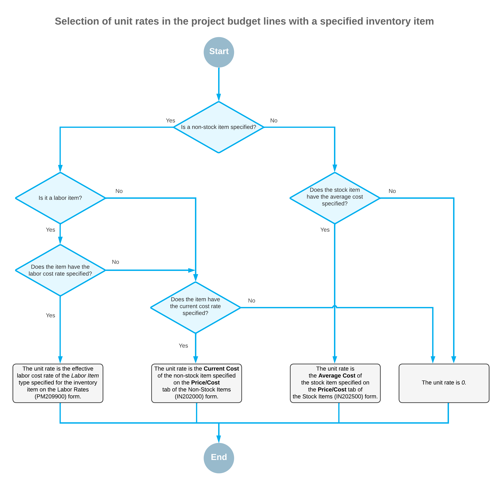

# Project Budget: Unit Rate in Budget Lines {#_c12cd234-2ac9-2147-a687-fa3ccdaa1e29 .concept}

The following sections describe the rules that the system uses for selecting the unit rate to be inserted in budget lines.

## New Revenue Budget Lines { .section}

When you select an inventory item in a newly created revenue budget line—that is, a line with an account group of the income type on the **Revenue Budget** tab of the [Projects](PM_30_10_00.md) \(PM301000\) form—the system automatically fills in the unit rate of the line with the applicable item price. The system searches for a price of the inventory item that is effective on the start date of the project. For more details on how the system searches for the price, see [Sales Prices: Rules of Price Selection](Prices_Sales_Price_Selection_GeneralInfo.md).

If the *Multicurrency Projects* feature is enabled on the [Enable/Disable Features](CS_10_00_00.md) \(CS100000\) form, the system searches for an applicable sales price in the project currency by using the rate that is effective on the start date of the project. The project currency is specified in the **Project Currency** box on the **Summary** tab of the [Projects](PM_30_10_00.md) form. For more information, see [Multicurrency Projects: Unit Rates in the Project Budget](Projects_Multicurrency_Projects_UnitRates.md).

## New Cost Budget Lines { .section}

When you select an inventory item in a newly created cost budget line—that is, a line with the account group of the expense type on the **Cost Budget** tab of the [Projects](PM_30_10_00.md) \(PM301000\) form—the system automatically fills in the unit rate of the line with the applicable item cost. The system searches for the applicable item cost depending on the type of the item selected in the line:

-   For a stock item, the system inserts the **Average Cost** of the item from the **Price/Cost** tab of the [Stock Items](IN_20_25_00.md) \(IN202500\) form.
-   For a non-stock item with the *Labor* type selected in the **Type** box on the **General** tab \(**Item Defaults** section\) of the [Non-Stock Items](IN_20_20_00.md) \(IN202000\) form, the system searches for the applicable labor cost rate. That is, it searches for a rate of the *Labor Item* type on the [Labor Rates](PM_20_99_00.md) \(PM209900\) form that is associated with the same inventory item and has an effective date that is after the document date or the start date of project.
-   For other types of non-stock items \(and for non-stock items with the *Labor* type if no effective labor cost rate was found\), the system specifies the **Current Cost** of the item from the **Price/Cost** tab of the [Non-Stock Items](IN_20_20_00.md) form.
-   If no applicable price has been found, the system inserts *0* as the unit rate.

If no applicable price has been found, the system inserts *0* as the unit rate.

The following diagram illustrates the logic the system uses to select the cost for an inventory item.

## Budget Lines Based on a Project Quote { .section}

If the *Project Quotes* feature is enabled on the [Enable/Disable Features](CS_10_00_00.md) \(CS100000\) form and a project was created based on a project quote, in each created budget line on the [Projects](PM_30_10_00.md) \(PM301000\) form, the system inserts the unit rate as follows:

-   In a cost budget line, the unit rate is inserted based on the unit cost of the corresponding estimation line of the project quote on the **Estimation** tab of the [Project Quotes](PM_30_45_00.md) \(PM304500\) form.
-   In a revenue budget line, the system calculates the unit rate based on the values in the estimation lines of the project quote on the **Estimation** tab of the [Project Quotes](PM_30_45_00.md) form by using the following formula: `Unit Rate = Amount / Quantity`, where `Amount = Ext. Price – Discount Amount`.

## Budget Lines Based on a Change Order { .section}

If the *Change Orders* feature is enabled on the [Enable/Disable Features](CS_10_00_00.md) \(CS100000\) form and the **Change Order Workflow** check box is selected for the project on the **Summary** tab of the [Projects](PM_30_10_00.md) \(PM301000\) form, in each created budget line of the project, the system specifies the unit rates as follows:

-   In a cost budget line created based on the change order, the unit rate is copied from the corresponding change order line.
-   In a revenue budget line created based on the change order, the unit rate is copied from the corresponding change order line.

**Parent topic:**[Managing the Project Budget](../UserGuide/Projects_Budget_Mapref.md)

