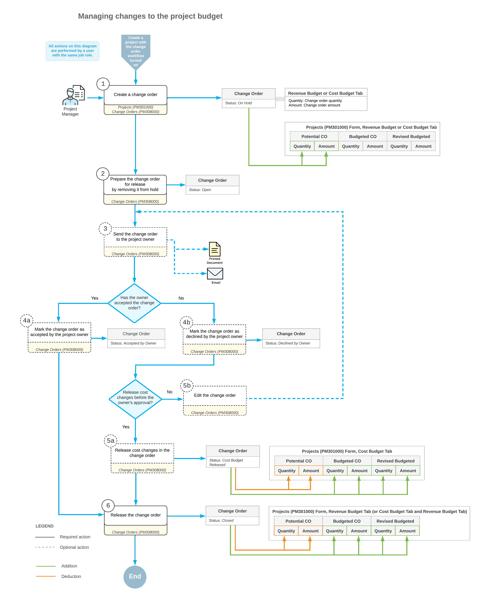

# Single-Tier Change Management: General Information {#_63a25b5a-d87a-1234-bbd1-03a8937d40cd .concept}

In Acumatica ERP, you can use change orders to track changes to a project's budgeted and committed values and to control the profitability of each customer-initiated change. A change order is a document used for profitability analysis and for auditing changes to the project’s revenue budget, commitments, and cost budget.

Change orders do not directly alter the original project values. They are tracked in separate project budget columns.

## Learning Objectives { .section}

In this chapter, you will learn how to do the following:

-   Create a change order class
-   Create a change order for a project
-   Update a project budget with change orders
-   Review the changes in a project budget
-   Prevent direct purchases for a project
-   Cancel a change order

## Applicable Scenarios { .section}

You want to control and track changes to the project budget and commitments at the budget level. To modify the project budget, you create change orders—which don’t alter the original budgeted and committed values.

You want to prevent the direct creation of purchase orders for a project and instead create them through change orders. This approach tracks purchases as changes to the project budget.

## Change Order Classes {#section_qkr_hkx_mcb .section}

A change order class determines which project data—the revenue budget, the cost budget, commitments, or any combination of these—can be adjusted with a change order of this class.

You must specify a change order class for each change order, so before change orders are created, you need to create change order classes on the [Change Order Classes](PM_20_30_00.md) \(PM203000\) form.

To allow users to modify specific types of data by using a change order of a class, you select any combination of the following check boxes for the class:

-   **Revenue Budget**: Allows changes to the revenue budget
-   **Cost Budget**: Allows changes to the cost budget
-   **Commitments**: Allows changes to committed values. For details, see [Change Orders for Commitments: General Information](Projects_Changes_to_Commitments_GeneralInfo.md).

For revenue change orders, you can release cost budget and commitment changes before releasing revenue budget changes.

Change order classes also let you group change orders by their impact on projects. For example, you can break down changes by class in reports to analyze which types of changes most affect project profitability.

Once you’ve created change order classes, you can specify the default change order class for new change orders. You select this class in the **Default Change Order Class** box on the **General** tab of the [Projects Preferences](PM_10_10_00.md) \(PM101000\) form.

In a new change order, you can override the default change order class. If no default change order class has been specified on the [Projects Preferences](PM_10_10_00.md) form, you must select the class manually on the [Change Orders](PM_30_80_00.md) \(PM308000\) form.

## Preparing the System for the Change Order Workflow {#section_pbd_zbq_mcb .section}

To make it possible for users to track a project’s changes by using change orders, you select the **Change Order Workflow** check box on the **Summary** tab of the [Projects](PM_30_10_00.md) \(PM301000\) form.

Once you’ve turned on this workflow for a project, you can create a change order for it on the [Projects](PM_30_10_00.md) form by clicking **Create Change Order** on the More menu. The system creates a change order on the [Change Orders](PM_30_80_00.md) \(PM308000\) form with the *On Hold* status and the project selected and opens it.

**Tip:** You can view a project’s latest change order number in the **Last Revenue Change Order Nbr.** box \(**Summary** tab\) of the [Projects](PM_30_10_00.md) form.

## General Steps of Managing Changes to the Project Budget { .section}

Managing changes to the project budget consists of the following general steps:

1.  Creating a change order by using the [Projects](PM_30_10_00.md) \(PM301000\) or [Change Orders](PM_30_80_00.md) \(PM308000\) form. For details, see [Single-Tier Change Management: Creating a Change Order](Projects_CO_Creation.md).
2.  Preparing the change order for release by clicking **Remove Hold** on the form toolbar.
3.  Optional: Sending the change order to the project owner \(a customer contact\) by clicking **Send to Owner** on the More menu.

    **Tip:** The customer contact is specified on the **Mailing &amp; Printing** tab of the [Projects](PM_30_10_00.md) form.

4.  Optional: Marking the change order as accepted by the project owner. To do this, you click **Mark as Accepted** on the More menu.
5.  Optional: Releasing only cost changes in the change order by clicking **Release Costs Only** on the More menu. For details, see [Single-Tier Change Management: Releasing Costs Only](Projects_CO_Cost_Release.md).

    **Tip:** You can release the cost changes while a change order has the *Open* or *Sent to Owner* status and the project owner's approval is pending.

6.  Releasing revenue changes in the change order by clicking **Release** on the form toolbar. For details, see [Single-Tier Change Management: Budget Update on Change Order Release](Projects_CO_Budget_Update_On_Release.md).

**Attention:** You can cancel a change order by clicking **Cancel** on the form toolbar of the [Change Orders](PM_30_80_00.md) form. The system assigns the change order the *Canceled* status and decreases the project’s potential change order \(CO\) values of the corresponding revenue and cost budget lines on the [Projects](PM_30_10_00.md) form.

## Workflow of Managing Changes to the Project Budget {#section_i2l_d4p_mcb .section}

The following diagram illustrates the workflow of managing changes to the project budget.

**Parent topic:**[Tracking Changes to the Project Budget](../UserGuide/Projects_CO_Mapref.md)

