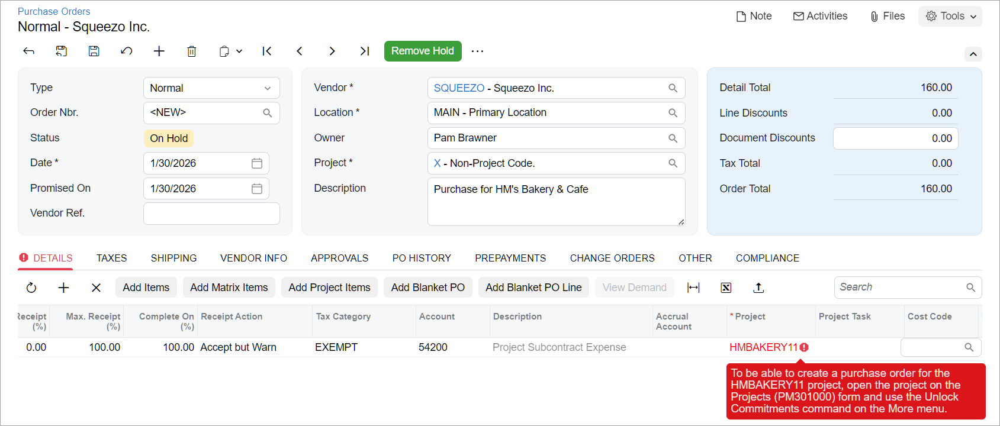

# Single-Tier Change Management: To Prevent Direct Changes to Commitments {#_c1180e6e-0253-8371-9119-8cad0ac11a6a .task}

If you want to manage changes to a project's committed values, you can prevent the creation of purchase orders for the project on the [Purchase Orders](PO_30_10_00.md) \(PO301000\) form and create new commitments by using change orders.

**Attention:** This activity is based on the *U100* dataset. If you are using another dataset or if any system settings have been changed in *U100*, these changes can affect the workflow of the activity and the results of the processing. To avoid issues, restore the *U100* dataset to its initial state.

## Story { .section}

Suppose that the HM's Bakery and Cafe customer has ordered a juicer from the SweetLife Fruits &amp; Jams company, along with the services of installation and training for its employees on operating the juicer. SweetLife has contracted the Squeezo Inc. vendor to perform the installation. The project accountant of SweetLife has created a project with tasks corresponding to the installation and training phases.

Acting as the project accountant, you need to purchase the installation service from the vendor. When you purchase the budgeted service, you will lock the commitments for the project to prevent the direct processing of purchase orders for the project.

## Configuration Overview { .section}

In the *U100* dataset, the following tasks have been performed to support this activity:

-   On the [Enable/Disable Features](CS_10_00_00.md) \(CS100000\) form, the following features have been enabled:
    -   *Projects*, which provides support for the project management functionality
    -   *Change Orders*, which gives you the ability to manage changes to the project’s budgeted and committed values
    -   *Inventory and Order Management*, which provides the functionality of purchase orders
-   On the [Projects](PM_30_10_00.md) \(PM301000\) form, the *HMBAKERY11* project has been created and the *PHASE1* \(for installation\) and *PHASE2* \(for training\) project tasks have been created for the project. *PHASE1* is the default task of the project. The cost budget of the project has not been configured.
-   On the [Non-Stock Items](IN_20_20_00.md) \(IN202000\) form, the *INSTALL* non-stock item has been created.
-   On the [Vendors](AP_30_30_00.md) \(AP303000\) form, the *SQUEEZO* vendor has been created.

## Process Overview { .section}

In this activity, you will create a purchase order for the project on the [Purchase Orders](PO_30_10_00.md) \(PO301000\) form. You will then lock the project commitments on the [Projects](PM_30_10_00.md) \(PM301000\) form to prevent the creation of purchase orders for the project on the [Purchase Orders](PO_30_10_00.md) form.

## System Preparation { .section}

To sign in to the system and prepare to perform the instructions of the activity, do the following:

1.  Launch the Acumatica ERP website, and sign in to a company with the *U100* dataset preloaded; you should sign in as project accountant by using the *brawner* username and the *123* password.
2.  In the info area at the upper-right corner of the top pane of the Acumatica ERP screen, make sure that the business date is set to *1/30/2026*. If a different date is displayed, click the Business Date menu button and select *1/30/2026* from the calendar. For simplicity, you'll create and process all documents in this activity using this business date.
3.  Open the [Projects Preferences](PM_10_10_00.md) \(PM101000\) form, and on the **General** tab select the **Internal Cost Commitment Tracking** check box to expose commitments and committed values in the project budget, and save your changes to the project accounting preferences.

## Step 1: Creating a Purchase Order for the Project { .section}

To create a purchase order for the project, do the following:

1.  On the [Purchase Orders](PO_30_10_00.md) \(PO301000\) form, create a purchase order, and specify the following settings in the Summary area:
    -   **Vendor**: *SQUEEZO*
    -   **Description**: `Purchase for HM's Bakery & Cafe`
2.  On the **Details** tab, click **Add Row** on the table toolbar, and specify the following settings in the row:
    -   **Inventory ID**: *INSTALL*
    -   **Order Qty.**: `4.00`
    -   **Project**: *HMBAKERY11*
    -   **Project Task**: *PHASE1* \(inserted automatically\)
    -   **Cost Code**: *00-000*
3.  On the form toolbar, click **Remove Hold**. The system assigns the purchase order the *Open* status.

    When the *Open* status is assigned to the purchase order, the system updates the committed values of the project.

4.  On the [Projects](PM_30_10_00.md) \(PM301000\) form, open the *HMBAKERY11* project, and review the cost budget on the **Cost Budget** tab. Notice that the original committed quantity and amount of the budget line with the *PHASE1* project task and the *INSTALL* inventory item are *4* and *320.00*, respectively.

## Step 2: Locking Commitments for the Project { .section}

To prevent the direct creation of purchase orders for the project, do the following:

1.  While you are still reviewing the *HMBAKERY11* project on the [Projects](PM_30_10_00.md) \(PM301000\) form, on the More menu, click **Lock Commitments**.
2.  On the [Purchase Orders](PO_30_10_00.md) \(PO301000\) form, create a purchase order, and specify the following settings:
    -   **Vendor**: *SQUEEZO*
    -   **Description**: `Purchase for HM's Bakery & Cafe`
3.  On the **Details** tab, click **Add Row**, and specify the following settings in the row:

    -   **Inventory ID**: *INSTALL*
    -   **Order Qty.**: `2.00`
    -   **Project**: *HMBAKERY11*
    When you select the project, the system shows an error message in the **Project** column that says you cannot create purchase order commitments for this project because the commitments are locked for the project \(see below\).

    

    **Tip:** Until you unlock the commitments for the project, you can process new purchases for the project only with change orders.

4.  Close the form without saving the purchase order, which was created solely for testing purposes.
5.  On the **General** tab \(**General Settings** section\) of the [Projects Preferences](PM_10_10_00.md) \(PM101000\) form, clear the **Internal Cost Commitment Tracking** check box, and save your changes to the project accounting preferences.

**Parent topic:**[Tracking Changes to the Project Budget](../UserGuide/Projects_CO_Mapref.md)

