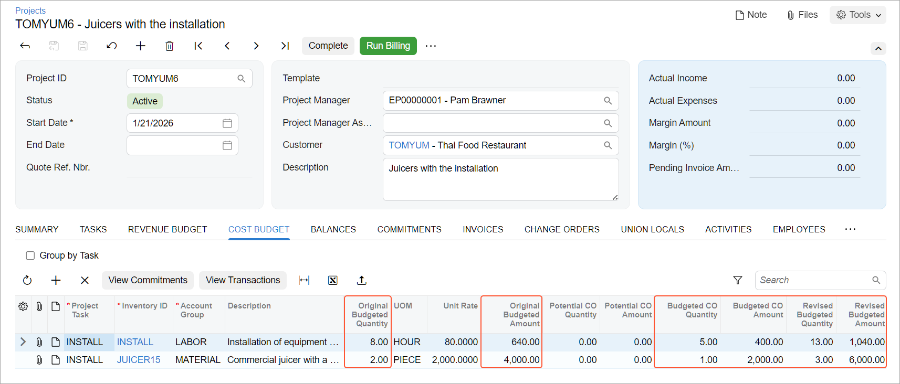

# Single-Tier Change Management: To Track Changes to the Project Budget {#_fb50755a-1813-46fd-9fe8-dfabb321b137 .task}

In this activity, you will learn how you can turn on the change order workflow for a project and manage changes to the project’s budgeted values by creating change orders.

**Attention:** This activity is based on the *U100* dataset. If you are using another dataset or if any system settings have been changed in *U100*, these changes can affect the workflow of the activity and the results of the processing. To avoid issues, restore the *U100* dataset to its initial state.

## Story { .section}

Suppose that the Thai Food Restaurant customer has ordered two juicers, along with eight hours of the installation service from the SweetLife Fruits &amp; Jams company. SweetLife's project accountant has created a project and configured the revenue and cost budgets based on the agreement reached with the customer. During project execution, the customer requests one more juicer, along with the installation, as a part of the same project. The project accountant has estimated that the installation of this additional juicer will require five hours of the installation service. Also, the project accountant has decided to track these changes to the project at the budget level because the installation of the third juicer was not planned initially.

Acting as the project accountant, you will turn on the change order workflow for the project to be able to track changes to the project budget. Then you will create a change order to update the project budget according to the customer's request and to reflect these changes at the project budget level.

## Configuration Overview { .section}

In the *U100* dataset, the following tasks have been performed to support this activity:

-   On the [Enable/Disable Features](CS_10_00_00.md) \(CS100000\) form, the following features have been enabled:
    -   *Projects*, which provides support for the project management functionality
    -   *Change Orders*, which gives you the ability to manage changes to the project’s budgeted and committed values
-   On the [Projects](PM_30_10_00.md) \(PM301000\) form, the *TOMYUM6* project has been created and the *INSTALL* project task has been created for the project.
-   On the [Change Order Classes](PM_20_30_00.md) \(PM203000\) form, the *DEFAULT* change order class has been created.
-   On the [Projects Preferences](PM_10_10_00.md) \(PM101000\) form, the *DEFAULT* change order class has been selected in the **Default Change Order Class** box on the **General** tab \(**General Settings** section\).

## Process Overview { .section}

In this activity, you will turn on the change order workflow for the project on the [Projects](PM_30_10_00.md) \(PM301000\) form. Then you will create and process a change order for the project on the [Change Orders](PM_30_80_00.md) \(PM308000\) form. Finally, you will review how the changes have affected the values in the project budget.

## System Preparation { .section}

To sign in to the system and prepare to perform the instructions of the activity, do the following:

1.  Launch the Acumatica ERP website, and sign in to a company with the *U100* dataset preloaded; you should sign in as Pam Brawner by using the *brawner* username and the *123* password.
2.  In the info area at the upper-right corner of the top pane of the Acumatica ERP screen, make sure that the business date is set to *1/30/2026*. If a different date is displayed, click the Business Date menu button and select *1/30/2026* from the calendar. For simplicity, you'll create and process all documents in this activity using this business date.

## Step 1: Turning on the Change Order Workflow for the Project { .section}

To turn on the change order workflow for the project, which makes it possible to create change orders for the project, do the following:

1.  On the [Projects](PM_30_10_00.md) \(PM301000\) form, open the *TOMYUM6* project.
2.  On the **Summary** tab, select the **Change Order Workflow** check box to turn on the change order workflow for the project.
3.  Save your changes to the project.

    Since you turned on the change order workflow for the project, the **Revised Budgeted Quantity** and **Revised Budgeted Amount** columns on the **Revenue Budget** and **Cost Budget** tabs have become read-only. Now you can make changes to these values only by using the change orders.

## Step 2: Creating a Change Order for the Project { .section}

To make changes to the project budget by creating a change order, do the following:

1.  While you are remaining on the [Projects](PM_30_10_00.md) \(PM301000\) form with the *TOMYUM6* project selected, on the More menu, click **Create Change Order**. The system creates a change order for the project and opens it on the [Change Orders](PM_30_80_00.md) \(PM308000\) form.

    Notice that the system has automatically selected the *DEFAULT* change order class for the change order because this class is the default change order class specified on the [Projects Preferences](PM_10_10_00.md) \(PM101000\) form.

2.  In the Summary area of this form, in the **Description** box, enter `One more juicer with installation requested by the customer`.
3.  On the **Revenue Budget** tab, click **Add Row** on the table toolbar and specify the following settings in the row:
    -   **Project Task**: *INSTALL*
    -   **Account Group**: *REVENUE*
    -   **Description**: `Additional juicer with installation`
    -   **Amount**: `2900`

        When you enter the **Amount** of the line, which represents the additional revenue, the system calculates the **Revised Budgeted Amount** as the sum of the **Original Budgeted Amount** and the **Amount**.

4.  On the table toolbar of the **Cost Budget** tab, click **Add Budget Lines**.
5.  In the **Add Budget Lines** dialog box, which opens, select the unlabeled check box for both cost budget lines, and click **Add Lines &amp; Close**.

    The system closes the dialog box and adds the selected lines to the change order.

6.  In the added budget line with the *LABOR* account group \(which is the line for the *INSTALL* item\), enter `5` in the **Quantity** column.
7.  In the line with the *MATERIAL* account group \(which is the line for the *JUICER15* item\), enter `1` in the **Quantity** column.

    The system automatically calculates the **Amount** value based on the **Unit Rate** value of the line, which is inherited from the project budget line. In the line, the system also calculates the **Revised Budgeted Quantity** value as the sum of the **Original Budgeted Quantity** and **Quantity** values, and it calculates the **Revised Budgeted Amount** value as the sum of the **Original Budgeted Amount** and **Amount** values.

    When you specify changes to the project budget, the revenue budget change total in the Summary area becomes $2,900 and the cost budget change total becomes $2,400. Until you release the change order, these changes will not affect the project budget.

8.  Save your changes to the change order.
9.  On the More menu, click **Print** to print the change order.

    The system navigates to the [Change Order](PM_64_30_00.md) \(PM643000\) report, which is a ready-to-print version of the change order. The printed form lists the revenue budget lines of the change order, which the customer might need to review and agree to.

10. Click Back in the browser tab to return to the change order on the [Change Orders](PM_30_80_00.md) form.
11. On the form toolbar, click **Remove Hold** to assign the change order the *Open* status. Then click **Release** to release the change order.
12. On the [Projects](PM_30_10_00.md) form, open the *TOMYUM6* project.
13. On the **Change Orders** tab, make sure the change order you have created is shown. The change order has the *Closed* status.
14. On the **Cost Budget** tab, review the cost budget lines that have been updated by the change order you have processed, as shown below.

    The system has calculated the **Revised Budgeted Quantity** as the sum of the **Original Budgeted Quantity** and the **Budgeted CO Quantity**, and it has calculated the **Revised Budgeted Amount** as the sum of the **Original Budgeted Amount** and the **Budgeted CO Amount** \(see below\). The **Budgeted CO Quantity** and **Budgeted CO Amount** are the quantity and amount of the change order.

    

You have processed a change order for the project.

**Parent topic:**[Tracking Changes to the Project Budget](../UserGuide/Projects_CO_Mapref.md)

