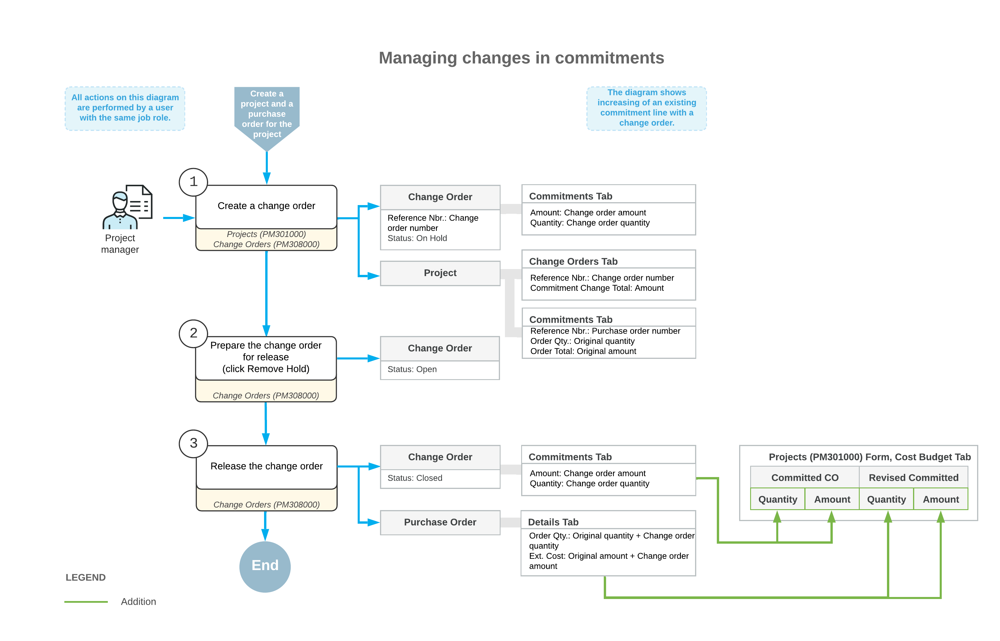

# Change Orders for Commitments: General Information {#_63a25b5a-d87a-2856-bbd1-03a8937d40cd .concept}

By using the change order functionality in Acumatica ERP, you can manage changes to a project's committed values if the commitment functionality has been configured for project accounting. For more information on commitments, see [Committed Costs: General Information](Projects_Commitments_GeneralInfo.md).

## Learning Objectives {#section_yfs_nsf_k5b .section}

In this chapter, you will learn how to do the following:

-   Create a change order class for tracking commitments
-   Update cost commitments with a change order
-   Review the changes to the project budget that have been made with change orders
-   Make changes to closed commitments

## Applicable Scenarios {#section_w21_lsf_k5b .section}

You turn on the change order workflow for a project and enable commitment tracking if you want to distinguish purchases within the cost budget of a project, control changes made to the committed values of the project budget, and track these changes at the budget level. To make changes to the project budget, you create change orders, which do not alter the original committed values.

## Configuration of a Change Order Class {#section_stz_rqr_lsb .section}

If the **Internal Cost Commitment Tracking** check box is selected on the **General** tab \(**General Settings** section\) of the [Projects Preferences](PM_10_10_00.md) \(PM101000\) form, the system exposes commitments on the [Commitments](PM_30_60_00.md) \(PM306000\) form. To allow users to make changes to commitments, you configure a change order class on the [Change Order Classes](PM_20_30_00.md) \(PM203000\) form. On this form, you select the **Commitments** check box to allow changes to committed values.

## Change Orders for Project Commitments {#section_pbd_zbq_mcb .section}

You can track changes to project commitments that have been created based on project-related subcontracts and purchase orders that have the *Normal* and *Project Drop-Ship* type.

**Tip:** Subcontracts are available in the system if the *Construction* feature is enabled on the [Enable/Disable Features](CS_10_00_00.md) \(CS100000\) form. For more information about the processing of subcontracts, see [Subcontracts: General Information](Construction_Subcontracts_GeneralInfo.md).

On the [Change Orders](PM_30_80_00.md) \(PM308000\) form, in a change order with the *On Hold* status, you can process the following changes to a project's committed values:

-   Creating a new purchase order or subcontract for a project
-   Adding a new line to an existing purchase order or subcontract
-   Adjusting an existing purchase order or subcontract by adding a new negative line
-   Making an addition to or deduction from an existing purchase order or subcontract with a positive or negative amount

    **Attention:** The amount of a negative change order line may not exceed the **Line Total** amount of the purchase order.

-   Making an addition to or deduction from an existing purchase order line or subcontract line with a positive or negative amount

    **Attention:** The quantity and amount of a negative change order line may not exceed the received or billed quantities and amounts of the purchase order.

-   Reopening a purchase order or subcontract

When you release the change order, based on the **Quantity** and **Amount** of a commitment line on the **Commitments** tab of the [Change Orders](PM_30_80_00.md) form, the system updates the related commitment document or creates a new one, depending on the type of the commitment line, and updates the **Committed CO Quantity**, **Committed CO Amount**, **Revised Committed Quantity** and **Revised Committed Amount** of the corresponding cost budget line of the project on the [Projects](PM_30_10_00.md) \(PM301000\) form. For more information, see [Change Orders for Commitments: Commitment Updates on Release of Change Orders](Projects_Changes_to_Commitments_Document_Update.md).

## Workflow of Managing Changes to Commitments { .section}

The following diagram illustrates the workflow of managing changes to commitments.

**Parent topic:**[Tracking Changes to Commitments](../UserGuide/Projects_Changes_to_Commitments_Mapref.md)

