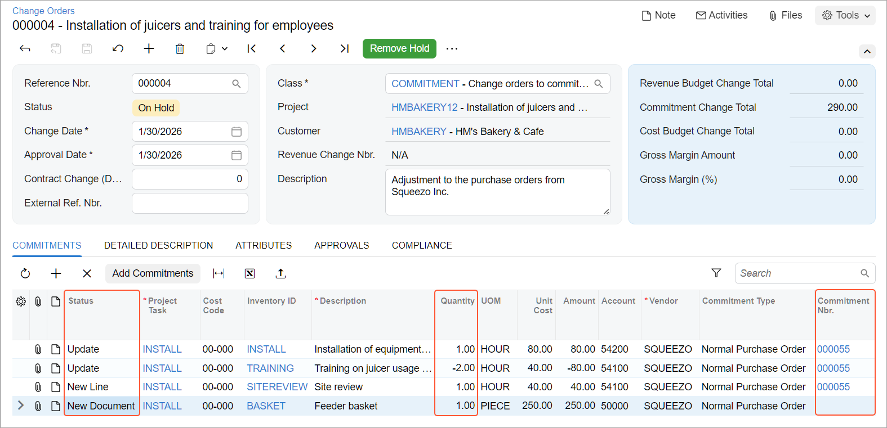
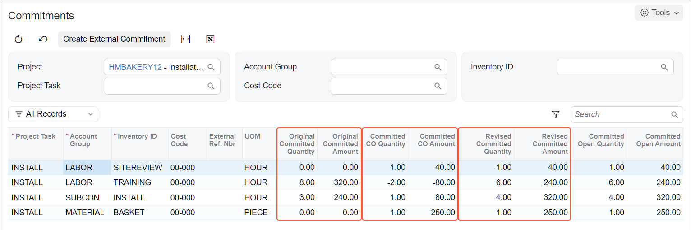

# Change Orders for Commitments: Process Activity {#_fb50755a-1813-46fd-9fe8-dfaccc21b137 .task}

In this activity, you will learn how you can track changes to project commitments with change orders.

## Story { .section}

Suppose that the HM's Bakery and Cafe customer has ordered the services of installation and employee training on operating the previously bought juicer from the SweetLife Fruits &amp; Jams company. The project accountant of SweetLife has created the project in Acumatica ERP and ordered the following services from the Squeezo Inc. vendor:

-   Three hours of juicer installation
-   Eight hours of training on operating the juicer

The vendor has provided the services. Acting as the project accountant, you will create a purchase order with both of the provided services in the appropriate quantities. You will then receive the invoice from the vendor and realize that the quantity of the provided services differs from the quantity of the ordered services as follows:

-   An hour of an additional service, the site review, was provided.
-   The vendor also provided and installed a feeder basket for the juicer.
-   The installation took one hour more than the ordered number of hours.
-   The training took two hours less than the ordered number of hours.

Per the agreement with the vendor, you will adjust the provided services within the created purchase order and create a new purchase order for the feeder basket.

## Configuration Overview { .section}

In the *U100* dataset, the following tasks have been performed to support this activity:

-   On the [Enable/Disable Features](CS_10_00_00.md) \(CS100000\) form, the following features have been enabled:
    -   *Projects*, which provides support for the project management functionality
    -   *Change Orders*, which gives you the ability to manage changes to the project’s budgeted and committed values
    -   *Inventory and Order Management*, which provides the functionality of purchase orders
-   On the [Projects](PM_30_10_00.md) \(PM301000\) form, the *HMBAKERY12* project has been created and the *INSTALL* project task has been created for the project. This project task is also the default task of the project. On the **Summary** tab of the form \(**Project Properties** section\), the **Change Order Workflow** check box is selected for the project so that users can track all the changes to the budgeted values by using change orders.
-   On the [Non-Stock Items](IN_20_20_00.md) \(IN202000\) form, the *SITEREVIEW*, *INSTALL*, and *TRAINING* non-stock items have been defined.
-   On the [Stock Items](IN_20_25_00.md) \(IN202500\) form, the *BASKET* stock item has been defined.
-   On the [Vendors](AP_30_30_00.md) \(AP303000\) form, the *SQUEEZO* vendor has been created.

## Process Overview { .section}

In this activity, you will create a purchase order on the [Purchase Orders](PO_30_10_00.md) \(PO301000\) form. On the [Commitments](PM_30_60_00.md) \(PM306000\) form, you will review the commitments that the system has made to the project based on the purchase order. You will also review the corresponding committed values of the project budget on the [Projects](PM_30_10_00.md) \(PM301000\) form. On the [Change Orders](PM_30_80_00.md) \(PM308000\) form, you will create a change order to adjust the created commitments. You will then modify and process the created change order on the [Change Orders](PM_30_80_00.md) form.

## System Preparation { .section}

To sign in to the system and prepare to perform the instructions of the activity, do the following:

1.  As a prerequisite to the current activity, perform the [Change Orders for Commitments: To Create a Change Order Class](Projects_Changes_to_Commitments_Implem_Activity.md) activity to configure the change order class for commitments.
2.  Launch the Acumatica ERP website and sign in as Pam Brawner using the *brawner* username and *123* password.
3.  In the info area at the upper-right corner of the top pane of the Acumatica ERP screen, make sure that the business date is set to *1/30/2026*. If a different date is displayed, click the Business Date menu button and select *1/30/2026* from the calendar. For simplicity, you'll create and process all documents in this activity using this business date.
4.  Open the [Projects Preferences](PM_10_10_00.md) \(PM101000\) form, and on the **General** tab \(**General Settings** section\), select the **Internal Cost Commitment Tracking** check box to expose commitments and committed values in the project budget, and save your changes to the project accounting preferences.

## Step 1: Creating Commitments for the Project { .section}

To create a purchase order for the project, which entails the creation of commitments, do the following:

1.  On the [Purchase Orders](PO_30_10_00.md) \(PO301000\) form, add a new record.
2.  In the Summary area, enter the following settings:
    -   **Vendor**: *SQUEEZO*
    -   **Description**: `Purchase for HM's Bakery and Cafe`
3.  On the **Details** tab, add two purchase order lines, and specify the settings shown in the following table in the lines you add.

    |**Inventory ID**|**Order Qty.**|**Project**|**Cost Code**|
    |----------------|--------------|-----------|-------------|
    |*INSTALL*|`3`|*HMBAKERY12*|*00-000*|
    |*TRAINING*|`8`|*HMBAKERY12*|*00-000*|

    **Tip:** The system inserts *INSTALL* as the project task in each line because this is the default task of the *HMBAKERY12* project.

4.  Save the purchase order.
5.  On the form toolbar, click **Remove Hold**. The system assigns the purchase order the *Open* status and creates commitments for the project.
6.  In the Summary area of the [Commitments](PM_30_60_00.md) \(PM306000\) form, select *HMBAKERY12* in the **Project** box, and make sure the other boxes are cleared. In the table, review the commitments that the system created when you saved the purchase order with the *Open* status. There are two commitments:
    -   The commitment with the *INSTALL* item and committed original and revised amounts of $240
    -   The commitment with the *TRAINING* item and committed original and revised amounts of $320
7.  On the [Projects](PM_30_10_00.md) \(PM301000\) form, open the *HMBAKERY12* project, and on the **Commitments** tab, notice that the project has only one related purchase order, which is the one you have just created. On the **Cost Budget** tab, review the original committed values and the revised committed values. Notice that the original committed quantity of each line equals the revised committed quantity \(8 for the *TRAINING* item and 3 for the *INSTALL* item\) and the original committed amount of each line equals the revised committed amount \($320 for the *TRAINING* item and $240 for the *INSTALL* item\).

## Step 2: Changing the Project Commitments { .section}

To change the project commitments by using a change order, do the following:

1.  While you are remaining on the [Projects](PM_30_10_00.md) \(PM301000\) form with the *HMBAKERY12* project selected, on the More menu, click **Create Change Order**. The system creates a change order and opens it on the [Change Orders](PM_30_80_00.md) \(PM308000\) form.
2.  In the Summary area, specify the following settings:
    -   **Class**: *COMMITMENT*
    -   **Description**: `Adjustment to the purchase orders from Squeezo Inc.`
3.  On the **Commitments** tab, to increase the quantity and amount of an existing line of the purchase order, do the following:
    1.  On the table toolbar, click **Add Commitments**.
    2.  In the **Add Commitments** dialog box, which opens, select the unlabeled check box in the line with the *INSTALL* inventory item and a line amount of $240, and click **Add Lines &amp; Close**.

        The system adds the selected purchase order line to the change order and closes the dialog box. Notice that the status of the added line is *Update*.

    3.  In the added line, enter `1` in the **Quantity** box.

        When you update the **Quantity** value, the system automatically calculates the **Amount** value \($80\) based on the **Unit Cost** of the line.

        The system also calculates the **Potentially Revised Quantity** value, which is 4, as the sum of the **Order Qty.** and **Quantity** values \(3 + 1\), and calculates the **Potentially Revised Amount** value, which is $320, as the sum of the **Ext. Cost** and **Amount** values \($240 + $80\).

4.  To decrease the quantity and amount of an existing line of the purchase order, do the following:
    1.  On the table toolbar, click **Add Commitments**.
    2.  In the **Add Commitments** dialog box, select the commitment with the *TRAINING* inventory item by selecting the check box in the unlabeled column, and click **Add Lines &amp; Close**.

        The system closes the dialog box and adds the selected purchase order line to the change order. Notice that the status of the added line is *Update*.

    3.  In the added line, enter `-2` in the **Quantity** column.

        When you update the **Quantity** value, the system automatically calculates the **Amount** \(-$80\), **Potentially Revised Quantity** \(6\), and **Potentially Revised Amount** \($240\) values.

5.  To add a new line to the existing purchase order, add a new row and specify the following settings for it \(see the screenshot below\):

    -   **Project Task**: *INSTALL*
    -   **Cost Code**: *00-000*
    -   **Inventory ID**: *SITEREVIEW*
    -   **Description**: `Site review`
    -   **Quantity**: `1`
    -   **Unit Cost**: `40`
    -   **Commitment Nbr.**: The reference number of the purchase order

        **Tip:** This is the same reference number as was used in the two previous lines.

    Notice that the system has assigned the line the *New Line* status.

6.  To add a new purchase order for the project, add a new row, and specify the following settings for it:

    -   **Project Task**: *INSTALL*
    -   **Cost Code**: *00-000*
    -   **Inventory ID**: *BASKET*
    -   **Description**: `Feeder basket`
    -   **Quantity**: `1`
    -   **Unit Cost**: `250`
    -   **Vendor**: *SQUEEZO*
    Notice that the system has assigned the line the *New Document* status.

7.  Save your changes to the change order.

    The **Commitment Change Total** in the Summary area must be equal to $290, as shown below.

    

8.  On the form toolbar, click **Remove Hold** to assign the change order the *Open* status, and then click **Release** to release the change order.
9.  On the [Purchase Orders](PO_30_10_00.md) \(PO301000\) form, open the purchase order that you have prepared earlier in this activity, and review how the purchase order has been modified as follows:
    1.  On the More menu, notice that the **Hold** command is unavailable. You cannot put the purchase order on hold and make changes to it because the purchase order has a related change order.
    2.  On the **Details** tab, make sure the purchase order now contains three lines. Make sure that the **Order Qty.** is set to *4* in the line with the *INSTALL* item and *6* in the line with the *TRAINING* item. Also, notice the newly added line with the *SITEREVIEW* item and a quantity of *1*.
    3.  On the **Change Orders** tab, make sure that three change order lines related to the purchase order are displayed.
10. On the same form, open the second purchase order that was created on release of the change order. This purchase order to the *SQUEEZO* vendor was created based on the change order line with the *New Document* status and has the order total of *250.00*.
11. In the Summary area, review the description of the created purchase order, which contains the number of the change order that the purchase order is based on.
12. On the **Details** tab, make sure that the order has a single line with the *BASKET* inventory item and a quantity of *1*. On the **Change Orders** tab, make sure that the corresponding change order line is displayed.

## Step 3: Reviewing the Updated Commitments { .section}

To review the commitments that the system has updated based on the change order you have processed earlier in this activity, do the following:

1.  Open the [Commitments](PM_30_60_00.md) \(PM306000\) form.
2.  In the Summary area, select *HMBAKERY12* in the **Project** box. In the table, review the commitments that have been updated.

    Notice that the commitments that have been updated with the change order have nonzero **Committed CO Quantity** and **Committed CO Amount** values. The **Revised Committed Quantity** and **Revised Committed Amount** values of these commitments also differ from the **Original Committed Quantity** and **Original Committed Amount** values, respectively \(see below\).

    

3.  On the [Projects](PM_30_10_00.md) \(PM301000\) form, open the *HMBAKERY12* project, and on the **Cost Budget** tab, review the updated committed values of the cost budget lines.

    Notice that the system has updated the revised committed values that have been calculated as the sum of the original committed values and committed CO values.

4.  On the **Commitments** tab, make sure that the second purchase order created based on the change order has appeared in the table.
5.  On the **General** tab \(**General Settings** section\) of the [Projects Preferences](PM_10_10_00.md) \(PM101000\) form, clear the **Internal Cost Commitment Tracking** check box, and save your changes to the project accounting preferences.

You have finished processing a change order for the project commitment.

**Parent topic:**[Tracking Changes to Commitments](../UserGuide/Projects_Changes_to_Commitments_Mapref.md)

