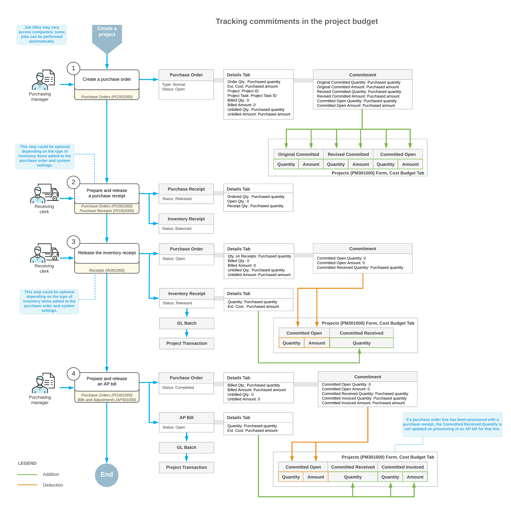

# Committed Costs: General Information {#_c17cd444-2ac9-4e6e-a687-fa3ccdaa1e16 .concept}

Acumatica ERP supports the tracking of purchase orders for each project as project cost commitments, which gives you the ability to control purchases made for projects. When the commitments are created, the system uses them to populate the cost budget for the corresponding project, project task, inventory item, and account group.

## Learning Objectives { .section}

In this chapter, you will learn how to do the following:

-   Set up the tracking of project commitments in the system
-   Create commitments by creating a purchase order for a project
-   Review how the commitments affect the project cost budget during the processing of the purchase order

## Applicable Scenarios { .section}

You set up commitment tracking if you want to distinguish purchases within the cost budget of a project. When you process a purchase order with detail lines related to the project, the system tracks this purchase as a commitment to the project and updates the cost budget of the project with the purchased services and materials. The commitment values are shown in separate columns in the cost budget.

## Tracking of Committed Costs for Projects {#section_akq_jg5_v1b .section}

If the **Internal Cost Commitment Tracking** check box is selected on the **General** tab \(**General Settings** section\) of the [Projects Preferences](PM_10_10_00.md) \(PM101000\) form, the system tracks project-related purchase orders as commitments to these projects and exposes these commitments on the [Commitments](PM_30_60_00.md) \(PM306000\) form.

**Attention:** If the *Construction* feature is enabled on the [Enable/Disable Features](CS_10_00_00.md) \(CS100000\) form, the system also tracks subcontracts as commitments to projects. For more information about processing subcontracts, see [Subcontracts: General Information](Construction_Subcontracts_GeneralInfo.md).

The system creates a commitment for a purchase order line in the amount of the **Ext. Cost** of the line and updates the committed values of the corresponding budget line of a project on the **Cost Budget** tab of the [Projects](PM_30_10_00.md) \(PM301000\) form if all of the following conditions are met on the [Purchase Orders](PO_30_10_00.md) \(PO301000\) form:

-   The type of the purchase order is *Normal*, *Drop-Ship* or *Project Drop-Ship*.
-   The status of the purchase order is *Pending Printing*, *Pending Email*, or *Open*.
-   The purchase order line specifies the project and the applicable project task \(and, optionally, the cost code\).

On the **Cost Budget** tab of the [Projects](PM_30_10_00.md) form, for each budget line, the system displays the total values of all the commitments that are associated with the same project, project task, account group, and inventory item. The system tracks the following committed values of the project budget on the **Cost Budget** tab:

-   Original committed quantity and amount
-   Revised committed quantity and amount
-   Committed open quantity and amount
-   Committed received quantity
-   Committed invoiced quantity and amount

The initial commitment amount is displayed in the **Original Committed Amount** column and the **Revised Committed Amount** column. The **Committed Open Amount** of a new commitment is equal to the **Revised Committed Amount**.

When you release an accounts payable bill with the purchase order lines of the *Service* type, the **Committed Invoiced Quantity** and **Committed Invoiced Amount** of the corresponding commitments are updated with the **Quantity** and **Ext. Cost** values of the bill lines, respectively. The **Committed Invoiced Quantity** and **Committed Invoiced Amount** are subtracted from the **Committed Open Quantity** and **Committed Open Amount** and added to the **Actual Quantity** and **Actual Amount**, respectively.

When an inventory receipt that corresponds to the purchase receipt with the purchase order lines of the *Goods for IN* or *Non-Stock* type is released, the **Committed Received Quantity** of the corresponding commitments is updated with the received quantity. On release of the AP bill with these lines, the received quantity and the amount of the **Ext. Cost** of the related purchase order lines are subtracted from the **Committed Open Quantity** and **Committed Open Amount** and added to the **Committed Invoiced Quantity**, **Committed Invoiced Amount**, **Actual Quantity** and **Actual Amount**, respectively.

After a purchase order line is assigned the *Closed* status, the **Committed Open Quantity** and **Committed Open Amount** of the corresponding commitment become *0*. If a purchase order has been canceled, the incomplete amounts are subtracted from the **Committed Open Amount**.

## Workflow of Commitments {#section_i3l_d4p_mcb .section}

The following diagram illustrates the workflow of processing a commitment and the ways the commitment affects the project budget.

**Parent topic:**[Tracking Cost Commitments](../UserGuide/Projects_Commitments_Mapref.md)

