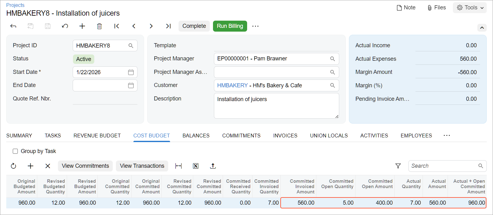

# Committed Costs: Process Activity {#_c53c0444-16c1-4385-a86e-d9cecd34d4c0 .task}

This activity will walk you through the creation of a purchase order for a project and tracking this purchase order as a commitment to the project cost budget.

**Attention:** This activity is based on the *U100* dataset. If you are using another dataset or if any system settings have been changed in *U100*, these changes can affect the workflow of the activity and the results of the processing. To avoid issues, restore the *U100* dataset to its initial state.

## Story { .section}

Suppose that the HM's Bakery and Cafe customer has ordered the installation of three juicers it previously purchased from the SweetLife Fruits &amp; Jams company. Acting as SweetLife's project accountant, you have created a project related to the planned installation work. The installation, which is performed by the vendor of the juicers, has been provided for each juicer. Based on the agreement with the vendor, your company will be billed in two parts—that is, first for the installation of the first two juicers and then for the installation of the third juicer. Acting as the project accountant, you need to capture the first part of the installation cost as a commitment to the project.

## Configuration Overview { .section}

In the *U100* dataset, the following tasks have been performed to support this activity:

-   The following features have been enabled on the [Enable/Disable Features](CS_10_00_00.md) \(CS100000\) form:
    -   *Projects*, which provides support for the project management functionality
    -   *Inventory and Order Management*, which provides the purchase order functionality
-   On the [Account Groups](PM_20_10_00.md) \(PM201000\) form, the *SUBCON* account group has been created. The *54200 - Project Subcontract Expense* account has been mapped to the account group.
-   On the [Vendors](AP_30_30_00.md) \(AP303000\) form, the *SQUEEZO* vendor has been created.
-   On the [Projects](PM_30_10_00.md) \(PM301000\) form, the *HMBAKERY8* project has been created and the *INSTALL* project task has been created for the project. This task is the default project task.
-   On the [Non-Stock Items](IN_20_20_00.md) \(IN202000\) form, the *INSTALL* non-stock item has been created. On the **General** tab, the **Require Receipt** check box is cleared for the item. On the **Price/Cost** tab \(**Standard Cost** section\), the **Current Cost** of the item has been set to *80.00*. On the same tab, *Purchases* is selected in the **Post Cost to Expenses On** box. On the **GL Accounts** tab, the *54200 - Project Subcontract Expense* account has been specified as the **Expense Account**.

## Process Overview { .section}

In this activity, you will create a purchase order on the [Purchase Orders](PO_30_10_00.md) \(PO301000\) form with lines related to the project. You will review how the committed amounts are shown in the project budget on the [Projects](PM_30_10_00.md) \(PM301000\) form. You will then create a partial bill for the purchase order and release the bill on the [Bills and Adjustments](AP_30_10_00.md) \(AP301000\) form.

Finally, you will review how the processed commitments affect the project budget on the [Projects](PM_30_10_00.md) form.

## System Preparation { .section}

To sign in to the system and prepare to perform the instructions of the activity, do the following:

1.  Launch the Acumatica ERP website and sign in as Pam Brawner using the *brawner* username and *123* password.
2.  In the info area at the upper-right corner of the top pane of the Acumatica ERP screen, make sure that the business date is set to *1/30/2026*. If a different date is displayed, click the Business Date menu button and select *1/30/2026* from the calendar. For simplicity, you'll create and process all documents in this activity using this business date.
3.  On the **General** tab \(**General Settings** section\) of the [Projects Preferences](PM_10_10_00.md) \(PM101000\) form, select the **Internal Cost Commitment Tracking** check box to expose commitments and committed values in the project budget, and save your changes to the project accounting preferences.

## Step: Creating Commitments for the Project { .section}

To process a purchase order for the project that updates the project budget with committed values, do the following:

1.  On the [Projects](PM_30_10_00.md) \(PM301000\) form, open the *HMBAKERY8* project, and on the **Cost Budget** tab, review the cost budget of the project. Because tracking of cost commitments is enabled in the system, the table contains columns for the original committed, revised committed, committed received, committed invoiced, and committed open values. In the only cost budget line of the project, all these values are *0*.
2.  On the [Purchase Orders](PO_30_10_00.md) \(PO301000\) form, create a purchase order, and specify the following settings in the Summary area:
    -   **Vendor**: *SQUEEZO*
    -   **Description**: `Purchase for HM's Bakery & Cafe`
    -   **Date**: *1/30/2026*
3.  On the **Details** tab, add three purchase order lines, and specify the settings shown in the following table in the lines you add.

    |**Inventory ID**|**Line Description**|**Order Qty.**|**Project**|**Cost Code**|
    |----------------|--------------------|--------------|-----------|-------------|
    |*INSTALL*|`Installation of the first juicer`|`3`|*HMBAKERY8*|*00-000*|
    |*INSTALL*|`Installation of the second juicer`|`4`|*HMBAKERY8*|*00-000*|
    |*INSTALL*|`Installation of the third juicer`|`5`|*HMBAKERY8*|*00-000*|

    **Tip:** The system automatically selects the *INSTALL* project task when you select the project of the line because this task is the default task of the *HMBAKERY8* project.

4.  Make sure the **Ext. Cost** of the added lines is *240.00*, *320.00*, and *400.00*, respectively; these represent the costs committed to the project.
5.  In the Summary area, make sure that the **Detail Total** value, which is the sum of the **Ext. Cost** values of the three lines, is *960.00*, and save the purchase order.
6.  On the form toolbar, click **Remove Hold**. The system assigns the purchase order the *Open* status.

    When the *Open* status is assigned to the purchase order, the system creates the commitments for the project.

7.  On the [Projects](PM_30_10_00.md) form, open the *HMBAKERY8* project, and on the **Cost Budget** tab, review the updated cost budget line.

    Notice that the committed quantities and amounts of the cost budget line have been updated and the **Original Committed Amount**, **Revised Committed Amount**, and **Committed Open Amount** columns contain the purchase order total \(*960.00*\).

8.  On the table toolbar, click **View Commitments** to review the commitments that correspond to the cost budget line on the [Commitments](PM_30_60_00.md) \(PM306000\) form. Notice that the system has created a commitment for each purchase order line and that all the commitments correspond to one cost budget line.
9.  Close the form and return to the [Projects](PM_30_10_00.md) form with the *HMBAKERY8* project.
10. On the **Commitments** tab, click the link in the **Order Nbr.** column to open the purchase order that you have created earlier in this activity.
11. On the More menu of the [Purchase Orders](PO_30_10_00.md) form, which opens, click **Enter AP Bill** to create a bill for the purchase order.

    The system creates an accounts payable bill and opens it on the [Bills and Adjustments](AP_30_10_00.md) \(AP301000\) form.

12. On the **Details** tab of this form, delete the line with the **Quantity** of *5.00* to bill the purchase order partially, as your company agreed on with the vendor.

    When you delete the line, the amount in the **Detail Total** box in the Summary area becomes *560.00*.

13. On the form toolbar, click **Remove Hold** to assign the bill the *Balanced* status, and then click **Release** to release the bill.
14. Return to the [Projects](PM_30_10_00.md) form with the *HMBAKERY8* project, press Esc to refresh the form, and review the updated cost budget on the **Cost Budget** tab.

    Notice that the billed quantity and amount \(*7.00* and *560.00*, respectively\) of the purchase order have been subtracted from the committed open quantity and amount, which is now equal to *5.00* and *400.00*, respectively. The billed quantity and amount have been added to the committed invoiced quantity and amount, to the actual quantity and amount, and to the received committed quantity, as shown below.

    

15. On the **General** tab \(**General Settings** section\) of the [Projects Preferences](PM_10_10_00.md) \(PM101000\) form, clear the **Internal Cost Commitment Tracking** check box, and save your changes to the project accounting preferences.

You have processed the commitment to the project.

**Parent topic:**[Tracking Cost Commitments](../UserGuide/Projects_Commitments_Mapref.md)

